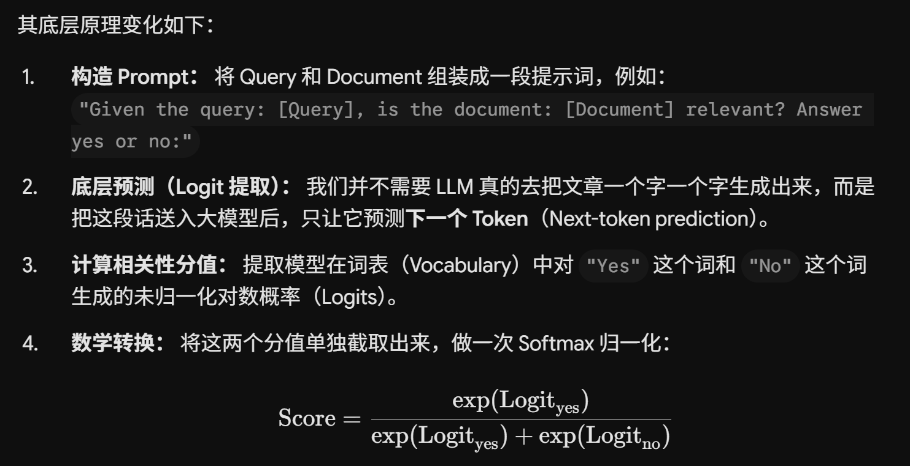

## RAG 步骤

1. 离线数据处理阶段（建库）：知识库文本 —— 分块（chunking） —— Embedding —— 入向量数据库
2. 在线检索生成阶段（问答）：查询语言 Embedding —— ~~向量匹配~~相似度检索（Retrieval） —— 提示词拼接 —— 给大模型并回答

!!! info "提示词模板示例"

    "你是一个专业的企业财务助手。请仅根据以下参考资料回答用户问题。如果参考资料中没有答案，请明确回答'资料中未提及'。
    【参考资料】：[系统自动插入刚才查到的 3 段报销制度原文]
    【用户问题】：公司最新的报销标准是多少？"

### 向量检索原理 —— 双编码器

两个编码器分别向量化两个文本：Query 和 Document。

## 延拓

所有检索生成算法都是 离线建库 + 在线检索

### BM25 & TF-IDF

核心：关键词匹配与词频统计

离线建库：文本分块 —— 分词 —— 去停用词 —— 词形还原 —— 统计文档元数据 —— 建立倒排索引

在线检索：用户输入 —— 同样方式分词 —— 倒排索引查询 —— 打分（BM25 和 TF-IDF 打分方式不同）

**关系**：传统RAG的第二阶段 retrieval 阶段是靠向量匹配，但是现在常用的方式是 **混合检索：BM25 + 向量检索**

## Reranker

- 平衡效率和速度
- 在不同场景中常常会有不同的多维打分机制

### 原理：交叉编码器

常规向量检索（双编码器 Bi-Encoder）： 把 Query 和 Document 分别独立映射到 high-dimensional 向量空间，然后计算余弦相似度。这种方式速度极快，适合从海量（几百万/几千万）数据中做粗排召回，但由于两者分开计算，无法捕捉复杂的词与词之间的深度语义关联。

重排序模型（交叉编码器 Cross-Encoder）： Reranker（如 BAAI/bge-reranker、Cohere Rerank、MonoT5）会将 Query 和 Document 拼接在一起同时输入神经网络（如 BERT/RoBERTa）。这使得两者的各个词元（Tokens）能够进行深入的交叉注意力计算（Cross-Attention）。

交叉编码器：

$$\text{Input} = \text{[CLS]} \circ Query \circ \text{[SEP]} \circ Document \circ \text{[SEP]}$$

将这个给到 transformer 处理，就可以拿到相互的注意力信息

$$\text{Attention}(Q, K, V) = \text{softmax}\left(\frac{QK^T}{\sqrt{d_k}}\right)V$$

### 现代变革

用大语言模型做 Reranker：用 prompt `"Given the query: [Query], is the document: [Document] relevant? Answer yes or no:"`

> softmax 归一化的数学本质就是 e 指数比值