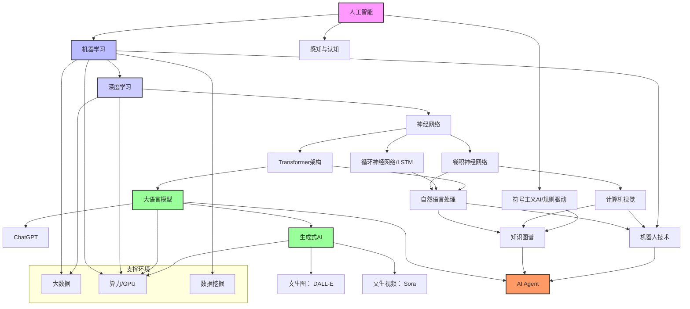

```mermaid
graph TD
    A[人工智能] --> B[机器学习];
    A --> C[符号主义AI/规则驱动];
    A --> D[感知与认知];

    B --> E[深度学习];
    E --> E1[神经网络];
    E1 --> E2[卷积神经网络];
    E1 --> E3[循环神经网络/LSTM];
    E1 --> E4[Transformer架构];

    E4 --> F1[大语言模型];
    F1 --> F11[ChatGPT];
    F1 --> G[生成式AI];
    G --> G1[文生图： DALL-E];
    G --> G2[文生视频： Sora];

    E2 & E3 & E4 --> F2[自然语言处理];
    E2 --> F3[计算机视觉];

    F2 & F3 & C --> H[知识图谱];

    F2 & F3 & B --> I[机器人技术];

    F1 & H & I --> J[AI Agent];

    subgraph 支撑环境
      K[大数据]
      L[算力/GPU]
      M[数据挖掘]
    end

    B & E & F1 & G --> L;
    B & E --> K;
    B --> M;

    style A fill:#f9f,stroke:#333,stroke-width:2px
    style B fill:#bbf,stroke:#333,stroke-width:2px
    style E fill:#ccf,stroke:#333,stroke-width:2px
    style F1 fill:#9f9,stroke:#333,stroke-width:2px
    style G fill:#9f9,stroke:#333,stroke-width:2px
    style J fill:#f96,stroke:#333,stroke-width:2px
```

