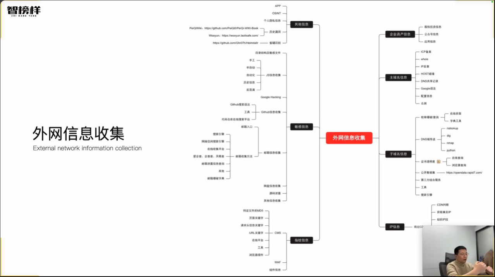
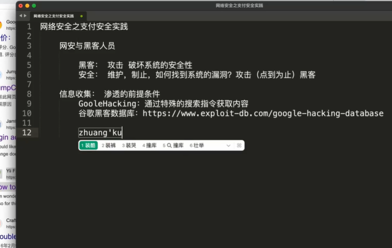
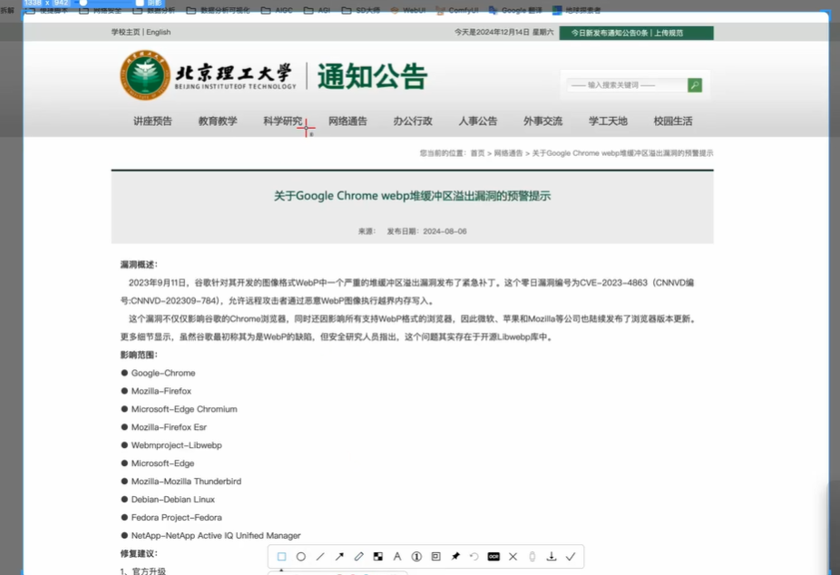
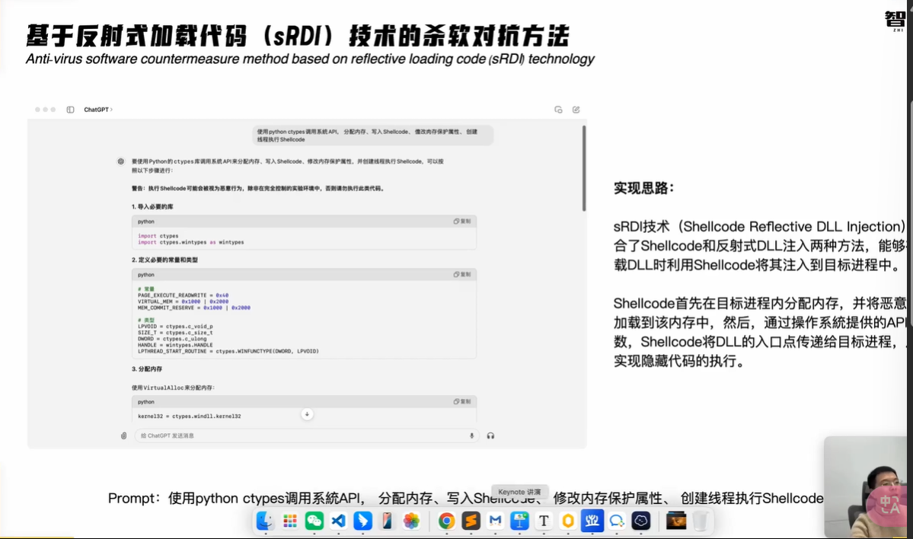
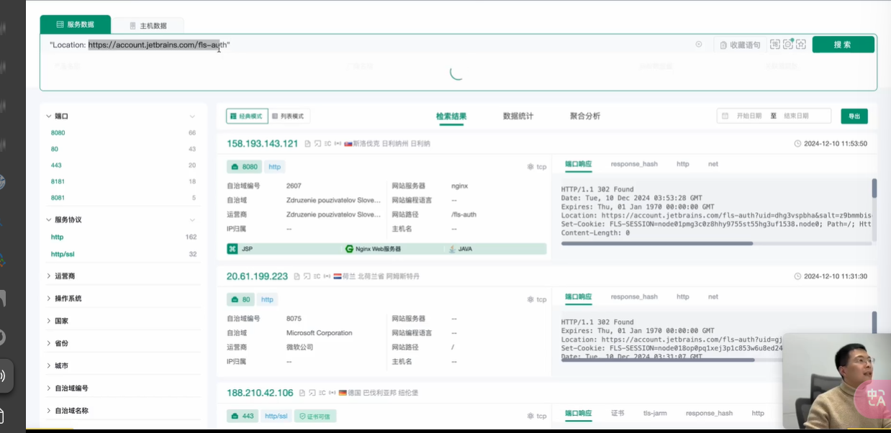
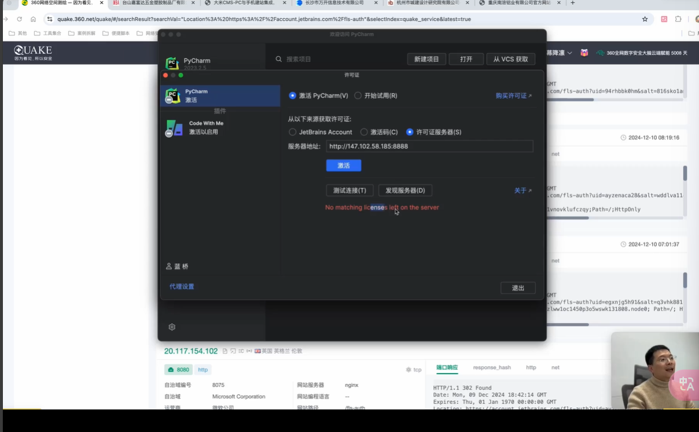
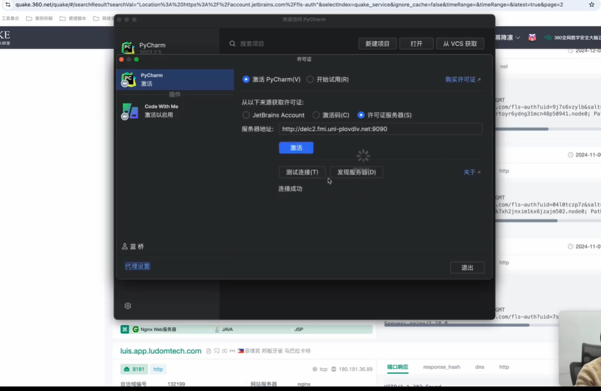
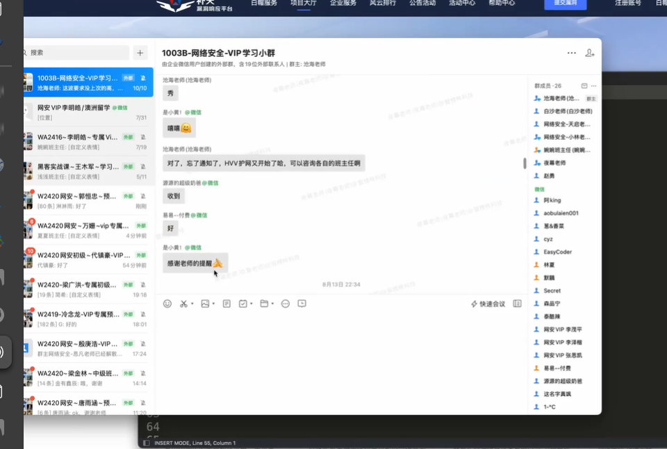

## 信息收集

首先明白要收集哪方面的信息

web指纹识别

https://browserscan.net/zh/

google:  

    搜索：inurl: 中国文化

    inurl:login/admin :管理员登陆页面

    inurl:login ：登录页面

    谷歌黑客数据库：https://www.exploit-db.com/google-haking-database

    

    撞库

## 漏洞利用

1. 系统维度：ms17-010 445 SMB Kali 用MSF：通过简单的配置来攻击

2. 软件维度：看pc上面安装的软件找漏洞：chrome浏览器的webp（一种格式）存在堆缓冲区溢出的漏洞；

    

    现实生活中软件多、版本多，人工成本高：用POC轰炸机（整理了漏洞的验证/攻击脚本，可以一键发起验证 POC-bomber-main

    https://exploit-db: 复制脚本

3. 人性维度

    社会工程学 (骗术)

    live-cam 换脸，用英伟达显卡跑不卡：直播：obs虚拟摄像头捕捉换脸后的画面

    邮件钓鱼、网站钓鱼：seeker，再用网站克隆工具，中间跳转

## 权限提升

：linux，windows

## 权限维持

用MSF劫持手机，权限持久：隐藏数据通信，改系统配置，写脚本

## 内网渗透

复杂，未知性强：目的是获得更多信息

## 痕迹清理

终端执行纪录，常用文件记录……

免杀：杀毒软件，99%没用：用

蜜罐监控：诱导攻击，从而反溯攻击方

肉机

作支付安全，数据抓包：请求 & 响应，拦截、查看、修改、转发

    工具：Burp、WS、浏览器开发者工具（功能少）直播间——ID

    DYLIVE，通过ID在脚本中跑

    M3U8在线播放器

    一天开几百个账号，直播，直接把直播流截过来，放自己的商品……

    CMS 靶场

    购买，修改请求，数量-1……

    360网络空间绘册工具 检索 大米CMS

    付费软件：以pycharm为例：根据激活原理：账户、激活码、许可证服务器；公司放到激活服务器上，我们检索到互联网上的激活服务器即可，高校or大学 
    

    找到大学，端口找到，复制IP，加一个端口

    

    

    写脚本：有思路框架，但是现有的无法满足

构建知识体系，构建自己的思考框架

技术 ——> 市场需求

天融信公司

挖洞，合法挣钱

实战能力：靶场不够，合法正规方式练习：

- SRC漏洞挖掘（挖洞）：公司开放一些权限允许 eg：补天

从入门到删库

$ 美元账户、

智榜样，廖鑫

建议：先挖洞积累项目实战经验，然后骑驴看吗寻找机会

HVV: 护网行动，攻击 /防守

工作党：时间少：SRC、CTF、挖洞

证书：CISSP  CISP  CISP-PTE