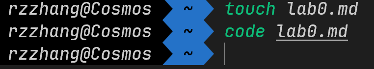
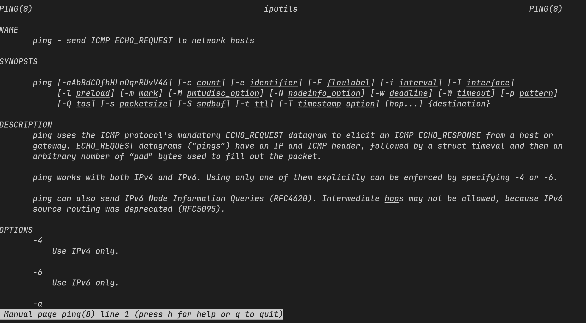
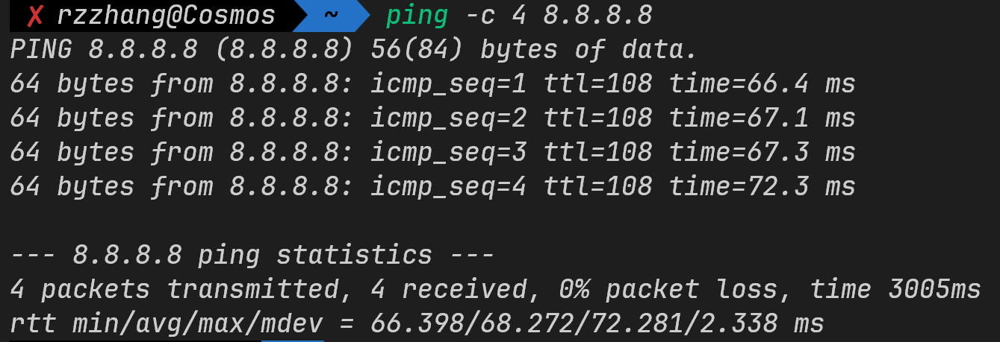
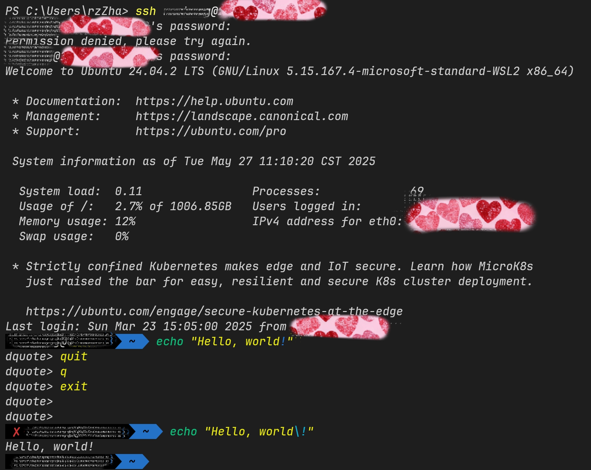
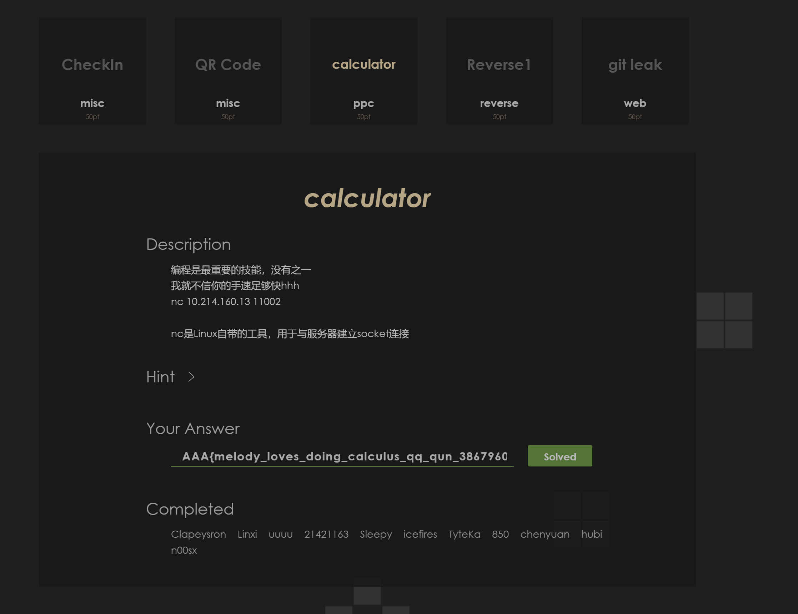
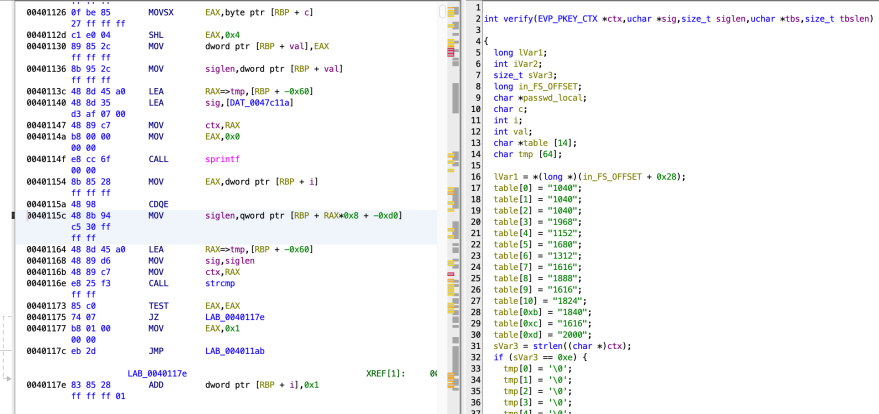
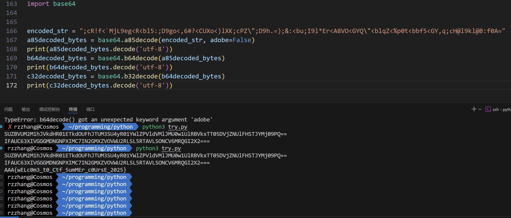
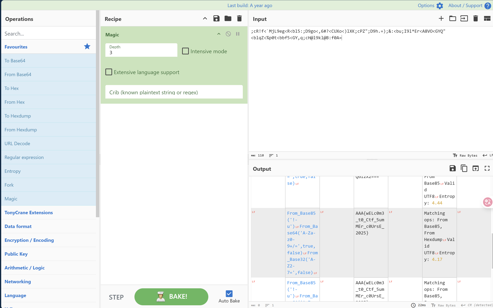
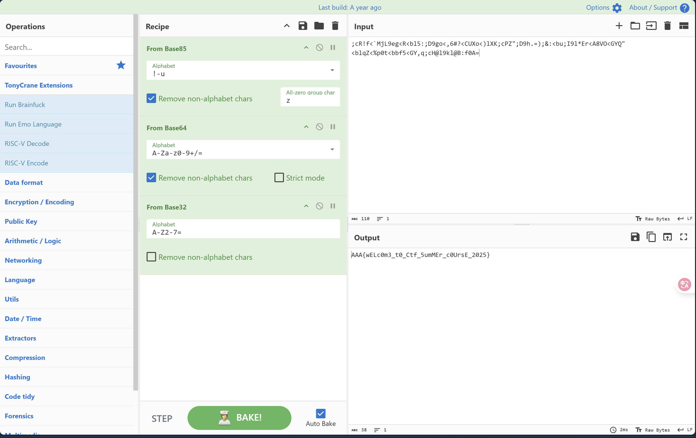
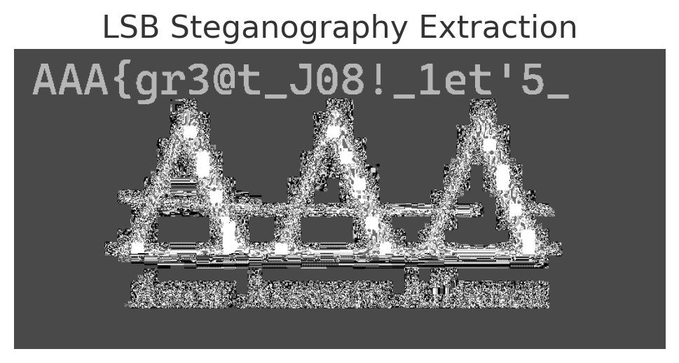

## Prerequisite
### Challenge 1
```shell
touch 文件名
```
新建文件

```shell
code 文件/目录的路径
```
用vscode打开文件



```shell
man 命令名称
```
查看官方给出的命令教程文档，包含释义 + 参数及解释 + 命令开发历史记录等




```shell
ping [参数] 目标地址（IP/域名）
```

用于网络连通性测试、延迟测量等



!!! info "ping输出解读 from deepseek"
 
    **单次回复示例**：
    ```bash
    64 bytes from 192.168.1.1: icmp_seq=1 ttl=64 time=2.34 ms
    ```
    - `icmp_seq`：数据包序列号。
    - `ttl`：生存时间（经过的路由器跳数）。
    - `time`：往返延迟（越低越好）。

    **统计信息**：
    ```bash
    Packets: Sent = 4, Received = 4, Lost = 0 (0% loss)
    Approximate round trip times in milli-seconds:
        Minimum = 2.34ms, Maximum = 5.12ms, Average = 3.45ms
    ```
    - 丢包率（Loss）和延迟统计。



### Challenge 2

#### 代码功能解释

转换大小写

#### 计算题

```python

import socket
import re

HOST = "10.214.160.13"
PORT = 11002

def recv_until(sock, delimiter):
    buf = b""
    delim_len = len(delimiter)
    while True:
        data = sock.recv(1)
        if not data:
            break
        buf += data
        if len(buf) >= delim_len and buf[-delim_len:] == delimiter:
            return buf[:-delim_len]
    return buf

def clean_question(raw_question):
    match = re.search(r'=\s*$', raw_question)
    if match:
        expr = raw_question[:match.start()].strip()
    else:
        expr = raw_question
    return re.sub(r'^[^\d]*(?=\d)', '', expr)

def main():
    s = socket.socket(socket.AF_INET, socket.SOCK_STREAM)
    try:
        s.settimeout(15) 
        s.connect((HOST, PORT))

        for _ in range(7):
            print("[HEADER]", recv_until(s, b'\n').decode().strip())

        for q in range(20):
            question = recv_until(s, b'= ').decode().strip()
            cleaned_question = clean_question(question)
            print(f"[Q{q+1}] 清洗后表达式: {cleaned_question}")

            try:
                result = eval(cleaned_question)
                answer = str(int(result)) if isinstance(result, float) and result.is_integer() else str(result)
            except:
                raise RuntimeError(f"计算失败: {cleaned_question}")

            payload = answer.encode() + b'\r\n'  
            s.sendall(payload)
            print(f"[ANS] 发送内容: {payload!r}")

            ack = recv_until(s, b'\n').decode().strip()
            print(f"[ACK] {ack}")

        flag_data = b""
        for _ in range(3):
            flag_data += recv_until(s, b'\n') + b'\n'
        flag = re.search(r'flag\{.*?\}', flag_data.decode())
        print("\n最终结果:", flag.group(0) if flag else "未找到flag")

    except Exception as e:
        print(f"错误: {str(e)}")
    finally:
        s.close()

if __name__ == "__main__":
    main()
```



flag是 `AAA{melody_loves_doing_calculus_qq_qun_386796080}`

## Web

### Challenge 1

```python
import re
import requests
sess = requests.session()
for i in range(1337): # 重复1337次
    # 获取网页代码
    res = sess.get("http:!$pumpk1n.com/lab0.php")
    ## 正则表达式提取内容
    r = re.findall(r"token=(.*)'",res.text)
    token = r[0]
    res = sess.get(f"http:!$pumpk1n.com/flag.php?token={token}")
print(res.text)
```

flag是：flag{56297ad00e70449a16700a77bf24b071}

## Reverse



⽤ghidra反编译后查看verify函数找到对应密码的ASCII码序列 65 65 65 123 72 105 82 101 118 101 114 115 101 125

falg是：flag: AAA{HiReverse}

## Misc

### Challenge 1

明文是 `AAA{wELc0m3_t0_Ctf_5umMEr_c0UrsE_2025}`

解码过程及思路如下：

1. 首先观察密文 ``;cR!f<`MjL9eg<R<bl5:;D9go<,6#?<CUXo<)lXK;cPZ";D9h.=);&:<bu;I9l*Er<A8VO<GYQ"<blqZ<%p0t<bbf5<GY,q;cH@l9kl@B:f0A=``形式：其中包含 `;` `<` `>` `:`等，符合BASE85编码方式，推断其为BASE85编码结果，用以下python脚本对其解码。

```python
import base64
encoded_str = ";cR!f<`MjL9eg<R<bl5:;D9go<,6#?<CUXo<)lXK;cPZ\";D9h.=);&:<bu;I9l*Er<A8VO<GYQ\"<blqZ<%p0t<bbf5<GY,q;cH@l9kl@B:f0A="
a85decoded_bytes = base64.a85decode(encoded_str, adobe=False)
print(a85decoded_bytes.decode('utf-8'))
```

    ```shell
    SUZBVUM2M1hJVkdHR01ETkdOUFhJTUM3SU4yR01YWlZPVldVMlJMU0w1UlRBVkxTT05DVjZNUlFHSTJYMj09PQ==
    ```

2. 解码结果不符合flag形式，推断其为多次编码结果。
3. 根据其形式判断为BASE64编码结果，用以下python脚本对其解码。：
    - 长度4n
    - 用 0~2个 `=` 填充

    ```python
    b64decoded_bytes = base64.b64decode(a85decoded_bytes)
    print(b64decoded_bytes.decode('utf-8'))
    ```

    ```shell
    IFAUC63XIVGGGMDNGNPXIMC7IN2GMXZVOVWU2RLSL5RTAVLSONCV6MRQGI2X2===
    ```

4. 再根据其形式判断，不符合BASE64编码结果，推断其为BASE32编码结果，用以下python脚本对其解码。

    ```python
    b32decoded_bytes = base64.b32decode(b64decoded_bytes)
    print(b32decoded_bytes.decode('utf-8'))
    ```

    ```shell
    AAA{wELc0m3_t0_Ctf_5umMEr_c0UrsE_2025}
    ```

结果正确。



回到实验文档，在 [CyberChef](https://lab.tonycrane.cc/CyberChef/) 中寻找方法，尝试 `magic` 方法，正确，按照分解步骤实验，正确。




### Challenge 2

学习 LSB 隐写术，使用 `stegsolve` 工具，对图像进行分析，结果如下。



因此前半段 flag 为 `AAA{gr3@t_J08!_1et'5` 

查看图片文件内容后，在文件结尾得到后半段：P1@y_m1SC_TOG3Th3R}
