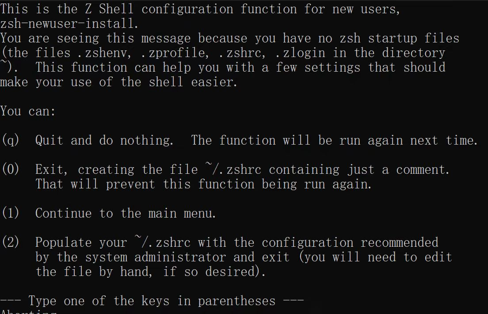

## Ubuntu

第一步：打开powershell管理员模式

- 方法：按 win + X，选择带有“管理员”字样的那个

第二步：安装wsl & Ubuntu

- 前提：开梯子
- 方法：运行以下命令

    ```powershell
    wsl --install -d Ubuntu
    ```
第三步：按照提示操作即可

## zsh

第一步：安装zsh

- 安装

    ```shell
    sudo apt update
    ```
    ```shell
    sudo apt-get install zsh
    ```

第二步：将zsh设置为默认终端

- 设置

    ```shell
    chsh -s $(which zsh)
    ```

再打开一个ubuntu的terminal，你将看到如下内容，证明以上步骤均成功



按照上图中他的提示做即可，建议输入：

```shell
0
```

第三步：安装oh-my-zsh

- 安装：（以下命令选一个即可）

    !!! info "注意"

        VPN在虚拟机不能同步（似乎v2rayN支持ubuntu但是我没有尝试），所以开梯子没啥用，那么，等到某个风和日丽的日子可能就成功了（from gsgg）

    ```shell
    # 用curl
    sh -c "$(curl -fsSL https://raw.githubusercontent.com/ohmyzsh/ohmyzsh/master/tools/install.sh)"
    ```
    ```shell
    # 用wget
    sh -c "$(wget -O- https://raw.githubusercontent.com/ohmyzsh/ohmyzsh/master/tools/install.sh)"
    ```
    ```shell
    # 换gitee源
    sh -c "$(curl -fsSL https://gitee.com/mirrors/oh-my-zsh/raw/master/tools/install.sh)"
    ```

    ```shell
    # 换清华源
    sh -c "$(curl -fsSL https://mirrors.tuna.tsinghua.edu.cn/github-raw/ohmyzsh/ohmyzsh/master/tools/install.sh)"
    ```

    ```shell
    # 换浙大源
    sh -c "$(curl -fsSL https://mirrors.zju.edu.cn/oh-my-zsh/oh-my-zsh/master/tools/install.sh)"
    ```

第四部：配置zsh

- 用vim打开~./zshrc

    ```shell
    vim ~./zshrc
    ```

- 命令：详见[我的vim笔记](https://r-z-zhang-ai.github.io/CS/Tools/vim/)

- 主题：在 `ZSH_THEME` 处更改，我使用的是agnoster
- 插件：可自行搜索，我使用了zsh-autosuggestions（命令建议）、zsh-syntax-highlighting（语法高亮）、zsh-history-substring-search（命令建议）

    - 先在 `plugins=(git)` 处添加这三个
    - 再退出vim，按如下命令安装：

        !!! info "注"

            此处只给出直接 git clone 的方法，也可以换源，一个方法不行就换另一个，同时建议开流量 ~

        - zsh-autosuggestions
            ```shell
            git clone https://github.com/zsh-users/zsh-autosuggestions ${ZSH_CUSTOM:-~/.oh-my-zsh/custom}/plugins/zsh-autosuggestions
            ```

        - zsh-syntax-highlighting
            ```shell
            git clone https://github.com/zsh-users/zsh-syntax-highlighting ${ZSH_CUSTOM:-~/.oh-my-zsh/custom}/plugins/zsh-syntax-highlighting
            ```

        - zsh-history-substring-search
            ```shell
            git clone https://github.com/zsh-users/zsh-history-substring-search ${ZSH_CUSTOM:-~/.oh-my-zsh/custom}/plugins/zsh-history-substring-search
            ```
        
- 字体和其他设置：我使用的是JetBrains Mon

    - 首先，在[官网](https://www.jetbrains.com/lp/mono/)下载并在文件夹（path-to-downloaded-files\JetBrainsMono-2.304\fonts\ttf）中选择你喜欢的那个，点开，点击安装

    - 其次，打开terminal，在上栏下拉菜单进入设置，进入ubuntu，在“外观”处设置字体和其他内容


!!! info "后记"

    俗话说，一杯茶一根烟 一个环境配一天。
    在配置linux环境过程中，最容易出现的问题（个人遇到的）是网络连接障碍，可尝试：连接手机热点 or 换源 or 换件别的事干干（
