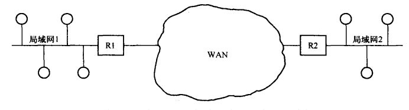
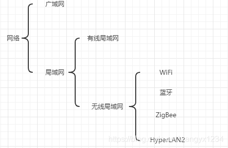

原文链接：https://blog.csdn.net/wangyx1234/article/details/113444581

## 广域网与局域网
广域网（Wide Area Network），简称WAN，是一种地域范围覆盖广的计算机网络的集合，通常所覆盖的范围从几十公里到几千公里，它能连接多个地区、城市和国家。由于其超长的覆盖范围，发送介质主要是政府或者大型企业部署的电话线或光纤，因此又被大家亲切的称为：外网、公网。

局域网（Local Area Network），简称LAN，相对于广域网（WAN）而言，主要是指在某一区域的计算机互联网络。“某一区域”指的是同一办公室、同一建筑物、同一公司和同一学校等，一般是方圆几千米以内。

更通俗地讲，你用手机上的移动网路，浏览网页时用到就是运营商体提供的WAN，即广域网。打开手机，连接图中的路由器R1、R2后，再访问网页，手机使用的就是局域网。是的，路由器这种工具往往充当广域网与局域网接入的“中间媒介”。

## 局域网中的分类
局域网按照是否使用何导线或传输电缆连接网络设备，分为有线局域网、和无线局域网。

无线局域网（英语：Wireless LAN，缩写WLAN）是不使用任何导线或传输电缆连接的局域网，其使用无线电波或电场与磁场作为数据传送的介质，传送距离一般只有几十米。

有线局域网，是使用导线或传输电缆连接的局域网，传送距离可达几千米。

## 无线局域网（WLAN）中的技术
WLAN和有线局域网最大的区别就是“无线”。无线局域网WLAN的范围实际上很广，按照定义，以各种无线电波（如激光、红外线等）的无线信道来代替有线局域网中的部分或全部传输介质所构成的网络都叫WLAN。但是，由于一些技术比如WiFi、蓝牙使用的很多，以至于它们几乎代表了WLAN。实际上，WLAN是指一种网络组织架构，而WiFi是WLAN中的技术标准之一罢了。

WiFi是无线保真（Wireless Fidelity）的英文缩写，是WLAN中的一种通信标准之一。该标准由于其实现技术相对简单、通信可靠、灵活性高和实现成本相对较低等特点，成为了WLAN的主流技术标准，这使得初学者会误认为WLAN与WiFi是一样的概念，No，它们是前者包含后者的关系。

## 总结

