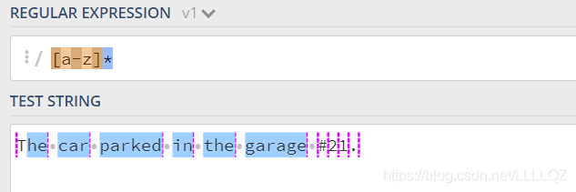
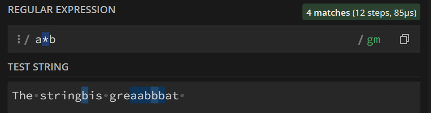
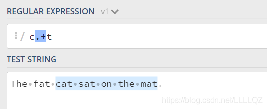
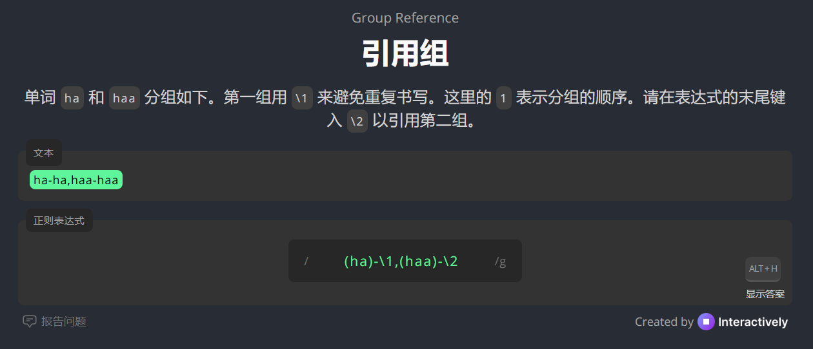
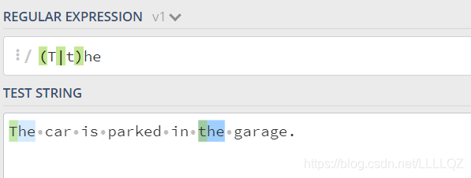
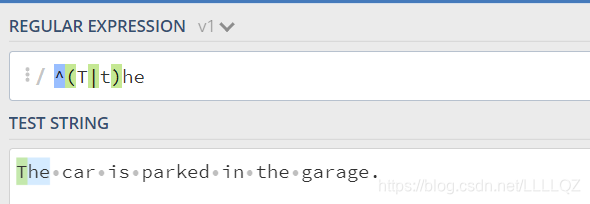
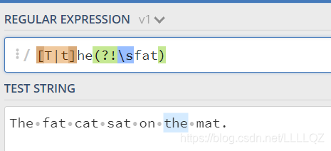
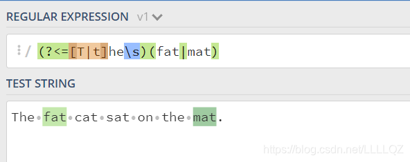
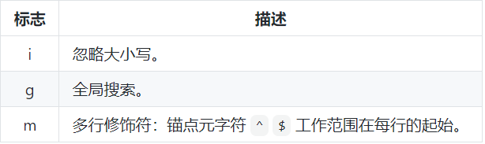

[练习网站](https://regex101.com/)

## 定义

正则表达式（Regular Expression，简称 regex 或 regexp）是一种用于匹配和处理文本的工具。是一组由字母和符号组成的特殊文本，帮助你在字符串中查找、替换或提取符合要求的内容,找出满足你想要的格式的句子。一个正则表达式是一种从左到右匹配主体字符串的模式，

## 语法

### 基本匹配
是在执行搜索时的格式，它由一些字母和数字组合而成。 例如：一个正则表达式， the，它表示一个规则：由字母t开始，接着是h，再接着是e。

### 元字符


#### 点.

`.`匹配任意单个字符，但不匹配换行符。 例如，表达式.ar匹配一个任意字符后面跟着是a和r的字符串。


#### 字符集[]

在方括号中使用连字符来指定字符集的范围。 

1. 枚举：在方括号中的字符集不关心顺序。 例如，表达式 `[Tt]he` 匹配 the 和 The。(即方括号里是字符的取值范围，这里只能取T，t，如果有字符串che的话则不会被匹配)

2. 范围：里面放字母范围，中间用连字符 `-` 分隔，匹配包括首末的他们之间的所有字符


PS: 只是搜索 `.` 的话就得用转义字符 `\.` ,但是，在 `[ ]` 里，不论是直接使用点还是转义字符都可以表示 `.`

#### 否定字符集

一般来说 ^ 表示一个字符串的开头，但它用在一个方括号的开头的时候，它表示这个字符集是否定的。 例如，表达式 `[^c]ar` 匹配一个后面跟着ar的除了c的任意字符。

#### *号

`*` 号匹配 在 `*` 之前的字符出现大于等于0次。 例如，表达式 a* 匹配0或更多个以a开头的字符。表达式 `[a-z]*` 匹配一个行中所有以小写字母开头的字符串。

PS：“0次”：如果单个`a*`那肯定是 $1 \to \infty$ 个a；  后面跟一个别的比如说 `a*b` 就是 $0 \to \infty$ 个a开头的接下来是b的字符串




#### +号

+号匹配+号之前的字符出现 >=1 次。 例如表达式c.+t 匹配以首字母c开头以t结尾，中间跟着至少一个字符的字符串。



#### ？号

在正则表达式中元字符 ? 标记在符号前面的字符为可选，即出现 0 或 1 次。 例如，表达式 `[T]?he` 匹配字符串 he 和 The。


`[th]e` : 匹配e or te or he 没有the 因为字符集代表可选

#### {}号

限定他前面的一个或一组字符可以重复出现的次数。 

- {n, m}：出现 $n \to m$ 次，包含 n 和 m

    例如， 表达式 \[0-9]{2,3} 匹配最少 2 位最多 3 位 0~9 的数字。

- {n, } 出现 $n \to \infty$ 次

    例如，\[0-9]{2,} 匹配至少两位 0~9 的数字。

- {n} 表示重复固定的 n 次。 

    例如，\[0-9]{3} 匹配3位数字

#### () 特征标群

特征标群是一组写在 (…) 中的子模式。(…) 中包含的内容将会被看成一个整体，和数学中小括号（ ）的作用相同。例如, 表达式 (ab)* 匹配连续出现 0 或更多个 ab。如果没有使用 (…) ，那么表达式 ab* 将匹配连续出现 0 或更多个 b 。再比如之前说的 {} 是用来表示前面一个字符出现指定次数。但如果在 {} 前加上特征标群 (…) 则表示整个标群内的字符重复 N 次。





#### | 或

竖线允许一个表达式包含多个不同的分支。所有分支用 | 分隔。和在字符层面上运作的字符集 \[abc] 不同，分支在表达式层面上运作。例如 (T|t)he|car 匹配 (T|t)he 或 car。

#### \转义符

转码紧跟其后的字符。用于指定 { } [ ] / \ + * . $ ^ | ? 这些特殊字符。如果想要匹配这些特殊字符则要在其前面加上反斜线 \

#### 锚点字符 ^ $

正则表达式中的锚点 `^` 和 `$` 用于匹配字符串的**位置**，而不是具体的字符。它们分别表示字符串的**开头**和**结尾**。以下是详细讲解：

---

1. `^` 锚点

用于匹配字符串的位置，而不是具体的字符。它们分别表示字符串的开头和结尾。

- **作用**：匹配字符串的**开头位置**。

- **示例**：
  - 正则表达式：`^abc`
    - 匹配：`abc`（在字符串开头）
    - 不匹配：`xabc`（不在开头）
  - 正则表达式：`^The`
    - 匹配：`The quick brown fox`（`The` 在开头）
    - 不匹配：`This is The end`（`The` 不在开头）

- **多行模式**：
  - 在多行模式（`m` 标志）下，`^` 还会匹配每一行的开头。
  - 示例：
    - 正则表达式：`/^The/m`
    - 字符串：
      ```
      The quick brown fox
      jumps over The lazy dog
      ```
    - 匹配：两个 `The`（分别在两行的开头）。

---

2. `$` 锚点

- **作用**：匹配字符串的**结尾位置**。

- **示例**：
  - 正则表达式：`abc$`
    - 匹配：`xyzabc`（`abc` 在结尾）
    - 不匹配：`abcxyz`（`abc` 不在结尾）
  - 正则表达式：`end$`
    - 匹配：`This is the end`（`end` 在结尾）
    - 不匹配：`The end is near`（`end` 不在结尾）

- 多行模式同理

3. `^` 和 `$` 的组合使用

- **作用**：匹配**整个字符串**。
- **用法**：
  - 将 `^` 放在开头，`$` 放在结尾，可以确保正则表达式匹配整个字符串，而不是部分匹配。

- **示例**：
  - 正则表达式：`^abc$`
    - 匹配：`abc`
    - 不匹配：`abcxyz` 或 `xyzabc`（因为字符串必须完全等于 `abc`）
  - 正则表达式：`^\d{3}-\d{2}-\d{4}$`
    - 匹配：`123-45-6789`（符合格式的字符串）
    - 不匹配：`123-45-6789abc`（因为字符串结尾有多余字符）






### 简写


### 零宽度断言（前后预查）

先行断言和后发断言都属于非捕获簇（不捕获文本 ，也不针对组合计进行计数）。 先行断言用于判断所匹配的格式是否在另一个确定的格式之前，匹配结果不包含该确定格式（仅作为约束）
说人话就是用来做判断的表达式，其本身只是一个条件


#### ?=… 为正先行断言

表示第一部分表达式之后必须跟着 ?=…定义的表达式。

- 判断后面跟着：写后面
- 


注意这里是要找出The 和 the 后面紧跟着 (空格)fat的字符串，但是正先行断言只是一个判断条件，他不会作为匹配被检索，所以最后匹配到的只是The

#### ?!… 负先行断言
筛选所有匹配结果，筛选条件为 其后不跟随着断言中定义的格式。 （说白了就是正先行断言的反例）

- 写后面
- =换成！



#### ?<=… 正后发断言

筛选所有匹配结果，筛选条件为 其前跟随着断言中定义的格式。 例如，表达式
(?<=(T|t)he\s)(fat|mat) 匹配 fat 和 mat，且其前跟着 The 或 the。

- 判断前面有没有：写前面 & 等号前面加上 < 符号



#### ?<!… 负后发断言

从筛选所有匹配结果，筛选条件为 其前不跟随着断言中定义的格式。


### 标志/模式修正符

修改表达式的搜索结果



- 格式是：`/`正斜杠后面加三个

这个不是自己输入的，是相当于修改设置

### 懒惰匹配

正则表达式默认采用贪婪匹配模式，在该模式下意味着会匹配尽可能长的子串。我们可以使用 ? 将贪婪匹配模式转化为惰性匹配模式。

`*?`

贪婪匹配：


懒惰匹配：


主要功能

1. **匹配**：检查字符串是否符合特定模式。
2. **搜索**：在字符串中查找符合模式的部分。
3. **替换**：将符合模式的部分替换为其他内容。
4. **提取**：从字符串中提取符合模式的部分。

示例

- 匹配邮箱：`^[a-zA-Z0-9._%+-]+@[a-zA-Z0-9.-]+\.[a-zA-Z]{2,}$`
- 匹配日期（YYYY-MM-DD）：`^\d{4}-\d{2}-\d{2}$`

应用场景

- **文本处理**：查找、替换或提取文本。
- **表单验证**：验证用户输入格式。
- **日志分析**：提取日志中的关键信息。
- **数据清洗**：清理和格式化数据。


