[练习网站](https://regex101.com/)

## 定义

正则表达式（Regular Expression，简称 regex 或 regexp）是一种用于匹配和处理文本的工具。是一组由字母和符号组成的特殊文本，帮助你在字符串中查找、替换或提取符合要求的内容,找出满足你想要的格式的句子。一个正则表达式是一种从左到右匹配主体字符串的模式，

## 语法

### 基本匹配
是在执行搜索时的格式，它由一些字母和数字组合而成。 例如：一个正则表达式， the，它表示一个规则：由字母t开始，接着是h，再接着是e。

### 元字符

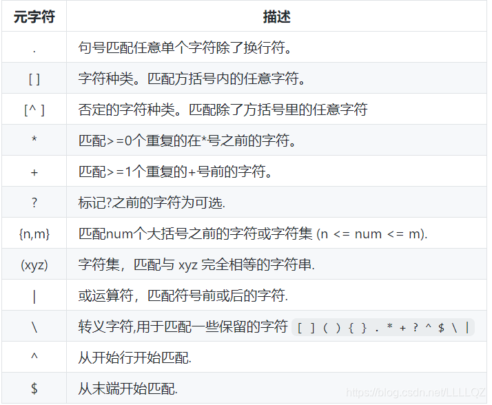

#### 点.

`.`匹配任意单个字符，但不匹配换行符。 例如，表达式.ar匹配一个任意字符后面跟着是a和r的字符串。

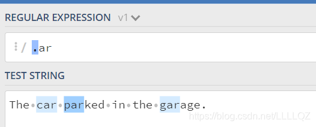

#### 字符集[]

在方括号中使用连字符来指定字符集的范围。 

1. 枚举：在方括号中的字符集不关心顺序。 例如，表达式 `[Tt]he` 匹配 the 和 The。(即方括号里是字符的取值范围，这里只能取T，t，如果有字符串che的话则不会被匹配)

2. 范围：里面放字母范围，中间用连字符 `-` 分隔，匹配包括首末的他们之间的所有字符

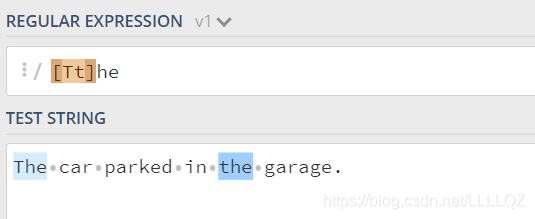

PS: 只是搜索 `.` 的话就得用转义字符 `\.` ,但是，在 `[ ]` 里，不论是直接使用点还是转义字符都可以表示 `.`

#### 否定字符集

一般来说 ^ 表示一个字符串的开头，但它用在一个方括号的开头的时候，它表示这个字符集是否定的。 例如，表达式 `[^c]ar` 匹配一个后面跟着ar的除了c的任意字符。

#### *号

`*` 号匹配 在 `*` 之前的字符出现大于等于0次。 例如，表达式 a* 匹配0或更多个以a开头的字符。表达式 `[a-z]*` 匹配一个行中所有以小写字母开头的字符串。

PS：“0次”：如果单个`a*`那肯定是 $1 \to \infty$ 个a；  后面跟一个别的比如说 `a*b` 就是 $0 \to \infty$ 个a开头的接下来是b的字符串


#### +号

+号匹配+号之前的字符出现 >=1 次。 例如表达式c.+t 匹配以首字母c开头以t结尾，中间跟着至少一个字符的字符串。


#### ？号

在正则表达式中元字符 ? 标记在符号前面的字符为可选，即出现 0 或 1 次。 例如，表达式 `[T]?he` 匹配字符串 he 和 The。

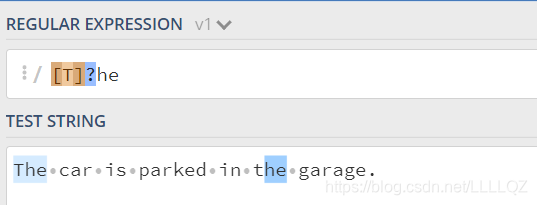

`[th]e` : 匹配e or te or he 没有the 因为字符集代表可选

#### {}号

限定他前面的一个或一组字符可以重复出现的次数。 

- {n, m}：出现 $n \to m$ 次，包含 n 和 m

    例如， 表达式 \[0-9]{2,3} 匹配最少 2 位最多 3 位 0~9 的数字。

- {n, } 出现 $n \to \infty$ 次

    例如，\[0-9]{2,} 匹配至少两位 0~9 的数字。

- {n} 表示重复固定的 n 次。 

    例如，\[0-9]{3} 匹配3位数字

#### () 特征标群

特征标群是一组写在 (…) 中的子模式。(…) 中包含的内容将会被看成一个整体，和数学中小括号（ ）的作用相同。例如, 表达式 (ab)* 匹配连续出现 0 或更多个 ab。如果没有使用 (…) ，那么表达式 ab* 将匹配连续出现 0 或更多个 b 。再比如之前说的 {} 是用来表示前面一个字符出现指定次数。但如果在 {} 前加上特征标群 (…) 则表示整个标群内的字符重复 N 次。

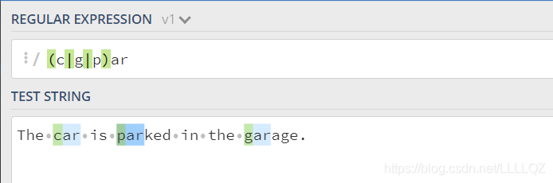


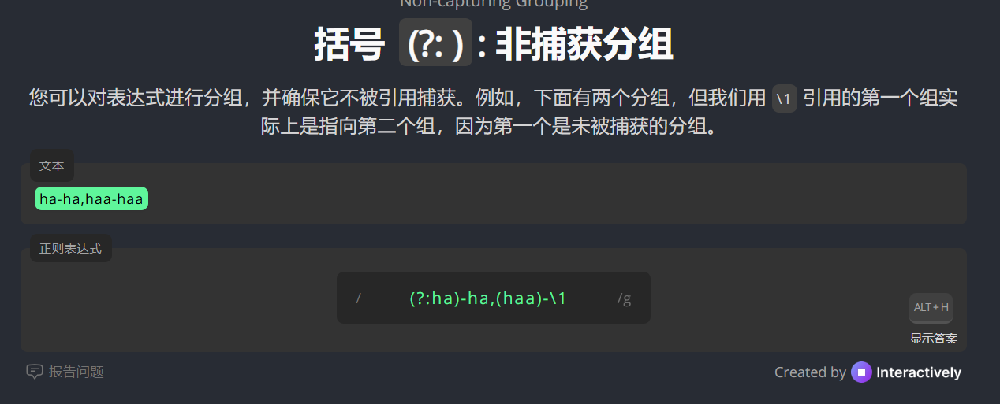

#### | 或

竖线允许一个表达式包含多个不同的分支。所有分支用 | 分隔。和在字符层面上运作的字符集 \[abc] 不同，分支在表达式层面上运作。例如 (T|t)he|car 匹配 (T|t)he 或 car。

#### \转义符

转码紧跟其后的字符。用于指定 { } [ ] / \ + * . $ ^ | ? 这些特殊字符。如果想要匹配这些特殊字符则要在其前面加上反斜线 \

#### 锚点字符 ^ $

正则表达式中的锚点 `^` 和 `$` 用于匹配字符串的**位置**，而不是具体的字符。它们分别表示字符串的**开头**和**结尾**。以下是详细讲解：

---

1. `^` 锚点

用于匹配字符串的位置，而不是具体的字符。它们分别表示字符串的开头和结尾。

- **作用**：匹配字符串的**开头位置**。

- **示例**：
  - 正则表达式：`^abc`
    - 匹配：`abc`（在字符串开头）
    - 不匹配：`xabc`（不在开头）
  - 正则表达式：`^The`
    - 匹配：`The quick brown fox`（`The` 在开头）
    - 不匹配：`This is The end`（`The` 不在开头）

- **多行模式**：
  - 在多行模式（`m` 标志）下，`^` 还会匹配每一行的开头。
  - 示例：
    - 正则表达式：`/^The/m`
    - 字符串：
      ```
      The quick brown fox
      jumps over The lazy dog
      ```
    - 匹配：两个 `The`（分别在两行的开头）。

---

2. `$` 锚点

- **作用**：匹配字符串的**结尾位置**。

- **示例**：
  - 正则表达式：`abc$`
    - 匹配：`xyzabc`（`abc` 在结尾）
    - 不匹配：`abcxyz`（`abc` 不在结尾）
  - 正则表达式：`end$`
    - 匹配：`This is the end`（`end` 在结尾）
    - 不匹配：`The end is near`（`end` 不在结尾）

- 多行模式同理

3. `^` 和 `$` 的组合使用

- **作用**：匹配**整个字符串**。
- **用法**：
  - 将 `^` 放在开头，`$` 放在结尾，可以确保正则表达式匹配整个字符串，而不是部分匹配。

- **示例**：
  - 正则表达式：`^abc$`
    - 匹配：`abc`
    - 不匹配：`abcxyz` 或 `xyzabc`（因为字符串必须完全等于 `abc`）
  - 正则表达式：`^\d{3}-\d{2}-\d{4}$`
    - 匹配：`123-45-6789`（符合格式的字符串）
    - 不匹配：`123-45-6789abc`（因为字符串结尾有多余字符）


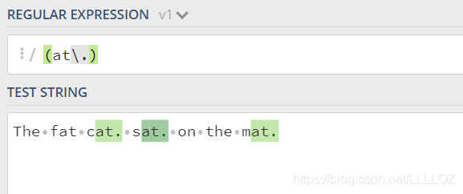
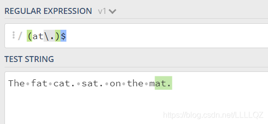

### 简写

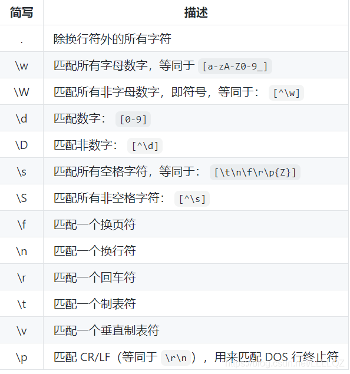

### 零宽度断言（前后预查）

先行断言和后发断言都属于非捕获簇（不捕获文本 ，也不针对组合计进行计数）。 先行断言用于判断所匹配的格式是否在另一个确定的格式之前，匹配结果不包含该确定格式（仅作为约束）
说人话就是用来做判断的表达式，其本身只是一个条件


#### ?=… 为正先行断言

表示第一部分表达式之后必须跟着 ?=…定义的表达式。

- 判断后面跟着：写后面
- 

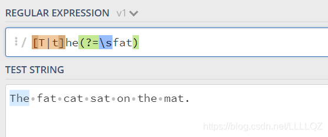

注意这里是要找出The 和 the 后面紧跟着 (空格)fat的字符串，但是正先行断言只是一个判断条件，他不会作为匹配被检索，所以最后匹配到的只是The

#### ?!… 负先行断言
筛选所有匹配结果，筛选条件为 其后不跟随着断言中定义的格式。 （说白了就是正先行断言的反例）

- 写后面
- =换成！


#### ?<=… 正后发断言

筛选所有匹配结果，筛选条件为 其前跟随着断言中定义的格式。 例如，表达式
(?<=(T|t)he\s)(fat|mat) 匹配 fat 和 mat，且其前跟着 The 或 the。

- 判断前面有没有：写前面 & 等号前面加上 < 符号


#### ?<!… 负后发断言

从筛选所有匹配结果，筛选条件为 其前不跟随着断言中定义的格式。

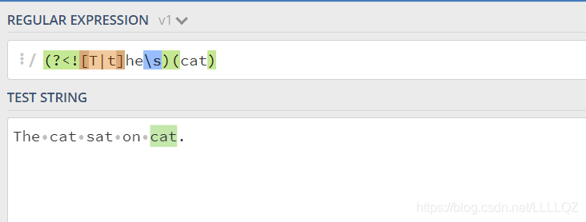

### 标志/模式修正符

修改表达式的搜索结果


- 格式是：`/`正斜杠后面加三个

这个不是自己输入的，是相当于修改设置

### 懒惰匹配

正则表达式默认采用贪婪匹配模式，在该模式下意味着会匹配尽可能长的子串。我们可以使用 ? 将贪婪匹配模式转化为惰性匹配模式。

`*?`

贪婪匹配：

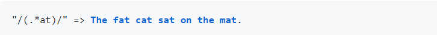

懒惰匹配：

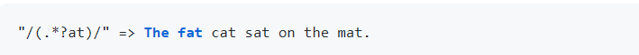


主要功能

1. **匹配**：检查字符串是否符合特定模式。
2. **搜索**：在字符串中查找符合模式的部分。
3. **替换**：将符合模式的部分替换为其他内容。
4. **提取**：从字符串中提取符合模式的部分。

示例

- 匹配邮箱：`^[a-zA-Z0-9._%+-]+@[a-zA-Z0-9.-]+\.[a-zA-Z]{2,}$`
- 匹配日期（YYYY-MM-DD）：`^\d{4}-\d{2}-\d{2}$`

应用场景

- **文本处理**：查找、替换或提取文本。
- **表单验证**：验证用户输入格式。
- **日志分析**：提取日志中的关键信息。
- **数据清洗**：清理和格式化数据。


## 第30课：正则表达式的应用

### 正则表达式相关知识

在编写处理字符串的程时，经常会遇到在一段文本中查找符合某些规则的字符串的需求，正则表达式就是用于描述这些规则的工具，换句话说，我们可以使用正则表达式来定义字符串的匹配模式，即如何检查一个字符串是否有跟某种模式匹配的部分或者从一个字符串中将与模式匹配的部分提取出来或者替换掉。

举一个简单的例子，如果你在Windows操作系统中使用过文件查找并且在指定文件名时使用过通配符（`*`和`?`），那么正则表达式也是与之类似的用 来进行文本匹配的工具，只不过比起通配符正则表达式更强大，它能更精确地描述你的需求，当然你付出的代价是书写一个正则表达式比使用通配符要复杂得多，因为任何给你带来好处的东西都需要你付出对应的代价。

再举一个例子，我们从某个地方（可能是一个文本文件，也可能是网络上的一则新闻）获得了一个字符串，希望在字符串中找出手机号和座机号。当然我们可以设定手机号是11位的数字（注意并不是随机的11位数字，因为你没有见过“25012345678”这样的手机号），而座机号则是类似于“区号-号码”这样的模式，如果不使用正则表达式要完成这个任务就会比较麻烦。最初计算机是为了做数学运算而诞生的，处理的信息基本上都是数值，而今天我们在日常工作中处理的信息很多都是文本数据，我们希望计算机能够识别和处理符合某些模式的文本，正则表达式就显得非常重要了。今天几乎所有的编程语言都提供了对正则表达式操作的支持，Python通过标准库中的`re`模块来支持正则表达式操作。

关于正则表达式的相关知识，大家可以阅读一篇非常有名的博文叫[《正则表达式30分钟入门教程》](https://deerchao.net/tutorials/regex/regex.htm)，读完这篇文章后你就可以看懂下面的表格，这是我们对正则表达式中的一些基本符号进行的扼要总结。

| 符号           | 解释                             | 示例               | 说明                                                         |
| -------------- | -------------------------------- | ------------------ | ------------------------------------------------------------ |
| `.`            | 匹配任意字符                     | `b.t`              | 可以匹配bat / but / b#t / b1t等                              |
| `\w`           | 匹配字母/数字/下划线             | `b\wt`             | 可以匹配bat / b1t / b_t等<br>但不能匹配b#t                   |
| `\s`           | 匹配空白字符（包括\r、\n、\t等） | `love\syou`        | 可以匹配love you                                             |
| `\d`           | 匹配数字                         | `\d\d`             | 可以匹配01 / 23 / 99等                                       |
| `\b`           | 匹配单词的边界                   | `\bThe\b`          |                                                              |
| `^`            | 匹配字符串的开始                 | `^The`             | 可以匹配The开头的字符串                                      |
| `$`            | 匹配字符串的结束                 | `.exe$`            | 可以匹配.exe结尾的字符串                                     |
| `\W`           | 匹配非字母/数字/下划线           | `b\Wt`             | 可以匹配b#t / b@t等<br>但不能匹配but / b1t / b_t等           |
| `\S`           | 匹配非空白字符                   | `love\Syou`        | 可以匹配love#you等<br>但不能匹配love you                     |
| `\D`           | 匹配非数字                       | `\d\D`             | 可以匹配9a / 3# / 0F等                                       |
| `\B`           | 匹配非单词边界                   | `\Bio\B`           |                                                              |
| `[]`           | 匹配来自字符集的任意单一字符     | `[aeiou]`          | 可以匹配任一元音字母字符                                     |
| `[^]`          | 匹配不在字符集中的任意单一字符   | `[^aeiou]`         | 可以匹配任一非元音字母字符                                   |
| `*`            | 匹配0次或多次                    | `\w*`              |                                                              |
| `+`            | 匹配1次或多次                    | `\w+`              |                                                              |
| `?`            | 匹配0次或1次                     | `\w?`              |                                                              |
| `{N}`          | 匹配N次                          | `\w{3}`            |                                                              |
| `{M,}`         | 匹配至少M次                      | `\w{3,}`           |                                                              |
| `{M,N}`        | 匹配至少M次至多N次               | `\w{3,6}`          |                                                              |
| `\|`            | 分支                             | `foo|bar`          | 可以匹配foo或者bar                                           |
| `(?#)`         | 注释                             |                    |                                                              |
| `(exp)`        | 匹配exp并捕获到自动命名的组中    |                    |                                                              |
| `(?<name>exp)` | 匹配exp并捕获到名为name的组中    |                    |                                                              |
| `(?:exp)`      | 匹配exp但是不捕获匹配的文本      |                    |                                                              |
| `(?=exp)`      | 匹配exp前面的位置                | `\b\w+(?=ing)`     | 可以匹配I'm dancing中的danc                                  |
| `(?<=exp)`     | 匹配exp后面的位置                | `(?<=\bdanc)\w+\b` | 可以匹配I love dancing and reading中的第一个ing              |
| `(?!exp)`      | 匹配后面不是exp的位置            |                    |                                                              |
| `(?<!exp)`     | 匹配前面不是exp的位置            |                    |                                                              |
| `*?`           | 重复任意次，但尽可能少重复       | `a.*b`<br>`a.*?b`  | 将正则表达式应用于aabab，前者会匹配整个字符串aabab，后者会匹配aab和ab两个字符串 |
| `+?`           | 重复1次或多次，但尽可能少重复    |                    |                                                              |
| `??`           | 重复0次或1次，但尽可能少重复     |                    |                                                              |
| `{M,N}?`       | 重复M到N次，但尽可能少重复       |                    |                                                              |
| `{M,}?`        | 重复M次以上，但尽可能少重复      |                    |                                                              |

> **说明：** 如果需要匹配的字符是正则表达式中的特殊字符，那么可以使用`\`进行转义处理，例如想匹配小数点可以写成`\.`就可以了，因为直接写`.`会匹配任意字符；同理，想匹配圆括号必须写成`\(`和`\)`，否则圆括号被视为正则表达式中的分组。

### Python对正则表达式的支持

Python提供了`re`模块来支持正则表达式相关操作，下面是`re`模块中的核心函数。

| 函数                                           | 说明                                                         |
| ---------------------------------------------- | ------------------------------------------------------------ |
| `compile(pattern, flags=0)`                    | 编译正则表达式返回正则表达式对象                             |
| `match(pattern, string, flags=0)`              | 用正则表达式匹配字符串 成功返回匹配对象 否则返回`None`       |
| `search(pattern, string, flags=0)`             | 搜索字符串中第一次出现正则表达式的模式 成功返回匹配对象 否则返回`None` |
| `split(pattern, string, maxsplit=0, flags=0)`  | 用正则表达式指定的模式分隔符拆分字符串 返回列表              |
| `sub(pattern, repl, string, count=0, flags=0)` | 用指定的字符串替换原字符串中与正则表达式匹配的模式 可以用`count`指定替换的次数 |
| `fullmatch(pattern, string, flags=0)`          | `match`函数的完全匹配（从字符串开头到结尾）版本              |
| `findall(pattern, string, flags=0)`            | 查找字符串所有与正则表达式匹配的模式 返回字符串的列表        |
| `finditer(pattern, string, flags=0)`           | 查找字符串所有与正则表达式匹配的模式 返回一个迭代器          |
| `purge()`                                      | 清除隐式编译的正则表达式的缓存                               |
| `re.I` / `re.IGNORECASE`                       | 忽略大小写匹配标记                                           |
| `re.M` / `re.MULTILINE`                        | 多行匹配标记                                                 |

> **说明：** 上面提到的`re`模块中的这些函数，实际开发中也可以用正则表达式对象（`Pattern`对象）的方法替代对这些函数的使用，如果一个正则表达式需要重复的使用，那么先通过`compile`函数编译正则表达式并创建出正则表达式对象无疑是更为明智的选择。

下面我们通过一系列的例子来告诉大家在Python中如何使用正则表达式。

#### 例子1：验证输入用户名和QQ号是否有效并给出对应的提示信息。

```Python
"""
要求：用户名必须由字母、数字或下划线构成且长度在6~20个字符之间，QQ号是5~12的数字且首位不能为0
"""
import re

username = input('请输入用户名: ')
qq = input('请输入QQ号: ')
# match函数的第一个参数是正则表达式字符串或正则表达式对象
# match函数的第二个参数是要跟正则表达式做匹配的字符串对象
m1 = re.match(r'^[0-9a-zA-Z_]{6,20}$', username)
if not m1:
    print('请输入有效的用户名.')
# fullmatch函数要求字符串和正则表达式完全匹配
# 所以正则表达式没有写起始符和结束符
m2 = re.fullmatch(r'[1-9]\d{4,11}', qq)
if not m2:
    print('请输入有效的QQ号.')
if m1 and m2:
    print('你输入的信息是有效的!')
```

> **提示：** 上面在书写正则表达式时使用了“原始字符串”的写法（在字符串前面加上了`r`），所谓“原始字符串”就是字符串中的每个字符都是它原始的意义，说得更直接一点就是字符串中没有所谓的转义字符啦。因为正则表达式中有很多元字符和需要进行转义的地方，如果不使用原始字符串就需要将反斜杠写作`\\`，例如表示数字的`\d`得书写成`\\d`，这样不仅写起来不方便，阅读的时候也会很吃力。

#### 例子2：从一段文字中提取出国内手机号码。

下面这张图是截止到2017年底，国内三家运营商推出的手机号段。


```Python
import re

# 创建正则表达式对象，使用了前瞻和回顾来保证手机号前后不应该再出现数字
pattern = re.compile(r'(?<=\D)1[34578]\d{9}(?=\D)')
sentence = '''重要的事情说8130123456789遍，我的手机号是13512346789这个靓号，
不是15600998765，也是110或119，王大锤的手机号才是15600998765。'''
# 方法一：查找所有匹配并保存到一个列表中
tels_list = re.findall(pattern, sentence)
for tel in tels_list:
    print(tel)
print('--------华丽的分隔线--------')

# 方法二：通过迭代器取出匹配对象并获得匹配的内容
for temp in pattern.finditer(sentence):
    print(temp.group())
print('--------华丽的分隔线--------')

# 方法三：通过search函数指定搜索位置找出所有匹配
m = pattern.search(sentence)
while m:
    print(m.group())
    m = pattern.search(sentence, m.end())
```

> **说明：** 上面匹配国内手机号的正则表达式并不够好，因为像14开头的号码只有145或147，而上面的正则表达式并没有考虑这种情况，要匹配国内手机号，更好的正则表达式的写法是：`(?<=\D)(1[38]\d{9}|14[57]\d{8}|15[0-35-9]\d{8}|17[678]\d{8})(?=\D)`，国内好像已经有19和16开头的手机号了，但是这个暂时不在我们考虑之列。

#### 例子3：替换字符串中的不良内容

```Python
import re

sentence = 'Oh, shit! 你是傻逼吗? Fuck you.'
purified = re.sub('fuck|shit|[傻煞沙][比笔逼叉缺吊碉雕]',
                  '*', sentence, flags=re.IGNORECASE)
print(purified)  # Oh, *! 你是*吗? * you.
```

> **说明：**` re`模块的正则表达式相关函数中都有一个`flags`参数，它代表了正则表达式的匹配标记，可以通过该标记来指定匹配时是否忽略大小写、是否进行多行匹配、是否显示调试信息等。如果需要为flags参数指定多个值，可以使用[按位或运算符](http://www.runoob.com/python/python-operators.html#ysf5)进行叠加，如`flags=re.I | re.M`。

#### 例子4：拆分长字符串

```Python
import re

poem = '窗前明月光，疑是地上霜。举头望明月，低头思故乡。'
sentences_list = re.split(r'[，。]', poem)
sentences_list = [sentence for sentence in sentences_list if sentence]
for sentence in sentences_list:
    print(sentence)
```

###  简单的总结

正则表达式在字符串的处理和匹配上真的非常强大，通过上面的例子相信大家已经感受到了正则表达式的魅力，当然写一个正则表达式对新手来说并不是那么容易，但是很多事情都是熟能生巧，大胆的去尝试就行了，有一个在线的[正则表达式测试工具](https://c.runoob.com/front-end/854)相信能够在一定程度上帮到大家。