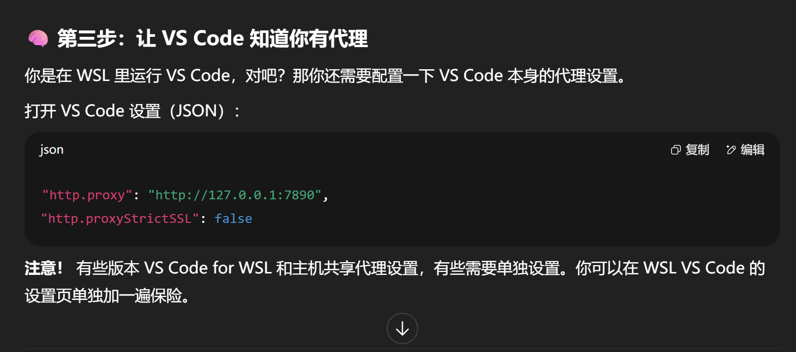
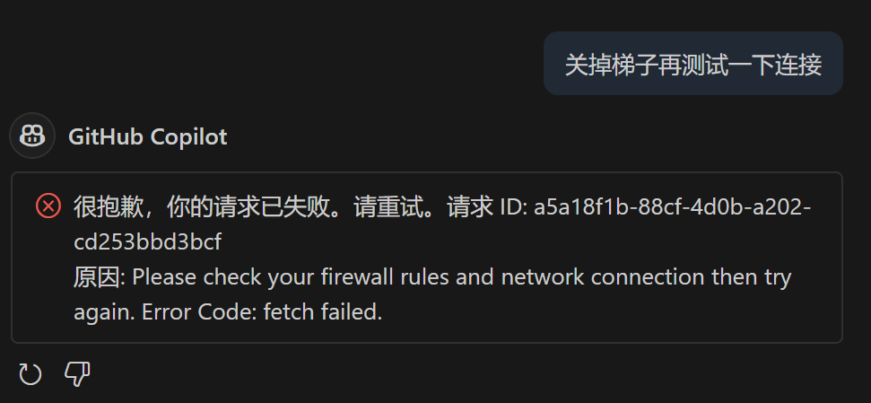

## 基本知识
??? info "在 WSL 中使用 GitHub Copilot by github copilot"

    GitHub Copilot 是一个 AI 编程助手，可以帮助你编写代码。要在 WSL 中使用 GitHub Copilot，你需要确保以下几点：

    1. **安装 Visual Studio Code**：确保你已经在 WSL 中安装了 Visual Studio Code，并且可以通过 `code` 命令启动它。
    2. **安装 GitHub Copilot 扩展**：在 Visual Studio Code 中，
        - 打开扩展视图（侧边栏中的方块图标或使用快捷键 `Ctrl+Shift+X`）。
        - 搜索 "GitHub Copilot" 并安装它。
    3. **登录 GitHub 账号**：安装完成后，GitHub Copilot 会提示你登录你的 GitHub 账号。按照提示完成登录。
    4. **配置 WSL**：确保你的 Visual Studio Code 已经连接到 WSL
        - 在 Visual Studio Code 中，打开命令面板（`Ctrl+Shift+P`），输入并选择 "Remote-WSL: New Window"。
        - 这将打开一个新的 VS Code 窗口，并连接到 WSL 环境。
    5. **使用 GitHub Copilot**：现在你可以在 WSL 中的任何代码文件中使用 GitHub Copilot。只需开始编写代码，Copilot 会自动提供建议。
    6. **检查设置**：如果你遇到任何问题，可以在 Visual Studio Code 的设置中检查 GitHub Copilot 的配置。确保它已启用，并且没有任何网络问题阻止它工作。
    7. **使用快捷键**：你可以使用 `Ctrl+Enter` 来接受 Copilot 的建议，或者使用 `Esc` 来忽略建议。
    8. **更新扩展**：确保你的 GitHub Copilot 扩展是最新的，以获得最新的功能和修复。
    9. **网络连接**：确保你的 WSL 环境可以访问互联网，因为 GitHub Copilot 需要连接到 GitHub 的服务器来提供建议。
    10. **使用其他编辑器**：如果你更喜欢使用其他编辑器（如 Vim 或 Emacs），你可以通过安装相应的插件来使用 GitHub Copilot，但这可能需要额外的配置步骤。

    如果你按照以上步骤操作，应该可以在 WSL 中顺利使用 GitHub Copilot。如果遇到任何问题，可以参考 GitHub Copilot 的官方文档或社区支持获取帮助。

    参考链接

    - [GitHub Copilot 官方文档](https://docs.github.com/en/copilot)
    - [在 WSL 中使用 Visual Studio Code](https://code.visualstudio.com/docs/remote/wsl)
    - [GitHub Copilot 扩展安装指南](https://docs.github.com/en/copilot/getting-started-with-github-copilot/installing-github-copilot)
    - [GitHub Copilot 常见问题解答](https://docs.github.com/en/copilot/troubleshooting-github-copilot)
    - [GitHub Copilot 设置和配置](https://docs.github.com/en/copilot/configuring-github-copilot)
    - [GitHub Copilot 使用技巧](https://docs.github.com/en/copilot/using-github-copilot/using-github-copilot-in-visual-studio-code)
    - [GitHub Copilot 与其他编辑器的集成](https://docs.github.com/en/copilot/integrations/integrating-github-copilot-with-other-editors)
    - [GitHub Copilot 社区支持](https://docs.github.com/en/copilot/community-support)

## 情况说明

我遇到的情况就是，在 wsl 里面使用 copilot 遇到网络问题，即聊天窗口一直显示处于脱机状态

先是问 dpsk，告我：

- 在 wsl Linux版本的vscode，终端直接报错
- wsl 里面登录 GitHub 账号，但登不上去 GitHub copilot 账户
- 怼着vscode的插件不停的卸载 / 清除缓存，p用没有
- 在vscode里面proxy设置加代理，没告我具体操作方法，md端口也不告我咋看，IP也告的是错的，加上这以后直接打不开插件市场了
- 命令行整了一大堆有的没的，全是报错
- 在 vscode 里面用 `ctrl + shift + p` 打开命令面板，输入 `GitHub Copilot: Sign in`，等一大堆，根本没有那个选项

## 解决方案

再问 chatgpt，解决方案如下：

- 打开 v2rayA
- 在 wsl 中设置环境变量（我永久加到 `~/.zshrc` 里面了）：

```bash
export http_proxy=http://<your_proxy_ip>:<your_proxy_port>
export https_proxy=http://<your_proxy_ip>:<your_proxy_port>
```

- 其中，`<your_proxy_ip>` 是主机ip，`127.0.0.1`。`<your_proxy_port>` 是v2rayA的端口，得去它的网页版设置里面看了，不是“默认是”“一般是”！！！

??? info "关于127.0.0.1"

    很好问题！我们来直接说清楚：

    ---

    🧠 `http://127.0.0.1` 是什么？

    这是一个**特殊的 IP 地址**，代表你自己的这台电脑，也叫：

    > **本地回环地址 / localhost**

    ---

    ✅ 用大白话解释：

    | 地址            | 代表谁            |
    | ------------- | -------------- |
    | `127.0.0.1`   | 自己电脑（本机）       |
    | `192.168.x.x` | 局域网其他设备        |
    | `0.0.0.0`     | 任意地址（监听全部）     |
    | `8.8.8.8`     | Google DNS（外部） |

    所以：

    ```bash
    http://127.0.0.1:7890
    ```

    意思是：

    > “访问你这台电脑上，**7890 这个端口**上的服务”

    ---

    🔧 在你的场景里，它的意思是：

    你电脑上开着一个代理（比如 v2rayA、clash），监听端口 `7890`，那：

    * `http://127.0.0.1:7890`：访问本机 HTTP 代理
    * `socks5://127.0.0.1:1080`：访问本机 SOCKS5 代理（常用于 curl/git）

    ---

    ✅ 举例：如果你配置了 VS Code 这样：

    ```json
    "http.proxy": "http://127.0.0.1:7890"
    ```

    意思是：

    > VS Code 出网（比如 GitHub API、Copilot）都会**通过本地的代理软件**出网，而不是直连

    ---

    📌 为什么不是写 IP 或域名？

    * 你用 `127.0.0.1` 是为了**保证只走本地，不依赖网络**
    * 它永远指向“自己”，跟网络断没关系

    ---

    🔐 安全性？

    * 只有你本机能访问 `127.0.0.1` 上的服务
    * 其他人远程访问不了你电脑的 `127.0.0.1:7890`

    ---

    总结一句话：

    > `127.0.0.1` = “我自己”
    > `http://127.0.0.1:7890` = “我自己电脑上跑的 HTTP 代理程序的入口”

    ---

    ⚠️ 如果你以后在配置代理、调试、curl、设置环境变量中看到 `127.0.0.1`，记住它永远就是**你电脑自己**。

    还想我帮你画一个网络请求图解说明这个代理流程吗？（从 VS Code → 127.0.0.1 → v2ray → GitHub）超直观。

- 然后在vscode的setting.json里面加上：

    ```json
    "http.proxy": "http://<your_proxy_ip>:<your_proxy_port>",
    "http.proxyStrictSSL": false,
    "github.copilot.advanced": {
    "inlineSuggest.enable": true
    }
    ```

以后：

!!! success "操作步骤"

    1. 打开 v2rayA 梯子
    2. 使用 GitHub copilot

    !!! success "打开v2rayA方法"

        1. 启动 v2rayA 服务

        ```bash
        sudo systemctl start v2raya
        ```

        2. Windows 浏览器中输入 `http://localhost:2017`，并启用代理。

        3. 测试代理是否生效

        ```bash
        curl -I https://www.google.com
        ```
        
        4. 最后用完关掉

        ```shell
        sudo systemctl disable v2raya
        ```

        5. 在网页那里关掉


## 后记

1. GitHub copilot 需要联网使用的原因：

    - GitHub Copilot 是一个基于云的 AI 编程助手，它需要访问 GitHub 的服务器来获取代码建议和模型更新。

2. 所谓脱机状态，就是没连上网，跟浏览器加载不出来一样。
3. 所以就需要在 wsl 开梯子并 让 vscode 知道我有代理（即通过代理访问 GitHub 的服务器，即设置环境变量等）。



