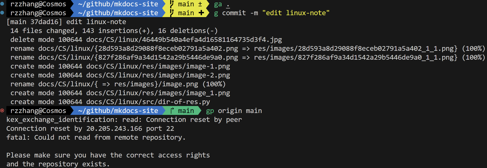
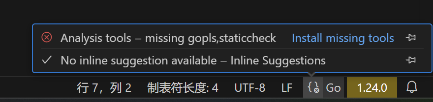
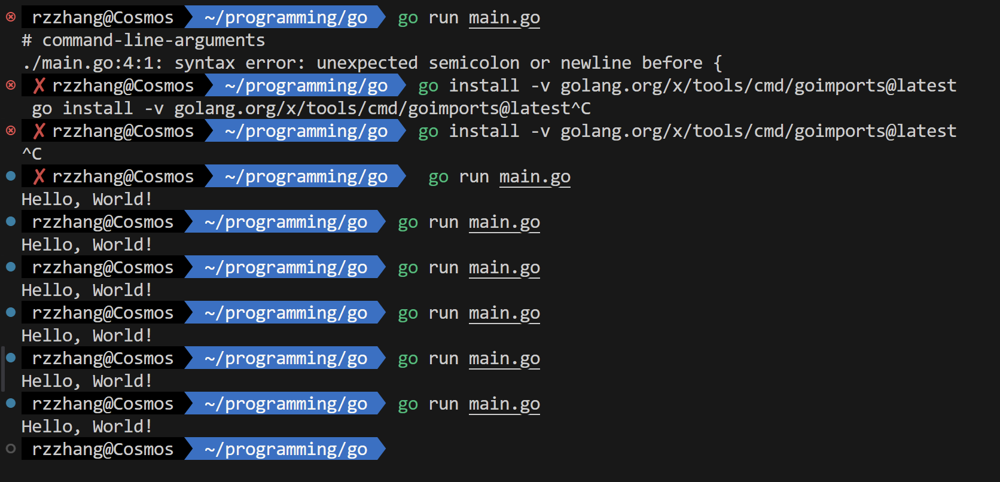
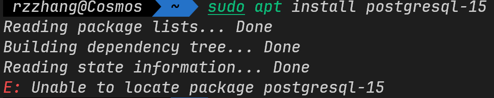

> Ubuntu is the world’s favourite Linux operating system. Run it on your laptop, workstation, server or IoT device, with five years of free security updates.


以及，请看我如何帮助 Colin 实现 *他的美甲梦* ~


Let's start !

## Linux虚拟机安装


#### 第一步：打开powershell管理员模式

方法：按 `win + X`，选择带有“管理员”字样的那个

#### 第二步：安装 Ubuntu

前提：科学上网

方法：输入以下命令以安装 Ubuntu
  ```shell
  wsl --install -d Ubuntu
  ```
#### 第三步：按照提示操作即可

---

## Zsh安装及基础配置


#### 第一步：安装zsh

仍然在命令提示符处，输入以下命令：

使用root用户，并更新apt：
```shell
sudo apt update
```
安装zsh：
```shell
sudo apt-get install zsh
```

#### 第二步：将zsh设置为默认终端

```shell
chsh -s $(which zsh)
```

再打开一个 Ubuntu 的 terminal，你将看到如下内容，证明以上步骤均成功


按照上图中他的提示做即可，建议输入：

```shell
0
```

#### 第三步：安装oh-my-zsh

Tips：VPN在虚拟机不能同步（似乎v2rayN支持Ubuntu但是我没有尝试），所以开梯子没啥用，可能等到某个风和日丽的日子可能就成功了（from gsgg）


<div style="text-align: center;">
    上图为我成功安装之后随手拍的窗外景象<br>
    的确风和日丽……
</div>

以下命令选一个即可

```shell
# 用curl
sh -c "$(curl -fsSL https://raw.githubusercontent.com/ohmyzsh/ohmyzsh/master/tools/install.sh)"
```
```shell
# 用wget
sh -c "$(wget -O- https://raw.githubusercontent.com/ohmyzsh/ohmyzsh/master/tools/install.sh)"
```
```shell
# 换gitee源
sh -c "$(curl -fsSL https://gitee.com/mirrors/oh-my-zsh/raw/master/tools/install.sh)"
```

```shell
# 换清华源
sh -c "$(curl -fsSL https://mirrors.tuna.tsinghua.edu.cn/github-raw/ohmyzsh/ohmyzsh/master/tools/install.sh)"
```

```shell
# 换浙大源
sh -c "$(curl -fsSL https://mirrors.zju.edu.cn/oh-my-zsh/oh-my-zsh/master/tools/install.sh)"
```

#### 第四步：配置zsh

##### 第一步：用vim打开~./zshrc

```shell
vim ~./zshrc
```

这里涉及一些简单的vim命令：
  - 输入 `i` 进入插入模式
  - 点击 `Esc` 进入普通模式
  - 输入 `:wq` 保存并退出

##### 第二步：跟着感觉走

1. 主题：在 `ZSH_THEME` 处更改，我使用的是 `agnoster`

2. 插件：可自行搜索，我使用了`zsh-autosuggestions`（命令建议）、`zsh-history-substring-search`（命令建议）、`zsh-syntax-highlighting`（语法高亮）

    方法：先在 `plugins=(git)` 处添加这三个，再退出vim，按如下命令安装（此处只给出直接 `git clone` 的方法，也可以换源，一个方法不行就换另一个，同时建议开流量 ~）

      - zsh-autosuggestions
          ```shell
          git clone https://github.com/zsh-users/zsh-autosuggestions ${ZSH_CUSTOM:-~/.oh-my-zsh/custom}/plugins/zsh-autosuggestions
          ```

      - zsh-syntax-highlighting
          ```shell
          git clone https://github.com/zsh-users/zsh-syntax-highlighting ${ZSH_CUSTOM:-~/.oh-my-zsh/custom}/plugins/zsh-syntax-highlighting
          ```

      - zsh-history-substring-search
          ```shell
          git clone https://github.com/zsh-users/zsh-history-substring-search ${ZSH_CUSTOM:-~/.oh-my-zsh/custom}/plugins/zsh-history-substring-search
          ```
        
3. 字体：我使用的是JetBrains Mon。首先，在[官网](https://www.jetbrains.com/lp/mono/)下载并在文件夹（path-to-downloaded-files\JetBrainsMono-2.304\fonts\ttf）中选择你喜欢的那个，点开，点击安装

4. 其他设置：打开命令提示符，点击顶栏下拉菜单中“设置”，进入Ubuntu，在“外观”处设置字体和其他内容

---

## Zsh食用小记

### 配置C/python环境

记录在另一篇文章[《语言环境》](https://r-z-zhang-ai.github.io/CS/linux/pl/)中。

后来也安上了anaconda，也在上文中。

### 安装ssh

记录在另一篇文章[《SSH》](https://r-z-zhang-ai.github.io/CS/linux/ssh)中。

#### BUG！

但是之后出现极大问题，每次 `gp` 都是

```plaintext
connection reset by peer
```

也就是服务器重置了连接，即无法将本地仓库的更改推送到远程仓库。

#### DEBUGGING！

几乎成了我的梦魇，尝试了无数种方法，包括：

- 问deepseek&豆包：

    - `ping github.com` 测试能否ping通
    - DNS解析没敢改动
    - 防火墙没敢动，因为没法动，少相关命令
    - `ssh -T git@github.com` 检查连接
    - 启动SSH服务并设置成开机自启：`sudo service ssh start` `sudo systemctl enable ssh`
    - 把代理关了：`unset http_proxy` `unset https_proxy`


- 以上方法均不行，于是自己想办法
    - 换了无数种网络组合：局域网/热点 & 主机开梯子/不开梯子 & 虚拟机开梯子/虚拟机不开梯子，几乎尝试了所有排列组合
    - 重配了密钥对
    - 把github上面原有的密钥对全删了在重建
    - 怀疑是加密算法的问题：rsa和ed25519，两种算法下的密钥对都试过

拼尽全力无法战胜。


呃呃呃呃呃呃

名牌了，我就是智障

问毛蛋，给出了gpt解答

问hwgg，告诉我删.git，再init，照做了，不行

<!-- 
咱也不好说效果哈，总之以后千万别给我删.git了！还是那句话，没有研究明白的东西别给人家乱改！

.git文件夹下很多东西你都不知道是干啥的~比如说删了之后和另一个电脑上的对比发现少很多文件，就连最基础的gh-pages分支都没有

还有一点，专业的事问专业的人，问问cs专业的学长~
 -->

问gsgg，热心地clone我的仓库帮我看问题！

试了试关掉 WiFi 单独开流量，在连热点，done！`gp` 出现输密码框了

如果开着WiFi再连热点，是共享WiFi的！你竟然不知道？

之后呢，

尝试直接修改之后直接提交，有报错





应该就是改了.git的缘故，之后研究研究.git是什么

接下来，尝试我的想法：先备份文件，再删除整个本地仓库，再`git clone`，再删除里面的备份过的文件，再把备份文件移过来，再提交

```shell
cp -r <path-to-origin-dir> <path-to-backuped-fir>
# -r是递归复制，如果copy单一文件不用
# 把~github/mkdocs-site下所有文件备份到~/github/backup下
```
```shell
git clone git@github.com:r-z-zhang-AI/r-z-zhang-AI.github.io.git
```
```shell
rm -r
```
```shell
mv path path
```
```shell
ga .
```
```shell
g commit -m ""
```
```shell
gp origin main
```



### 安装 chromium

缘起：Colin提出希望做烟花🎇样式的美甲，我这里恰好写过一个模拟烟花的代码，为圆**他**的美甲💅梦，需要运行并展示，然而新电脑并没有安装chromium……

Tips：pip 是 Python 的包管理工具，用于安装 Python 库和工具。然而，Chromium 浏览器和 ChromeDriver 并不是 Python 库，而是 Linux 系统的软件包，需要通过系统的包管理器（如 apt）来安装，不能通过 pip 直接安装。    

#### 第一步：使用 apt 包管理器安装

更新apt
```shell
sudo apt update
```
安装 chromium 浏览器
```shell
sudo apt install chromium-browser
```
安装 chromedriver
```shell
sudo apt install chromium-chromedriver
```

#### 第二步：验证安装

启动 chromium

```shell
chromium-browser
```
若成功打开如下页面则证明安装成功。


检查 chromedriver 版本
```shell
chromedriver --version
```
若输出 chromedriver 版本则证明安装成功。

Tips：由于Ubuntu默认使用snap下载chromium，所以即使用该方法也会自动调用snap，如果没有则会下载它。

> "默认使用 Snap 是因为维护成本低、自动更新方便、跨平台支持好、依赖管理简单且安全性高。"

最终，chromium被安装在 `~/snap/chromium` 目录下。

#### 第三步：在虚拟环境中安装相关python包

安装 webdriver-manager，一款自动管理浏览器驱动器的包

```shell
pip3 install webdriver-manager 
```
安装 selenium，一款可以实现 Web 应用程序的自动化测试（模拟用户在浏览器中的操作，如点击按钮、填写表单、导航页面等）的包

```shell
pip3 install selenium
```

### 安装xdg-utils

**1. `xdg-utils` 包含的工具**
`xdg-utils` 提供了以下常用工具：
- **`xdg-open`**：根据文件类型或 URL 调用默认应用程序打开文件或链接。
- **`xdg-mime`**：查询或设置 MIME 类型与默认应用程序的关联。
- **`xdg-icon-resource`**：安装或卸载图标资源。
- **`xdg-desktop-menu`**：安装或卸载桌面菜单项。
- **`xdg-desktop-icon`**：安装或卸载桌面图标。
- **`xdg-email`**：调用默认邮件客户端发送邮件。
- **`xdg-screensaver`**：控制屏幕保护程序。
- **`xdg-settings`**：获取或设置默认应用程序配置。

---

**2. 安装 `xdg-utils`**

```bash
sudo apt update
sudo apt install xdg-utils
```
**3. 常用工具的使用方法**

**`xdg-open`**
用于根据文件类型或 URL 调用默认应用程序打开文件或链接。

- 打开图片：
  ```bash
  xdg-open image.jpg
  ```
- 打开网页：
  ```bash
  xdg-open https://www.example.com
  ```
- 打开目录：
  ```bash
  xdg-open /path/to/directory
  ```

**`xdg-mime`**
用于查询或设置 MIME 类型与默认应用程序的关联。

- 查询文件的 MIME 类型：
  ```bash
  xdg-mime query filetype image.jpg
  ```
- 查询默认应用程序：
  ```bash
  xdg-mime query default image/jpeg
  ```
- 设置默认应用程序：
  ```bash
  xdg-mime default eog.desktop image/jpeg
  ```

**`xdg-icon-resource`**
用于安装或卸载图标资源。

- 安装图标：
  ```bash
  xdg-icon-resource install --context apps --size 64 icon.png application-icon
  ```
- 卸载图标：
  ```bash
  xdg-icon-resource uninstall --context apps --size 64 application-icon
  ```

**`xdg-desktop-menu`**
用于安装或卸载桌面菜单项。

- 安装桌面菜单项：
  ```bash
  xdg-desktop-menu install application.desktop
  ```
- 卸载桌面菜单项：
  ```bash
  xdg-desktop-menu uninstall application.desktop
  ```

**`xdg-settings`**
用于获取或设置默认应用程序配置。

- 获取默认浏览器：
  ```bash
  xdg-settings get default-web-browser
  ```
- 设置默认浏览器：
  ```bash
  xdg-settings set default-web-browser chromium.desktop
  ```


### 安装v2rayA

参考：[官方教程](https://v2raya.org/docs/prologue/introduction/)（打开这篇教程需要梯子）

应该是成功了，一开始以为不成功，因为看到IP在广东，过了两天发现主机的IP也在广东，这时是挂到了香港，据此推断，应该是成功的。

开机自启应该是后来关掉了


### 配置LaTex环境

参考：[hwgg的教程](https://www.philfan.cn/Tools/latex/)以及[b站良心视频](https://www.bilibili.com/video/BV1y8411P7qs/?spm_id_from=333.337.search-card.all.click&vd_source=b14909f255fe42946743657320d2f59a)

下载tex live，之后再在vscode下载插件，再在setting.json里面添加教程里面给出的东西。

[](res/images/image_1.png)

#### BUG！

- vscode在 `\documentclass{article}` 处有黄色波浪线报错，不过可以渲染出来。
- 文献引用总是 `[?]` 

#### DEBUGGING！

文献引用：

- 两个setting.json来回切换，failed
- 问了豆包，了解了bibtex，自己建了一个main.tex 和referencd.bib 试了试，没用，说实话这并没有朝着正确的方向努力，failed
- 引入了文献引用的库 `\usepackage{cite}` 和结尾引用`\bibliography{references}`，failed


### 将wsl从C盘迁移至D盘

参考：[知乎良心教程](https://zhuanlan.zhihu.com/p/621873601)

并自己写了一篇[教程](https://mp.weixin.qq.com/s/-zICf02Hs48Nb76FqXDw4Q?token=438288014&lang=zh_CN)发在公众号上面，原文链接：[《WSL迁移》](https://r-z-zhang-ai.github.io/CS/linux/wsl-c2d.md)

很好成功


## 后记
俗话说，一杯茶一根烟 一个环境配一天。

在配linux环境过程中，最容易出现的问题（个人遇到的）是网络连接障碍，可尝试：连接手机热点 or 换源 or 换件别的事干干（

