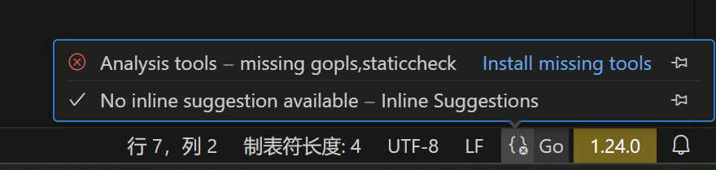
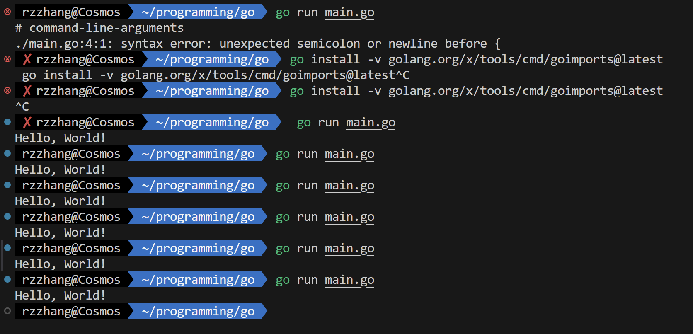
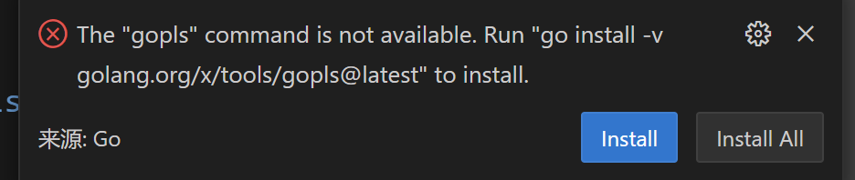

# 语言环境
## C

1. 更新系统包列表

    ```bash
    sudo apt update
    ```

2. 安装GCC（编译器）

    - 安装
    ```bash
    sudo apt install build-essential  # 这是一个元包，包含 GCC、G++、make 等
    ```

3. 安装GDB（调试）

    ```bash
    sudo apt install gdb
    ```

4. 验证

    ```bash
    gdb --version

    make --version

    gcc --version
    ```

5. VSCode

    1. 下载并安装 [VS Code](https://code.visualstudio.com/)。
    2. 安装 C/C++ 扩展。

## python

1. Ubuntu 通常预装了 Python 3。检查：
    ```bash
    python3 --version
    ```

2. 安装 pip（包管理工具）
    ```bash
    sudo apt install python3-pip
    ```

3. 安装常用工具如ipython

    ```bash
    pip install ipython
    ```


5. VS Code
    1. 安装 VS Code：
        ```bash
        sudo snap install --classic code
        ```
    2. 安装 Python 扩展：
        - 打开 VS Code，点击左侧扩展图标（或按 `Ctrl+Shift+X`）。
        - 搜索 `Python`，安装 Microsoft 提供的官方扩展。


### 安装 anaconda

#### 第一步：下载安装脚本
以下命令选一个即可：

```bash
# 使用 wget
wget https://repo.anaconda.com/archive/Anaconda3-2023.07-1-Linux-x86_64.sh
```
```shell
# 使用 curl
curl -O https://repo.anaconda.com/archive/Anaconda3-2023.07-1-Linux-x86_64.sh
```

#### 第二步：运行安装脚本

```bash
bash Anaconda3-2023.07-1-Linux-x86_64.sh
```

Tips：这里一定要用 `bash` 命令而不能用 `zsh`，因为 `zsh` 对语法的检查比 `bash` 严格，导致安装脚本中 `Anaconda3-2023.07-1-Linux-x86_64.sh:377: no matches found: /home/rzzhang/download/anaconda3/pkgs/envs/*/` 文件无法夹正确下载，应该就是通配符检查的问题。

#### 第三步：按照提示操作

确认权限处一直输入 yes ，安装路径处我选择输入新安装路径 : `/home/<user-name>/download/anaconda3`，或者选择默认路径亦可（直接按 `Enter` 确认。

安装完成后，安装程序会提示你是否将 Anaconda 添加到环境变量中：
```
Do you wish the installer to initialize Anaconda3 by running conda init? [yes|no]
```
输入 `yes`


#### 第四步：重新加载 .zshrc 文件
```bash
source ~/.zshrc
```

#### 第五步：验证安装

```bash
conda --version
```

## latex


## Go

!!! warning "log"

    详见 log/go.log 和 log/go1.log

实际上差一点点，但是该睡觉了就没继续：差在 vscode 里面的扩展之类的东西没安完



（这是一个大小超出限制的视频……）




但确实能跑，但是好慢！

### 安装方法

1. 更新系统包
首先，确保你的WSL系统是最新的：

```bash
sudo apt update
sudo apt upgrade
```

2. 下载Go
访问 [Go官方下载页面](https://golang.org/dl/) 获取最新版本的Go。选择适合你系统的Linux版本（通常是`linux-amd64.tar.gz`）。

使用`wget`下载：

```bash
wget https://golang.org/dl/go1.xx.x.linux-amd64.tar.gz
```

将`1.xx.x`替换为实际的版本号（是1.24.0）。

3. 解压安装包
将下载的压缩包解压到`/usr/local`目录：

```bash
sudo tar -C /usr/local -xzf go1.xx.x.linux-amd64.tar.gz
```

4. 设置环境变量
编辑`~/.profile`或`~/.bashrc`文件，添加以下内容：

```bash
export PATH=$PATH:/usr/local/go/bin
export GOPATH=$HOME/go
export PATH=$PATH:$GOPATH/bin
```

保存后，执行以下命令使配置生效：

```bash
source ~/.profile
```

5. 验证安装
检查Go是否安装成功：

```bash
go version
```

如果显示版本号，说明安装成功。

6. 测试Go环境
创建一个简单的Go程序测试：

```bash
mkdir -p ~/go/src/hello
cd ~/go/src/hello
touch hello.go
```

编辑`hello.go`文件，内容如下：

```go
package main

import "fmt"

func main() {
    fmt.Println("Hello, World!")
}
```

运行程序：

```bash
go run hello.go
```

如果输出`Hello, World!`，说明Go环境配置正确。

7. 安装Go工具（可选）
安装常用的Go工具：

```bash
go get golang.org/x/tools/cmd/...
```

### 出现的问题

!!! warning "log"

    详见 log/go1.log


`wget` 步骤连不上网，代理没开的问题

解决方案详见[《Linux备忘录》](https://r-z-zhang-ai.github.io/CS/OS/linux/linux-note/)