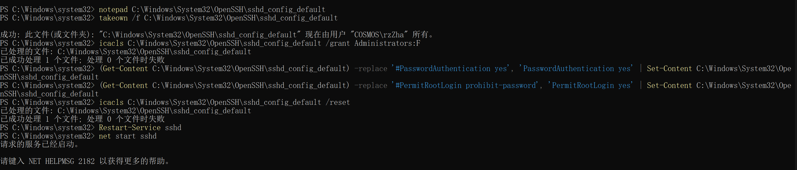

## 《万物互联》


要通过SSH从Ubuntu远程控制Windows电脑并使用密钥登录，请按照以下步骤操作：

---

### **一、在Windows上安装OpenSSH服务器**
1. **以管理员身份打开PowerShell**
   - 右键开始菜单 → 选择 **Windows PowerShell (管理员)**

2. **安装OpenSSH服务器**
   ```powershell
   # 检查是否已安装OpenSSH
   Get-WindowsCapability -Online | Where-Object Name -like 'OpenSSH*'

   # 安装OpenSSH服务器（如未安装）
   Add-WindowsCapability -Online -Name OpenSSH.Server~~~~0.0.1.0
   ```

3. **启动并配置SSH服务**
   ```powershell
   # 启动SSH服务
   Start-Service sshd

   # 设置SSH服务开机自启
   Set-Service -Name sshd -StartupType Automatic

   # 验证服务状态
   Get-Service sshd
   ```

---

### **二、生成SSH密钥对（在Ubuntu上操作）**
1. **生成密钥对**
   ```bash
   ssh-keygen -t ed25519 -C "your_email@example.com"
   ```
   - 按提示选择保存路径（默认 `~/.ssh/id_ed25519`）
   - 可选：设置密钥密码（增强安全性）

2. **查看公钥内容**
   ```bash
   cat ~/.ssh/id_ed25519.pub
   ```
   复制输出的公钥内容（以 `ssh-ed25519` 开头）。

---

### **三、将公钥部署到Windows**
1. **在Windows上创建 `.ssh` 目录**
   - 打开文件资源管理器 → 输入路径：
     ```
     %USERPROFILE%\.ssh
     ```
   - 如果不存在，手动创建文件夹并命名为 `.ssh`

2. **创建 `authorized_keys` 文件**
   - 在 `.ssh` 文件夹内新建文件 `authorized_keys`
   - 将Ubuntu生成的公钥内容粘贴到此文件中
   - 保存文件

3. **设置文件权限（关键步骤！）**
   - 右键 `authorized_keys` → 属性 → 安全 → 高级
   - 禁用继承 → 删除所有权限 → 添加当前用户并赋予 **完全控制**
   - 确保 `.ssh` 文件夹权限相同

---

### **四、配置Windows SSH服务器**
1. **编辑SSH配置文件**
   - 用记事本以管理员身份打开 `C:\ProgramData\ssh\sshd_config`
   - 修改以下参数：
     ```ini
     PubkeyAuthentication yes
     AuthorizedKeysFile .ssh/authorized_keys
     PasswordAuthentication no  # 禁用密码登录（可选）
     ```

2. **重启SSH服务**
   ```powershell
   Restart-Service sshd
   ```

---

### **五、配置Windows防火墙**
1. **允许SSH端口（默认22）**
   - 控制面板 → Windows Defender 防火墙 → 高级设置
   - 入站规则 → 新建规则 → 端口 → TCP 22 → 允许连接

---

### **六、从Ubuntu连接测试**
```bash
ssh -i ~/.ssh/id_ed25519 your_windows_username@windows_ip
```
- 替换 `your_windows_username` 为Windows用户名
- 替换 `windows_ip` 为Windows机器的IP地址

---

### **常见问题排查**
- **权限错误**：确保Windows上 `.ssh` 和 `authorized_keys` 的权限正确。
- **连接被拒绝**：检查Windows防火墙是否放行22端口，或SSH服务是否运行。
- **密钥认证失败**：使用 `ssh -v` 查看详细日志，确认公钥路径正确。

---
---
---


!!! success ""

    成功将WSL、虚拟机、Windows主机互联，实现排列组合操作

关键是安装 OpenSSH，在三个设备上都安上。

点击[这里](https://chat.deepseek.com/a/chat/s/eaba8bb0-58d9-44a8-990c-92f0b1c36902)查看聊天记录 with deepseek

### **第一步**：下载OpenSSH

1. Windows设置 -> 系统 -> 可选功能 -> 添加可选功能 -> OpenSSH 下载

2. `win + R`，输入 `services.msc`，回车，打开“服务”管理器。找到 OpenSSH SSH Server。右键，选择“属性”。“启动类型”，选择自动（延迟启动）。


### **第二步**：更改配置

1. `C:\Windows\System32\OpenSSH\sshd_config_default`

2. 管理员身份运行powershell / 命令提示符

2. **获取文件所有权**：

     ```powershell
     takeown /f C:\Windows\System32\OpenSSH\sshd_config_default
     ```

3. **修改文件权限**：

     ```powershell
     icacls C:\Windows\System32\OpenSSH\sshd_config_default /grant Administrators:F
     ```

4. 修改文件内容

   ```powershell
   (Get-Content C:\Windows\System32\OpenSSH\sshd_config_default) -replace 'PasswordAuthentication no', 'PasswordAuthentication yes' | Set-Content C:\Windows\System32\OpenSSH\sshd_config_default
   ```
   ```powershell
   (Get-Content C:\Windows\System32\OpenSSH\sshd_config_default) -replace '#PermitRootLogin prohibit-password', 'PermitRootLogin yes' | Set-Content C:\Windows\System32\OpenSSH\sshd_config_default
   ```

5. 恢复文件权限（可选）

    ```powershell
   icacls C:\Windows\System32\OpenSSH\sshd_config_default /reset
   ```

!!! warning

   上面的 `C:\Windows\System32\OpenSSH\sshd_config_default` 应该都是 `C:\ProgramData\ssh\sshd_config`

6. 重启 OpenSSH 服务

   ```powershell
   Restart-Service sshd
   ```



遇到的问题：

1. 无管理员权限无法修改配置文件
2. 记事本修稿之后默认在原文件夹下新建一个 .txt 文件

    - 针对此，想删除原来的文件并将 .txt 扩展名删掉
    - 提示需要 TrustedInstaller，即 Windows 模块安装服务，其拥有完全控制权限）提供的权限才能删除文件
    - 于是有了上面的解决方案

### **第三步**：启动 SSH 服务

1. 打开命令提示符（以管理员身份运行），输入以下命令：
    ```bash
    net start sshd
    ```
2. 确保 SSH 服务已启动：
    ```bash
    sc query sshd
    ```

5. **检查防火墙规则**：
   - 确保 Windows 防火墙允许 SSH（端口 22）的入站连接。
   - 打开“Windows Defender 防火墙” -> “高级设置” -> “入站规则”，确保“OpenSSH SSH Server (sshd)”已启用。

6. **获取 Windows 主机的 IP 地址**：
   - 在命令提示符中输入 `ipconfig`，找到 IPv4 地址。

---


### **第四步**：连接


2. **使用 SSH 连接 Windows 主机**：
    
    ```bash
    ssh username@windows_host_ip
    ```
    
    - `username` 是 Windows 主机的用户名。
    - `windows_host_ip` 是 Windows 主机的 IP 地址。
    - 如果是第一次连接，系统会提示你确认主机的指纹，输入 `yes` 继续。
   - 输入 Windows 用户的密码即可登录。


之后，又通过ssh密钥实现了连接：实质上就是：

- 配置SSH密钥

    - 这个是：需要在A机器上操控B机器，则A里面得要有私钥，则需要在A里面安装SSH服务，B里面得要有公钥，即将A中的公钥复制到B里面。那么我在win主机用ssh次数估计不多，遂未在win中安装SSH。
- 更改ssh设置使得可以通过密钥连接

    ```plaintext
    PubkeyAuthentication yes
    AuthorizedKeysFile .ssh/authorized_keys
    PasswordAuthentication no
    ```

### **4. 使用 SSH 密钥登录（可选）**
为了提高安全性，可以配置 SSH 密钥登录，避免每次输入密码。

#### **步骤：**
1. **在 Ubuntu 虚拟机中生成 SSH 密钥**：
   - 运行以下命令生成密钥：
     ```bash
     ssh-keygen -t rsa
     ```
   - 按提示保存密钥（默认路径为 `~/.ssh/id_rsa`）。

2. **将公钥复制到 Windows 主机**：
   - 将生成的公钥（`~/.ssh/id_rsa.pub`）复制到 Windows 主机的 `C:\Users\username\.ssh\authorized_keys` 文件中。
   - 如果 `.ssh` 目录不存在，可以手动创建。

3. **测试 SSH 密钥登录**：
   - 在 Ubuntu 虚拟机中运行：
     ```bash
     ssh username@windows_host_ip
     ```
   - 如果配置正确，无需输入密码即可登录。

### 关于IP

```plaintext
rzzha@COSMOS C:\Users\rzZha>ipconfig

Windows IP 配置

无线局域网适配器 本地连接* 1:

   媒体状态  . . . . . . . . . . . . : 媒体已断开连接
   连接特定的 DNS 后缀 . . . . . . . :

无线局域网适配器 本地连接* 2:

   媒体状态  . . . . . . . . . . . . : 媒体已断开连接
   连接特定的 DNS 后缀 . . . . . . . :

以太网适配器 VMware Network Adapter VMnet1:

   连接特定的 DNS 后缀 . . . . . . . :
   本地链接 IPv6 地址. . . . . . . . : fe80::80df:3ca1:7eef:f908%15
   IPv4 地址 . . . . . . . . . . . . : 192.168.221.1
   子网掩码  . . . . . . . . . . . . : 255.255.255.0
   默认网关. . . . . . . . . . . . . :

以太网适配器 VMware Network Adapter VMnet8:

   连接特定的 DNS 后缀 . . . . . . . :
   本地链接 IPv6 地址. . . . . . . . : fe80::3148:7fc3:194d:c71%19
   IPv4 地址 . . . . . . . . . . . . : 192.168.91.1
   子网掩码  . . . . . . . . . . . . : 255.255.255.0
   默认网关. . . . . . . . . . . . . :

无线局域网适配器 WLAN:

   连接特定的 DNS 后缀 . . . . . . . :
   IPv6 地址 . . . . . . . . . . . . : 2408:8642:893:2fb:66fb:76dd:d4a8:b986
   临时 IPv6 地址. . . . . . . . . . : 2408:8642:893:2fb:1511:2ad2:eb13:9eb8
   本地链接 IPv6 地址. . . . . . . . : fe80::82a2:6d95:b28f:a094%14
   IPv4 地址 . . . . . . . . . . . . : 10.197.128.98
   子网掩码  . . . . . . . . . . . . : 255.255.0.0
   默认网关. . . . . . . . . . . . . : fe80::327b:acff:fe67:5802%14
                                       10.197.0.1

以太网适配器 蓝牙网络连接:

   媒体状态  . . . . . . . . . . . . : 媒体已断开连接
   连接特定的 DNS 后缀 . . . . . . . :

以太网适配器 vEthernet (WSL (Hyper-V firewall)):

   连接特定的 DNS 后缀 . . . . . . . :
   本地链接 IPv6 地址. . . . . . . . : fe80::d3ed:2796:8d4f:a7cc%25
   IPv4 地址 . . . . . . . . . . . . : 172.25.144.1
   子网掩码  . . . . . . . . . . . . : 255.255.240.0
   默认网关. . . . . . . . . . . . . :
```


从你的 `ipconfig` 输出中可以看到，你的 Windows 主机有多个网络适配器，每个适配器都有不同的 IP 地址和配置。以下是关键信息的总结和解释：

---

#### **1. 无线局域网适配器 (WLAN)**

- **IPv4 地址**：`10.196.142.22`
- **子网掩码**：`255.255.0.0`
- **默认网关**：`10.196.0.1`
- **IPv6 地址**：`2408:8642:891:382:caa9:b6be:d4e5:957b`（临时地址为 `2408:8642:891:382:40ef:227:f712:1601`）

这是你的主网络连接，用于访问互联网或局域网。你可以通过这个 IP 地址（`10.196.142.22`）从其他设备访问你的 Windows 主机。

---

#### **2. VMware 网络适配器**

- **VMnet1**：

  - **IPv4 地址**：`192.168.221.1`
  - **子网掩码**：`255.255.255.0`

- **VMnet8**：

  - **IPv4 地址**：`192.168.91.1`
  - **子网掩码**：`255.255.255.0`

这些是 VMware 虚拟机的虚拟网络适配器，用于虚拟机与主机之间的通信。如果你在 VMware 中运行虚拟机，可以通过这些 IP 地址与虚拟机通信。

---

#### **3. WSL 网络适配器**

- **vEthernet (WSL)**：

  - **IPv4 地址**：`172.25.144.1`
  - **子网掩码**：`255.255.240.0`

这是 WSL（Windows Subsystem for Linux）的虚拟网络适配器，用于 WSL 与 Windows 主机之间的通信。你可以通过这个 IP 地址（`172.25.144.1`）从 WSL 访问 Windows 主机。

---

#### **4. 其他适配器**

- **本地连接* 1** 和 **本地连接* 2**：媒体已断开连接。
- **蓝牙网络连接**：媒体已断开连接。

这些适配器当前未连接，因此没有分配 IP 地址。

---

#### **如何通过 IP 地址访问 Windows 主机？**
根据你的需求，可以通过以下方式访问 Windows 主机：

**1. 从局域网内的其他设备访问**

- 使用无线局域网适配器的 IPv4 地址：`10.196.142.22`。
- 确保其他设备与 Windows 主机在同一局域网内（例如，连接到同一个 Wi-Fi 网络）。

**2. 从 WSL 访问 Windows 主机**

- 使用 WSL 网络适配器的 IPv4 地址：`172.25.144.1`。
- 例如，在 WSL 中运行以下命令：

  ```bash
  ping 172.25.144.1
  ```

**3. 从 VMware 虚拟机访问 Windows 主机**

- 使用 VMware 网络适配器的 IP 地址：

  - `192.168.221.1`（VMnet1）
  - `192.168.91.1`（VMnet8）

- 确保虚拟机的网络设置与适配器匹配（例如，NAT 模式或仅主机模式）。

---

#### **如何测试网络连接？**

你可以使用 `ping` 命令测试网络连接。例如：

**1. 从 WSL 测试 Windows 主机**

在 WSL 中运行：

```bash
ping 172.25.144.1
```

**2. 从局域网内的其他设备测试 Windows 主机**

在其他设备的终端中运行：

```bash
ping 10.196.142.22
```

---

### **总结**

- 你的 Windows 主机有多个网络适配器，每个适配器都有不同的 IP 地址。
- 根据你的需求，选择合适的 IP 地址进行访问：

  - 局域网访问：`10.196.142.22`
  - WSL 访问：`172.25.144.1`
  - VMware 访问：`192.168.221.1` 或 `192.168.91.1`

