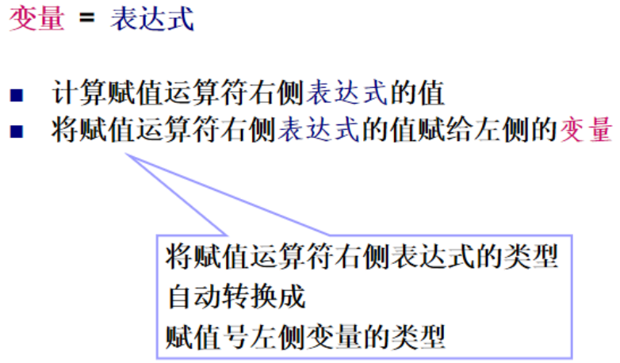
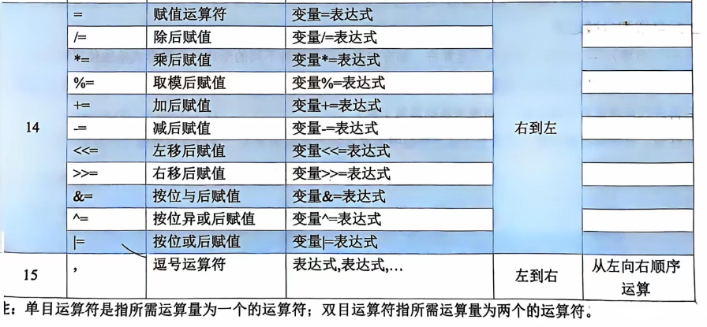
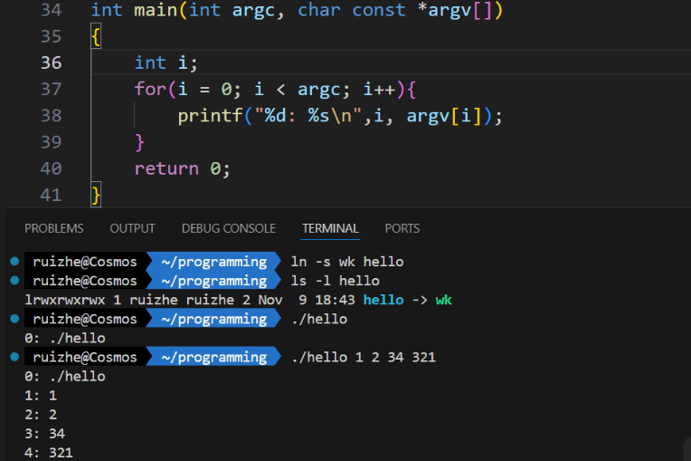
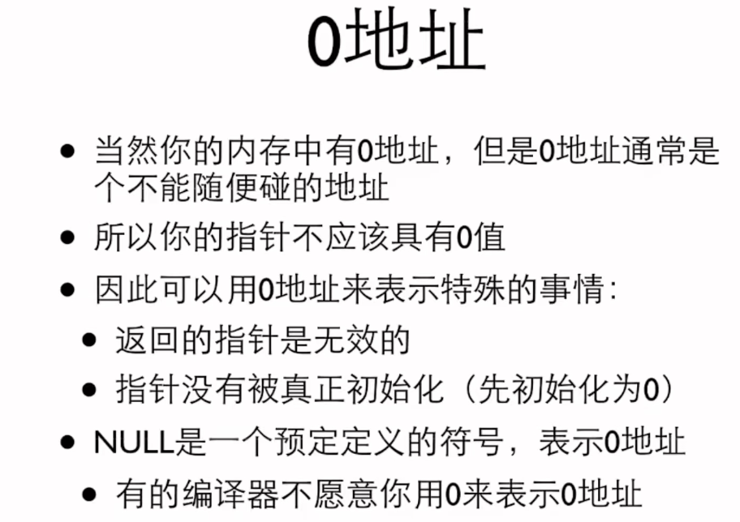

# Note

## 数据类型、运算符、表达式

### 数据类型

#### 变量和常量
- 变量
   - 作用：开一块内存放数据
   - 定义：
      - C89：变量必须在程序一开始全部定义
      - C99：任何位置都可以定义变量
   - 名字（标识符）
      
      规则：字母数字下划线组成；数字不能是第一个字符；不能是关键字

   - 赋值：若不赋值则随机值

- 常量

   - 定义
	   -  `const`只读变量
		可全局/局部
		eg：`const double PI = 3.1415;`
	   -  `#define`宏
      不加逗号
      eg：`#define PI 3.1415`


#### 基本数据类型

| 类别   | 名称             | 类型名                | 数据长度 | 取值范围                              | 格式说明符 |
|--------|------------------|-----------------------|----------|---------------------------------------|------------|
| 整型   | \[有符号] 整型    | int                   | 32 位     | $-2^{31}$ ~ $2^{31}-1$               | %d         |
|        | \[有符号] 短整型  | short \[int]          | 16 位     | $-2^{15}$ ~ $2^{15}-1$               | %hd        |
|        | \[有符号] 长整型  | long \[int]           | 32 位     | $-2^{31}$ ~ $2^{31}-1$               | %ld        |
|        | 无符号整型       | unsigned \[int]       | 32 位     | $0$ ~ $2^{32}-1$                     | %u         |
|        | 无符号短整型     | unsigned short \[int] | 16 位     | $0$ ~ $2^{16}-1$                     | %hu        |
|        | 无符号长整型     | unsigned long \[int]  | 32 位     | $0$ ~ $2^{32}-1$                     | %lu        |
| 字符型 | 字符型           | char                 | 8 位      | $0$ ~ $255$                          | %c         |
| 浮点型 | 单精度浮点型     | float                | 32 位     | 约 $10^{-38}$ ~ $10^{38}$            | %f         |
|        | 双精度浮点型     | double               | 64 位     | 约 $10^{-308}$ ~ $10^{308}$          | %lf        |


**注**: 

- 方括号中的内容可以省略。

- bit位数：0 ~ 长度-1 位；符号位：最高位（第长度-1位）

- 	十进制Decimal 八进制Octal 十六进制Hexadecimal

    16进制：X对应A~F； x对应a~f

- scanf：以行为单位，按下回车前不会读到任何东西

##### 整型

**定义**

1. 整型常量 == 整数数字
2. 整型变量

**存储**

让计算机用特定byte存数字：加后缀eg：`123L`,`123UL`，但是没有专门短整型的这种东西

**数字编码**

- 补码：

    使得数据的表示唯一：主要是0和-0统一；使得减法用加法做

    内存中按补码存储


正数：

三个码相同：符号位0，其余为二进制

负数：

- 原码：符号位1，其他位与为绝对值的二进制
- 反码：符号位1不变，除符号位其他为原码的反
- 补码：反码+1

负数三码转换

- 转换原因：内存中补码存储/运算；指导原码才知道数字是多少

- 原码 —— 补码：

    - 负数 取反（符号位不变） + 1

- 补码转原码：
    
    - 负数法一：加 1，取反。
    - 负数法一：补码的补码是原码

溢出：会有进位，溢出最高位舍

###### 示例

```c
int a = -1;
printf("%d, %u", a, a);
//结果：-1, 4294967295
printf("%o, %x", a, a);
//结果：37777777777, ffffffff
```

```c
//进制转换
printf("%d, %o, %x", 10, 10, 10);
printf("%d, %d, %d", 10, 010, 0x10);
```

##### 实型/浮点型
	
**定义**

表示形式：小数/科学计数法(格式说明符：%e)

数据精度 与 取值范围是两个不同的概念：

float x = 1234567.89;   x虽在取值范围内，但无法精确表达。 

float y = 1.2e55;   y 的精度要求不高，但超出取值范围。


**存储**

??? info "IEEE 754标准" 
	
	浮点数分三个部分,依次是：

	1. **符号位**（Sign bit）：1位，表示数值正负，0正1负数。

	2. **指数位**（Exponent）：存储指数部分，单精度为8位，双精度为11位。指数部分采用偏移量（bias）表示，单精度的偏移量为127，双精度的偏移量为1023。

	3. **尾数位**（Mantissa，也称为有效数字或 significand）：存储有效数字部分，单精度为23位，双精度为52位。尾数部分通常不包括最高位的1（隐含的前导1），除了特殊情况。

	举例

	假设有一个双精度浮点数 `3.14`，其二进制表示为 `1.1001000110100010100011110100110110`（不包括隐含的前导1），则其在内存中的存储方式如下：

	1. **符号位**：0（因为3.14是正数）
	2. **指数**：计算指数部分，3.14的二进制科学计数法为 `1.1001000110100010100011110100110110 * 2^1`，指数为1，加上偏移量1023，得到1024，二进制为 `10000000000`。
	3. **尾数**：`1001000110100010100011110100110110`（不包括隐含的前导1）

	因此，3.14在内存中的存储为：

	```
	0 10000000000 1001000110100010100011110100110110
	```


特点：不能精确存储

```c
printf("%d", 2.1 - 1 == 0.1);  //输出：0
printf("%d", 0.1 == 0.1);  //输出：1（非零）
```
```c
//判断俩实数是否相等
/*
wrong:
if(f1 == f2){}
*/
fabs(f1 - f2) < 1e-12  //其实1e-8就够了
```

##### 字符型

**定义**
	
- 字符型变量

- 字符型常量：单个字符，`'A'` `'\n'` 是正确的定义方式，得加上单引号 

**存储**

存ASCII

??? info "转义字符" 

	1. **多行字符串**：
	```c
	printf("Line 1 \
	Line 2");
	//输出：Line 1 Line 2
	```

	2. **包含特殊字符的字符串**：
	```c
	char str[] = "He said, \"Hello, World!\"";
	//输出: He said, "Hello, World!"
	```

	3. **使用八进制和十六进制转义序列**：
	```c
	printf("ASCII: \101 \102 \103\n"); // 八进制表示
	printf("ASCII: \x41 \x42 \x43\n"); // 十六进制表示
	```
	这里，`\101`、`\102`、`\103` 分别是字母 `A`、`B`、`C` 的八进制ASCII码，而 `\x41`、`\x42`、`\x43` 分别是 `A`、`B`、`C` 的十六进制ASCII码。输出结果将是：
	```
	ASCII: A B C
	ASCII: A B C
	```

	4. **使用退格符**：
	```c
	printf("Type \bnot\b me\n");
	```
	这里，`\b` 是退格符，用于删除前一个字符。输出结果将是：
	```
	Type  me
	```

	5. **使用空字符**：
	```c
	char str[] = "Hello\0World";
	printf("%s\n", str);
	```
	这里，`\0` 是空字符，它将字符串在 `Hello` 后面截断，所以 `World` 不会被打印出来。输出结果将是：
	```
	Hello
	```

	6. **使用回车符和换行符**：
	```c
	printf("First line.\rSecond line.\n");
	```
	这里，`\r` 是回车符，将光标移动到行首，然后打印 `Second line.`，覆盖了 `First line.`。输出结果将是：
	```
	Second line.
	```

	所有字符都可以用转义字符表示
	eg：打印`A`
    ```c
    printf("%c\n", 'A'); //直接
    ```
    ```c
    printf("%c\n", 65); //ASCII
    ```
    ```c
    printf("%c\n", '\x41'); //使用转义序列`\x`后跟十六进制的ASCII码值打印`A`（在支持C99标准或更高版本的编译器中）
    ```
    ```c
    printf("%c\n", '\101'); //八进制的ASCII码, 注意有''单引号
    ```


##### 关系
整型和字符型可以按ASCII随便交换

##### 类型转换

**零、情况**

1. 不同类型数据的混合运算
2. 整型数据除法需要得到小数

**一、自动**

**（一）、非赋值运算**

1. 理论
	
	水平方向：自动；垂直方向：低 —>高 

**（二）、赋值运算**
1. 理论
	
	
2. 示例：
```c
short bi;
bi = 0x12345678L; //长整型十六进制
printf("%d", bi);
/*
warning: overflow in conversion from ‘long int’ to ‘short int’ changes value from ‘305419896’ to ‘22136’ [-Woverflow]
   11 | bi = 0x12345678L;
      |      ^~~~~~~~~~~
*/
```
数值溢出时：

**截断**：由于数值超出了 `short` 类型的范围，编译器会将这个数值截断到 `short` 类型能表示的范围。具体来说，它会取这个数值的低16位。`0x12345678L` 的二进制表示是 `0001 0010 0011 0100 0101 0110 0111 1000`，取低16位是 `0101 0110 0111 1000`，即 `0x5EF8`。

**二、强制类型转换**

**语法：**(类型名)  表达式

**示例：**

```C
    printf("(double)3 = %.1f\n", (double)3); // 3.0
    printf("(int)3.8 = %d\n", (int)3.8);  //3
    printf("(int)-1.6 = %d\n", (int)-1.6);  //-1
    printf("(double)(5/2) = %.1f\n", (double)(5 / 2));  //2.0
    printf("(double)5/2 = %.1f\n", (double)5 / 2);  //2.5
    //后两个：看优先级：（）比（类型名）高

    int i;        // Integer variable
    double x;     // Double variable
    x = 3.8;      // Assign 3.8 to x
    i = (int)x;   // Cast x to int, truncating 3.8 to 3
    printf("x = %f, i = %d\n", x, i); 
    // Output: x = 3.800000, i = 3
    printf("(double)(int)x = %f\n", (double)(int)x); 
    // Cast x to int (3) and then cast back to double (3.0)
    // Output: (double)(int)x = 3.000000
    printf("x mod 3 = %d\n", (int)x % 3); 
    // Cast x (3.8) to int (3), then compute 3 % 3 = 0
    // Output: x mod 3 = 0
```

#### 其他数据类型

##### 枚举

**定义&规则：**

```c
enum 枚举名 {
    枚举常量1,
    枚举常量2,
    ...
};
//带上分号
```

- C内部`enum`其实就是`int`，可以当作`int`做运算
- **枚举名**：是枚举类型的名字（可选，因为一般不用）。
- **枚举常量**：是一组合法的标识符，（必要，需要用）类型是`int`常量，默认从 `0` 开始依次递增。
- 枚举中的常量必须唯一

- **不能直接输入枚举常量的名字：**
  枚举常量不能通过输入输出函数直接读写。例如，不能用 `scanf` 读取枚举类型，必须通过整数变量赋值。

- **类型安全性：**
  枚举变量的值可以超出定义的范围（尽管不推荐），因为底层实现是整数。例如：
  ```c
  enum Color { RED, GREEN, BLUE };

  int main() {
      enum Color myColor = 5; // 合法，但不推荐
      printf("%d\n", myColor); // 输出 5
      return 0;
  }
  ```


**意义**：

命名的一组需要排列的整数常量，用于固定类别、状态和选项的表示。可读性，易于维护。


**使用**

```c
enum Color {
    RED,    // 默认值为 0
    GREEN,  // 默认值为 1
    BLUE    // 默认值为 2
};
```

这里定义了一个枚举类型 `Color`，它包含了三个枚举常量：`RED`、`GREEN` 和 `BLUE`。这些常量的默认值分别是 `0`、`1` 和 `2`。


**为枚举常量指定值**

可以显式为枚举常量指定值。如果未指定值，则该常量的值为前一个常量值加 `1`。

```c
enum Day {
    MON = 1,  // MON 的值是 1
    TUE,      // TUE 的值是 2
    WED = 5,  // WED 的值是 5
    THU,      // THU 的值是 6
    FRI = 10, // FRI 的值是 10
    SAT,      // SAT 的值是 11
    SUN       // SUN 的值是 12
};
```

**定义枚举变量**


```c
enum Color { RED, GREEN, BLUE };

int main() {
    enum Color myColor; // 定义一个枚举变量
    myColor = GREEN;    // 为变量初始化枚举常量
    printf("myColor = %d\n", myColor); // 输出 1
    scanf("%d", &myColor);  // 输入 5
    printf("%d", myColor);  // 输出 5
    printf("%d", GREEN); // 输出 1
    return 0;
}
//GREEN的值不会变成5啊，因为枚举常量的值是固定的，且在编译时已经确定。赋值给枚举变量（如 myColor）时，只是改变了变量的值，不会修改枚举常量的值。
```

---

**匿名枚举**

如果不需要多次引用枚举类型名称，可以省略枚举类型的名字，直接使用枚举常量。

```c
enum { MON, TUE, WED, THU, FRI, SAT, SUN };

int main() {
    int today = WED; // 直接使用枚举常量
    printf("Today is day number: %d\n", today); // 输出 2
    return 0;
}
```

**计数**

`Color{c1, c2, c3, c4, cnt};` 这里`cnt`值是4，记录了前面枚举变量的个数，可以用它来循环……

**具体使用场景**

在底层，枚举类型的常量其实是整数（`int` 类型）。因此，枚举常量可以用于任何需要整数值的地方。

```c
enum Status { OFF, ON };

int main() {
    enum Status light = OFF;

    if (light == OFF) {
        printf("Light is off\n");
    }
    return 0;
}
```


```c
//状态开关机
enum State { INIT, RUNNING, STOPPED };

void checkState(enum State s) {
    switch (s) {
        case INIT:    printf("Initializing...\n"); break;
        case RUNNING: printf("Running...\n"); break;
        case STOPPED: printf("Stopped.\n"); break;
        default:      printf("Unknown state!\n");
    }
}
```

##### typedef自定义类型

`typedef` 用于给现有类型定义新的别名或创建易于使用的自定义类型。

---

**1. 简化复杂类型**
为指针类型创建别名，简化代码的书写和阅读。

```c
#include <stdio.h>

// 为指针类型定义别名
typedef char* String;

int main() {
    String name = "Alice";
    printf("Name: %s\n", name);
    return 0;
}
```

**解析**：`String` 是 `char*` 的别名，简化了定义指针变量的代码。

---

**2. 定义结构体的别名**
为结构体类型创建更简洁的名称。

```c
#include <stdio.h>

// 定义结构体和别名
typedef struct {
    int x;
    int y;
} Point;

int main() {
    Point p = {10, 20};
    printf("Point: (%d, %d)\n", p.x, p.y);
    return 0;
}
```

**解析**：使用 `typedef` 后，定义变量时无需再写 `struct`，直接使用 `Point`。

---

**3. 定义枚举类型的别名**
为枚举类型起一个更直观的名字。

```c
#include <stdio.h>

// 定义枚举类型和别名
typedef enum { RED, GREEN, BLUE } Color;

int main() {
    Color favoriteColor = GREEN;
    printf("Favorite color code: %d\n", favoriteColor);
    return 0;
}
```

**解析**：`Color` 是枚举类型的别名，代码更直观。

再例，

```c
typedef enum { false, true } bool;
bool palindrome(char *s) { /*代码块*/}
```

---

**4. 定义自定义数据类型**
将常用的基础类型替换为更具语义的名字。

```c
#include <stdio.h>

// 定义一个长度类型
typedef unsigned int Length;

int main() {
    Length len = 100;
    printf("Length: %u\n", len);
    return 0;
}
```

**解析**：`Length` 是 `unsigned int` 的别名，用于表示逻辑上的长度，增加代码语义。

---

**5. 定义函数指针的别名**
为函数指针类型定义别名，简化函数指针的声明和使用。

```c
#include <stdio.h>

// 定义函数指针类型
typedef int (*Operation)(int, int);

// 函数定义
int add(int a, int b) {
    return a + b;
}

int multiply(int a, int b) {
    return a * b;
}

int main() {
    Operation op;  // 使用别名定义函数指针变量

    op = add;
    printf("Add: %d\n", op(5, 3));

    op = multiply;
    printf("Multiply: %d\n", op(5, 3));

    return 0;
}
```

**解析**：`Operation` 是函数指针 `int (*)(int, int)` 的别名，简化了函数指针的声明。

---

**6. 定义数组类型的别名**
为数组定义一个别名，用于统一管理数据类型。

```c
#include <stdio.h>

// 定义数组类型别名
typedef int Matrix[3][3];

int main() {
    Matrix mat = {
        {1, 2, 3},
        {4, 5, 6},
        {7, 8, 9}
    };

    for (int i = 0; i < 3; i++) {
        for (int j = 0; j < 3; j++) {
            printf("%d ", mat[i][j]);
        }
        printf("\n");
    }

    return 0;
}
```

**解析**：`Matrix` 是一个 3x3 整数数组的别名，简化了矩阵类型的声明。

---

**7. 定义位域类型的别名**
为包含位域的结构体定义一个易用的别名。

```c
#include <stdio.h>

// 定义位域类型
typedef struct {
    unsigned int isAvailable : 1;
    unsigned int isReadOnly  : 1;
    unsigned int isHidden    : 1;
} FileAttributes;

int main() {
    FileAttributes file = {1, 0, 1};

    printf("Available: %u, ReadOnly: %u, Hidden: %u\n",
           file.isAvailable, file.isReadOnly, file.isHidden);
    return 0;
}
```

**解析**：`FileAttributes` 是带有位域的结构体的别名，用于简化属性定义。

---

**8. 定义通用数据类型**
为便于跨平台开发，将特定平台的基础类型定义为通用类型。

```c
#include <stdio.h>

// 定义跨平台的整型别名
typedef unsigned long long int U64;

int main() {
    U64 largeNumber = 1234567890123456789ULL;
    printf("Large number: %llu\n", largeNumber);
    return 0;
}
```

**解析**：`U64` 是 `unsigned long long int` 的别名，用于表示 64 位无符号整数。

---

??? info "总结"
    
    `typedef` 的用法非常灵活，常见场景包括：
    1. 简化复杂类型的声明。
    2. 提高代码可读性和语义性。
    3. 增强代码的可维护性和可移植性。

    在不同的场景中，根据需求使用 `typedef` 可以使代码更加清晰简洁。

### 杂项
- static & auto
	- C语言有很多区放变量：常量区、静态区、栈区、堆区
	- 动态变量 auto
		- 特点：调用一次分配一次内存，调用结束就释放了，重来
		- 定义：在C语言中，`auto` 关键字用于声明自动存储期的局部变量。它告诉编译器，该变量应该在栈上分配，并且其生命周期仅限于声明它的函数或代码块。然而，`auto` 关键字实际上是可选的，因为在函数内部声明的变量默认就是自动存储期的。
		- 在C99标准之前，`auto` 关键字是必需的，但在C99及以后的标准中，它变得可选。
	- 静态变量 static
		- 特点：整个程序运行期间存在，等程序结束后释放
	- 全局静态变量
		- 作用：只可以使其在声明的文件中可见，避免与其他文件中同名变量冲突
	- 静态函数 ```static int function_name(parameter_type parameter)```
		- 作用：只能在所声明的文件中调用，其他文件不可使用：辅助函数、实用函数限制在特定文件中
    - 局部静态变量
		- 定义：函数内部定义的静态变量
		- 作用：类似全局变量，函数调用结束后，其值不会被销毁，而是保持存在
		- 用处：重复使用，这一次的接着上一次的值用

```c
#include<stdio.h>
//三个变量都赋初始值0
int global = 0;  //global为全局变量
void stc()
{
    int n = 0;  //n 为局部变量
    static int sta = 0;  //sta为静态局部变量
    n++; sta++; global++;  //函数每次执行都对三个变量+1
    printf("%d ", n); printf("%d ", sta); printf("%d ", global);
}
int main()
{
    int i;
    for(i = 1; i <= 5; i++){
        stc(); printf("\n");  //三次调用函数
    }
    return 0; 
}
/* 输出：
1 1 1 
1 2 2 
1 3 3 
1 4 4 
1 5 5 
全局变量和静态局部变量都延续了上次调用的结果继续+，局部变量从初始值开始
*/
```

??? info "ASCII"
        
    | 字符 | 中文名称   | 十进制 | 十六进制 | 八进制 | 二进制       |
    |------|------------|--------|----------|--------|--------------|
    | NUL  | 空字符     | 0      | 0x00     | 000    | 00000000     |
    | SOH  | 标题开始   | 1      | 0x01     | 001    | 00000001     |
    | STX  | 正文开始   | 2      | 0x02     | 002    | 00000010     |
    | ETX  | 正文结束   | 3      | 0x03     | 003    | 00000011     |
    | EOT  | 传输结束   | 4      | 0x04     | 004    | 00000100     |
    | ENQ  | 请求       | 5      | 0x05     | 005    | 00000101     |
    | ACK  | 确认       | 6      | 0x06     | 006    | 00000110     |
    | BEL  | 响铃       | 7      | 0x07     | 007    | 00000111     |
    | BS   | 退格       | 8      | 0x08     | 010    | 00001000     |
    | TAB  | 水平制表符 | 9      | 0x09     | 011    | 00001001     |
    | LF   | 换行       | 10     | 0x0A     | 012    | 00001010     |
    | VT   | 垂直制表符 | 11     | 0x0B     | 013    | 00001011     |
    | FF   | 换页符     | 12     | 0x0C     | 014    | 00001100     |
    | CR   | 回车       | 13     | 0x0D     | 015    | 00001101     |
    | SO   | 禁止切换   | 14     | 0x0E     | 016    | 00001110     |
    | SI   | 允许切换   | 15     | 0x0F     | 017    | 00001111     |
    | SP   | 空格       | 32     | 0x20     | 040    | 00100000     |
    | !    | 感叹号     | 33     | 0x21     | 041    | 00100001     |
    | "    | 双引号     | 34     | 0x22     | 042    | 00100010     |
    | #    | 井号       | 35     | 0x23     | 043    | 00100011     |
    | $    | 美元符     | 36     | 0x24     | 044    | 00100100     |
    | %    | 百分号     | 37     | 0x25     | 045    | 00100101     |
    | &    | 和号/商标符| 38     | 0x26     | 046    | 00100110     |
    | '    | 单引号     | 39     | 0x27     | 047    | 00100111     |
    | (    | 左括号     | 40     | 0x28     | 050    | 00101000     |
    | )    | 右括号     | 41     | 0x29     | 051    | 00101001     |
    | *    | 星号       | 42     | 0x2A     | 052    | 00101010     |
    | +    | 加号       | 43     | 0x2B     | 053    | 00101011     |
    | ,    | 逗号       | 44     | 0x2C     | 054    | 00101100     |
    | -    | 减号       | 45     | 0x2D     | 055    | 00101101     |
    | .    | 句号       | 46     | 0x2E     | 056    | 00101110     |
    | /    | 斜杠       | 47     | 0x2F     | 057    | 00101111     |
    | 0    | 数字0      | 48     | 0x30     | 060    | 00110000     |
    | 1    | 数字1      | 49     | 0x31     | 061    | 00110001     |
    | 2    | 数字2      | 50     | 0x32     | 062    | 00110010     |
    | 3    | 数字3      | 51     | 0x33     | 063    | 00110011     |
    | 4    | 数字4      | 52     | 0x34     | 064    | 00110100     |
    | 5    | 数字5      | 53     | 0x35     | 065    | 00110101     |
    | 6    | 数字6      | 54     | 0x36     | 066    | 00110110     |
    | 7    | 数字7      | 55     | 0x37     | 067    | 00110111     |
    | 8    | 数字8      | 56     | 0x38     | 070    | 00111000     |
    | 9    | 数字9      | 57     | 0x39     | 071    | 00111001     |
    | :    | 冒号       | 58     | 0x3A     | 072    | 00111010     |
    | ;    | 分号       | 59     | 0x3B     | 073    | 00111011     |
    | <    | 小于号     | 60     | 0x3C     | 074    | 00111100     |
    | =    | 等号       | 61     | 0x3D     | 075    | 00111101     |
    | >    | 大于号     | 62     | 0x3E     | 076    | 00111110     |
    | ?    | 问号       | 63     | 0x3F     | 077    | 00111111     |
    | @    | 电子邮件符  | 64     | 0x40     | 100    | 01000000     |
    | A    | 字母A       | 65     | 0x41     | 101    | 01000001     |
    | B    | 字母B       | 66     | 0x42     | 102    | 01000010     |
    | C    | 字母C       | 67     | 0x43     | 103    | 01000011     |
    | D    | 字母D       | 68     | 0x44     | 104    | 01000100     |
    | E    | 字母E       | 69     | 0x45     | 105    | 01000101     |
    | F    | 字母F       | 70     | 0x46     | 106    | 01000110     |
    | G    | 字母G       | 71     | 0x47     | 107    | 01000111     |
    | H    | 字母H       | 72     | 0x48     | 110    | 01001000     |
    | I    | 字母I       | 73     | 0x49     | 111    | 01001001     |
    | J    | 字母J       | 74     | 0x4A     | 112    | 01001010     |
    | K    | 字母K       | 75     | 0x4B     | 113    | 01001011     |
    | L    | 字母L       | 76     | 0x4C     | 114    | 01001100     |
    | M    | 字母M       | 77     | 0x4D     | 115    | 01001101     |
    | N    | 字母N       | 78     | 0x4E     | 116    | 01001110     |
    | O    | 字母O       | 79     | 0x4F     | 117    | 01001111     |
    | P    | 字母P       | 80     | 0x50     | 120    | 01010000     |
    | Q    | 字母Q       | 81     | 0x51     | 121    | 01010001     |
    | R    | 字母R       | 82     | 0x52     | 122    | 01010010     |
    | S    | 字母S       | 83     | 0x53     | 123    | 01010011     |
    | T    | 字母T       | 84     | 0x54     | 124    | 01010100     |
    | U    | 字母U       | 85     | 0x55     | 125    | 01010101     |
    | V    | 字母V       | 86     | 0x56     | 126    | 01010110     |
    | W    | 字母W       | 87     | 0x57     | 127    | 01010111     |
    | X    | 字母X       | 88     | 0x58     | 130    | 01011000     |
    | Y    | 字母Y       | 89     | 0x59     | 131    | 01011001     |
    | Z    | 字母Z       | 90     | 0x5A     | 132    | 01011010     |
    | \[    | 左方括号    | 91     | 0x5B     | 133    | 01011011     |
    | \\   | 反斜杠     | 92     | 0x5C     | 134    | 01011100     |
    | ]    | 右方括号    | 93     | 0x5D     | 135    | 01011101     |
    | ^    | 插入符号    | 94     | 0x5E     | 136    | 01011110     |
    | _    | 下划线      | 95     | 0x5F     | 137    | 01011111     |
    | `    | 反引号      | 96     | 0x60     | 140    | 01100000     |
    | a    | 字母a       | 97     | 0x61     | 141    | 01100001     |
    | b    | 字母b       | 98     | 0x62     | 142    | 01100010     |
    | c    | 字母c       | 99     | 0x63     | 143    | 01100011     |
    | d    | 字母d       | 100    | 0x64     | 144    | 01100100     |
    | e    | 字母e       | 101    | 0x65     | 145    | 01100101     |
    | f    | 字母f       | 102    | 0x66     | 146    | 01100110     |
    | g    | 字母g       | 103    | 0x67     | 147    | 01100111     |
    | h    | 字母h       | 104    | 0x68     | 150    | 01101000     |
    | i    | 字母i       | 105    | 0x69     | 151    | 01101001     |
    | j    | 字母j       | 106    | 0x6A     | 152    | 01101010     |
    | k    | 字母k       | 107    | 0x6B     | 153    | 01101011     |
    | l    | 字母l       | 108    | 0x6C     | 154    | 01101100     |
    | m    | 字母m       | 109    | 0x6D     | 155    | 01101101     |
    | n    | 字母n       | 110    | 0x6E     | 156    | 01101110     |
    | o    | 字母o       | 111    | 0x6F     | 157    | 01101111     |
    | p    | 字母p       | 112    | 0x70     | 160    | 01110000     |
    | q    | 字母q       | 113    | 0x71     | 161    | 01110001     |
    | r    | 字母r       | 114    | 0x72     | 162    | 01110010     |
    | s    | 字母s       | 115    | 0x73     | 163    | 01110011     |
    | t    | 字母t       | 116    | 0x74     | 164    | 01110100     |
    | u    | 字母u       | 117    | 0x75     | 165    | 01110101     |
    | v    | 字母v       | 118    | 0x76     | 166    | 01110110     |
    | w    | 字母w       | 119    | 0x77     | 167    | 01110111     |
    | x    | 字母x       | 120    | 0x78     | 170    | 01111000     |
    | y    | 字母y       | 121    | 0x79     | 171    | 01111001     |
    | z    | 字母z       | 122    | 0x7A     | 172    | 01111010     |
    | {    | 左花括号    | 123    | 0x7B     | 173    | 01111011     |
    | \|    | 竖线       | 124    | 0x7C     | 174    | 01111100     |
    | }    | 右花括号    | 125    | 0x7D     | 175    | 01111101     |
    | ~    | 波浪号      | 126    | 0x7E     | 176    | 01111110     |
    | DEL  | 删除       | 127    | 0x7F     | 177    | 01111111     |


    单个数字0(0)（ASCII的0位）就是'\0'；带引号的字符0('0') 是ASCII的48位
	

### 运算符和表达式

!!! success "牢记几句话"

    表达式的值

**表达式定义：**

运算符 + 运算对象

运算符：具有运算功能的符号

运算对象：常量、变量和函数等表达式

**分类**

算术表达式、赋值表达式、关系表达式、逻辑表达式、条件表达式和逗号表达式 


#### 优先级

最好都加上逗号





- 逻辑表达式：C赋值：真1 假0

- 循环判断：非零真

- ++ --
    - 数据的值一样，表达式的值不一样
        - a++：表达式：a+1之前的值，把表达式的值赋给其他
        - ++a：表达式：a+1之后的值，把表达式的值赋给其他

- 只能对变量不能对表达式用

- 左右结合：先从哪边算

- x = y = 3 : 不能在变量定义处用，可以后面用，结合顺序
- 复合赋值：i+=1：更高效

- 逻辑运算短路：
    - ||：前面真后面不算
    - &&：前面假后面不算


#### 位运算
结果是表达式的值

!!! warning "重点"

    计算机中，数字的储存、运算都是以 补码 形式

    `Ctrl F 数字编码`


- 位逻辑运算

	- ~   按位取反               
	- &   按位与 
	- ^   按位异或：相同取0，不同取1
	- |   按位或
- 移位运算

    - <<    对操作数左移给出的位数
    - \>>    对操作数右移给出的位数
   
   箭头朝向即为移动方向

   直接遗弃超出范围的位

- 复合位赋值运算

   - `&=`, `|=`, `^=`, `>>=`, `<<=`

   `a &= b` 等价于 `a = a & b`； `a >>= 3` 等价于 `a = a >> 3`


## 循环和分支
循环：

- for 
- while 
- do while
### 语法

**`do while` 的语法**
```c
int main()
{
    do
    {
        /* code */
    } while (/* condition */);
}
```
很好用，意义是不管任何条件先做一次，适用于条件判断处有特殊情况时,。例如输入的数字是0，条件判断是 `>0` 


**灵活：**

- for内部：`(起始条件; 条件判断; 结束条件)`

    - 内部三处均可按需省略，保留两个分号即可
    - 不一定只能有一个变量
    - 几个条件不一定必须是只含 `i` 的逻辑表达式


### 示例

写无限循环遇到某条件跳出：
```c
for(i = 0; ; i++){
    if(/*条件*/) break;
    else /*代码块例如cnt++*/;
}
```
```c
while(1){
    /*代码块例如cnt++*/;
    if(/*条件*/) break;
}
```

分支

`if`

`switch`

```c
switch (expression)
{
case /* constant-expression */:  //一定得是常量
    /* code */
    break;

default:
    break;
}
```

## 函数

### 定义、声明与调用
#### 声明
编译器一行一行编译，故调用之前应该让编译器知道函数的返回类型、参数、名称

**建议**：用声明：先读main函数干什么

**位置**
	
- C89：写在main里面
- C99：写在main前面

**规则：** 定义声明一致

实际上，声明中可以只写变量类型，变量名称也可以和函数定义头部不一样。因为编译器检查只检查定义和声明变量类型是否一样

#### 参数和值

**核心：**

要在函数内部对主函数的变量进行操作，则必须得把主函数中的那个变量or其地址传入函数。

**形参实参**

- 参数 & 值：实参 —— 参数；形参 —— 值（参数的值）：就是传值

**数组作为函数的参数**
```
Ctrl F 指针与函数
```

#### 变量空间：
每个函数都有他自己的变量空间；
离开一个函数f到另一个函数g里面，则会跳出f的变量空间，来到g的变量空间；
在一个函数g里面对变量操作，不会影响f里面的变量，因为不在一个变量空间；

#### 局部变量

**前置**

- 生存期：变量多会出现，多会消亡
- 作用域：在代码的什么范围内可以访问这个变量（这个变量起作用）

**定义**

局部变量(\==本地变量、自动变量)

概念：

每次函数运行，都产生一个独立的变量空间，这个空间中的变量是函数这次运行独有的

分类：定义在函数内部的 & 参数

规则：

定义在块内，即一个大括号{ }，进入块，变量存在；离开块，变量消失
- 函数的块内
- 语句的块内
- 甚至以单拉一个大括号定义变量

内部的变量外部不可以访问，外部的变量内部可以访问

同名变量：
- 内外同名：内部掩盖外部的
- 内部同名：编译错误redefination

本地变量不会默认初始化，但是参数进入函数时已经被初始化（参数的传递）

#### 调用函数

传递的值（实参）：常量、变量、*表达式（的值）*

类型不匹配：

C：会发生自动类型转换：即将传入的参数类型转换为定义中说的那个类型。Java、C++会严格检查类型的匹配。

传值：

永远是传值给函数，即参数传递的单向性：实参的值传给形参，形参的值改变了，也不会影响实参。还是变量空间的问题，swap的例子。

#### 返回值

**return作用：**

1. 结束执行函数
2. 返回一个值，将这个值给到调用它的地方：*调用它的地方那里写的函数调用就是代表该函数的返回值*。

**规则：**

1. `return;`, 
2. `return 表达式;` 将表达式的值传出去
3. 函数里面可以多个return，也可以不在函数最后。
4. *单一出口理念*：最好函数只有一个出口即只有一个return。


#### 杂项
- 没有参数
	
    `f(void)` : 不传参数，声明时写上void，别不写

- 逗号运算符
	
    `f(a, b)` : 逗号是标点符号不是运算符，这是传了俩参数
	
    `f((a, b))` : `(a, b)`是一个表达式，值是b，则这句代表传的是这个表达式的值：b
- 函数中不能定义函数，可以声明
- 函数声明可以放在自己的定义里面
- main函数
	
    return 0；返回0：正确；返回非0：异常
	
    bash : `echo $?`: 可查看main运行结束的返回值（return -1 则 stdout：255）

### 标准库

#### stdio.h

**1. `printf`**  
**功能**：格式化输出到标准输出（屏幕）。  
**函数原型**：`int printf(const char *format, ...);`  
**示例**：  
```c
printf("Hello, %s! You are %d years old.\n", "Alice", 25);
```

---

**2. `scanf`**  
**功能**：从标准输入读取格式化数据。  
**函数原型**：`int scanf(const char *format, ...);`  
**示例**：  
```c
int age;
scanf("%d", &age);
```

---

**3. `fprintf`**  
**功能**：格式化输出到指定文件流。  
**函数原型**：`int fprintf(FILE *stream, const char *format, ...);`  
**示例**：  
```c
FILE *fp = fopen("output.txt", "w");
fprintf(fp, "Score: %d\n", 100);
fclose(fp);
```

---

**4. `fscanf`**  
**功能**：从指定文件流读取格式化数据。  
**函数原型**：`int fscanf(FILE *stream, const char *format, ...);`  
**示例**：  
```c
FILE *fp = fopen("data.txt", "r");
int score;
fscanf(fp, "%d", &score);
fclose(fp);
```

---

**5. `fopen`**  
**功能**：打开文件。  
**函数原型**：`FILE *fopen(const char *filename, const char *mode);`  
**示例**：  
```c
FILE *fp = fopen("file.txt", "r");
```

---

**6. `fclose`**  
**功能**：关闭文件流。  
**函数原型**：`int fclose(FILE *stream);`  
**示例**：  
```c
fclose(fp);
```

---

**7. `fgetc`**  
**功能**：从文件流中读取单个字符。  
**函数原型**：`int fgetc(FILE *stream);`  
**示例**：  
```c
char ch = fgetc(fp);
```

---

**8. `fputc`**  
**功能**：将单个字符写入文件流。  
**函数原型**：`int fputc(int c, FILE *stream);`  
**示例**：  
```c
fputc('A', fp);
```

---

**9. `fgets`**  
**功能**：从文件流读取一行。  
**函数原型**：`char *fgets(char *str, int n, FILE *stream);`  
**示例**：  
```c
char buffer[100];
fgets(buffer, 100, fp);
```

---

**10. `fputs`**  
**功能**：将字符串写入文件流。  
**函数原型**：`int fputs(const char *str, FILE *stream);`  
**示例**：  
```c
fputs("Hello, World!\n", fp);
```

---

**11. `getchar`**  
**功能**：从标准输入读取单个字符。  
**函数原型**：`int getchar(void);`  
**示例**：  
```c
char ch = getchar();
```

---

**12. `putchar`**  
**功能**：输出单个字符到标准输出。  
**函数原型**：`int putchar(int c);`  
**示例**：  
```c
putchar('A');
```

---

**13. `gets`** *(已不推荐使用，存在安全隐患)*  
**功能**：从标准输入读取字符串。  
**函数原型**：`char *gets(char *str);`  
**示例**：  
```c
char buffer[100];
gets(buffer);
```

---

**14. `puts`**  
**功能**：输出字符串到标准输出。  
**函数原型**：`int puts(const char *str);`  
**示例**：  
```c
puts("Hello, World!");
```

---

**15. `feof`**  
**功能**：检查文件流是否到达末尾。  
**函数原型**：`int feof(FILE *stream);`  
**示例**：  
```c
if (feof(fp)) {
    printf("End of file reached.\n");
}
```

---

**16. `ferror`**  
**功能**：检查文件流是否有错误。  
**函数原型**：`int ferror(FILE *stream);`  
**示例**：  
```c
if (ferror(fp)) {
    printf("File error occurred.\n");
}
```

---

**17. `rewind`**  
**功能**：将文件流位置指针重置到文件开头。  
**函数原型**：`void rewind(FILE *stream);`  
**示例**：  
```c
rewind(fp);
```

---

**18. `ftell`**  
**功能**：获取文件流当前位置。  
**函数原型**：`long ftell(FILE *stream);`  
**示例**：  
```c
long pos = ftell(fp);
```

---

**19. `fseek`**  
**功能**：设置文件流位置指针。  
**函数原型**：`int fseek(FILE *stream, long offset, int whence);`  
**示例**：  
```c
fseek(fp, 0, SEEK_END);
```

---

**20. `clearerr`**  
**功能**：清除文件流的错误标志和 EOF 标志。  
**函数原型**：`void clearerr(FILE *stream);`  
**示例**：  
```c
clearerr(fp);
```


#### string.h

**1. `strlen`**  
**功能**：返回字符串的长度（不包括终止符 `\0`）。  
**函数原型**：`size_t strlen(const char *str);`  
**示例**：  
```c
printf("%zu\n", strlen("Hello")); // 输出 5
```

---

**2. `strcpy`**  
**功能**：将字符串复制到另一个字符串。  
**函数原型**：`char *strcpy(char *dest, const char *src);`  
**底层**：第一个参数代表目标的起始地址，第二个参数代表源头的起始地址。   
**示例**：  
```c
char dest[20];
strcpy(dest, "Hello");
printf("%s\n", dest); // 输出 "Hello"
```

---

**3. `strncpy`**  
**功能**：复制指定长度的字符串到另一个字符串。  
**函数原型**：`char *strncpy(char *dest, const char *src, size_t n);`  
**示例**：  
```c
char dest[10];
strncpy(dest, "HelloWorld", 5);
dest[5] = '\0';
printf("%s\n", dest); // 输出 "Hello"
```

---

**4. `strcat`**  
**功能**：将字符串追加到另一个字符串的末尾。  
**函数原型**：`char *strcat(char *dest, const char *src);`  
**示例**：  
```c
char str[20] = "Hello";
strcat(str, " World");
printf("%s\n", str); // 输出 "Hello World"
```

---

**5. `strncat`**  
**功能**：将指定长度的字符串追加到另一个字符串的末尾。  
**函数原型**：`char *strncat(char *dest, const char *src, size_t n);`  
**示例**：  
```c
char str[20] = "Hello";
strncat(str, "World", 3);
printf("%s\n", str); // 输出 "HelloWor"
```

---

**6. `strcmp`**  
**功能**：比较两个字符串（区分大小写）。  
**函数原型**：`int strcmp(const char *str1, const char *str2);`  
**示例**：  
```c
if (strcmp("abc", "abc") == 0) {
    printf("Equal\n");
}
```

---

**7. `strncmp`**  
**功能**：比较指定长度的两个字符串。  
**函数原型**：`int strncmp(const char *str1, const char *str2, size_t n);`  
**示例**：  
```c
if (strncmp("abcdef", "abcxyz", 3) == 0) {
    printf("Equal\n");
}
```

---

**8. `strchr`**  
**功能**：查找字符串中首次出现的指定字符。  
**函数原型**：`char *strchr(const char *str, int c);`  
**示例**：  
```c
char *pos = strchr("Hello", 'e');
if (pos) {
    printf("Found at index %ld\n", pos - "Hello");
}
/*
查找字符第一次出现的位置。如果找到了，函数会返回指向该字符的指针；如果找不到，则返回 NULL。
"Hello" 是字符串的起始地址。
pos 是目标字符 'e' 的地址。
将两个指针相减，结果就是目标字符相对于字符串起始位置的索引。
*/

```

---

**9. `strrchr`**  
**功能**：查找字符串中最后一次出现的指定字符。  
**函数原型**：`char *strrchr(const char *str, int c);`  
**示例**：  
```c
char *pos = strrchr("Hello", 'l');
if (pos) {
    printf("Found at index %ld\n", pos - "Hello");
}
```

---

**10. `strstr`**  
**功能**：查找字符串中首次出现的子串。  
**函数原型**：`char *strstr(const char *haystack, const char *needle);`  
**示例**：  
```c
char *pos = strstr("Hello World", "World");
if (pos) {
    printf("Substring found: %s\n", pos);
}
```

---

**11. `strtok`**  
**功能**：分割字符串（以指定分隔符为界）。  
**函数原型**：`char *strtok(char *str, const char *delim);`  
**示例**：  
```c
char str[] = "Hello,World";
char *token = strtok(str, ",");
while (token) {
    printf("%s\n", token);
    token = strtok(NULL, ",");
}
/*
char *strtok(char *__restrict__ __s, const char *__restrict__ __delim)

Divide S into tokens separated by characters in DELIM.
*/

/*

 1. **`char str[] = "Hello,World";`**
   - 定义了一个字符串数组 `str`，其中包含内容 `"Hello,World"`。
   - 字符串 `str` 可被修改（不同于字符串常量）。

 2. **`char *token = strtok(str, ",");`**
   - `strtok` 函数用于将字符串 `str` 按分隔符 `","`（逗号）进行分割。
   - 第一次调用时，`strtok` 将会：
     1. 查找第一个分隔符 `','`。
     2. 将分隔符替换为 `'\0'`（字符串结束符）。
     3. 返回指向第一个子字符串（即 `Hello`）的指针。

 3. **`while (token) {`**
   - 只要 `token` 不为 `NULL`，就继续循环。
   - `strtok` 会返回每个子字符串的指针，直到字符串末尾时返回 `NULL`。

 4. **`printf("%s\n", token);`**
   - 打印当前的子字符串（token）。

 5. **`token = strtok(NULL, ",");`**
   - 继续查找下一个子字符串：
     - 第二次及之后的调用中，传入的第一个参数必须为 `NULL`，表示继续处理上一次的字符串。
     - 查找到下一个分隔符，返回对应的子字符串指针。
*/
```

---

**12. `memset`**  
**功能**：将内存的某一部分设置为指定值。  
**函数原型**：`void *memset(void *s, int c, size_t n);`  
**示例**：  
```c
char buffer[10];
memset(buffer, 'A', 10);
buffer[9] = '\0';
printf("%s\n", buffer); // 输出 "AAAAAAAAA"
```

---

**13. `memcpy`**  
**功能**：复制内存区域。  
**函数原型**：`void *memcpy(void *dest, const void *src, size_t n);`  
**示例**：  
```c
char src[] = "Hello";
char dest[10];
memcpy(dest, src, 6);
printf("%s\n", dest); // 输出 "Hello"
```

---

**14. `memmove`**  
**功能**：在内存区域重叠时安全地复制内存。  
**函数原型**：`void *memmove(void *dest, const void *src, size_t n);`  
**示例**：  
```c
char str[] = "HelloWorld";
memmove(str + 5, str, 5);
printf("%s\n", str); // 输出 "HelloHello"
```

---

**15. `memcmp`**  
**功能**：比较两个内存区域。  
**函数原型**：`int memcmp(const void *s1, const void *s2, size_t n);`  
**示例**：  
```c
if (memcmp("abc", "abc", 3) == 0) {
    printf("Memory is equal\n");
}
```

---

**16. `strdup`** *(POSIX标准，部分实现中提供)*  
**功能**：复制字符串并返回新分配的副本。  
**函数原型**：`char *strdup(const char *str);`  
**示例**：  
```c
char *copy = strdup("Hello");
printf("%s\n", copy);
free(copy);
```

---

**17. `strcspn`**  
**功能**：返回在字符串中找到的第一个不属于指定字符集的字符位置。  
**函数原型**：`size_t strcspn(const char *str1, const char *str2);`  
**示例**：  
```c
size_t pos = strcspn("Hello, World", " ,");
printf("%zu\n", pos); // 输出 5
```

---

**18. `strspn`**  
**功能**：返回字符串中连续包含指定字符集的字符数。  
**函数原型**：`size_t strspn(const char *str1, const char *str2);`  
**示例**：  
```c
size_t len = strspn("abcdef", "abc");
printf("%zu\n", len); // 输出 3
```

---

**19. `strpbrk`**  
**功能**：查找字符串中第一个包含在指定字符集中的字符。  
**函数原型**：`char *strpbrk(const char *str1, const char *str2);`  
**示例**：  
```c
char *pos = strpbrk("Hello, World", ",!");
if (pos) {
    printf("Found: %c\n", *pos); // 输出 ','
}
```

---

**20. `strrev`** *(非标准函数，部分实现中提供)*  
**功能**：反转字符串。  
**函数原型**：`char *strrev(char *str);`  
**示例**：  
```c
char str[] = "Hello";
strrev(str);
printf("%s\n", str); // 输出 "olleH"
```


#### ctype.h

**1. `isalnum`**  
**功能**：检查字符是否为字母或数字。  
**函数原型**：`int isalnum(int c);`  
**示例**：  
```c
if (isalnum('A')) {
    printf("Alphanumeric\n");
}
```

---

**2. `isalpha`**  
**功能**：检查字符是否为字母。  
**函数原型**：`int isalpha(int c);`  
**示例**：  
```c
if (isalpha('b')) {
    printf("Alphabet\n");
}
```

---

**3. `isdigit`**  
**功能**：检查字符是否为数字（0-9）。  
**函数原型**：`int isdigit(int c);`  
**示例**：  
```c
if (isdigit('5')) {
    printf("Digit\n");
}
```

---

**4. `islower`**  
**功能**：检查字符是否为小写字母。  
**函数原型**：`int islower(int c);`  
**示例**：  
```c
if (islower('a')) {
    printf("Lowercase\n");
}
```

---

**5. `isupper`**  
**功能**：检查字符是否为大写字母。  
**函数原型**：`int isupper(int c);`  
**示例**：  
```c
if (isupper('Z')) {
    printf("Uppercase\n");
}
```

---

**6. `isspace`**  
**功能**：检查字符是否为空白字符（如空格、换行、制表符）。  
**函数原型**：`int isspace(int c);`  
**示例**：  
```c
if (isspace(' ')) {
    printf("Whitespace\n");
}
```

---

**7. `iscntrl`**  
**功能**：检查字符是否为控制字符（如回车、删除等）。  
**函数原型**：`int iscntrl(int c);`  
**示例**：  
```c
if (iscntrl('\n')) {
    printf("Control character\n");
}
```

---

**8. `isprint`**  
**功能**：检查字符是否为可打印字符（包括空格）。  
**函数原型**：`int isprint(int c);`  
**示例**：  
```c
if (isprint('A')) {
    printf("Printable\n");
}
```

---

**9. `isgraph`**  
**功能**：检查字符是否为可打印字符（不包括空格）。  
**函数原型**：`int isgraph(int c);`  
**示例**：  
```c
if (isgraph('!')) {
    printf("Graphical character\n");
}
```

---

**10. `ispunct`**  
**功能**：检查字符是否为标点符号。  
**函数原型**：`int ispunct(int c);`  
**示例**：  
```c
if (ispunct('?')) {
    printf("Punctuation\n");
}
```

---

**11. `tolower`**  
**功能**：将字符转换为小写（若可能）。  
**函数原型**：`int tolower(int c);`  
**示例**：  
```c
char ch = tolower('A');
printf("%c\n", ch); // 输出 'a'
```

---

**12. `toupper`**  
**功能**：将字符转换为大写（若可能）。  
**函数原型**：`int toupper(int c);`  
**示例**：  
```c
char ch = toupper('a');
printf("%c\n", ch); // 输出 'A'
```

---

**13. `isxdigit`**  
**功能**：检查字符是否为十六进制数字（0-9, A-F, a-f）。  
**函数原型**：`int isxdigit(int c);`  
**示例**：  
```c
if (isxdigit('F')) {
    printf("Hexadecimal digit\n");
}
```

---

**14. `isblank`** *(C99标准新增)*  
**功能**：检查字符是否为空格或制表符。  
**函数原型**：`int isblank(int c);`  
**示例**：  
```c
if (isblank('\t')) {
    printf("Blank character\n");
}
```

---

**15. `isascii`** *(非标准函数，部分实现中提供)*  
**功能**：检查字符是否为ASCII字符（0-127）。  
**函数原型**：`int isascii(int c);`  
**示例**：  
```c
if (isascii(65)) {
    printf("ASCII character\n");
}
```

---

**16. `toascii`** *(非标准函数，部分实现中提供)*  
**功能**：将字符转换为ASCII值。  
**函数原型**：`int toascii(int c);`  
**示例**：  
```c
int ascii = toascii('A');
printf("%d\n", ascii); // 输出 65
```


#### stdlib.h

**1. `malloc`**  
**功能**：分配动态内存。  
**函数原型**：`void *malloc(size_t size);`  
**示例**：  
```c
int *ptr = (int *)malloc(5 * sizeof(int));
if (ptr) {
    printf("Memory allocated\n");
    free(ptr);
}
```

---

**2. `calloc`**  
**功能**：分配并初始化动态内存。  
**函数原型**：`void *calloc(size_t num, size_t size);`  
**示例**：  
```c
int *ptr = (int *)calloc(5, sizeof(int));
if (ptr) {
    printf("Memory allocated and initialized to zero\n");
    free(ptr);
}
```

---

**3. `realloc`**  
**功能**：调整动态内存大小。  
**函数原型**：`void *realloc(void *ptr, size_t size);`  
**示例**：  
```c
int *ptr = (int *)malloc(5 * sizeof(int));
ptr = (int *)realloc(ptr, 10 * sizeof(int));
if (ptr) {
    printf("Memory resized\n");
    free(ptr);
}
```

---

**4. `free`**  
**功能**：释放动态内存。  
**函数原型**：`void free(void *ptr);`  
**示例**：  
```c
int *ptr = (int *)malloc(5 * sizeof(int));
free(ptr);
```

---

**5. `abs`**  
**功能**：计算整数的绝对值。  
**函数原型**：`int abs(int n);`  
**示例**：  
```c
printf("%d\n", abs(-5)); // 输出 5
```

---

**6. `labs`**  
**功能**：计算长整数的绝对值。  
**函数原型**：`long int labs(long int n);`  
**示例**：  
```c
printf("%ld\n", labs(-123456789L)); // 输出 123456789
```

---

**7. `llabs`** *(C99标准新增)*  
**功能**：计算长长整数的绝对值。  
**函数原型**：`long long int llabs(long long int n);`  
**示例**：  
```c
printf("%lld\n", llabs(-123456789012345LL)); // 输出 123456789012345
```

---

**8. `atoi`**  
**功能**：将字符串转换为整数。  
**函数原型**：`int atoi(const char *str);`  
**示例**：  
```c
printf("%d\n", atoi("123")); // 输出 123
```

---

**9. `atof`**  
**功能**：将字符串转换为浮点数。  
**函数原型**：`double atof(const char *str);`  
**示例**：  
```c
printf("%f\n", atof("123.45")); // 输出 123.450000
```

---

**10. `atol`**  
**功能**：将字符串转换为长整数。  
**函数原型**：`long int atol(const char *str);`  
**示例**：  
```c
printf("%ld\n", atol("123456789")); // 输出 123456789
```

---

**11. `atoll`** *(C99标准新增)*  
**功能**：将字符串转换为长长整数。  
**函数原型**：`long long int atoll(const char *str);`  
**示例**：  
```c
printf("%lld\n", atoll("1234567890123")); // 输出 1234567890123
```

---

**12. `strtol`**  
**功能**：将字符串转换为长整数，支持指定进制。  
**函数原型**：`long int strtol(const char *str, char **endptr, int base);`  
**示例**：  
```c
char *end;
long int value = strtol("123abc", &end, 10);
printf("%ld\n", value); // 输出 123
```

---

**13. `strtod`**  
**功能**：将字符串转换为双精度浮点数。  
**函数原型**：`double strtod(const char *str, char **endptr);`  
**示例**：  
```c
char *end;
double value = strtod("123.45abc", &end);
printf("%f\n", value); // 输出 123.450000
```

---

**14. `rand`**  
**功能**：生成伪随机数。  
**函数原型**：`int rand(void);`  
**示例**：  
```c
printf("%d\n", rand() % 100); // 输出 0-99 的随机数
```

---

**15. `srand`**  
**功能**：设置随机数种子。  
**函数原型**：`void srand(unsigned int seed);`  
**示例**：  
```c
srand(time(NULL));
printf("%d\n", rand() % 100);
```

---

**16. `system`**  
**功能**：执行系统命令。  
**函数原型**：`int system(const char *command);`  
**示例**：  
```c
system("ls"); // 在 Unix 系统上列出文件
```

---

**17. `bsearch`**  
**功能**：在排序数组中执行二分查找。  
**函数原型**：  
```c
void *bsearch(const void *key, const void *base, size_t nitems, size_t size, int (*compar)(const void *, const void *));
```  
**示例**：  
```c
int arr[] = {1, 2, 3, 4, 5};
int key = 3;
int *res = (int *)bsearch(&key, arr, 5, sizeof(int), compare);
if (res) printf("Found: %d\n", *res);
```

---

**18. `qsort`**  
**功能**：对数组进行快速排序。  
**函数原型**：  
```c
void qsort(void *base, size_t nitems, size_t size, int (*compar)(const void *, const void *));
```  
**示例**：  
```c
int arr[] = {5, 2, 3, 1, 4};
qsort(arr, 5, sizeof(int), compare);
for (int i = 0; i < 5; i++) printf("%d ", arr[i]);
```

---

**19. `exit`**  
**功能**：终止程序执行。  
**函数原型**：`void exit(int status);`  
**示例**：  
```c
printf("Exiting...\n");
exit(0);
```

---

**20. `div`**  
**功能**：执行整数除法并返回商和余数。  
**函数原型**：`div_t div(int numerator, int denominator);`  
**示例**：  
```c
div_t result = div(10, 3);
printf("Quotient: %d, Remainder: %d\n", result.quot, result.rem);
```

---

**21. `labs`**  
**功能**：计算长整数的绝对值。  
**函数原型**：`long int labs(long int n);`  
**示例**：  
```c
printf("%ld\n", labs(-123456)); // 输出 123456
```

---

**22. `getenv`**  
**功能**：获取环境变量的值。  
**函数原型**：`char *getenv(const char *name);`  
**示例**：  
```c
printf("PATH: %s\n", getenv("PATH"));
```

---

**23. `_Exit`** *(C99标准新增)*  
**功能**：立即退出程序，不执行清理操作。  
**函数原型**：`void _Exit(int status);`  
**示例**：  
```c
printf("Exiting without cleanup...\n");
_Exit(0);
```


#### math.h


**1. `sqrt`**  
**功能**：计算平方根。  
**函数原型**：`double sqrt(double x);`  
**示例**：  
```c
printf("%f\n", sqrt(16.0)); // 输出 4.000000
```

---

**2. `pow`**  
**功能**：计算 x 的 y 次幂。  
**函数原型**：`double pow(double x, double y);`  
**示例**：  
```c
printf("%f\n", pow(2.0, 3.0)); // 输出 8.000000
```

---

**3. `fabs`**  
**功能**：计算绝对值（浮点数）。  
**函数原型**：`double fabs(double x);`  
**示例**：  
```c
printf("%f\n", fabs(-5.5)); // 输出 5.500000
```

---

**4. `ceil`**  
**功能**：向上取整。  
**函数原型**：`double ceil(double x);`  
**示例**：  
```c
printf("%f\n", ceil(2.3)); // 输出 3.000000
```

---

**5. `floor`**  
**功能**：向下取整。  
**函数原型**：`double floor(double x);`  
**示例**：  
```c
printf("%f\n", floor(2.7)); // 输出 2.000000
```

---

**6. `round`**  
**功能**：四舍五入到最近的整数值。  
**函数原型**：`double round(double x);`  
**示例**：  
```c
printf("%f\n", round(2.5)); // 输出 3.000000
```

---

**7. `fmod`**  
**功能**：计算浮点数的余数。  
**函数原型**：`double fmod(double x, double y);`  
**示例**：  
```c
printf("%f\n", fmod(7.5, 2.0)); // 输出 1.500000
```

---

**8. `exp`**  
**功能**：计算 e 的 x 次幂。  
**函数原型**：`double exp(double x);`  
**示例**：  
```c
printf("%f\n", exp(1.0)); // 输出 2.718282
```

---

**9. `log`**  
**功能**：计算自然对数（以 e 为底）。  
**函数原型**：`double log(double x);`  
**示例**：  
```c
printf("%f\n", log(2.718282)); // 输出 1.000000
```

---

**10. `log10`**  
**功能**：计算常用对数（以 10 为底）。  
**函数原型**：`double log10(double x);`  
**示例**：  
```c
printf("%f\n", log10(100.0)); // 输出 2.000000
```

---

**11. `sin`**  
**功能**：计算弧度值的正弦值。  
**函数原型**：`double sin(double x);`  
**示例**：  
```c
printf("%f\n", sin(3.141592 / 2)); // 输出 1.000000
```

---

**12. `cos`**  
**功能**：计算弧度值的余弦值。  
**函数原型**：`double cos(double x);`  
**示例**：  
```c
printf("%f\n", cos(3.141592)); // 输出 -1.000000
```

---

**13. `tan`**  
**功能**：计算弧度值的正切值。  
**函数原型**：`double tan(double x);`  
**示例**：  
```c
printf("%f\n", tan(3.141592 / 4)); // 输出 1.000000
```

---

**14. `asin`**  
**功能**：计算反正弦（弧度值）。  
**函数原型**：`double asin(double x);`  
**示例**：  
```c
printf("%f\n", asin(1.0)); // 输出 1.570796
```

---

**15. `acos`**  
**功能**：计算反余弦（弧度值）。  
**函数原型**：`double acos(double x);`  
**示例**：  
```c
printf("%f\n", acos(0.0)); // 输出 1.570796
```

---

**16. `atan`**  
**功能**：计算反正切（弧度值）。  
**函数原型**：`double atan(double x);`  
**示例**：  
```c
printf("%f\n", atan(1.0)); // 输出 0.785398
```

---

**17. `atan2`**  
**功能**：计算 y/x 的反正切值（弧度值，考虑象限）。  
**函数原型**：`double atan2(double y, double x);`  
**示例**：  
```c
printf("%f\n", atan2(1.0, 1.0)); // 输出 0.785398
```

---

**18. `hypot`**  
**功能**：计算欧几里得距离（`sqrt(x^2 + y^2)`）。  
**函数原型**：`double hypot(double x, double y);`  
**示例**：  
```c
printf("%f\n", hypot(3.0, 4.0)); // 输出 5.000000
```

---

**19. `cbrt`** *(C99标准新增)*  
**功能**：计算立方根。  
**函数原型**：`double cbrt(double x);`  
**示例**：  
```c
printf("%f\n", cbrt(27.0)); // 输出 3.000000
```

---

**20. `round`**  
**功能**：返回最接近的整数（四舍五入）。  
**函数原型**：`double round(double x);`  
**示例**：  
```c
printf("%f\n", round(3.5)); // 输出 4.000000
```

---

**21. `trunc`**  
**功能**：截断小数部分，保留整数部分。  
**函数原型**：`double trunc(double x);`  
**示例**：  
```c
printf("%f\n", trunc(3.9)); // 输出 3.000000
```

---

**22. `modf`**  
**功能**：将浮点数分解为整数和小数部分。  
**函数原型**：`double modf(double x, double *iptr);`  
**示例**：  
```c
double intpart, fracpart;
fracpart = modf(3.14, &intpart);
printf("Integer: %f, Fraction: %f\n", intpart, fracpart); // 输出 "Integer: 3.000000, Fraction: 0.140000"
```

---

**23. `fmax`** *(C99标准新增)*  
**功能**：返回两个浮点数中的较大值。  
**函数原型**：`double fmax(double x, double y);`  
**示例**：  
```c
printf("%f\n", fmax(3.0, 4.5)); // 输出 4.500000
```

---

**24. `fmin`** *(C99标准新增)*  
**功能**：返回两个浮点数中的较小值。  
**函数原型**：`double fmin(double x, double y);`  
**示例**：  
```c
printf("%f\n", fmin(3.0, 4.5)); // 输出 3.000000
```

---

**25. `copysign`** *(C99标准新增)*  
**功能**：将 y 的符号赋值给 x。  
**函数原型**：`double copysign(double x, double y);`  
**示例**：  
```c
printf("%f\n", copysign(3.0, -4.0)); // 输出 -3.000000
```


## 数组

### 一维数组
**定义和引用**

- 数组长度必须得是一个数字，不能放变量，即使那个变量有值也不行。
	即：
    ```c
    //situation 1: ERROR
    int n = 5;
    int arr[n];

    //situation 2: ERROR
    int n;
    scanf("%d", &n);
    int arr[n];

    //situation 3: right
    int arr[10];
    ```
- 引用时只能引用单个值，不能一次引用整个数组。引用其实就是*访问和操作*那个东西
	例子：` str[1] `


- 数组下标越界：

	要求：不可越界访问

	越界访问，随意赋值

- 在内存中的存放
	与前后数据：见下神奇的try：不一定
	内部：index从小到大地址依次增大。从下到上排
	
**初始化**

- C语言规定只能对静态存储的数组初始化，但是课本允许对动态数组+静态数组初始化
	eg：
    ```c
    static int arr[5] = {1, 2, 3, 4, 5}
    ```
- 不初始化：

	静态数组``` static arr[5] ```：不初始化则全是0

	动态数组``` arr[5] ```：不初始化则随机数
- 部分初始化：

	初始化前几个，后面没有初始化的元素默认赋值为0
- 全部元素都赋值则可以省略数组长度（不建议）

??? info "神奇的try看着玩玩"

    ```c
    //按照书上的标准，这个定义方式是错的，但是不带了改代码了......
    #include<stdio.h>
    int main()
    {
        int a = 4;
        int arr[a];
        for(int i = 0; i < a; i++){
            arr[i] = i;
        }
        int b = 3;
        printf("%p\n", &a); printf("%p\n", &b); printf("%p\n", &arr);  //打印三个的地址
        printf("%p\n",&arr[0]); printf("%p\n",&arr[3]); printf("%p\n",&arr[4]); printf("%p\n",&arr[7]); //越界访问，且发现&arr[7] ==&a
        printf("%d\n",*&arr[7]);
        printf("%d\n",*&a);  //发现上面那个之后试试a和arr[7]是什么，发现arr[7]被赋值为a的值4
        printf("%d\n",arr[9]); printf("%d\n",arr[10]); //越界访问，随意赋值
        int try[5] = {1, 2};
        printf("%d\n", try[3]); //初始化部分元素，后面的自动赋值0
        return 0;
    }
    /*
    输出：
    a's ptr:0x7ffc2289afe4  b's ptr:0x7ffc2289afe8  arr's ptr0x7ffc2289afd0  arr[0]'s ptr:0x7ffc2289afd0  arr[3]'s ptr:0x7ffc2289afdc 
    arr[4]'s ptr:0x7ffc2289afe0  arr[7]'s ptr:0x7ffc2289afec  
    arr[7]:4  *&a:4
    arr[9]:0  arr[10]:579448784
    try[3]:0
    ```

**示例**

- 用数组计算斐波那契数列，每行打印5个数字，最后一行不满5个也要换行

    ```c
    # include <stdio.h>
    # define MAXN 46                    /* 定义符号常量MAXN */
    int main(void)
    {
        int i, n;
        int fib[MAXN] = {1, 1};         /* 初始化前两个 */
        printf ("Enter n: ");    
        scanf ("%d", &n);
        if(n >= 1 && n <= 46 ){
            for(i = 2; i < n; i++){  
                fib[i] = fib[i - 1] + fib[i - 2];
            }  
            /* 学学人家怎么输出：*/
            for(i = 0; i < n; i++){
                printf("%6d", fib[i]);
                if((i + 1) % 5 == 0){   /* 每5个换行：循环变量i+1是5的倍数；注意细节i+1 */
                    printf("\n");
                }  
            }
            if(n % 5 != 0){             /* 最后不满5个换行：数学转化：最后一行和总数mod5同余 */ /* 这只能学了 */
                printf("\n");
            }
        }else{
            printf("Invalid Value.\n"); 
        }
        return 0;
    }
    ```

- 选择法排序
	
	Answer program——the sorting and swapping process
```c
# include <stdio.h>
# define MAXN 10                    
int main(void)
{
    /* 排序 */
    for(k = 0; k < n-1; k++){
        index = k;                      /* 直接用index记录最小值,因为后面交换需要用到index，替换我的min = arr[k] */
        for(i = k + 1; i < n; i++){     /* 寻找最小值所在下标 */
            if(a[i] < a[index]){
                index = i;  
            }
        }
        temp = a[index];                /* 交换 */
        a[index] = a[k];
        a[k] = temp;
    }
}
```


### 字符串

`char arr[] = {'h', 'i'}` 不是字符串
`char arr[] = {'h', 'i', '\0'}` or `char arr[] = {'h', 'i', 0}` 是字符串
**概念**

有效长度：不包含‘\0' : 计算字符串长度不包括末尾0
结束符：'\0'

**定义与初始化**

定义：
`char str[]` or `char* str` 都可以用来定义数组，但是两个不一样！
如果要用指针：不能之后再赋值，否则将导致segmentation fault！
eg：
```c
char* str;
str[0] = 'h';
str[1] = 'i';
// 编译器输出:[1]    122420 segmentation fault (core dumped)  ./pta11_7
char* str2 = "hi";  // OK
```
定义方法
1. 放在一维数组中
```c
static char str[6] = {'h', 'a', 'p', 'p', 'y', '\0'}
```

2. 使用字符串常量
```c
static char str[6] = {"happy"}
```
or
```c
static char str[6] = "happy"
```
- 字符串常量：就是双引号括起来的一个字符串，两种定义方式：`char str[]` or `char* str`

    `char* str` ：只读

    `char str[]`：也是只读，不过在堆栈区会copy一份跟他一样的字符串，这个是可以修改的

	
- 字符串常量不能修改（但是不能写const……）
- 相同的字符串字面量初始化两不同名字的字符串常量，在一样的地址上（在代码段，是只读的）

??? info "字符串常量"

    在C语言中，`str1` 和 `str2` 的区别主要在于它们的存储位置和是否可以修改。

    1. **`char* str1 = "hi";`**
    - 这里 `str1` 是一个指向字符的指针，它指向一个字符串字面量。字符串字面量存储在程序的只读数据段中，这意味着你不能修改 `str1` 指向的内容。尝试修改 `str1` 指向的字符串将导致未定义行为，通常是程序崩溃。
    - 例如，以下代码是不允许的：
        ```c
        str1[0] = 'H'; // 错误：不能修改字符串字面量
        ```

    2. **`char str2[] = "hi";`**
    - 这里 `str2` 是一个字符数组，它在栈上分配了足够的空间来存储字符串 "hi" 及其结尾的空字符 `\0`。`str2` 存储的是数组的第一个元素的地址，这意味着你可以修改 `str2` 中的字符。
    - 例如，以下代码是允许的：
        ```c
        str2[0] = 'H'; // 正确：可以修改数组中的字符
        ```
        这将把数组 `str2` 的第一个元素从 `'h'` 改为 `'H'`。

    - **字符串字面量（`str1`）**：字符串字面量存储在只读数据段中，这是C语言规范的一部分。编译器将字符串字面量放在只读内存区域，以防止程序修改它们。这样做的好处是可以节省内存，因为多个相同的字符串字面量可以共享同一块内存区域。

    - **字符数组（`str2`）**：字符数组是在栈上分配的，它们的生命周期仅限于定义它们的函数或代码块。字符数组的内容可以被修改，因为它们不是存储在只读内存区域。


    在你提供的两个例子中：

    - `char* str1 = "hi";`
    - 这里的 `"hi"` 是一个字符串常量，而 `str1` 是一个指向这个字符串常量的指针。

    - `char str2[] = "hi";`
    - 这里的 `"hi"` 也是一个字符串常量，但 `str2` 是一个字符数组，它在栈上分配了空间，并且包含了字符串常量的内容。尽管 `str2` 本身不是一个字符串常量，它包含了字符串常量的内容，并且这些内容在数组中是可以被修改的。

    字符串常量的例子

    以下是一些字符串常量的例子：

    ```c
    const char* literal1 = "Hello, World!";
    const char* literal2 = "This is a string constant.";
    ```

    在这些例子中，`"Hello, World!"` 和 `"This is a string constant."` 都是字符串常量。它们存储在只读内存区域，任何尝试修改这些字符串的行为都会导致未定义行为（通常是程序崩溃）。

    为什么 `str2` 不是字符串常量

    `str2` 不是字符串常量，因为它是一个字符数组，它包含了字符串常量的内容，但存储在栈上，并且其内容是可以被修改的。字符串常量本身是存储在只读内存区域的，而 `str2` 只是包含了这些内容的一个可修改的副本。


- 定义字符串长度 >= 字符串有效长度 + 1

	因为有结束符'\0'

	开大数组：只对前面的赋值，'\0'后面的与字符串无关，字符串到'\0'即结束，故不会影响字符串的处理
	例子见下面一个代码块


**访问**

- 可以用数组，可以用指针，多用指针
- 字符串的赋值

通常涉及'\0'，用它来控制
	例子：
```c
    auto char arr[80] = "happy";
    int i, k;
    //完全打印
    for(i = 0; i <= 80; i++){
        printf("%c\n", arr[i]);
    }
    //以下三种方式效果一样，第三种是倒序打印
    printf("%s\n", arr);            //first
    
    for(k = 0; k <= 80; k++){
        if(arr[k] != 0){
            printf("%c\n", arr[k]);
            continue;
        }
    }                              //second
    
    for(k = 80; k >= 0; k--){
        if(arr[k] != 0){
            printf("%c\n", arr[k]);
            continue;    
        }                          //third
    }
```


**输入输出**

用 `getchar()`

特定字符控制

- 直接读一个字符串

    ```c
    int str[100];
    int k;
    printf("Enter your string:"); //输入提示
    k = 0;
    while((str[k] = getchar()) != '\n'){ //用getchar逐个获取字符，不到'\n'不停
        k++;  //统计字符数量
    }
    str[k] = '\0'; //输入结束符'\0'
    ```

- 先读一个在读一个字符串

    ```C
    scanf("%c", &ch);
    getchar(); // 再getchar消耗掉第一个'\n', 清理缓冲区
    while((str[k] = getchar()) != '\n'){
        k++;
    }
    str[k] = '\0';
    ```


用`scanf()`

1. 读取（可能）含有空格的字符串：目的是通过含有空格字符串的测试点

    这种方法不可以用于读取单个字符

    ```C
    scanf("%c", ch);
    getchar(); //何时都要有
    /*如果前面需要先读一个则加上面这部分*/
    scanf("%[^\n]", str);
    ```

1. scanf读一个单词：到空格/tab/回车 为止，即见到那三个就停止读入了

    ```c
    char str\[8]; 
    scanf("%s", str); //input: 123 45678
    printf("%s", str);  //output: 123
    ```
2. %ns  (n为一个整数)：这次输入最多输入那么多个值，其他的内容停在输入流中，等待下一个scanf，这些scanf依然遵循上一条

    ```c
    char str1[8];
    char str2[8];
    scanf("%3s", str1);
    scanf("%s", str2);
    printf("%s##%s", str1, str2);
    /*
    input 1234 56 --> output 123##4
    input 12 345 --> output 12##345
    input 12 34567789835374 --> *** stack smashing detected ***: terminated \ [1]    25177 IOT instruction (core dumped)  ./wk
    input 123456 --> output 123##456
    ```


**杂项**

`char **a` : a是一个指针，指向另一个指针，那个指针指向一个字符串

`char *a[]` : 
	


**程序参数**

main函数
	原型：`int main(int argc, char const *argv[])`
	argv\[0] 命令
程序链接：



### 二维数组

**定义和引用**

- 多个类型相同的一维数组
- 行长度列长度分别是整形常量表达式，先行数后列数
- 在内存中的存放
	
    按行——列顺序存放：先0行，再1行……每行按列顺序存放
	
    从上到下：00,01,02,10,11,12,20,21,22……

**初始化**

- 分行赋值

	- 按顺序每行一个括号

	- 部分赋值
		- 括号在：内部也可像一维的一样只赋前面几个的值，空括号代表全0
		- 没or少括号：代表全0
- 顺序赋值
	全写出 or 部分写出，
- 如果完整赋值，可以省略行长度

**矩阵的术语**

```c
for(i = 0; i < n; i++){
	for(j = 0; j < n; j ++){
		// 见下
		}
}
```

- 主对角线：``` if(i == j)```
- 上三角： ``` if(i <= j)```
- 下三角：``` if(i >= j)```
- 副对角：``` if(i + j == n - 1)```

- 遍历上三角：
`
/*j的循环体：*/ j = i; j < n; j++
`

## 指针
### 概念与定义

**基本定义**
```c
int i;
int *p = &i;
int* p = &i;
```

理解：有一个整型变量i，p这个变量的值是变量i地址的变量，称p为指针变量
```c
int*p, q;
```
易错：其中，q只是普通int变量；要想定义多个指针变量得分别指定

### 规则

- 输出：得用%p，不能转换成整数再%x（16进制），因为这俩值一不一样取决于编译器、64or32位架构

- 取址符右边只能是变量；`&(++i)`,`&(i + j)`均不合法

### 指针运算
`q - p`：同类型指针相减，表示差的元素个数

`(int)p - (int)q` ：表示差的字节数


`p + 1` / `p-1`:指向下一个存储单元 / 指向上一个存储单元

其他都非法：指针相加、相乘和相除，指针加or减浮点数

可以++，--，+=，-=：注意对应的表达式值&变量值

!!! info
   
    ++i（表达式值+1） 大于 *，i++（表达式值不变） 等于 * 但从右向左结合：意味着俩都先于\*，那么\*其实是对表达式的值取\*

    例如

    ```c
    int main()
    {
    int arr[5] = {1, 2, 3, 4, 5};
    int* p = arr;
    int* q = arr;
    printf("*p++ : %d\n", *p++); //输出*p++ : 1
    printf("p : %p\n", p); //输出p : 0x7ffd12243564
    printf("*++q : %d\n", *++q); //输出*++q : 2
    printf("q : %p\n", q); //输出q : 0x7ffd12243564
    return 0;
    }
    ```


**应用**

\*p++ : 取出原本这个位置的值再把p+1

指针比较
	<, <=, >, >=, =, != 
	比较地址大小
	数组中元素地址*线性递增*


### 应用
#### 指针与函数

**数组作参数**

函数定义：

- 常用：指针 例如 `*arr` or `arr[]`

- !!! info "其他"

      ```c
      // 1. 不指定大小，单独传递数组名（等价于指针）
      void func(int arr[]);

      // 2. 带有形参大小的语义化声明（仅作提示，与1等价）
      void func(int arr[length]);

      // 3. 传递数组和大小（常用方式）
      void func(int arr[], int size);

      // 4. 使用指针的方式（与1等价）
      void func(int *arr);

      // 5. 传递指针和大小（常用方式，等价于3）
      void func(int *arr, int size);

      // 6. 使用通用指针（适合泛型处理）
      void func(void *arr) {
          int *intArr = (int *)arr; // 需要显式转换
      }
      /*
      1. 参数 void *arr 的含义
      void * 是一种通用指针类型，表示它可以指向任意类型的数据（int、float、char 等）。
      它不能直接用于解引用或进行算术运算，因为编译器不知道它指向的具体数据类型。
      2. 显式类型转换 (int *)arr
      int *intArr = (int *)arr; 将 void * 指针显式转换为 int * 指针。
      这样，编译器就知道 intArr 指向的是一个 int 类型数据，允许后续进行解引用和算术运算。
      */

      // 7. 多维数组，必须指定列数（编译器需要推导数组布局）
      void func(int arr[][N]);  // 适用于静态二维数组
      void func(int arr[M][N]); // 如果固定行数，也可显式指定

      // 8. 多维数组同时传递行数（灵活处理，但需要列数固定）
      void func(int arr[][N], int rows);

      // 9. 动态分配的二维数组（需传递指针数组）
      void func(int **arr, int rows, int cols);

      // 10. const修饰符，保护数组内容（适合只读操作）
      void func(const int arr[], int size);
      void func(const int *arr, int size);

      // 11. restrict关键字（优化提示，避免指针别名）
      void func(int *restrict arr, int size);

      // 12. 使用stddef.h的size_t定义大小（推荐规范写法）
      #include <stddef.h>
      void func(int arr[], size_t size);
      void func(int *arr, size_t size);

      // 13. 使用指针加偏移处理子数组
      void func(int *arr, int startIndex, int length);

      // 14. 同时传递数组和数据类型信息（处理泛型或多类型场景）
      void func(void *arr, size_t elementSize, size_t length);
      ```


函数调用：

- 常用：数组名 `arr` 
- !!! info "其他"

    ```c
    // 1. 直接传递数组名
    int arr[10] = {0};
    func(arr);  // 对应 void func(int arr[]); 或 void func(int *arr);

    // 2. 带有大小参数
    int arr[10] = {0};
    func(arr, 10);  // 对应 void func(int arr[], int size); 或 void func(int *arr, int size);

    // 3. 传递多维数组
    int arr[3][4] = {{0}};
    func(arr);          // 对应 void func(int arr[][4]); 或 void func(int arr[M][4]);
    func(arr, 3);       // 对应 void func(int arr[][4], int rows);

    // 4. 动态分配的一维数组
    int *arr = malloc(10 * sizeof(int));
    func(arr);          // 对应 void func(int *arr);
    func(arr, 10);      // 对应 void func(int *arr, int size);

    // 5. 动态分配的二维数组（指针数组）
    int **arr = malloc(3 * sizeof(int *));
    for (int i = 0; i < 3; i++) arr[i] = malloc(4 * sizeof(int));
    func(arr, 3, 4);    // 对应 void func(int **arr, int rows, int cols);

    // 6. 传递通用指针
    void *arr = malloc(10 * sizeof(int));
    func(arr);          // 对应 void func(void *arr);

    // 7. 传递子数组（指针偏移）
    int arr[10] = {0};
    func(arr + 5, 5);   // 对应 void func(int *arr, int size); 或子数组操作

    // 8. 常量数组传递
    const int arr[10] = {0};
    func(arr, 10);      // 对应 void func(const int arr[], int size);

    // 9. 使用 restrict 修饰的数组
    int arr[10] = {0};
    func(arr, 10);      // 对应 void func(int *restrict arr, int size);

    // 10. 传递多类型数据
    double darr[10] = {0};
    func((void *)darr, sizeof(double), 10);  // 对应 void func(void *arr, size_t elementSize, size_t length);

    // 11. 多维数组的动态分配模拟
    int *arr = malloc(3 * 4 * sizeof(int));
    func(arr, 3, 4);    // 对应 void func(int *arr, int rows, int cols);

    // 12. 直接传递字符数组（字符串）
    char str[] = "hello";
    func(str);          // 对应 void func(char arr[]); 或 void func(char *arr);

    ```


!!! info "经典交换"

    === "1"
 
        ```c
        void swap1 (int x, int y)
        {   
        int t;
        t = x; 
        x = y; 
        y = t;
        } 
        ```
 
    === "2"
 
        ```c
        void swap2 (int *px, int *py)
        {    
        int t;
        t = *px; 
        *px = *py; 
        *py = t;
        } 
        ```
 
    === "3"
 
        ```c
        void swap3 (int *px, int *py)
        {    
        int *pt;
        pt = px; 
        px = py; 
        py = pt;
        } 
        ```
 
不理解就记住只有第二个能成功


??? info "试图理解"

    函数：仍然是参数的传递

    变量作参数：将那个变量的值给到函数的形参，而函数结束后，形参消失，原来的变量仍然是原来的值

    指针做参数：将那个变量的值给到函数的形参，这里，值是地址值，通过地址，可以在函数内部访问外面那个值


##### 函数多返回值 

**原理**

通过传入指针变量，更改对应地址上的值，实现“多返回值”。

**形式**

函数定义：参数例如 `int* p`

函数调用：参数例如 `&num`

例子：
```c
#include<stdio.h>
void minmax(int arr[], int *min, int *max) 
/*
传入参数有讲究：要在定义的函数中对main函数输入/定义的数组进行处理，就必须得传入它，这是函数参数传递的基本内容;
传入指针变量，因为定义的函数内部要对main函数中的min，max变量进行处理，原理同上面;
**核心：要在函数内部对主函数的变量进行操作，则必须得把主函数中的那个变量or其地址传入函数**
*/
{
    int i, j;
    *min = arr[0];
    *max = arr[0];
    for(i = 0; i < 5; i++){
        if(arr[i] >= *max) *max = arr[i];
        if(arr[i] <= *min) *min = arr[i];
    }
    printf("min = %d\n", *min);
    printf("max = %d", *max);
}
int main()
{
    int min; int max;
    int arr[5] = {1,4,7,5,0};
    minmax(arr, &min, &max);
    return 0;
}
```
注：
	函数参数表中的数组是什么？
		答：指针。
		形式：`int a[]` `int *a` 都行

**其他场景**

函数返回状态：return返回运算的状态，指针返回运算结果

#### 数组与指针

!!! success "牢记几句话"

    “数组名是指向数组首元素的指针”

    “同类型指针直接加减是加一个sizeof，实现移位的功能”

##### 几组等价表示
```c
int arr[10];
int* p = arr;
```
那么，
```c
arr , &arr[0] , &*arr , p , &p[0] , &*p
/*注意：
不包含&arr: 他是整个数组的地址；
他的类型：int (*)[10]，即一个指向包含 10 个 int 元素的数组的指针。
&arr + 1 ：加一个数组的大小
arr + 1 ：加一个元素的大小
*/

arr[i] , *(arr + i) , p[i] , *(p + i)
```

```c
    int n, i;
    scanf("%d", &n);
    int* arr = (int* )malloc(n * sizeof(int));
    for(i = 0; i < n; i++) scanf("%d", &arr[i]); 
    for (i = 0; i < n; i++) printf("%d#", arr[i]);
    return 0;
```

##### 用法

遍历：`p++`

法一：
```c
int arr[] = {1,2,3,4,5,6,-1};
int* p = arr;
while(*p != -1){
    printf("%d\n", *p++);
}
```
法二：
```c
int arr[] = {1,2,3,4,5,6,-1};
int* p = arr;
for(p = arr; p < arr + n; p++){
   sum += *p;
   }
```


##### 其他

2. 数组变量是const类型指针:常量指针
   即：`int b[]` <=>`int* const b`
   故数组变量不能直接赋值, 即：
```c
int arr1[3] = {1,2,3};
int arr2;
arr2 = arr1;  //ERROR
```

#### const与指针
1. 指针可以是const(指针不可修改：`const`在`*`后面)：这个指针变量的值（地址）不能变了，不能再指向其他变量

    ```c
    int* const q = &i    //q is const
    q++   //ERROR
    i = 20    //OK
    ```

2. 所指的是const(通过指针不可修改：const在\*前面)：表示不能通过这个指针去修改那个变量，但是这个指针和那个变量都不是const都可以修改.用处：大的结构用const结构的指针
    ```c
    const int *p = &i    
    i = 20; i++    //OK
    p++    //OK
    p = &j    //OK
    *p = 30    //ERROR
    ```

3. const数组

    `const int a\[] = {1,2,3,4,5,6}` : 这里的const表示每个元素都是const int

    用处：防止函数对数组修改：`int func(const int arr[], int len)`


### 动态内存分配
C99中的代替方法：可变长度数组
C89中：malloc函数：`#include<stdlib.h>`

**语法**

`int* a = malloc(n * sizeof(int))`

!!! info "malloc() & free()"
	
    函数原型：
		
    `void* malloc(size_t size);`
		
    `void free(void *ptr);`


free() and malloc() is 绑定使用的

参数：内存大小; 

返回值：void* ：一个指针，指向一块内存，单位为字节

之后需要强制类型转换 `(int*)malloc(n * sizeof(int))`

之后将malloc产生的那个指针当数组来用即可

之后要free(a)  //a 是那个指针

必须得是malloc申请来的内存才能被free，其他不行。
好习惯：定义指针先赋值0，最后在free(0)

合理设计程序结构以找到合适地方进行free

如果没有内存了：返回0 orNULL
	
   
**示例**
```c
    int n, i;
    scanf("%d", &n);
    int* arr = (int* )malloc(n * sizeof(int));
    for(i = 0; i < n; i++) scanf("%d", &arr[i]);
    for (i = 0; i < n; i++) printf("%d#", arr[i]);
    free(arr);
    return 0;
```

### 杂项
1. NULL与0地址

1. 指针一定要现初始化！
2. 指针类型转换
	- 原理：换一种视角去看那些内存空间
	- 普通指针
		- 事实上，指针的大小都是一样的，可以进行强制类型转换
		- 理解：用内存格格来看：原来这堆格格代表A类型的数据，强制类型转换后代表B类型的数据，按照数据存储的规则进行“翻译”即可
		例子：
??? info "不同类型指针的相互赋值"

    在C语言中，`int` 类型和 `char` 类型的指针可以相互赋值，因为它们通常具有相同的大小（在大多数平台上，`char` 是1字节，`int` 是4字节，但指针的大小是固定的，通常是4字节或8字节，取决于系统架构）。然而，这种赋值通常是不安全的，因为 `int` 和 `char` 指针指向的数据大小不同，解引用这些指针可能会导致未定义行为。

    以下是一些示例和说明：

    示例1：将 `int*` 赋值给 `char*`
    ```c

        int i = 10;
        int* intPtr = &i;
        char* charPtr = (char*)intPtr; // 将int*转换为char*

        // 打印charPtr指向的值
        printf("%d\n", *charPtr); // 打印i的最低字节

    ```
    在这个例子中，我们将 `int` 类型的指针转换为 `char` 类型的指针，并打印出指向的值。这里打印的是 `int` 值的最低字节，因为 `char` 类型是1字节的。

    示例2：将 `char*` 赋值给 `int*`
    ```c

        char chars[4] = {'a', 'b', 'c', 'd'};
        char* charPtr = chars;
        int* intPtr = (int*)charPtr; // 将char*转换为int*

        // 打印intPtr指向的值
        printf("%c\n", *intPtr); // 打印chars数组的前4个字节作为一个整数

    ```
    在这个例子中，我们将 `char` 类型的指针转换为 `int` 类型的指针，并打印出指向的值。这里打印的是 `char` 数组的前4个字节作为一个整数的ASCII值。

    注意事项
    虽然这些赋值在技术上是可能的，但它们可能会导致未定义行为，特别是当你尝试解引用这些指针并访问它们指向的数据时。这是因为 `int` 和 `char` 类型的数据在内存中的表示和对齐方式可能不同。

    - **对齐问题**：许多系统要求 `int` 类型的数据必须在4字节边界上对齐，而 `char` 类型的数据没有这样的要求。将 `char*` 赋值给 `int*` 可能会导致对齐问题，从而导致程序崩溃或数据损坏。
    - **数据解释**：将 `int*` 赋值给 `char*` 或反之，可能会导致数据解释错误，因为 `int` 和 `char` 类型的数据在内存中的布局不同。

    因此，除非完全清楚这样做的后果，否则应避免将 `int` 和 `char` 类型的指针相互赋值。在实际编程中，最好使用相同类型的指针来操作相同类型的数据。


## 编译预处理和宏
### 编译预处理
”\#“：编译预处理指令
例子：`#include<stdio.h>`
### 宏
`#define`：定义一个宏（是一个符号）
范例程序见下
#### 要点
- 语法：没有等号，没有分号（因为不是一条C语句，其他语言都是用\#编译预处理）
- 值：可以是任何东西，可以空格、标点等：名字再空格后面所有东西
- 没有值的宏：
	
- 位置：
	普通：源代码文件的顶部，或者放在头文件中

??? info "宏的所有定义位置"

    在C或C++中，定义宏（Macro）通常有两种方式：

    1. **预处理器指令**：
    - 宏定义通常写在源代码文件的顶部，或者放在头文件中。它们使用预处理器指令`#define`来定义。
    - 例如，在源文件或头文件中定义一个宏：
        ```c
        #define MY_MACRO 123
        ```
    - 这种方式定义的宏在编译器进行预处理阶段之前就会被处理。

    2. **命令行参数**：
    - 你也可以在编译时通过命令行参数定义宏。这在编译器（如GCC）的命令行参数中使用`-D`选项来实现。
    - 例如，在GCC中定义一个宏：
        ```zsh
        gcc -DMY_MACRO=123 source_file.c
        ```
    - 这种方式定义的宏会在预处理阶段被识别和替换。

    3. **配置文件**：
    - 在某些项目中，宏定义可能被放在一个专门的配置文件中，然后通过包含该文件来使用这些宏定义。

    4. **Makefile**：
    - 在使用Makefile构建项目时，可以在Makefile中定义宏，并通过`-D`选项传递给编译器。

    5. **构建系统**：
    - 在使用现代构建系统（如CMake或Bazel）时，宏定义可以在构建脚本中设置，并在编译时传递给编译器。

    宏定义的位置取决于你的项目结构和个人偏好。通常，如果宏是项目中多个文件共享的，最好将它们定义在头文件中。如果宏是特定于单个文件的，可以直接在该文件中定义。如果宏的值需要在不同的构建之间改变，那么在命令行或构建系统中定义宏可能更灵活。

    当然，让我们更详细地探讨在C/C++项目中定义宏的第2、4和5点：

    2. 命令行参数

    在编译时，你可以通过编译器的命令行参数来定义宏。这通常通过`-D`选项来实现，后面跟着宏的名称和可选的值。这种方法特别适用于：

    - **编译时配置**：根据不同的编译选项启用或禁用特定的代码段。
    - **环境变量**：在不同的开发环境或部署环境中使用不同的宏值。

    **示例**：

    ```bash
    gcc -DDEBUG -DMAX_THREADS=4 -o my_program my_program.c
    ```

    在这个例子中，`DEBUG`和`MAX_THREADS`被定义为宏，`DEBUG`没有指定值（通常用来启用调试代码），而`MAX_THREADS`被赋予了值`4`。

    4. Makefile

    在Makefile中定义宏可以在构建过程中提供灵活性，特别是当你需要根据不同的目标或平台调整编译选项时。你可以在Makefile中设置宏，然后在编译命令中使用这些宏。

    **示例**：

    ```makefile
    CFLAGS += -DUSE_FEATURE -DVERSION='"1.2.3"'

    all:
        gcc $(CFLAGS) -o my_program my_program.c
    ```

    在这个Makefile中，`CFLAGS`变量被用来添加编译器标志，包括定义宏`USE_FEATURE`和`VERSION`。当你运行`make`命令时，这些宏会被传递给GCC编译器。

    5. 构建系统

    现代构建系统如CMake提供了强大的宏和变量管理功能，允许你在构建过程中定义和使用宏。这些宏可以用于控制编译选项、源文件包含、依赖关系等。

    **示例**：

    ```cmake
    # CMakeLists.txt

    # 定义一个宏
    add_definitions(-DENABLE_DEBUG)

    # 设置一个变量，可以作为宏的值
    set(MY_VERSION "1.2.3")

    # 将变量转换为宏
    add_definitions(-DVERSION=${MY_VERSION})

    # 指定C++标准
    set(CMAKE_CXX_STANDARD 11)

    # 构建目标
    add_executable(my_program my_program.cpp)
    ```

    在这个CMake配置文件中，我们使用`add_definitions`来定义宏和添加编译器标志。`set`命令用于设置变量，这些变量可以被用作宏的值。`add_executable`定义了一个可执行文件目标，它将使用前面定义的宏和设置。

    使用构建系统定义宏的好处包括：

    - **跨平台支持**：构建系统通常提供了跨平台的构建配置。
    - **依赖管理**：自动处理源文件和库的依赖关系。
    - **可重用性**：构建脚本可以在多个项目中重用，只需少量修改。

    这些方法提供了在不同层面上控制宏定义的灵活性，使得项目构建更加模块化和可配置。


- 注释：依然作为C语言注释

范例程序：
```c
#include<stdio.h>
#define PI 3.14
#define PI2 2 * PI  //不能写成2PI，因为不是合法的标识符 //一个宏中包含另一个宏
#define FORMAT "%f\n" //宏的值可以是任何东西
#define PRT printf("%f\n", PI); \
			printf(FORMAT, PI2 * 3)  //上面那一行"\"后面不能有任何东西空格、注释啥也不行 FORMAT文本替换，多行，第一行得有分号，因为被替换处需要分号
int main()
{
PRT;
return 0;
}
/*
也可以这样：
#define PRT printf("%f\n", PI); \
			printf(FORMAT, PI2 * 3);
int main()
{
PRT
return 0;
}
注意分号
*/
```

- 原理_文本替换：编译之前，编译预处理程序（cpp）把文件中所有宏的名字换成值
	gcc查看编译预处理过程中的文件
    ```zsh
    gcc -g try.c -o try --save-temps
    ```
    ```zsh
    ls -l
    ```
    ```zsh
    tail try.i
    ```

??? info ".c，.i， .o，.s 分别是什么"

    这些文件扩展名代表了C/C++编程和编译过程中的不同阶段和类型的文件：

    1. **.c**：
    - 这是C语言源代码文件的扩展名。它包含了用C语言编写的程序代码。例如，`main.c`就是一个C语言源文件。

    2. **.i**：
    - 这是预处理后的源代码文件的扩展名。当你使用编译器的`-E`选项时，它会生成一个包含了预处理指令（如宏展开、条件编译指令、头文件包含等）后的文件。这个文件通常用于调试预处理阶段。

    3. **.o**：
    - 这是目标文件（Object file）的扩展名。目标文件是编译器编译源代码后生成的中间文件，包含了源代码对应的机器码，但还没有进行链接。目标文件可以被链接器用来生成最终的可执行文件。

    4. **.s**：
    - 这是汇编代码文件的扩展名。当你使用编译器的`-S`选项时，它会生成一个包含了源代码对应的汇编语言代码的文件。这个文件可以被汇编器进一步转换成目标文件。

    5. **.a**：
    - 这是静态库文件的扩展名。静态库是一组目标文件的集合，它们被打包在一起，可以在编译时被链接到程序中。静态库通常用于共享代码或资源，而不需要在运行时动态加载。

    6. **.so**：
    - 这是共享库文件（在Linux系统中）的扩展名。共享库是一种特殊的库，它们在运行时被动态加载和链接到程序中。这允许多个程序共享同一份库代码，节省内存并减少磁盘空间。

    7. **.exe**：
    - 这是可执行文件的扩展名，在Windows系统中使用。可执行文件是编译后的程序，可以直接在操作系统中运行。

    8. **a.out**：
    - 这是一个传统的可执行文件的名称，在Unix和类Unix系统中使用。在早期的Unix系统中，编译器默认生成的可执行文件被命名为`a.out`。尽管现代编译器允许你指定可执行文件的名称，但`a.out`仍然被用作默认名称，尤其是在某些特定的编译环境或教学示例中。

    这些文件类型和扩展名是C/C++编程和编译过程中的基本组成部分，了解它们有助于更好地理解程序的构建和运行过程。


[编程语言热度榜](https://www.tiobe.com/tiobe-index/)

<!-- ## 计算机基础
程序的执行
	解释
	编译
告诉计算机干什么：编程语言
与计算机交谈：命令行
计算的步骤：算法
让计算机做的事情：计算
C用处
底层（服务器、操作系统）：C
前端（网站前端）：其他语言 -->