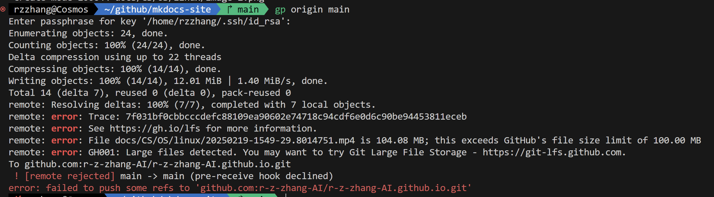

## 基本概念

### 分布式/集中式版本管理

版本管理：顾名思义，用于个人/团队级别代码管理，**主要是记录更改**

关键概念：仓库（Repository）、提交（Commit）、分支（Branch）、合并（Merge）、冲突（Conflict）、标签（Tag）

github：理解成云端（== 百度云），通过git上传，上传内容主要是代码

## 版本退回

[廖雪峰教程](https://liaoxuefeng.com/books/git/time-travel/reset/index.html)

原理：指针操作


```shell
git log
git log --pretty=oneline
```

```shell
git reset --hard <id>
git reset --hard HEAD^n  # n是退几步
```

```shell
git reflog
```

## 工作区/暂存区

工作（目录）有一个隐藏目录.git，这个不算工作区，而是Git的版本库。

- 其中包含暂存区、分支（默认有一个main）

把文件往Git版本库里添加

- 第一步是用 `git add` 把文件添加进去，是把文件修改添加到暂存区；

- 第二步是用 `git commit` 提交更改，是把**暂存区**的所有内容提交到当前分支。


```shell
git checkout -- file
```

两种情况：

- 一种是readme.txt自修改后还没有被放到暂存区，现在，撤销修改就回到和版本库一模一样的状态；

- 一种是readme.txt已经添加到暂存区后，又作了修改，现在，撤销修改就回到添加到暂存区后的状态。

!!! success ""

   就是让这个文件回到最近一次git commit或git add时的状态。

## 删除文件

## 远程仓库

使用https除了速度慢以外，还有个最大的麻烦是每次推送都必须输入口令，但是在某些只开放http端口的公司内部就无法使用ssh协议而只能用https。

## 分支管理

### 多人协作

1. 首先，可以尝试用 `git push origin <branch-name>` 推送自己的修改；
2. 如果推送失败，则因为远程分支比你的本地更新，需要先用git pull试图合并；
3. 如果合并有冲突，则解决冲突，并在本地提交；
4. 没有冲突或者解决掉冲突后，再用 `git push origin <branch-name>` 推送就能成功！

## 杂项

### 文件大小限制




### 提交哈希值


在 Git 中，**版本 ID**（即提交哈希值）由 SHA-1 算法生成，表现为一个 40 位的十六进制字符串（例如 `a1b2c3d4e5f6...`）。

### SHA-1算法流程

1. **预处理**  
   - 将输入数据填充至长度满足 `512位倍数 - 64位`。  
   - 附加原始数据长度的二进制表示（64位）。

2. **分块处理**  
   - 将填充后的数据分割为512位的块（Block）。

3. **初始化哈希值**  
   - 设置5个32位的初始变量（H0-H4）：  
     ```
     H0 = 0x67452301  
     H1 = 0xEFCDAB89  
     H2 = 0x98BADCFE  
     H3 = 0x10325476  
     H4 = 0xC3D2E1F0
     ```

4. **循环压缩函数**  
   - 对每个512位块进行80轮运算，更新中间哈希值。  
   - 每轮使用非线性函数（如AND、OR、XOR）和常量值。

5. **最终哈希**  
   - 合并所有块的中间结果，生成最终的160位哈希值。


示例

  ```bash
  # Linux/macOS
  echo "hello" | openssl sha1   # 输出：aaf4c61ddcc5e8a2dabede0f3b482cd9aea9434d

  # Windows PowerShell
  Get-FileHash -Algorithm SHA1 file.txt
  ```

SHA-256 算法原理与 SHA-1 的区别是位数多了


### **SHA-256 应用**

1. **数据完整性验证**  

   - 文件下载后校验哈希值，确保未被篡改。  
   ```bash
   # Linux/macOS
   sha256sum file.iso
   # Windows PowerShell
   Get-FileHash -Algorithm SHA256 file.iso
   ```

2. **数字签名**  
   - 用私钥对数据的SHA-256哈希值签名，公钥验证签名合法性。

3. **区块链**  
   - 比特币使用SHA-256计算区块哈希和交易验证。

4. **密码学协议**  
   - TLS 1.2/1.3、SSH、IPSec等协议依赖SHA-256保证通信安全。

---

### **使用SHA-256**
#### **1. 命令行工具**
- **Linux/macOS**：  
  ```bash
  echo "hello" | sha256sum          # 计算字符串哈希
  sha256sum file.txt               # 计算文件哈希
  ```
- **Windows PowerShell**：  
  ```powershell
  Get-FileHash -Path C:\file.txt -Algorithm SHA256
  ```

#### **2. 编程示例（Python）**
```python
import hashlib

# 计算字符串的SHA-256哈希
text = "hello"
hash_object = hashlib.sha256(text.encode())
hex_dig = hash_object.hexdigest()
print(hex_dig)  # 输出：2cf24dba5fb0a30e26e83b2ac5b9e29e1b161e5c1fa7425e73043362938b9824

# 计算文件的SHA-256哈希
def hash_file(filepath):
    sha256 = hashlib.sha256()
    with open(filepath, "rb") as f:
        while chunk := f.read(4096):
            sha256.update(chunk)
    return sha256.hexdigest()

print(hash_file("data.txt"))
```

#### **3. 在线工具**
- [SHA-256 Online Generator](https://emn178.github.io/online-tools/sha256.html)  
- [CyberChef](https://gchq.github.io/CyberChef/)（多功能加密工具）

