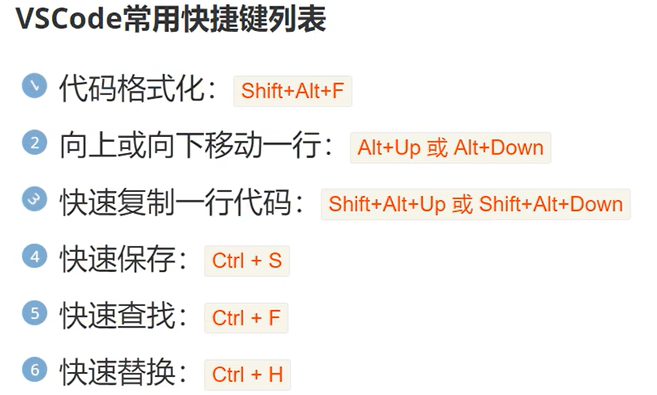

## 学习资料

[很好b站](https://www.bilibili.com/video/BV1jj411P7Yp?spm_id_from=333.788.player.switch&vd_source=b14909f255fe42946743657320d2f59a&p=6)

[HTML 简介 - 学习 Web 开发 | MDN](https://developer.mozilla.org/zh-CN/docs/Learn/HTML/Introduction_to_HTML)

[开始学习 HTML - 学习 Web 开发 | MDN](https://developer.mozilla.org/zh-CN/docs/Learn/HTML/Introduction_to_HTML/Getting_started)

[CSS 入门概述 - 学习 Web 开发 | MDN](https://developer.mozilla.org/zh-CN/docs/Learn/CSS/First_steps)

[JavaScript - MDN Web 文档术语表：Web 相关术语的定义 | MDN](https://developer.mozilla.org/zh-CN/docs/Glossary/JavaScript)




## 基本骨架
```html
 <!DOCTYPE html>  <!--声明文档类型-->
<html>

    <head>  <!--head双标签-->
        <title>CosHub</title>  <!--title标签中一般不展示给用户-->
        <meta charset="utf-8">  <!--meta单标签，中间写内容，charset指定编码-->
    </head>

    <body>

    </body>

</html>
```

## 标题
```html
<h1> 到 <h6> 双标签 例如 <h1> </h1> <!--正斜杠,放在body中-->
```

快捷键：
```plaintext
h$*6 : 自动生成1~6级标签，其中后面的数字为n，代表自动生成1~n级标签
```
