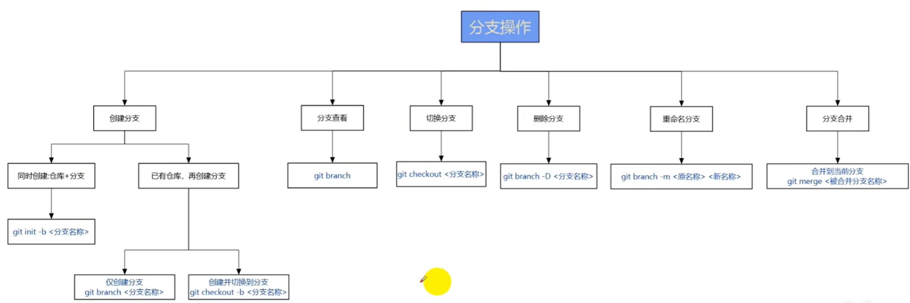
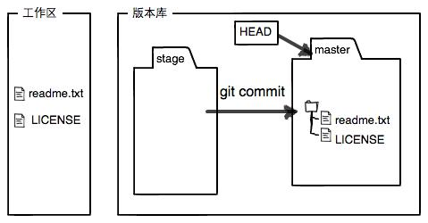
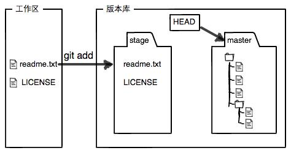

## Part 1 什么是Anaconda？


> Anacondas（水蟒）或boas（水蚺）是 水蚺属的一类大型蟒蛇。它们是一种半水生的蛇类，主要分布在南美洲的热带地区。目前被认可的现存物种有三到五种，另有一种已灭绝的物种，其中包括世界上最大的蛇之一——绿森蚺（Eunectes murinus）。

根据 Huni Kuin 族的创世神话，一个名叫 Yube 的男子爱上了一位水蟒女子，并因此也被变成了一条水蟒。他开始与她在水的深处世界生活。在这个世界里，Yube 发现了一种具有治疗功效并能通往知识的致幻饮品。有一天，Yube 在没有告诉他的水蟒妻子的情况下，决定返回人类的世界，并恢复他原来的人类形态。

以下省略苯动物科学博主所作万字长文……

咳咳，进入正题：

> Anaconda is an open source data science and artificial intelligence distribution platform for Python and R programming languages. 



简单来说，Anaconda 是一个开源的 Python 和 R 数据科学平台，它集成了强大的包管理工具 `conda`，支持创建虚拟环境，简化了库的安装和依赖管理。Anaconda 预装了数百个数据科学和机器学习库（如 NumPy、Pandas、Scikit-learn 等），适合数据分析、机器学习和科学计算。它支持跨平台操作，是数据科学家和研究人员的首选工具之一。

似乎听起来并不简单。

## Part 2 为什么需要安装Anaconda？


当今时代，于学生而言，据博主所知，大多数国内高校的大多数专业均需要学习编程，计算机科学类专业自不必说，非计算机专业同学大多需要学习python。python的可爱之处其中之一就是有强大的社区支持、丰富的第三方库。而 Anaconda 恰恰是虚拟环境管理、库管理的得力助手。于职场人士而言，国产开源大模型 DeepSeek 告诉博主 Anaconda 是为不同领域工作人员量身打造的数据科学工具，以及无论使用 Windows、macOS 还是 Linux，Anaconda 都能完美运行。


> Anaconda，在计算机科学领域，用于编程学习、算法开发、数据处理；人工智能领域，用于机器学习、深度学习和自然语言处理，简化模型训练和部署；航空航天领域，用于数据分析、模拟仿真和科学计算，帮助处理复杂的数学和物理问题；金融学领域，用于数据分析、统计建模和金融市场预测，适合处理经济数据和构建预测模型；数学领域，用于数值计算、统计分析和数学建模；建筑学领域，用于数据分析、3D 建模和可视化；生物医学领域，用于生物信息学、数据分析和医学图像处理；环境科学领域，用于数据分析、地理信息系统（GIS）和气候建模；历史学领域，用于历史数据分析、文本挖掘和可视化，帮助研究历史事件、社会变迁和文化发展；政治学领域，用于政治数据分析、选举预测和政策研究，帮助分析国际关系、公共舆论和政治行为；无论你是想提升技能、解决实际问题，还是探索数据科学的奥秘，Anaconda 都是你的理想选择。

## Part 3 如何安装Anaconda？

### 图形化界面

适用于 Windows、macOS 系统

第一步：访问[官方网站](https://www.anaconda.com/download)，

第二步：按照网站操作说明即可成功安装。

（似乎有些过于简短）

提供邮箱：在写有“Email Address:”的输入框写下你的邮箱



查收邮件：点击“Download Now”，进入下载网页，网站会自动识别你的操作系统，点击“Download”即可。对于mac用户，需要根据实际情况选择M1/M2/M3 或者是 intel 处理器。




继续安装：像所有PC上的软件一样，一直点击下一步或者确认即可安装完成

- 中间建议将安装地址从默认的C盘改为D盘，原因自不必说
- 在“Advanced Options”中，建议勾选“Add Anaconda to my PATH environment variable”


另外，博主计划出一期关于C盘清理的文章，朋友们可以稍稍期待一下。

### 命令行

适用于Windows、Linux、macOS 系统

有兴趣的朋友可以看看博主前一篇文章，先装个Ubuntu（著名Linux发行版）


#### Linux/macOS

第一步：打开terminal

第二步：下载安装脚本

运行以下命令：
```bash
# 使用 curl
curl -O https://repo.anaconda.com/archive/Anaconda3-2023.07-1-Linux-x86_64.sh
```
或者：

```bash
# 使用 wget 
wget https://repo.anaconda.com/archive/Anaconda3-2023.07-1-Linux-x86_64.sh
```

第三步：运行安装脚本：

```bash
bash Anaconda3-2023.07-1-Linux-x86_64.sh
```

第四步：按照提示完成安装：

   - 阅读许可协议，按 `Enter` 键继续。
   - 输入 `yes` 接受许可协议。
   - 选择安装路径（默认路径为 `~/anaconda3`），。
   - 是否将 Anaconda 添加到 `PATH` 环境变量中，建议输入 `yes`。

第五步：激活环境：

```bash
source ~/.zshrc  # 如果你使用 zsh
```

第六步：验证安装：
```bash
conda --version
```

如果显示版本号（如 `conda 23.5.2`），说明安装成功。


#### Windows

第一步：`win + R` 输入 `powershell`，打开PowerShell

第二步：输入以下命令：
```powershell
Invoke-WebRequest -Uri https://repo.anaconda.com/archive/Anaconda3-2023.07-1-Windows-x86_64.exe -OutFile Anaconda3.exe
```


第三步：导航到下载的 `.exe` 文件所在目录

```powershell
cd <download-dir>
```

第四步：运行安装程序：
```powershell
Anaconda3-2023.07-1-Windows-x86_64.exe
```

第五步：按照图形界面提示完成安装：
   - 接受许可协议。
   - 选择安装路径（默认路径为 `C:\Users\<用户名>\Anaconda3`）。
   - 在“Advanced Options”中，勾选“Add Anaconda to my PATH environment variable”（建议勾选）。

第六步：验证安装：

打开新的 powershell

```powershell
conda --version
```

如果显示版本号，说明安装成功。


## 如何使用Anaconda？
写在前面：

- 以下内容全部使用命令行方法，打开终端的方法见上文。
- 下文的所以形如 `<一些东西>` 的内容，在实际输入过程中全部不需要加 `<>`

### 使用conda

- 创建新环境

    ```bash
    conda create -n <env-name> python=3.12
    ```

- 激活环境

    ```bash
    conda activate <env-name>
    ```

- 退出环境

    ```bash
    conda deactivate
    ```

- 删除环境
   如果不再需要某个环境，可以运行以下命令删除：
   ```bash
   conda remove -n 环境名 --all
   ```


1. 创建新环境
    ```shell
    conda create -n <env_name> <package_names>  # -n 等价于 --name
    ```

- <env_name> 创建的环境名，<package_names> 安装在环境中的包名

- 如果要安装指定的版本号，则只需要在包名后面以 = 和版本号的形式执行。如： `conda create --name python3 python=3.12` ，即创建一个名为“python3”的环境，环境中安装版本为3.12的python。

- 如果要在新创建的环境中创建多个包，则直接在 <package_names> 后以空格隔开，添加多个包名即可。如： `conda create -n python3 python=3.5 numpy pandas` ，即创建一个名为“python3”的环境，环境中安装版本为3.5的python，同时也安装了numpy和pandas。

- 默认情况下，新创建的环境将会被保存在 /Users/<user_name>/anaconda3/env 目录下

- 如果创建环境后安装Python时没有指定Python的版本，那么将会安装与Anaconda版本相同的Python版本，即安装Anaconda第3版，则会自动安装Python 3.x。

- 命令提示符前为 (envi-name)


2. 切换环境

```shell
conda activate <env_name>
```


3. 退出环境

```shell
conda deactivate
```

4. 显示已创建环境

```shell
conda info --envs
# or
conda info -e
# or
conda env list
```


5. 复制环境

conda create --name <new_env_name> --clone <copied_env_name>

- <copied_env_name> 为被复制/克隆环境名

- <new_env_name> 为复制之后新环境的名称

eg:  `conda create --name py2 --clone python2` ，克隆名为“python2”的环境，克隆后的新环境名为“py2”。此时，环境中将同时存在“python2”和“py2”环境，且两个环境的配置相同。


6. 删除环境
```shell
conda remove --name <env_name> --all
```


### 管理包
1. 查找可供安装的包版本

    1. 精确查找
        ```shell
        conda search --full-name <package_full_name>
        ```
    - <package_full_name> 是被查找包的全名，例如 `conda search --full-name python` 即查找全名为“python”的包有哪些版本可供安装。


    2. 模糊查找
        ```shell
        conda search <text>
        ```
    - <text> 是查找含有此字段的包名。此字段两边不加尖括号“<>”。例如： `conda search py` 即查找含有“py”字段的包，有哪些版本可供安装。


2. 获取当前环境中已安装的包信息
    ```shell
    conda list
    ```


3. 安装包

路径：/home/用户名/anaconda3/envs/环境名/lib/pythonX.X/site-packages/

    1. 在指定环境中安装包
        ```shell
        conda install --name <env_name> <package_name>
        ```

    2. 在当前环境中安装包
        ```shell
        conda install <package_name>
        ```

    3. 使用pip安装包

        使用 conda install 无法进行安装时，可以使用pip进行安装

        ```shell
        pip install <package_name>
        ```

pip可以安装一些conda无法安装的包；conda也可以安装一些pip无法安装的包。因此当使用一种命令无法安装包时，可以尝试用另一种命令。


4. 卸载包

    1. 卸载指定环境中的包

        ```shell
        conda remove --name <env_name> <package_name>
        ```


    2. 卸载当前环境中的包
        ```shell
        conda remove <package_name>
        ```


5. 更新包

    1. 更新所有包
        ```shell
        conda update --all
        # or
        conda upgrade --all
        ```

    2. 更新指定包
        ```shell
        conda update <package_name>
        # or
        conda upgrade <package_name>
        ```
    - 更新多个指定包，则包名以空格隔开，向后排列。如： conda update pandas numpy matplotlib 即更新pandas、numpy、matplotlib包。


### 管理conda

- 禁用自动激活base环境

    ```bash
    conda config --set auto_activate_base false
    ```

- 重新启用自动激活

    ```bash
    conda config --set auto_activate_base true
    ```

- 更新conda至最新版本
    ```shell
    conda update conda
    ```


- 查看conda帮助

```shell
conda -h  # or: conda --help 
```

