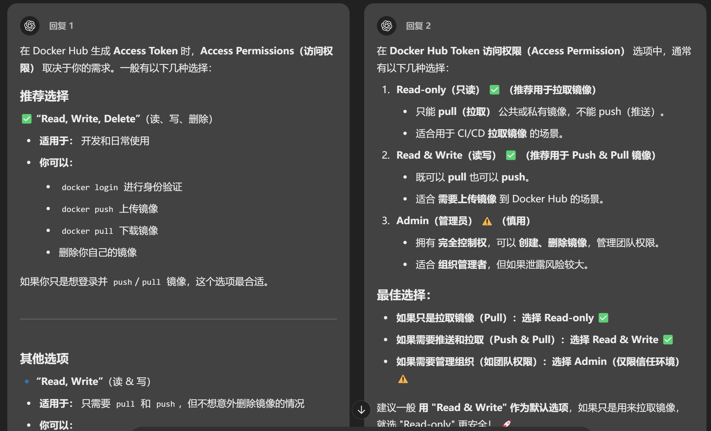

## 基础知识

!!! warning "虚拟机/WSL/Linux"

    - WSL不是虚拟机，Linux不是虚拟机~
    - 虚拟机是用软件（例如VMware）虚拟出一个计算机，与其相对应的概念是物理机，区别在于是否有物理实体机
    - linux是一个操作系统与Windows是同一概念，主要是内核，与虚拟机的关系是虚拟机上的操作系统可以是Linux，也可以是windows等

    !!! info "by deepseek"

        1. **架构与实现原理**
        - **WSL**:
            - WSL 是 Windows 的一个子系统，直接在 Windows 内核上运行 Linux 二进制文件。
            - WSL 1 通过转换层将 Linux 系统调用转换为 Windows 系统调用。
            - WSL 2 使用轻量级虚拟机（基于 Hyper-V）运行一个完整的 Linux 内核。
            - WSL 的设计目标是实现 Windows 和 Linux 的高度集成。

        - **虚拟机**:
            - 虚拟机通过虚拟化技术（如 Hyper-V、VMware、VirtualBox）模拟完整的硬件环境。
            - 在虚拟机中运行的操作系统（如 Linux）与主机操作系统（Windows）完全隔离。
            - 虚拟机需要分配独立的资源（CPU、内存、磁盘等），运行效率较低。

        ---

        2. **性能**
        - **WSL**:
            - WSL 1 的性能较低，尤其是在文件系统操作上，因为需要转换系统调用。
            - WSL 2 的性能接近原生 Linux，因为它运行了一个完整的 Linux 内核。
            - WSL 的资源占用较少，启动速度快。

        - **虚拟机**:
            - 虚拟机的性能较低，因为需要模拟完整的硬件环境。
            - 资源占用较高（CPU、内存、磁盘），启动速度较慢。

        ---

        3. **文件系统**
        - **WSL**:
            - WSL 1 可以直接访问 Windows 文件系统，但性能较差。
            - WSL 2 使用虚拟硬盘（VHD）存储文件，文件系统性能较好，但与 Windows 文件系统的互操作性稍差。

        - **虚拟机**:
            - 虚拟机的文件系统与主机完全隔离。
            - 需要通过共享文件夹或网络文件系统（如 Samba）实现文件共享。

        ---

        4. **网络**
        - **WSL**:
            - WSL 1 和 WSL 2 的网络与 Windows 主机共享，可以直接访问主机的网络接口。
            - WSL 2 使用虚拟化网络，IP 地址与主机不同，但可以通过端口转发访问。

        - **虚拟机**:
            - 虚拟机的网络通常是独立的，可以通过 NAT、桥接或主机模式与主机通信。
            - 网络配置更灵活，但也更复杂。

        ---

        6. **安装与配置**
        - **WSL**:
            - 安装简单，只需在 Windows 功能中启用 WSL 并安装 Linux 发行版。
            - 配置简单，与 Windows 高度集成。

        - **虚拟机**:
            - 需要安装虚拟机软件（如 VMware、VirtualBox）并手动配置虚拟机。
            - 配置较复杂，需要分配资源并安装操作系统。

        ---

        7. **资源占用**
        - **WSL**:
            - 资源占用较少，适合低配置设备。
            - 与 Windows 共享资源，无需额外分配内存或 CPU。

        - **虚拟机**:
            - 资源占用较高，需要为虚拟机分配独立的内存、CPU 和磁盘空间。
            - 不适合低配置设备。

        ---

        8. **兼容性**
        - **WSL**:
            - WSL 1 对 Linux 系统调用的兼容性较差，部分应用程序可能无法运行。
            - WSL 2 兼容性较好，支持大多数 Linux 应用程序。

        - **虚拟机**:
            - 兼容性最好，可以运行任何 Linux 发行版和应用程序。

        ---

        总结
        | 特性                | WSL                          | 虚拟机                     |
        |---------------------|------------------------------|--------------------------|
        | **性能**            | 较高（WSL 2）                | 较低                     |
        | **资源占用**        | 较少                         | 较多                     |
        | **文件系统**        | 与 Windows 高度集成          | 完全隔离                 |
        | **网络**            | 与主机共享                   | 独立配置                 |
        | **使用场景**        | 开发、命令行工具             | 完整 Linux 环境、服务器  |
        | **安装与配置**      | 简单                         | 复杂                     |
        | **兼容性**          | 较好（WSL 2）                | 最好                     |

docker 与 虚拟机的关系是：docker 直接使用主机的内核，而虚拟机需要再搞出一个内核，因而内存占用大。

### 镜像image

就是照片~

### 

## docker 的下载与使用

### 下载

### 拉取镜像

#### 具体操作

手动拉取, 例如

```shell
docker pull node:14-alpine
```

构建镜像
```shell
docker build -t hello-docker .
```


#### 遇到的问题1

依然是网络连接问题~

#### 解决方案1

步骤一: 在WSL打开v2rayA

- 操作方法见[Linux备忘录中相关内容](https://r-z-zhang-ai.github.io/CS/OS/linux/linux-note/#v2raya)

!!! info "关于直接使用主机代理"

    - 理论依据: WSL 与主机共用网络, 理论上可以与主机共用代理. 方法是: clash里面打开 "系统代理"和"局域网连接" (主要是第二个, 决定了能否与虚拟机共用)即可
    - 实际操作中遇到的问题: `curl -I http://www.google.com` 命令无法正确输出, 说明失败了, 故未使用

步骤二: 手动设置 Docker 代理

!!! warning 

    这一步是核心


1. 在 WSL 终端中，创建或编辑 Docker 配置文件：
    ```sh
    sudo mkdir -p /etc/systemd/system/docker.service.d
    sudo nano /etc/systemd/system/docker.service.d/http-proxy.conf
    ```

```
(添加以下内容)
[Service]
Environment="HTTP_PROXY=http://127.0.0.1:20171"
Environment="HTTPS_PROXY=http://127.0.0.1:20171"
```

2. 重启 Docker

    ```sh
    sudo systemctl daemon-reload
    sudo systemctl restart docker
    ```

#### 遇到的问题2

用户名密码的问题

在 `docker login -u CosHub` 时输入密码提示密码错误❌

#### 解决方案2

配置token, 使用personal access token 登录

[官网入口](https://app.docker.com/settings/personal-access-tokens/copy?description=first&scope=repo%3Awrite&expiration=)放在这里

!!! warning "token权限"

    

    这个是一个read&write的

#### 遇到的问题3

运行`docker build -t hello-docker .`之后没有自动拉取镜像


??? info "出现该问题的原因"

    据下面的回答, 应该是权限问题~
    
    **`docker build -t hello-docker .`**

    这条命令用于 **构建 Docker 镜像**。具体来说，它做了以下几件事：

    1. **`docker build`**：这是 Docker 用来根据一个 `Dockerfile` 文件构建镜像的命令。
    2. **`-t hello-docker`**：这个选项是用来指定你构建的镜像的标签（tag）。在这种情况下，镜像会被命名为 `hello-docker`。你可以使用这个标签来引用或运行构建出来的镜像。
    3. **`.`**：这是构建上下文的路径，指明了 `Dockerfile` 和其他需要的文件所在的位置。在这种情况下，`.` 表示当前目录。

    简单来说，这条命令通过读取当前目录中的 `Dockerfile` 来构建一个新的 Docker 镜像。

    **为什么需要手动拉取镜像？**

    在你的 `Dockerfile` 中，可能有类似如下的内容：

    ```dockerfile
    FROM node:14-alpine
    ```

    这表示你构建的镜像是基于 `node:14-alpine` 镜像的。所以 Docker 会尝试从 Docker Hub 或者配置的镜像仓库拉取这个基础镜像。如果你的机器上没有这个镜像，Docker 会自动尝试拉取它。

    不过，在某些情况下，Docker 没有权限或由于网络问题无法直接拉取镜像。例如，你可能遇到权限问题或者需要登录才能访问某些镜像库，或者某些镜像可能被标记为私有的，需要手动拉取。

    手动运行 `docker pull node:14-alpine` 命令，可以确保该镜像已经存在本地，避免 `docker build` 时出现权限或者网络问题。

    **直接构建为什么不能成功？**

    `docker build` 其实是可以在没有手动拉取镜像的情况下构建的。通常情况下，Docker 会在构建过程中自动拉取所需的基础镜像。但如果遇到网络、权限、或其他配置问题，可能会导致构建失败。通过手动拉取镜像，我们确保镜像已经存在本地，避免这些潜在的错误。


#### 解决方案3

手动拉取

```shell
docker pull <需要的镜像>
```


