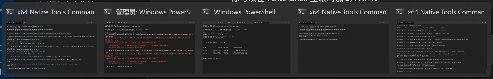

## IOS Fake Run
+ 如果你的电脑不具有 .NET 6.0 环境，请在 [此处](https://dotnet.microsoft.com/en-us/download/dotnet/6.0/runtime) 下载并安装 .NET Desktop Runtime 6.0

+ 下载 [iOS Fake Run](https://github.com/Mythologyli/iOSFakeRun/releases) 软件并解压到空文件夹中

!!! info "关于病毒检测"

    打开 Windows 安全中心

    - 按 Win + S，搜索 “Windows 安全” 或 “Windows Security”，点击打开。

    进入病毒与威胁防护

    - 在左侧菜单中点击 “病毒与威胁防护”。

    管理设置

    - 找到 “病毒与威胁防护设置” 下的 “管理设置”（Manage settings），点击进入。

    找到排除项

    - 滚动到 “排除项”（Exclusions）部分，点击 “添加或删除排除项”。
    
    添加排除项

    - 先关闭实时保护，然后点击 “添加排除项” 按钮，选择“文件”，添加 zip 文件；选择 “文件夹”，然后选择你解压 iOS Fake Run 的文件夹。

+ 虚拟定位需要开发者镜像。软件预置了 iOS 14/15/16 的开发者镜像。

  如果你的 iOS 版本低于 14，请执行以下步骤:
    + 进入 [DeveloperDiskImage](https://github.com/Mythologyli/DeveloperDiskImage) 仓库
    + 查看自己的 iOS 版本，下载对应的 DeveloperDiskImage.dmg 和 DeveloperDiskImage.dmg.signature
    + 进入 iOS Fake Run 软件文件夹。在 DeveloperDiskImage 文件夹中建立以版本号为名称的文件夹（如 13.7），将刚才下载的两个文件放入此文件夹

  如果你的 iOS 为 16，请执行以下步骤:
    + 进入设置 > 隐私与安全性
    + 打开开发者模式开关

+ 打开[路径拾取网站](https://fakerun.myth.cx)。通过点击地图构造路径。点击时无需考虑间距，会自动用直线连接。路径点击完成后，单击上方的路径坐标——复制，将坐标数据复制到剪贴板

!!! info "地图比较卡"

    找到浙江大学比较困难（（（

+ 打开 iOS Fake Run 软件，将坐标数据粘贴到左侧的文本输入框中
+ 将 iOS 设备连接至电脑并解除设备锁屏。你需要确保电脑上的相关驱动正确（安装 [iTunes](https://www.apple.com.cn/itunes/) 即可）
+ 点击连接按钮将 iOS 设备连接到软件。设置路径循环次数和跑步速度，点击开始跑步即可开始
+ 跑步结束后，点击重置定位恢复 iOS 设备的正常定位，否则设备在重启前将保持在虚拟定位上

## iOSRealRun-cli-17

!!! warning ""

    如果遇到了本文档中未提及的问题，问 Google Gemini 吧

### 主线任务

在[这里](https://github.com/iOSRealRun/iOSRealRun-cli-17)下载仓库

创建并激活虚拟环境

```bash
python -m venv venv
```

cmd：venv\Scripts\activate.bat
PowerShell：venv\Scripts\Activate.ps1


安装依赖

```bash
pip3 install -r requirements.txt
```

### 环境配置

#### Microsoft C++ Build Tools

下载地址：[Microsoft C++ Build Tools](https://visualstudio.microsoft.com/zh-hans/visual-cpp-build-tools/)

下载中确保勾选“使用 C++ 的桌面开发”

#### Strawberry Perl

在[该网页](https://strawberryperl.com/releases.html)选择合适的版本下载

#### OpenSSL-1.1.1w

在[该网页](https://openssl-library.org/source/old/1.1.1/index.html)选择合适的版本下载。我的windows11-x86系统对应的是：[OpenSSL-1.1.1w 源代码](https://github.com/openssl/openssl/releases/download/OpenSSL_1_1_1w/openssl-1.1.1w.tar.gz)（未编译版本）

移动至一个你喜欢的位置，这里以 `D:\DevelopSoftware\openssl-1.1.1w\openssl-1.1.1w` 为例。

一、添加环境变量：

- perl：`set PATH=D:\DevelopSoftware\strawberry-perl-5.42.0.1-64bit-portable\perl\bin;%PATH%`，用 `perl -v` 验证

- 虚拟环境：

    ```bash
    cd C:\你的项目目录

    # 创建虚拟环境，假设名字叫 venv
    python -m venv venv

    # 激活（powershell中）
    venv\Scripts\Activate.ps1

    # 激活（cmd中）
    venv\Scripts\activate.bat

    # 关闭
    deactivate
    ```


二、在 **Developer Command Prompt For VS** 2022中：

```bash
cd D:\DevelopSoftware\openssl-1.1.1w\openssl-1.1.1w
perl Configure VC-WIN64A no-shared no-asm enable-psk --prefix=D:\OpenSSL-1.1.1 --openssldir=D:\OpenSSL-1.1.1\ssl
nmake # 编译 OpenSSL
nmake install # 安装 OpenSSL
```

三、安装（仍在 **Developer Command Prompt For VS** 2022中）

首先 `cd` 到源代码目录，`pip install -r requirements.txt`

环境变量：

- INCLUDE: `set INCLUDE=D:\OpenSSL-1.1.1\include;%INCLUDE%`
- LIB: `set LIB=D:\OpenSSL-1.1.1\lib;%LIB%`
- CL: `set CL=/link Ws2_32.lib Crypt32.lib`

之后 `pip install sslpsk-pmd3`

四、如果还失败，建议从 `sslpsk-pmd3` 源码安装：

- 下载地址：[sslpsk-pmd3 源码](https://github.com/doronz88/sslpsk-pmd3)，移动到一个位置，此处以 `D:\AAA文件\Projects\sslpsk-pmd3-1.0.3` 为例

- 更改 `setup.py`

    ```python
    # 在最一开始那里添加
    libraries = [
        'libcrypto',
        'libssl',
        'Ws2_32',  # Socket 库，解决 __imp_recv 等问题
        'Crypt32', # CAPI 库，解决 __imp_CryptAcquireContextW 等问题
        'Advapi32', # 另一个常见的 CAPI 依赖
        'User32'
    ]
    ```

- 安装：`pip install .`

五、运行

`python main.py`


## Log

### 11.10 进度

[gpt 都傻了](https://chatgpt.com/c/6911bf4b-885c-8323-adf3-339ac2496343)

#### 干了的事情

- [ ] `pip install -r requirements.txt` 报错，缺少 sslpsk-pmd3 和 lzfse

- [ ] 对于 lzfse，装了 Microsoft Visual C++ ，在 D 盘

- [ ] `pip install --no-cache-dir sslpsk-pmd3` 需要 OpenSSL 环境

- [ ] OpenSSL 安装成3.多的版本，但是 sslpsk-pmd3 需要1.多的版本，下载了openssl 1.1.1w 源代码并手动编译，编译目录还换了一次，从 C 盘到 D 盘

- [ ] 忘记 OpenSSL 在 C 还是 D 盘了，好像都有。。。

- [ ] 编译 OpenSSL 需要 Perl 和 NASM，安装了 Strawberry Perl（在 D 盘），没安装 NASM（汇编优化）

- [ ] 手动编译 `nmake && nmake install` 之后发现没有 lib and def 文件，手动生成了两种文件

- [ ] 但还是无法安装 sslpsk-pmd3，“可能你在生成 .lib 时选项不对或者使用了精简版。”

- [ ] 来回切换几种终端

- [ ] 还碰到了 Windows 系统不对的问题，需要 64 位的编译

- [ ] 罢工



#### 待干的事情

- [ ] 检查所有安装的东西，把 C 盘腾出来

- [ ] 把环境变量都加到 path

- [ ] 到网上找一个 OpenSSL 1.1.1 的 Windows 预编译版本，把今天有关 OpenSSL 的东西都删掉删干净，重新开始

- [ ] 看看设置里面有关存储的东西，清一清系统盘

### 11.21 进度

- [ ] 不推荐将 `perl` 添加至系统环境变量 添加临时环境变量 `$env:Path = "D:\DevelopSoftware\strawberry-perl-5.42.0.1-64bit-portable\perl\bin;" + $env:Path`
