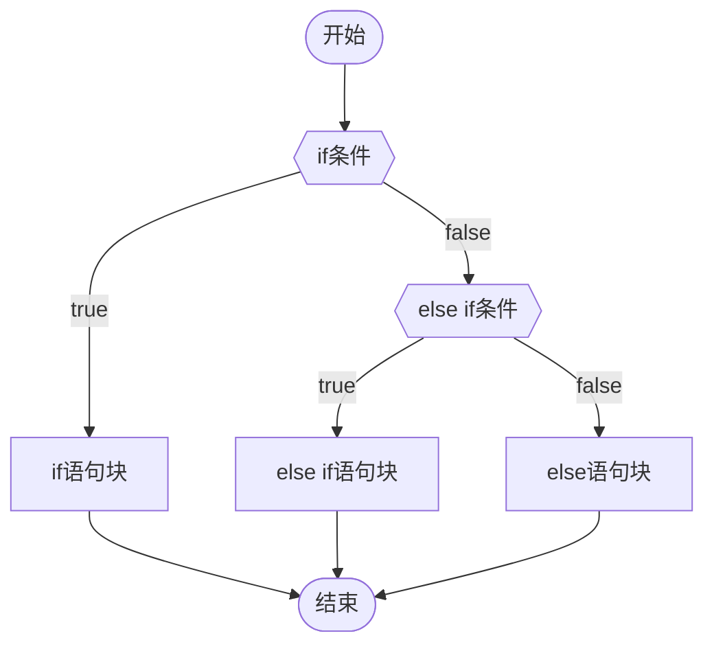
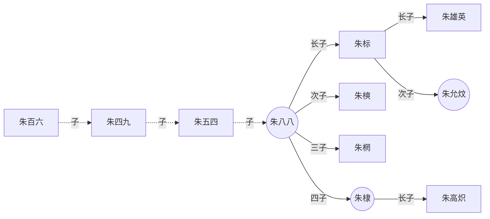
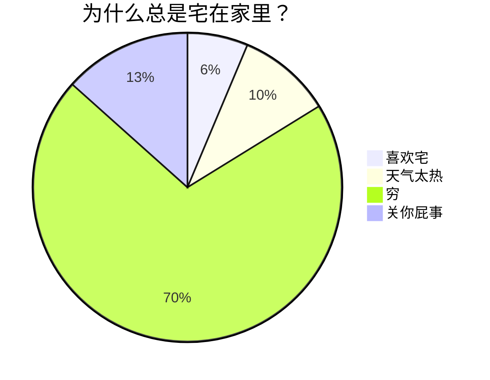
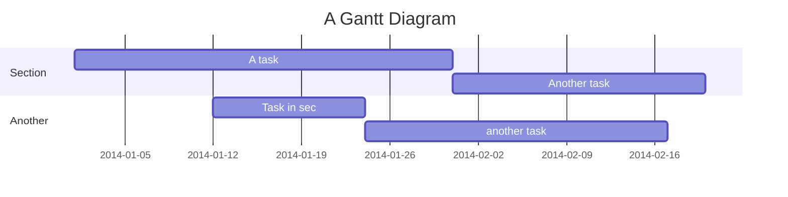
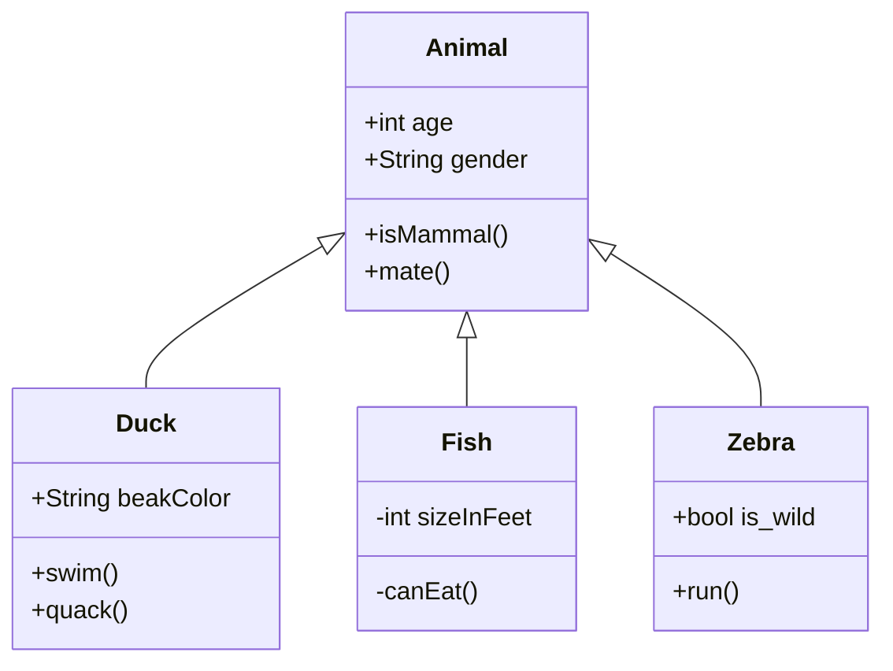

# Markdown 与 Obsidian

本文涵盖 Mermaid 流程图、Obsidian 标签、标识符规范，以及 Obsidian 编辑器的常用快捷键。


## 17. Mermaid

- 一些 **MD编辑器** 和 **笔记软件** 支持通过 [**Mermaid**](https://mermaid-js.github.io/ "Mermaid官网") 及其所提供的 [编译器](https://mermaid-js.github.io/mermaid-live-editor  "Mermaid在线编译器") 来为用户提供图表的绘制功能

- 这里只提供一些演示的图表，具体教程可戳下方
  - [[MOC Mermiad 教程 Obsidian版| Mermiad 超级教程 Obsidian版]]

<br>

### 17.1 流程图

<br>

**<big>源码1：</big>**

````txt

````

**<big>渲染1：</big>**


<br>

**<big>源码2：</big>**

````txt

````

**<big>渲染2：</big>**


<br>

### 17.2 饼图

<br>

**<big>源码：</big>**

````md

````

**<big>渲染：</big>**


<br>

### 17.3 序列图 (时序图)

<br>

**<big>源码：</big>**

````txt
```mermaid
sequenceDiagram
	%% 自动编号
	autonumber
	%% 定义参与者并取别名，aliases：别名
        participant A as Aly
        participant B as Bob
        participant C as CofCai
        %% 便签说明
        Note left of A: 只复习了一部分
        Note right of B: 没复习
        Note over A,B: are contacting
        
        A->>B: 明天是要考试吗？
        B-->>A: 好像是的！
        
        %% 显示并行发生的动作，parallel：平行
        %% par [action1]
        rect rgb(0, 25, 155)
            par askA
                C -->> A:你复习好了吗？
            and askB
                C -->> B:你复习好了吗？
            and self
                C ->>C:我还没准备复习......
            end
        end
        
        %% 背景高亮，提供一个有颜色的背景矩形
        rect rgb(25, 55, 0)
            loop 自问/Every min
            %% <br/>可以换行
            C ->> C:我什么时候<br/>开始复习呢？
            end
        end
        
        %% 可选择路径
        rect rgb(153, 83, 60)
            alt is good
                A ->> C:复习了一点
            else is common
                B ->> C:我也是
            end
            %% 没有else时可以提供默认的opt
            opt Extra response
                C ->> C:你们怎么不回答我
            end
        endsequenceDiagram
	%% 自动编号
	autonumber
	%% 定义参与者并取别名，aliases：别名
        participant A as Aly
        participant B as Bob
        participant C as CofCai
        %% 便签说明
        Note left of A: 只复习了一部分
        Note right of B: 没复习
        Note over A,B: are contacting
        
        A->>B: 明天是要考试吗？
        B-->>A: 好像是的！
        
        %% 显示并行发生的动作，parallel：平行
        %% par [action1]
        rect rgb(0, 25, 155)
            par askA
                C -->> A:你复习好了吗？
            and askB
                C -->> B:你复习好了吗？
            and self
                C ->>C:我还没准备复习......
            end
        end
        
        %% 背景高亮，提供一个有颜色的背景矩形
        rect rgb(25, 55, 0)
            loop 自问/Every min
            %% <br/>可以换行
            C ->> C:我什么时候<br/>开始复习呢？
            end
        end
        
        %% 可选择路径
        rect rgb(153, 83, 60)
            alt is good
                A ->> C:复习了一点
            else is common
                B ->> C:我也是
            end
            %% 没有else时可以提供默认的opt
            opt Extra response
                C ->> C:你们怎么不回答我
            end
        end
```
````

**<big>渲染：</big>**



<br>

```mermaid
sequenceDiagram
	%% 自动编号
	autonumber
	%% 定义参与者并取别名，aliases：别名
        participant A as Aly
        participant B as Bob
        participant C as CofCai
        %% 便签说明
        Note left of A: 只复习了一部分
        Note right of B: 没复习
        Note over A,B: are contacting
        
        A->>B: 明天是要考试吗？
        B-->>A: 好像是的！
        
        %% 显示并行发生的动作，parallel：平行
        %% par [action1]
        rect rgb(0, 25, 155)
            par askA
                C -->> A:你复习好了吗？
            and askB
                C -->> B:你复习好了吗？
            and self
                C ->>C:我还没准备复习......
            end
        end
        
        %% 背景高亮，提供一个有颜色的背景矩形
        rect rgb(25, 55, 0)
            loop 自问/Every min
            %% <br/>可以换行
            C ->> C:我什么时候<br/>开始复习呢？
            end
        end
        
        %% 可选择路径
        rect rgb(153, 83, 60)
            alt is good
                A ->> C:复习了一点
            else is common
                B ->> C:我也是
            end
            %% 没有else时可以提供默认的opt
            opt Extra response
                C ->> C:你们怎么不回答我
            end
        end
```

### 17.4 甘特图

<br>

**<big>源码：</big>**

````txt

````

**<big>渲染：</big>**


### 17.5 类图

<br>

**<big>源码：</big>**

````md

````


**<big>渲染：</big>**


<br><br>

## 18. 标签 (Tag)

- 标签是 **Obsidian** 特有的一个功能，标签可以通过点击唤起快速搜索 (搜索包含该标签的所有笔记)

**格式：**
- **\#** + **标签名** 
	- `#标签名`

### 关于空格

- 在一段正文文本的后面添加 Tag， <kbd>**\#**</kbd> 的**前面** 需要有个空格
	- <kbd>**空格**</kbd> + **\#** + 标签名

<br>

- \# 与 标签名 **之间**，**不能**有空格，否则就变成 一级标题 了

<br>

- 标签名的**内部**，**不允许**使用空格，若想区分标签中的词语，可使用以下**三种**方法：
	1. 驼峰式大小写： `#BlueTopaz`
	2. 下划线： `#blue_topaz`
	3. 连字符： `#blue-topaz`

<br>

### 关于数字

- 标签内允许使用数字，但不能完全由数字组成
	- `#1984` ❌
	- `#1984Date` ⭕
	- `#da_1984_te` ⭕
	- `#date-1984`  ⭕

<br>

### 标签的嵌套

在标签名内，使用 `/` 斜杠 可以实现标签的嵌套

**格式：**
- `#主标签/子标签1`
- `#主标签/子标签2`
- `#主标签/子标签3`

嵌套标签可以像普通标签一样通过点击来唤起搜索，嵌套标签允许你选择搜索的层次。**例如：**
- 搜索 `#主标签` ，即可找到包含任意一个子标签的所有笔记
	- 返回的结果会是上述的三个例子
- 当你在一个主分类下设置了多个子分类，想找到这个主分类包含的所有内容时，该功能会很实用

<br>

### 能被使用的符号

综上所述，标签内能被使用的符号共有三种

1. `_` 下划线
2.  `-` 连字符
3.  `/` 斜杠 

<br>

### 如何让 \# 不被识别

可以使用前面提到的转义符号 `\` 反斜杠，与上述的 转义标题 类似

**格式：**

`\#这里的内容不会被识别为标签`

**效果：**

\#这里的内容不会被识别为标签

<br>

## 19. 避免标识符的滥用

即使在 **Markdown** 中，也要尽量**避免**标识符的滥用

比如我的这篇教程，就存在一定程度的滥用
- 其实是因为我这篇是教学性质的，不太一样，有些不能避免
	-  **(好吧，我就是在甩锅)**

标识符的本质是突出显示，代表**重点**
- 一篇笔记里的某段文本，使用**各式各样的**的标识符，会造成**重点不清晰**

有**三种**标识，**慎用**！  
1. 词中对**单个汉字**的标识
	1. 卧==虎==藏==龙==
2. 短语中对**单个英语单词**的标识
	1. get a ==bang== out of
3. 标识符的**多层嵌套**
	1. **我感觉快要==原地`起飞`==了**

**原因：**
- 词义的割裂
- 视觉的混乱
- 不利于搜索
	- `卧==虎==藏==龙==` 
		- 搜 `卧虎` -- 搜不到
		- 搜 `藏龙`  -- 搜不到


<!-- 变量区域 -->

[度娘]: http://www.baidu.com
[知乎]: https://www.zhihu.com
[^1]: 周树人
[^2]: 绍兴人


[Markdown语法图文全面详解(10分钟学会)-CSDN博客](https://blog.csdn.net/u014061630/article/details/81359144?ops_request_misc=%257B%2522request%255Fid%2522%253A%25222B332BBB-8F0E-4A76-A74F-1B6FD4CE149E%2522%252C%2522scm%2522%253A%252220140713.130102334..%2522%257D&request_id=2B332BBB-8F0E-4A76-A74F-1B6FD4CE149E&biz_id=0&utm_medium=distribute.pc_search_result.none-task-blog-2~all~top_positive~default-1-81359144-null-null.142^v100^pc_search_result_base4&utm_term=markdown%E8%AF%AD%E6%B3%95&spm=1018.2226.3001.4187)

[Markdown 最全语法指南 —— 看这一篇就够了_markdown语法-CSDN博客](https://blog.csdn.net/mrluo735/article/details/136643692?ops_request_misc=&request_id=&biz_id=102&utm_term=markdown%E8%AF%AD%E6%B3%95&utm_medium=distribute.pc_search_result.none-task-blog-2~all~sobaiduweb~default-0-136643692.142^v100^pc_search_result_base4&spm=1018.2226.3001.4187)

[MarkDown 语法大总结【全网汇总，从0到深大全版】_markdown语法-CSDN博客](https://blog.csdn.net/xdnxl/article/details/129518943?ops_request_misc=%257B%2522request%255Fid%2522%253A%25222B332BBB-8F0E-4A76-A74F-1B6FD4CE149E%2522%252C%2522scm%2522%253A%252220140713.130102334..%2522%257D&request_id=2B332BBB-8F0E-4A76-A74F-1B6FD4CE149E&biz_id=0&utm_medium=distribute.pc_search_result.none-task-blog-2~all~top_positive~default-2-129518943-null-null.142^v100^pc_search_result_base4&utm_term=markdown%E8%AF%AD%E6%B3%95&spm=1018.2226.3001.4187)

[Markdown详细教程+技巧总结_markdown课程-CSDN博客](https://blog.csdn.net/NSJim/article/details/89697630)

[MarkDown语法 超详细教程 - 经验分享 - Obsidian 中文论坛](https://forum-zh.obsidian.md/t/topic/435)


求和：$\sum_{i=1}^{n}$		//按照$\sum_{...}^{...}$的格式
积分：$\int_{0}^{\pi}$		//按照$\int_{...}^{...}$的格式
求积：$\prod_{0}^{n}$		//同上两种类似，按照$\prod_{...}^{...}$的格式
$\vec a$		表示向量a
$\overrightarrow{AB}$  表示向量AB，箭头指向右(即A->B)	
$\overleftarrow{AB}$   表示向量BA，箭头指向左(即A<-B)

在Markdown中，没有官方的注释语法，因为Markdown的目的是转换为纯文本，而纯文本格式通常不包含注释。然而，你可以使用一些技巧来模拟注释的效果：

1. **HTML注释**：由于Markdown最终会被转换为HTML，你可以使用HTML注释来隐藏信息。HTML注释不会被显示在最终的HTML页面上。例如：

```markdown
<!-- 这是一个注释，它不会出现在渲染后的页面上 -->
```

2. **使用行首的HTML注释**：如果你在Markdown文件中使用行首HTML注释，它通常不会被渲染，但请注意，这并不是所有Markdown解析器都支持的行为。

3. **使用代码块**：你可以将注释内容放在代码块中，这样它们就不会被渲染为普通文本，而是作为代码显示。

```markdown
```
// 这是一个注释，它会被显示为代码
```
```

4. **使用任务列表**：如果你使用的Markdown解析器支持GitHub Flavored Markdown（GFM），你可以使用任务列表项来模拟注释，并且勾选掉它们。

```markdown
- [x] 这是一个已完成的任务（可以视为注释）
```

5. **使用隐藏的HTML元素**：你可以使用HTML的`<span>`或`<div>`标签，并给它们添加一个样式，使其不可见。

```markdown
<span style="display:none;">这是一个注释，它不会出现在渲染后的页面上</span>
```

请记住，这些方法并不是Markdown的标准部分，不同的Markdown解析器和渲染器可能会有不同的表现。如果你需要在Markdown中注释内容，最好是使用HTML注释，因为它是最通用的方法。

- [x] 这是一个已完成的任务（可以视为注释） ✅ 2024-10-31
 <span style="display:none;">这是一个注释，它不会出现在渲染后的页面上</span>
 <!--qvghj-->


:smile:
win + . 输入emoji

## Obsidian 快捷键

| 快捷键 | 作用 |
|--------|------|
| `Ctrl+W` | 关闭当前标签页并切到前一文件 |
| `Ctrl+E` | 切换阅读 / 编辑模式 |
| `Ctrl+T` | 打开新标签页 |
| `Ctrl+O` | 打开现有文件 |
| `Ctrl+N` | 新建文件 |

> 常用组合：`Ctrl+T` → `Ctrl+O` 或 `Ctrl+T` → `Ctrl+N`

## 相关资源

- [Tars 插件介绍（Obsidian 中文论坛）](https://forum-zh.obsidian.md/t/topic/36816) —— 支持多种国产大模型的标签建议文本生成插件
