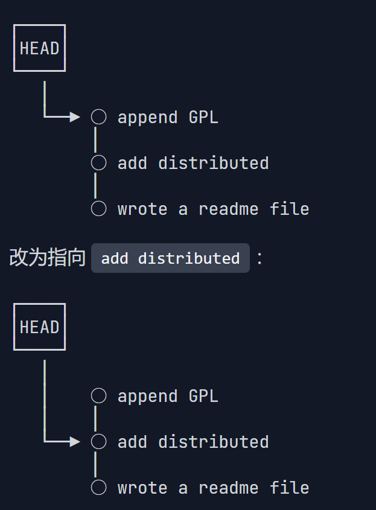

>from MIT Missing Semester of Your CS Education

??? info "shell的工作原理by ChatGPT"

    Shell 是操作系统的命令行界面（CLI）程序，它充当用户与操作系统内核之间的中介，接受用户输入的命令并将其传递给内核进行处理。Shell 不仅提供一个交互式的命令执行环境，还能执行脚本，进行自动化操作。它在系统中运行并处理输入输出，控制进程、文件以及程序流。理解 Shell 的工作原理有助于更好地使用它进行任务自动化、调试和系统管理。

    下面详细讲解 Shell 的工作原理。

    ---

    **1. Shell 启动过程**

    当你打开一个终端或控制台时，Shell 程序会启动并等待你输入命令。Shell 启动的过程一般分为以下几步：

    1. **启动**：
    - 当你打开终端，或者在启动时启动某个 Shell 程序时，操作系统会根据默认配置（如 `/etc/passwd` 中的 `SHELL` 设置）启动一个特定的 Shell 程序，常见的是 `bash`（Bourne Again Shell）。
    
    2. **读取配置文件**：
    - Shell 启动时，会加载一些配置文件，这些文件设置了环境变量、别名、函数等。
    - 对于交互式 Shell，通常会读取以下文件：
        - **全局配置**：`/etc/profile`、`/etc/bash.bashrc`（系统范围内的配置）
        - **用户配置**：`~/.bash_profile`、`~/.bashrc`（用户自定义的配置）
    
    3. **初始化环境**：
    - 配置文件中的环境变量会被加载，定义如 `PATH`、`USER`、`HOME` 等环境变量。
    - 此时，Shell 为会话准备好输入输出流（标准输入 `stdin`、标准输出 `stdout`、标准错误 `stderr`）。

    ---

    **2. Shell 的工作原理**

    Shell 通过对用户输入的命令进行解析、执行，并返回输出结果的方式与操作系统进行交互。其主要工作原理包括命令解释、进程管理、文件操作、脚本执行等。

    #### **命令解释与执行**

    当用户在 Shell 中输入命令时，Shell 执行以下步骤：

    1. **命令输入**：
    - 用户在 Shell 中输入命令。例如，输入 `ls -l /home`。

    2. **命令解析**：
    - Shell 将输入的命令分解成各个部分。通过空格或其他分隔符，Shell 会把输入命令分解为命令名、参数、选项等。
        - 示例输入 `ls -l /home`，Shell 将其分解为：
        - `ls`：命令名（程序）
        - `-l`：选项
        - `/home`：参数

    3. **命令查找**：
    - Shell 会检查命令是否是内建命令（如 `cd`, `echo`, `exit` 等）。如果是内建命令，Shell 会直接在自身中处理。
    - 如果是外部命令（如 `ls`, `grep`, `python` 等），Shell 会根据 `$PATH` 环境变量搜索命令所在的路径。

    4. **创建进程**：
    - 如果命令是外部命令，Shell 使用 `fork()` 系统调用创建一个新的进程，子进程会运行该命令。
        - `fork()`：创建一个子进程，子进程会从父进程复制一份自己的内存。
        - `exec()`：子进程调用 `exec()` 系列系统调用加载命令的可执行文件，执行命令。

    5. **命令执行**：
    - 子进程执行命令，并向标准输出（`stdout`）输出结果。对于错误输出，系统会写入标准错误流（`stderr`）。

    6. **返回结果**：
    - 命令执行完毕后，子进程会将其退出状态返回给父进程（Shell）。如果命令成功执行，退出状态为 0；如果失败，退出状态为非零值。
    - Shell 将命令的输出结果显示给用户，并将错误信息输出到标准错误。

    **进程管理**

    Shell 不仅能够执行命令，还能够管理和控制进程。它通过以下方式进行进程管理：

    1. **后台和前台进程**：
    - 默认情况下，Shell 在前台执行命令。你可以使用 `&` 将命令放到后台执行：
        ```bash
        command &
        ```
    - 背景进程会在后台运行，Shell 会显示进程 ID（PID）。你可以通过 `jobs` 查看后台进程，并使用 `fg` 或 `bg` 将其带回前台或继续后台执行。

    2. **进程间通信（IPC）**：
    - Shell 使用管道（`|`）和重定向（`>`，`<`）来实现进程间通信和数据流转。
    - 管道将一个命令的输出作为下一个命令的输入，实质上是通过内存缓冲区进行数据传输。例如：
        ```bash
        ls | grep "txt"
        ```

    3. **信号管理**：
    - Shell 可以发送和接收信号，用于进程控制。例如，`Ctrl+C` 发送一个 `SIGINT` 信号，终止正在执行的进程；`Ctrl+Z` 发送 `SIGTSTP` 信号，暂停进程。

    4. **作业控制**：
    - Shell 提供了作业控制功能，允许用户暂停、继续、停止进程，管理多个进程的运行。
    - 命令如 `jobs`、`fg`、`bg`、`kill` 用于管理进程。

    ---

    **3. Shell 脚本的工作原理**

    Shell 不仅能够执行单个命令，还可以执行由多个命令组成的脚本。脚本通常是包含多个命令的文本文件，Shell 会逐行读取并执行这些命令。

    **脚本执行流程**

    1. **脚本创建**：
    - 创建脚本文件并编辑，脚本的第一行通常会包含一个 shebang（`#!`）来指定解释器。例如：
        ```bash
        #!/bin/bash
        echo "Hello, World!"
        ```

    2. **脚本权限**：
    - 脚本需要具有执行权限。使用 `chmod` 为脚本赋予执行权限：
        ```bash
        chmod +x script.sh
        ```

    3. **脚本执行**：
    - 运行脚本时，Shell 会按顺序读取文件中的每一行，逐行执行命令。每个命令都会按照前述的流程解析、查找、执行。

    4. **变量与函数**：
    - 脚本支持使用变量、控制结构（如 `if`, `for`, `while` 等）和函数，以实现更复杂的任务。

    5. **错误处理与调试**：
    - 在执行脚本时，Shell 会根据命令的退出状态来判断是否继续执行。使用 `set -e` 可让脚本在命令失败时停止执行。
    - 可以使用 `echo` 输出调试信息，或使用 `trap` 捕获错误信号。

    ---

    **4. 输入输出流与重定向**

    Shell 提供了强大的输入输出管理功能，允许用户将命令的输入输出进行重定向。

    1. **标准流**：
    - 标准输入（stdin）、标准输出（stdout）和标准错误（stderr）是 Shell 与外部交互的主要方式。

    2. **重定向**：
    - 输入重定向（`<`）：将文件内容作为命令的输入。
    - 输出重定向（`>` 或 `>>`）：将命令输出写入文件。
    - 错误重定向（`2>`）：将错误信息输出到文件。

    3. **管道**：
    - 管道（`|`）将一个命令的输出传递给下一个命令作为输入。

    ---

    **5. 内建命令与外部命令**

    Shell 有两类命令：内建命令和外部命令。

    1. **内建命令**：
    - Shell 自带的命令，由 Shell 自身执行。常见的内建命令有 `cd`（切换目录）、`echo`（输出文本）、`exit`（退出 Shell）等。
    
    2. **外部命令**：
    - 外部命令是操作系统中的程序（如 `ls`、`grep`、`cat`）。Shell 查找这些命令的可执行文件，创建子进程执行。

    ---

    **总结**

    Shell 的工作原理可以分为多个阶段：用户输入命令、Shell 解析命令、查找和执行命令、进程管理、输出结果。它不仅是命令行工具，还可以通过脚本编程自动化任务，进行进程间通信，处理输入输出流，进行错误处理等。Shell 是与操作系统交互的重要桥梁，理解其工作原理能帮助我们更高效地操作系统、管理进程、自动化任务。

- terminal: 呈现shell的地方

- bash: the most widely used shell on linux

- prompt: 命令提示符，就这个东西


在命令提示符后面，你输入的是：程序名称 + 参数

And, use spaces to seprate the arguments, and if your need to include space in one argument, use \ before the space or "" or ''.

```shell
date
echo hello\ world
mkdir "my photes" # the right way
mkdir my photos # you might create 2 directory(my and photos)
# 其中：echo and date and mkdir 是程序名称，后面的是参数，即这里shell执行的就是带参数的程序
```

## enviroment variable
How does the shell know what to do when you type the "echo" or somethong else?

环境变量：设置好的，shell启动时就会自动设置的东西，bash下环境变量其实就是一个编程语言，So, in fact, we can run not only the program with arguments, but also things in programming language, like defining functions, while loops and so on, which is called shell scripting(编写shell脚本)

```shell
echo $PATH
# show all the path, shell就是在这些里面搜索程序的；被冒号分隔
```
本质上，输入程序名称，shell会遍历这些path然后找到名称与我输入的命令相匹配的那个

```shell
which <程序名称>
# 查看我输入这个程序名称后运行的是哪个程序
```

## 简单文件操作
首先解释一下路径的概念：

win: 由“\”开始(win的根目录为\\)，且每个分区（驱动器）都有一个根目录("\\"), 例如C:\

linux/macos: 由“/”开始(其根目录为/),且所有都在一个根目录下

绝对路径：能完全确定文件位置的完整路径

相对路径：相当于你当前处于的路径来说

例如，用cd改变路径就可以相对 or 绝对路径

```shell
pwd # 打印当前所处绝对路径
cd # 改变路径
# 几个特殊的目录：
. 当前的目录
.. 父目录
.. # 可回到父目录
../../ or ../.. # 回到上上级目录，etc.
~ 代表home/ruizhe
cd - # 切换回上一次所在的目录
```
想要在任何目录下运行程序例如echo, 要么只给出程序名，要么给出绝对路径（相对路径不行）

```shell
ls <目录名> # 可以列出ls后面的参数（目录）下的文件
# 例如：
ls ..
```
其他标志和选项：


| **区别点**   | **标志（Flags）**                | **选项（Options）**             |
|--------------|----------------------------------|---------------------------------|
| **格式**     | 通常是 `-f` 或 `--flag`          | 通常是 `-o value` 或 `--option=value` |
| **参数**     | 通常不需要额外的值               | 通常需要指定一个值              |
| **功能**     | 控制简单开关功能                 | 提供更详细的设置                |
| **组合性**   | 可以组合，例如 `-abc`            | 不能组合，需单独指定            |


查看详细用法：
```shell
ls --help
```
常用
```shell
ls -l # 列出文件的详细信息
```

??? info "detailed info by ChatGPT"

    执行 `ls -l` 命令后，会以**长格式**列出目录或文件的详细信息。每一行代表一个文件或目录，输出内容分为以下几个字段（从左到右）：  

    **1. 文件类型与权限**
    ```bash
    -rw-r--r--
    ```
    - 第一位：文件类型：
    - `-`：普通文件（regular file）
    - `d`：目录（directory）
    - `l`：符号链接（symbolic link）
    - `b`：块设备文件（block device）
    - `c`：字符设备文件（character device）
    - `p`：命名管道（pipe）
    - `s`：套接字（socket）

    - 接下来的9位：文件权限，分为三组，每组三位，分别表示**所有者**、**所在组**、**其他用户**的权限：
    - **r**（read）：可读
    - **w**（write）：可写
    - **x**（execute）：可执行
    - 如果没有权限，用 `-` 表示。

    对文件：r/w/x代表字面含义

    对文件夹：
        r代表：可以查看该目录下的文件列表（是否被允许列出该文件夹的所有文件列表；
        w代表：可以在该目录中重命名、创建、删除文件。如果对一个文件有w而对其目录没有w则不能删除文件（因为删除文件得需要对目录有w）；
        x代表：有cd入该目录的权限，如果想对该目录下的文件进行r、w、x，必须得拥有该目录及其所有父目录的x权限。

    **示例**：
    ```bash
    -rw-r--r--  # 表示：普通文件，所有者有读写权限，组和其他用户仅有读权限。
    drwxr-xr-x  # 表示：目录，所有者有读、写、执行权限，组和其他用户有读和执行权限。
    ```

    ---

    **2. 链接数**
    ```bash
    2
    ```
    - 表示硬链接的数量，即有多少路径指向该文件。
    - 对于目录，表示该目录中包含的子目录（包括 `.` 和 `..`）。

    ---

    **3. 所有者（User）**
    ```bash
    user
    ```
    - 文件的所有者名称，表示谁创建或拥有该文件。

    ---

    **4. 所属组（Group）**
    ```bash
    group
    ```
    - 文件所属的用户组，组内成员共享该文件的组权限。

    ---

    **5. 文件大小**
    ```bash
    4096
    ```
    - 文件的大小（以字节为单位）。  
    - 对于目录，显示的是目录元数据占用的大小，而非其内容大小。  
    - 如果需要更直观的显示大小，可以使用 `-h`（human-readable）选项：  
    ```bash
    ls -lh
    ```

    ---

    **6. 修改时间**
    ```bash
    2024-11-18 10:30
    ```
    - 文件最近的**修改时间**，格式是 `年月日 时:分`。  
    - 如果文件的修改时间超过半年，则显示年份而不是时间。  

    ---

    **7. 文件名**
    ```bash
    example.txt
    ```
    - 文件或目录的名称。
    - 如果是符号链接，会显示指向的目标路径，例如：
    ```bash
    mylink -> /path/to/target
    ```

    ---

    **完整示例**
    执行 `ls -l` 输出如下：
    ```bash
    -rw-r--r--  1 user group  1024 2024-11-18 10:30 example.txt
    drwxr-xr-x  2 user group  4096 2024-11-18 10:00 my_directory
    ```

    **逐字段解释**：
    1. `-rw-r--r--`：普通文件，所有者有读写权限，组和其他用户仅有读权限。
    2. `drwxr-xr-x`：目录，所有者有读、写、执行权限，组和其他用户有读和执行权限。
    3. `1` 和 `2`：硬链接数量。
    4. `user`：所有者名称。
    5. `group`：所属组名称。
    6. `1024` 和 `4096`：文件或目录大小（字节数）。
    7. 时间：最后修改时间。
    8. `example.txt` 和 `my_directory`：文件名或目录名。

    ---

    常见扩展选项
    - **`-h`**：以易读格式显示文件大小。
    - **`-a`**：显示所有文件，包括隐藏文件（以 `.` 开头）。
    - **`-t`**：按修改时间排序。
    - **`-S`**：按文件大小排序。  

    综合使用这些选项可以更方便地查看文件信息。

```shell
mv full_path/old_file_name full_/new_file_name  # 重命名文件,这里可以是相对路径也可以是绝对路径,无法在一个目录下操作另一个目录下的文件所以要给出目录

mv file_name directory  # 移动文件

cp full_path/file_name full_path(new)/file_name(can_be_new) # 在full_path(new)中复制一份名为file_name(can_be_new)的文件，注意这里可以是相对路径也可以是绝对路径

rm dir/file_name  # 也要提供文件路径（相对or绝对）

rm -r  # 递归删除目录及其包含的所有文件

rmdir  # 删除目录，但是只能删除空目录

mkdir 

cat
```
查看具体：
```shell
man <程序名>  # 手册页
```
```shell
Ctrl + L == clear
```

## 真正有用的文件操作 —— 流
流 —— shell真正的强大之处
输入流：默认从键盘输入终端terminal的

输出流：默认处输出到terminal
### 重定向 `>`, `<`, `>>`
重定向输入流输出流：
```shell
< full_path/file_name  # 将前面程序的输入重定向到这个文件
> full_path/file_name  # 将前面程序的输出重定向到这个文件

# for example，

echo hello world > hello.txt  # 在当前目录下创建一个hello.txt并在其中写入hello world，如果原来有内容将会覆盖原来的。且这里可以两个单词之间用空格；

echo hello world ohh >> hello.txt  # 继续写入，不会覆盖原有的

cat  # 可以将输入输出连在一起：默认情况下将输入内容复制到输出端

# example：
cat < hello.txt  # shell会打开文件hello.txt，从其中读取输入，并将其设置为cat的命令，输出，默认道terminal

cat < hello.txt > hello2.txt  # 其实是告诉shell使用hello.txt作为cat命令的输出，再将cat打印的内容写入hello2.txt

```

### 管道 `|`
作用：将左边程序的输出作为右边程序的输入

注意：左右两个程序互相不知道，只是`|`将其输入输出连接

```shell
tail -nk  # 最后k行（其中n为标志，k为你输入的一个常数代表最后k行

# 等价于：

tail --line=k
```

for example，
```shell
ls -l | tail -n2  # 将ls -l的输出即文件详细列表作为tail -n2的输入，用tail命令处理输入得到最后两行，由于没有重定向，则输出内容打印到terminal

ls -l | tail -n2 > ls.txt  # 加了一个重定向，则输出内容打印到ls.txt
```
作用：文本处理，图像处理，数据流传数

# root
超级用户（可以做任何事情，访问任何文件）
，像win的管理员用户

一般不用

使用：
sudo（即do as su）以超级用户的身份执行操作

语法：
sudo + 程序名 + ……

场景：
sys文件夹：其实不是你计算机上的文件，里面是计算机的内核参数，由于是文件，所以可以用文件操作命令来访问他们；一般没有权限访问，访问需要sudo

例如brightness调节

可能的方案：
```shell
sudo echo 500 > brightness  # permission denied
```
because 管道和重定向不是程序知道的，是shell知道的，而此时仍是run as ruizhe. 

即：shell以ruizhe身份想要打开brightness并将echo的500写入其中，这是没有权限的

再例，`ls -l | tail -n2  `, ls不知道tail，tail不知道ls。而是我告诉shell，shell进行/处理pipe & redirection。


解决方案1：
```shell
sudo su  # 改变成：shell以root身份运行，而不是ruizhe
```
`$`代表以用户ruizhe访问文件

`#`代表以root访问文件


解决方案2：

```shell
echo 1060 | sudo tee brightness
# 含义：我告诉终端运行sudo 1060，然后告诉他运行sudo tee brightness(即run tee as root)，并让他将echo的输出发送到sudo tee；
# tee命令：读取输入，将其输入到文件中，同时将他就输出到标准输出。
# echo <num> | sudo tee <file_name>  or  echo <sum> > file_name
```

打开文件
```shell
xdg-open <file_name>  # 用特定软件打开文件，只用于linux
```

# 杂项
1. WSL: Windows Subsystem for Linux，即 Windows 下的 Linux 子系统。

    | **方面**              | **Linux**                                          | **WSL**                                           |
    |------------------------|---------------------------------------------------|--------------------------------------------------|
    | **底层架构**          | 运行在 Linux 内核上，是一个独立的操作系统。         | 运行在 Windows 内核上，基于翻译或虚拟化实现。    |
    | **内核支持**          | 使用真正的 Linux 内核。                             | - WSL 1：无 Linux 内核，仅模拟系统调用。<br>- WSL 2：使用完整的 Linux 内核。 |
    | **文件系统**          | 默认使用 Linux 文件系统（如 ext4）。                 | 默认通过虚拟磁盘支持 ext4，同时可以访问 NTFS 文件。 |
    | **硬件访问**          | 直接访问硬件资源（如设备、网络）。                   | 通过 Windows 层间接访问硬件，限制对设备的直接控制。 |
    | **性能**              | 直接运行在裸机上，性能最佳。                         | WSL 1：性能有限，尤其是文件 I/O。<br>WSL 2：性能接近 Linux，但仍稍逊色于原生。 |
    | **软件兼容性**        | 完全支持 Linux 应用程序和工具。                      | - WSL 1：部分应用不兼容，特别是需要完整内核功能的应用。<br>- WSL 2：大部分应用兼容。 |
    | **GUI 支持**          | 原生支持 GUI 应用程序（如 GNOME、KDE）。              | 通过 WSLg 支持部分 Linux GUI 应用程序（仅 WSL 2）。 |
    | **使用场景**          | 专为服务器、桌面和嵌入式设备设计。                   | 适合开发者在 Windows 环境下运行 Linux 工具链。   |

2. Quoting

Actually, you can simply use escape character like this.


??? info "linux执行文件的命令"

    在 Linux 中，执行文件的命令取决于文件的类型（可执行文件、脚本等）和文件的权限设置。以下是几种常见的执行文件的方法：

    **1. 执行可执行文件**
    对于已经编译好的二进制可执行文件，可以直接在终端中执行。假设文件是 `./program`，你可以使用以下命令：

    ```bash
    ./program
    ```

    **注意事项：**
    - 使用 `./` 表示当前目录。如果文件不在 `PATH` 环境变量指定的目录中，必须使用 `./` 指定当前目录。
    - 如果文件没有执行权限，系统会提示 `Permission denied` 错误。可以使用 `chmod` 添加执行权限：
    ```bash
    chmod +x program
    ```

    **2. 执行脚本文件**
    对于脚本文件（如 Shell 脚本、Python 脚本等），你也可以通过以下命令执行它们：

    **a. 执行 Bash 脚本**
    假设脚本文件是 `./script.sh`，你可以使用以下命令：

    ```bash
    ./script.sh
    ```

    如果没有执行权限，你可以使用 `chmod +x` 来添加执行权限：
    ```bash
    chmod +x script.sh
    ```

    **b. 执行 Python 脚本**
    对于 Python 脚本文件，你可以使用 Python 解释器来执行。例如，假设脚本是 `./script.py`：

    ```bash
    python script.py
    ```

    或者，如果脚本有执行权限，并且在第一行包含正确的 shebang（`#!/usr/bin/python`），你也可以直接运行：
    ```bash
    ./script.py
    ```

    **注意：** 在运行 Python 脚本时，你可能需要指定 Python 版本，尤其是 Python 2 和 Python 3 之间的区别。例如：
    ```bash
    python3 script.py
    ```

    **c. 执行其他类型的脚本**
    对于其他类型的脚本（例如 Perl、Ruby 等），你可以指定相应的解释器运行它们：

    - **Perl 脚本**：
    ```bash
    perl script.pl
    ```

    - **Ruby 脚本**：
    ```bash
    ruby script.rb
    ```

    **3. 使用 `sh` 或 `bash` 执行脚本**
    如果你不想直接运行脚本文件，也可以通过 `sh` 或 `bash` 来执行它。例如：

    ```bash
    sh script.sh
    ```

    或者：

    ```bash
    bash script.sh
    ```

    **4. 执行已安装的程序（通过 PATH）**
    如果文件已经安装并且位于环境变量 `$PATH` 中，你可以直接输入文件名来执行。例如，`ls`、`git` 等命令可以直接运行，因为它们在 `$PATH` 中。

    ```bash
    git --version
    ls -l
    ```

    **总结**
    - 对于可执行文件，使用 `./<filename>` 来执行（确保文件有执行权限）。
    - 对于脚本文件，确保文件有执行权限（`chmod +x <script>`），然后使用 `./script.sh` 或相关解释器（`python script.py`）来执行。
    - 如果文件在 `$PATH` 中，直接输入文件名即可执行。
    在 Linux 中，当你想要执行一个文件时，`./` 是用来指定当前目录的路径。通常，`./` 是必要的，因为当前目录（`.`）并不自动包含在环境变量 `$PATH` 中，`$PATH` 变量是告诉系统在哪些目录中查找可执行文件的。如果你直接输入文件名，Linux 会在 `$PATH` 中指定的目录中查找该命令，而不会自动查找当前目录。

    **1. `$PATH` 环境变量的作用**
    `$PATH` 环境变量告诉 shell 在哪些目录中查找命令。通常，它包含一些系统目录（如 `/usr/bin`、`/bin`、`/usr/local/bin` 等），但是**当前目录（`.`）并不包含在内**。

    当你在终端中输入一个命令时，Shell 会按顺序在 `$PATH` 指定的目录中查找该命令。如果命令不在这些目录中，Shell 就不会执行它。

    **2. 为什么当前目录不在 `$PATH` 中**
    将当前目录（`.`）加入到 `$PATH` 中存在一定的安全风险。假设当前目录在 `$PATH` 中，如果你在当前目录下无意中创建了一个与系统命令同名的文件（例如 `ls`），Shell 就可能会执行这个恶意文件，而不是系统中的 `ls` 命令。这可能导致系统安全问题。

    **3. 使用 `./` 明确指定当前目录**
    为了防止误用，Linux 默认不将当前目录 (`.`) 包括在 `$PATH` 中。如果你希望执行当前目录下的文件，就需要通过 `./` 来明确指定当前目录。

    例如，如果当前目录中有一个名为 `program` 的可执行文件，运行时需要这样输入：

    ```bash
    ./program
    ```

    这样，Shell 就知道你要执行的是当前目录下的 `program` 文件，而不是在 `$PATH` 中的任何其他程序。

    **4. 如果不加 `./` 会发生什么？**
    如果你直接输入 `program`（没有加 `./`），Shell 会在 `$PATH` 中查找名为 `program` 的可执行文件。如果该文件不在 `$PATH` 中，Shell 会显示类似于以下的错误：

    ```
    bash: program: command not found
    ```

    **5. 安全性考虑**
    如果允许直接执行当前目录下的文件（不加 `./`），可能会导致以下安全隐患：
    - 无意间执行恶意脚本或程序（例如，某些脚本或程序可能被误放入当前目录）。
    - 执行与系统命令同名的恶意文件（例如，如果某个文件叫 `ls`，你可能会执行错误的程序）。

    **6. 如何改变行为（不推荐）**
    如果你非常确信自己不想经历 `./`，并且愿意承担风险，可以将当前目录添加到 `$PATH` 中。你可以在 `.bashrc` 或 `.zshrc` 等配置文件中添加以下行：

    ```bash
    export PATH=".:$PATH"
    ```

    这样，你的当前目录就会被包括在 `$PATH` 中，从而允许你直接执行当前目录下的文件。然而，这样做是不推荐的，尤其是在生产环境中，因为它会带来潜在的安全问题。

    ---

    **总结**
    - `./` 是用来明确告诉 Shell 当前目录的路径，因为当前目录 (`.`) 默认不在 `$PATH` 中。
    - 这样做是出于安全考虑，防止你无意间执行当前目录下的恶意或不安全的文件。

??? info "#!"
    `#!/usr/bin/` 中的 `#!` 是 **shebang**（也叫 **hashbang** 或 **bang line**）符号，它是用来告诉操作系统该脚本应该由哪个解释器来执行的特殊字符序列。`#!/usr/bin/` 后面的路径（如 `/usr/bin/python3`、`/bin/bash` 等）指定了该脚本应该使用的解释器。

    **详细解释：**

    1. **`#!` 的含义：**
    - `#!` 是一种特殊的字符序列，它并不属于普通的注释语法，而是操作系统用来识别脚本类型的标记。
    - 在 Unix-like 系统（如 Linux 和 macOS）中，`#!` 是 **shebang**，表示该文件是一个脚本文件，后面跟着一个解释器的路径。
    - 操作系统读取文件时，遇到 `#!` 会知道该文件应该用后面指定的程序（解释器）来执行，而不是依赖于当前的 shell 或其他默认设置。

    2. **`/usr/bin/` 的含义：**
    - `/usr/bin/` 是文件系统中的一个标准目录，通常包含了大多数用户可用的命令和可执行文件。它是 Linux 系统中存放系统二进制可执行文件的一个常见位置。
    - 当你在 shebang 中看到 `/usr/bin/`，后面通常跟着解释器程序的名称，例如 `/usr/bin/python3` 或 `/usr/bin/bash`，表示该脚本应由 `/usr/bin/` 目录中的 Python 3 解释器或 Bash 解释器来执行。

    3. **完整的 shebang 示例：**

    - **Python 脚本：**
        ```python
        #!/usr/bin/python3
        print("Hello, World!")
        ```
        这个脚本告诉操作系统用 `/usr/bin/python3` 解释器来执行 Python 代码。当你运行脚本时，系统会自动调用 Python 3 解释器来执行脚本中的代码。

    - **Bash 脚本：**
        ```bash
        #!/bin/bash
        echo "Hello, World!"
        ```
        这个脚本告诉操作系统用 `/bin/bash` 解释器来执行 shell 脚本。

    4. **作用：**
    - **指定解释器：** `#!` 后面的路径告诉操作系统使用哪个解释器来执行脚本。例如，`#!/usr/bin/python3` 会让系统使用 Python 3 来执行脚本；`#!/bin/bash` 会使用 Bash 解释器来执行 shell 脚本。
    - **使脚本直接可执行：** 当你在脚本的第一行使用 shebang 并给文件赋予执行权限后，你可以直接执行脚本，而不需要手动指定解释器。例如：
        ```bash
        chmod +x myscript.py
        ./myscript.py
        ```
        如果没有 shebang 行，你就需要显式地使用解释器：
        ```bash
        python3 myscript.py
        ```

    **为什么使用 shebang？**
    1. **便捷性：**
    使用 shebang 可以让你直接通过 `./script_name` 运行脚本，而无需指定解释器（例如 `python3 script.py` 或 `bash script.sh`）。
    
    2. **兼容性：**
    Shebang 允许脚本在不同的环境中正确运行，尤其是在不同系统上。例如，在某些系统中，`/usr/bin/python` 可能指向 Python 2，而 `/usr/bin/python3` 指向 Python 3。使用正确的 shebang 行确保脚本会使用正确的版本。

    3. **明确性：**
    Shebang 使脚本文件变得自解释，即使不查看文件的内容，用户也可以知道该脚本需要哪个解释器。

    **总结：**
    - **`#!`（shebang）**：这是一个特殊的标记，告诉操作系统用哪个解释器来执行脚本。
    - **`/usr/bin/`**：这是文件系统中常见的存放可执行文件的目录，通常是操作系统查找解释器的位置之一。
    - 在 shebang 后面指定的路径（如 `/usr/bin/python3` 或 `/bin/bash`）告诉操作系统该脚本由哪个解释器来运行，从而使得脚本更加灵活和自包含。


words

    argument: 参数
    variable: 变量
    prompt: 命令提示符