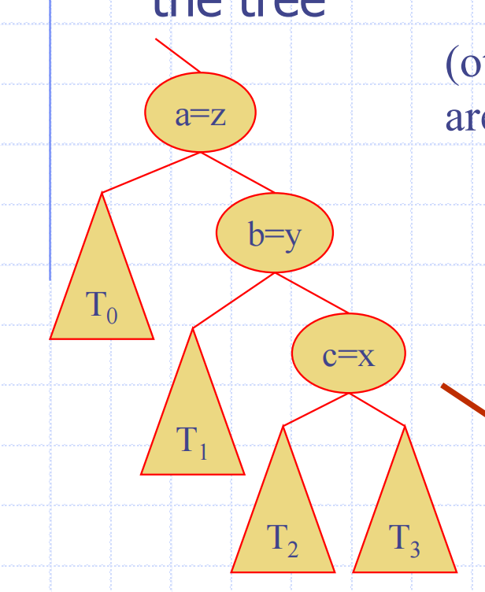
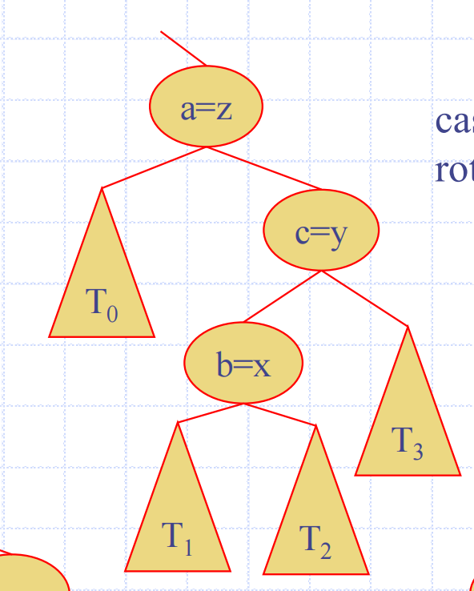
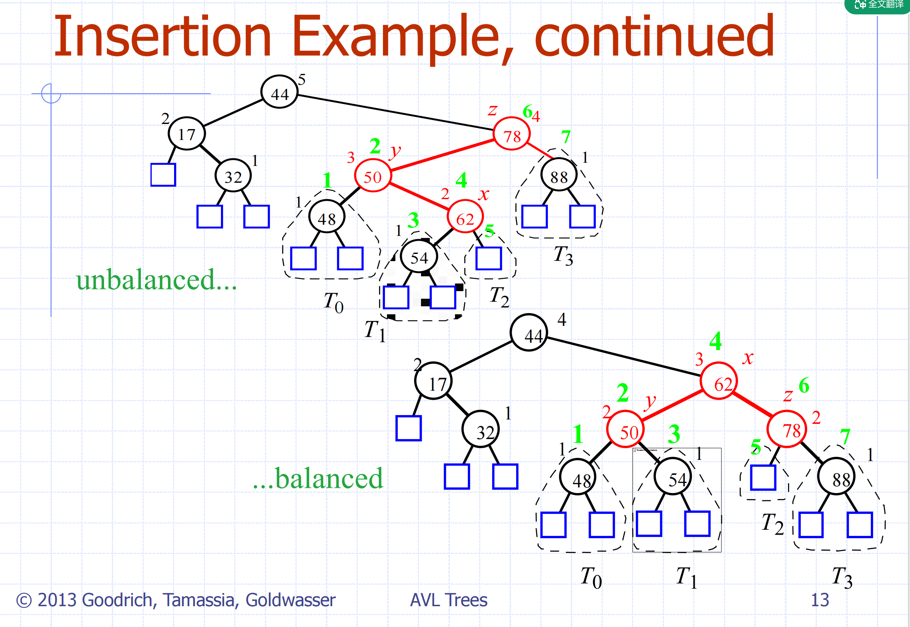
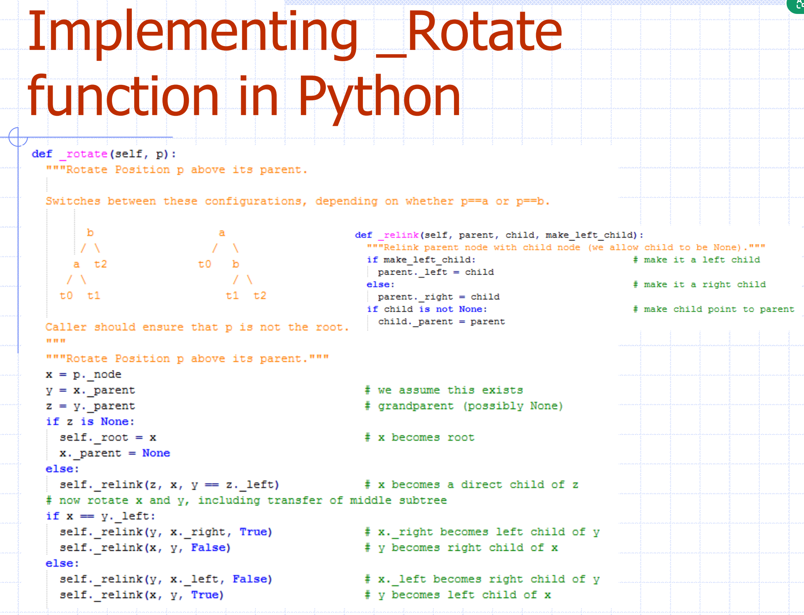
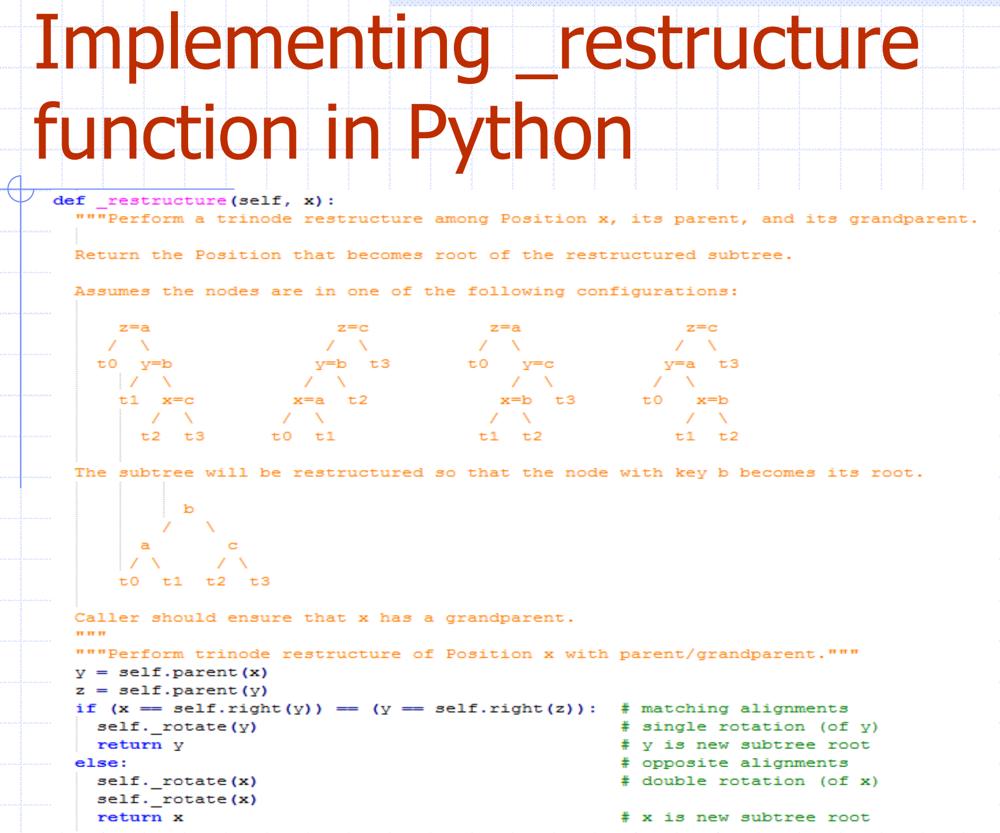
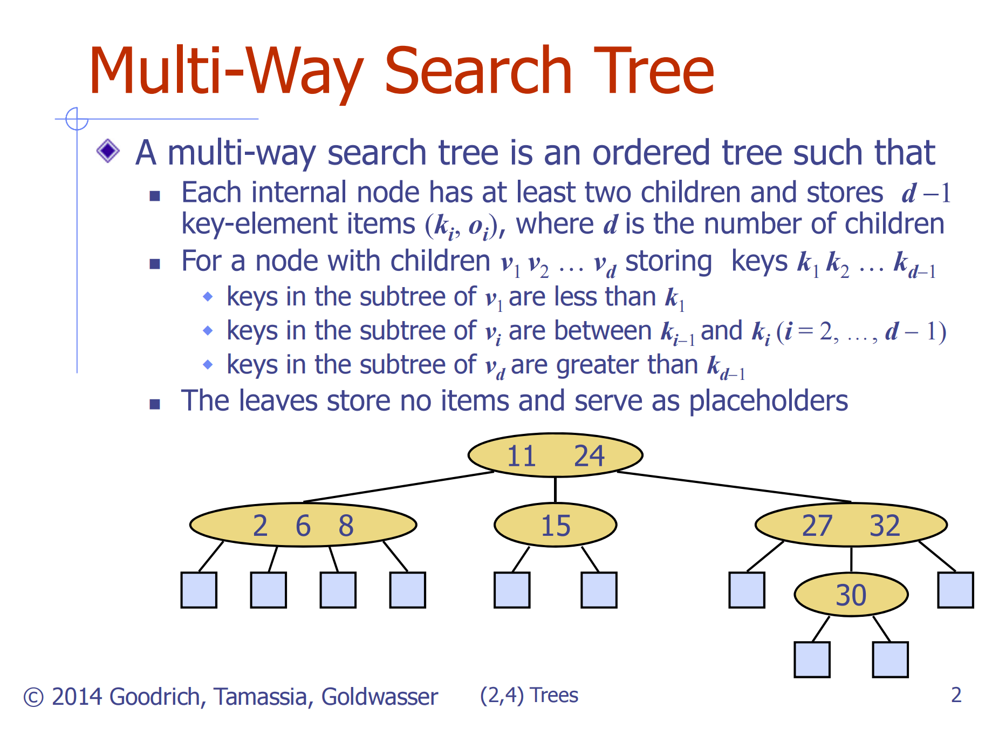

## AVL tree

### Rotation

rotate(x): x will become a child of its child y.

- x will go down one level.
- y will go up one level.

```text
      z                               z
     / \                             / \
    y   T4  --(rotate(x))-->       x   T4
   / \                             / \
  x   T3                          T1  y
 / \                                 / \
T1  T2                              T2  T3
```

Consider the trinode restructuring:



Linear case

rotate(b), a will go down, b will go up, c will be the right child of b.

If they are in  one line, rotate the middle one.

non-linear case

Double rotation: first rotate the child, then rotate the parent.



```text
      z                               z                               z
     / \                             / \                             / \
    c   T4  --(rotate(b))-->       b   T4  --(rotate(a))-->       b   T4
   / \                             / \                             / \
  T1  b                           c   T3                          a   c
     / \                         / \                             / \
    T2  a                       T1  T2                          T1  T2
       / \                                                     / \
      T3  T4                                                  T3  T4
```

**ALWAYS ROTATE THE MIDDLE NODE FIRST.**

寻找旋转哪个节点：从插入的节点开始，go all the way up to the node, 路上检查第一个不平衡的节点，就是要旋转的节点。



两次旋转 62，62是中间的排在节点

### Implementation




reconstruct(node): 决定单旋还是双旋

## (2, 4) tree

2 means the minimum number of children a non-leaf node can have.

4 means the maximum number of children a non-leaf node can have.

规则：

- leaf node store no value.
- 所有节点都存数据
- 节点中的数据，孩子们的数据值在父亲的两个数据值之间

Multi-way search tree.



由 k 个儿子的节点叫做 k-node

### 插入 - Overflow and Split

当 overflow 发生时，分裂节点，把一个 pivot(middle value) 提升到父节点，剩余节点前后分成两个，pivot 放到父节点，递归上去。

### 删除

找到替代，用 inorder successor。

要是实际删掉的是节点中唯一值，就从上面拿一个。
