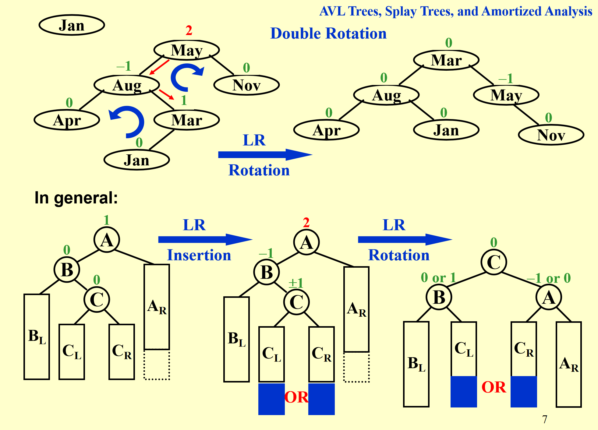

## 定义概念

平均搜索时间 average search time：节点深度平均值

### AVL tree 定义

0. 空树是 height balanced 的
1. 左右子树都 height balanced：**递归下去所有都是**
2. $|h_L - h_r| \le 1$，即对所有节点 $BF(node) = -1 / 0 / 1$，

!!! info ""

    定义  $BF(node) = h_L - h_R$

### 旋转

#### RR rotate

1. trouble maker: $B_R$，右子树的右子树插入
2. trouble finder（此处是A）：从插入/删除点往上回溯
3. 局部调整，整体起效：一般 AVL 调整只需要处理 离插入点最近的、最底层的失衡节点（即第一个 finder），即此处 A 没必要是根节点
4. 调整过程保持 二叉搜索树的中序遍历结果不变，即这里 $B_L$ 变成 A 的右子树

#### LL rotate

