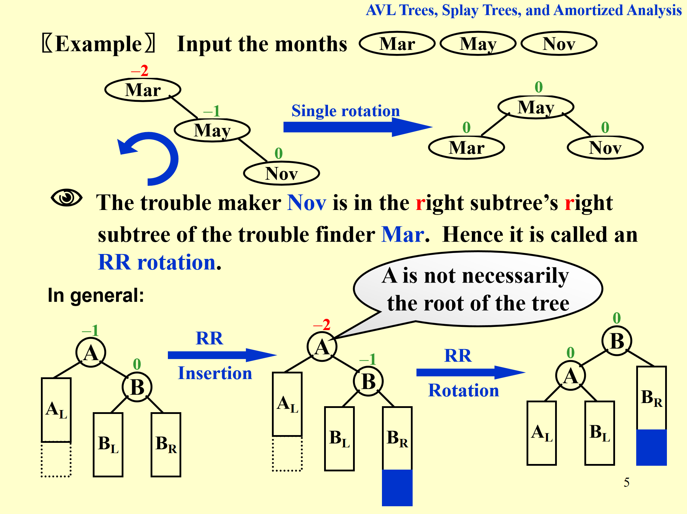

## 定义概念

平均搜索时间 average search time：节点深度平均值

### AVL tree 定义

0. 空树是 height balanced 的
1. 左右子树都 height balanced：**递归下去所有都是**
2. $|h_L - h_r| \le 1$，即对所有节点 $BF(node) = -1 / 0 / 1$，

!!! info ""

    定义  $BF(node) = h_L - h_R$

### 旋转

#### RR rotate

1. trouble maker: 右子树的右子树插入
2. trouble finder
1. 右子树的右子树插入，左旋