## AVL tree

### 定义

目标：保证每次操作时间是 $O(\log n)$

0. 空树是 height balanced 的
1. 左右子树都 height balanced：**递归下去所有都是**
2. $|h_L - h_r| \le 1$，即对所有节点 $BF(node) = -1 / 0 / 1$，


!!! info ""

    定义  $BF(node) = h_L - h_R$

### 旋转（核心）

!!! abstract "课下总结"

    - 对于 LR 和 RL，按照从 trouble maker 到 trouble finder 的走势，决定顺逆时针。
        - 往右撇，顺时针
        - 往左撇，逆时针
    - 只旋转 trouble maker，按照刚刚的顺逆时针

**一句话，每次插入 / 删除，带来 BF 的变化，就要看需不需要旋转，如果需要的话，看从 trouble maker 到 trouble finder 这条路上的情况，决定怎样旋转**

#### 规律

**命名来由**（LL / LR / RR / RL）：

- trouble maker：插入/删除点
- trouble finder：失衡节点

从 trouble finder 看 trouble maker 在哪边的哪边，只数三个节点（包含头尾，也就是中间经过一个节点）：L代表左子树，R代表右子树

- LL：左子树的左子树插入
- LR：左子树的右子树插入
- RR：右子树的右子树插入
- RL：右子树的左子树插入


#### RR rotate
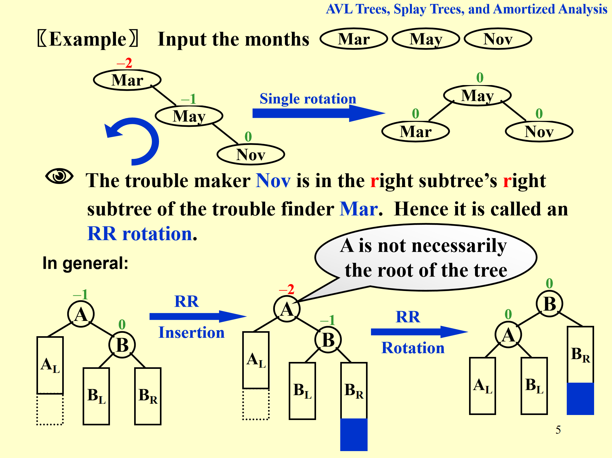

1. trouble maker: $B_R$，右子树的右子树插入
2. trouble finder（此处是A）：从插入/删除点往上回溯
3. 局部调整，整体起效：一般 AVL 调整只需要处理 离插入点最近的、最底层的失衡节点（即第一个 finder），即此处 A 没必要是根节点
4. 调整过程保持 二叉搜索树的中序遍历结果不变，即这里 $B_L$ 变成 A 的右子树

#### LL rotate

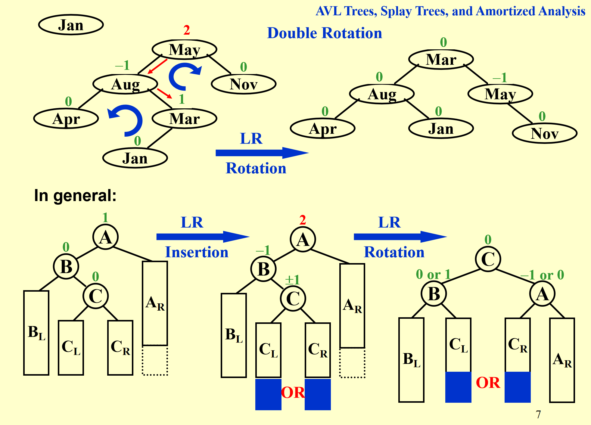

#### LR rotate

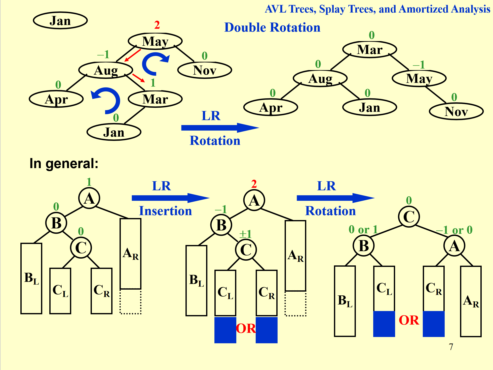


旋转方法：反着转，先右后左

- 左：左子树，即 trouble finder 的左子树
- 右：右子树，即 trouble finder 的左子树的右子树

右：把从 trouble maker 和从他开始到 trouble finder 的路径上前三个节点向左旋转（逆时针）

左：旋转原来的 trouble finder 节点，向右旋转（顺时针）

#### RL rotate

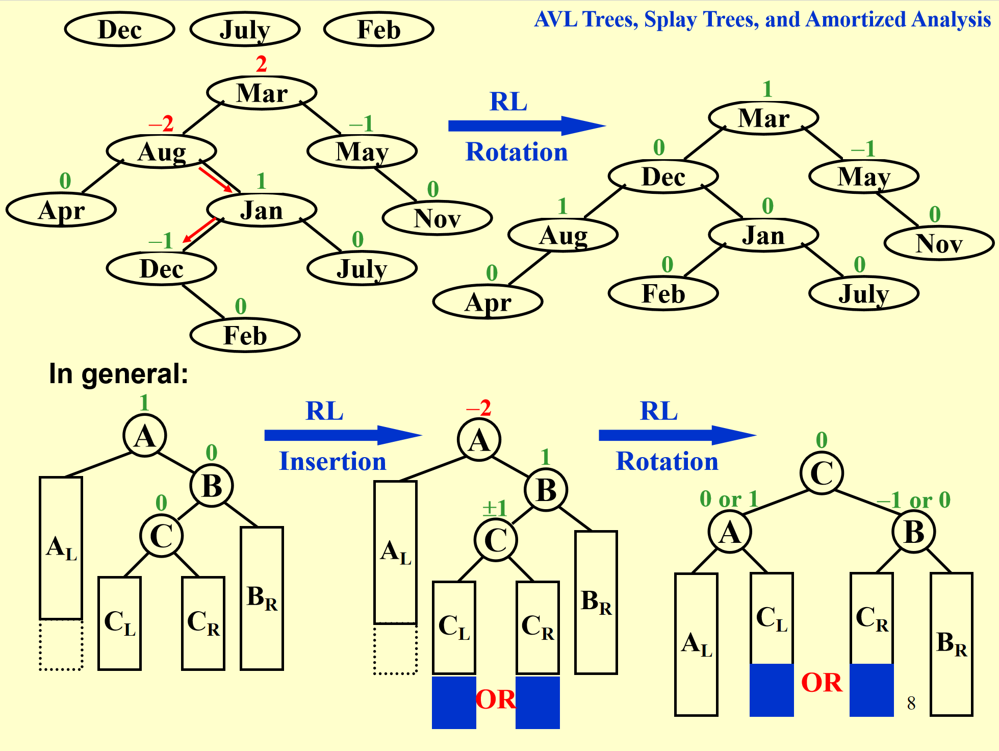

基本同上，变一下顺序

### 数据存储

### 复杂度
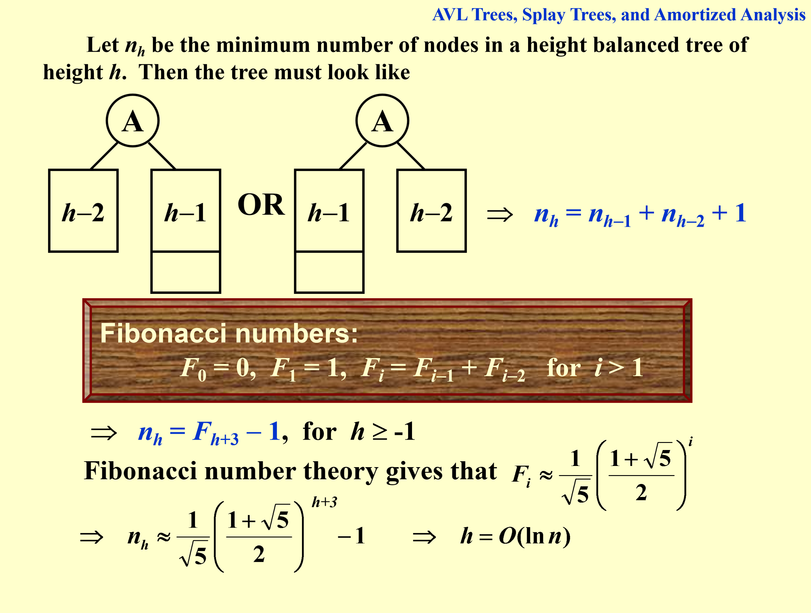

$n_h$ 为高度为 h 的 AVL 树的最小节点数，由于是最小，则 root 的左右子树高度差1（相等的话左 / 右减去一个还是 AVL 树）

$$n_h = 1 + n_{h-1} + n_{h-2}$$

每一步操作都是 $O(\log n)$

- 插入：$O(\log n)$
- 删除：$O(\log n)$
- 查找：$O(\log n)$


## Splay Tree

???- info "Splay 知识点全解"

    ## 🧩 一、什么是 Splay Tree（伸展树）

    **Splay Tree（伸展树）** 是一种**自调整的二叉搜索树（Self-adjusting Binary Search Tree）**，由 **Daniel Sleator** 和 **Robert Tarjan** 在 1985 年提出。

    它与 AVL Tree、Red-Black Tree 一样都是**二叉搜索树（BST）**，但**不维护严格的平衡信息**（如高度或颜色）。
    取而代之，它通过一种称为 **Splaying（伸展）** 的操作，使得**最近访问的节点被移动到树根**。

    > 📖 直观理解：
    > Splay Tree 就像一个“会自己记忆使用习惯”的 BST。
    > 你常访问哪个节点，它就会自动靠近根，让以后访问更快。

    ---

    ## ⚙️ 二、Splay Tree 的核心思想

    每当执行一次操作（如查找、插入、删除），我们都会把**访问到的节点伸展（splay）到根节点**。

    伸展的好处是：

    * **最近访问的节点更靠近根**；
    * **局部性原则（locality）**：若未来访问相同或邻近的节点，速度会更快；
    * **摊还时间复杂度为 O(log n)**。

    ---

    ## 🪜 三、Splay 操作（Splaying）

    ### 1️⃣ 定义

    “Splay” 是一种通过**旋转（rotation）**将节点逐步移动到根节点的过程。

    设要伸展的节点为 `x`，其父节点为 `p`，祖父节点为 `g`。
    根据 `x` 在树中的位置，有三种情况：

    ---

    ### 2️⃣ 三种情况详解

    #### **（1）Zig（单旋转）**

    当 `x` 是根的**直接孩子**时（即没有祖父节点）：

    * 若 `x` 是左孩子 → 右旋；
    * 若 `x` 是右孩子 → 左旋。

    ```text
        p                x
    /                / \
    x      →         a   p
    / \                  / \
    a   b                b   c
    ```

    ---

    #### **（2）Zig-Zig（双旋转，同向）**

    当 `x` 和 `p` **在同一方向**（都是左孩子或都是右孩子）时：

    * 先对 `g` 旋转；
    * 再对 `p` 旋转。

    例如：`x`、`p` 都是左孩子：

    ```text
        g                     x
        /                     / \
        p         →           a   p
    / \                       / \
    x   c                     b   g
    / \                           / \
    a   b                         c   d
    ```

    ---

    #### **（3）Zig-Zag（双旋转，交叉方向）**

    当 `x` 和 `p` **方向相反**时：

    * 先对 `p` 旋转；
    * 再对 `g` 旋转。

    例如：`x` 是右孩子，`p` 是左孩子：

    ```text
        g                     x
        /                     / \
        p         →           p   g
    / \                   / \ / \
    a   x                 a  b c  d
        / \
        b   c
    ```

    ---

    ## 🌱 四、基本操作

    Splay Tree 的所有操作（查找、插入、删除）都基于“先 splay，再调整”：

    ---

    ### **1️⃣ 查找（Search）**

    查找键 `k`：

    * 像普通 BST 一样查找；
    * 若找到节点 `x` → **将 `x` 伸展到根**；
    * 若没找到 → **将最后访问的节点伸展到根**（靠近 `k`）。

    > ✅ 好处：即使查找失败，也能把“接近目标”的节点放到根，方便后续插入。

    ---

    ### **2️⃣ 插入（Insert）**

    插入键 `k`：

    1. 普通 BST 插入；
    2. 插入后，将新节点 `x` 伸展到根。

    ---

    ### **3️⃣ 删除（Delete）**

    删除键 `k`：

    1. 查找并将节点 `x` 伸展到根；
    2. 删除 `x` 后，假设左子树为 `L`、右子树为 `R`；
    3. 若 `L` 不为空，将 `L` 中的最大节点伸展到根；
    4. 再将 `R` 连接为右子树。

    ---

    ## ⏱ 五、复杂度分析

    | 操作 | 最坏时间复杂度 | 摊还时间复杂度（Amortized） |
    | -- | ------- | ------------------ |
    | 查找 | O(n)    | **O(log n)**       |
    | 插入 | O(n)    | **O(log n)**       |
    | 删除 | O(n)    | **O(log n)**       |

    > 💡 摊还复杂度分析由 Sleator & Tarjan 提出，使用**势能分析（Potential Method）**证明。

    ---

    ## 🧠 六、Splay Tree 的特点

    ### ✅ 优点

    * 不需要显式维护平衡信息；
    * 支持摊还 O(log n) 的操作；
    * 最近访问的节点更快访问；
    * 对**具有访问局部性**的场景性能极好；
    * 实现简单。

    ### ❌ 缺点

    * 单次操作可能退化到 O(n)；
    * 对于无访问模式的随机操作，性能略逊于红黑树；
    * 不保证严格平衡。

    ---

    ## 🧪 七、应用场景

    * 缓存系统（LRU-like 结构）
    * 文件系统的路径缓存（例如 UNIX 内核）
    * 动态集合、字典
    * 访问模式具有**局部性**的数据结构优化

    ---

    ## 💻 八、示例代码（Python）

    下面是一份简化的 Splay Tree 实现：

    ```python
    class Node:
        def __init__(self, key):
            self.key = key
            self.left = None
            self.right = None

    class SplayTree:
        def __init__(self):
            self.root = None

        # ---------- 基本旋转 ----------
        def _right_rotate(self, x):
            y = x.left
            x.left = y.right
            y.right = x
            return y

        def _left_rotate(self, x):
            y = x.right
            x.right = y.left
            y.left = x
            return y

        # ---------- Splay 操作 ----------
        def _splay(self, root, key):
            if not root or root.key == key:
                return root

            # key 在左子树
            if key < root.key:
                if not root.left:
                    return root
                # Zig-Zig
                if key < root.left.key:
                    root.left.left = self._splay(root.left.left, key)
                    root = self._right_rotate(root)
                # Zig-Zag
                elif key > root.left.key:
                    root.left.right = self._splay(root.left.right, key)
                    if root.left.right:
                        root.left = self._left_rotate(root.left)
                return root if not root.left else self._right_rotate(root)

            # key 在右子树
            else:
                if not root.right:
                    return root
                # Zag-Zig
                if key < root.right.key:
                    root.right.left = self._splay(root.right.left, key)
                    if root.right.left:
                        root.right = self._right_rotate(root.right)
                # Zag-Zag
                elif key > root.right.key:
                    root.right.right = self._splay(root.right.right, key)
                    root = self._left_rotate(root)
                return root if not root.right else self._left_rotate(root)

        # ---------- 查找 ----------
        def search(self, key):
            self.root = self._splay(self.root, key)
            return self.root and self.root.key == key

        # ---------- 插入 ----------
        def insert(self, key):
            if not self.root:
                self.root = Node(key)
                return
            self.root = self._splay(self.root, key)
            if self.root.key == key:
                return  # 已存在
            new_node = Node(key)
            if key < self.root.key:
                new_node.right = self.root
                new_node.left = self.root.left
                self.root.left = None
            else:
                new_node.left = self.root
                new_node.right = self.root.right
                self.root.right = None
            self.root = new_node

        # ---------- 删除 ----------
        def delete(self, key):
            if not self.root:
                return
            self.root = self._splay(self.root, key)
            if self.root.key != key:
                return
            if not self.root.left:
                self.root = self.root.right
            else:
                temp = self.root.right
                self.root = self._splay(self.root.left, key)
                self.root.right = temp
    ```

    ---

    ## 📚 九、小结

    | 特性    | 说明          |
    | ----- | ----------- |
    | 结构类型  | 自调整二叉搜索树    |
    | 平衡策略  | 通过伸展操作自适应   |
    | 时间复杂度 | 摊还 O(log n) |
    | 实现复杂度 | 中等          |
    | 应用优势  | 适合局部性访问场景   |

    ---

    是否希望我帮你画一个**图示（动画式）示意 Splay 操作过程**？
    我可以生成一张带示例的伸展树图，帮助你形象理解「Zig」「Zig-Zig」「Zig-Zag」。


### 定义 / 目标

保证 $m$ 次操作的总时间复杂度为 $O(m \log n)$

### 基础操作

!!! success "大体思路"

    思路: 当查询到时间极长的（一般是 $O(N)$）的，就 **通过旋转操作把他旋转到根节点**


有些操作比较快（要求松），有的操作比较慢，做到连续 M 次操作最多 $O(M \log n)$

当一个节点被访问（时间超过某个阈值），就通过 AVL 的旋转使得其到根节点（ push to the root）

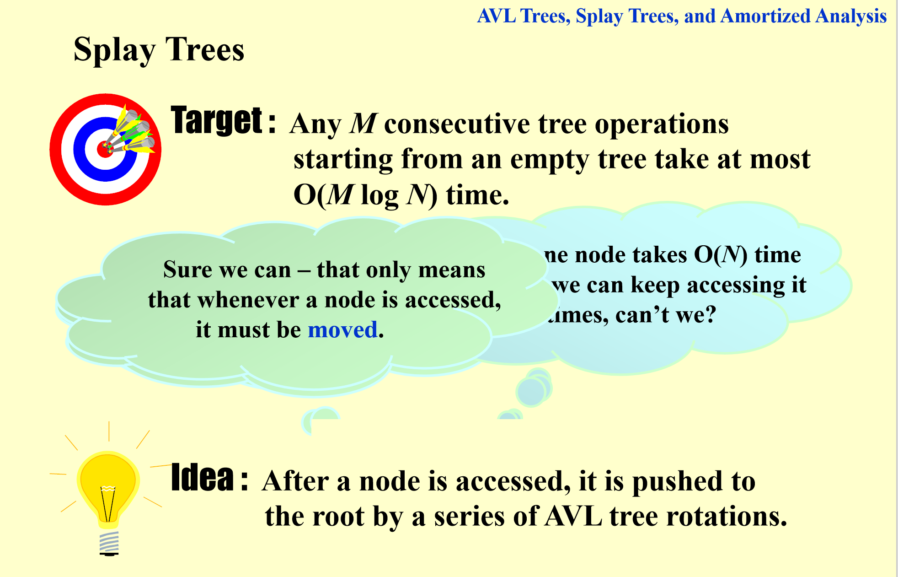

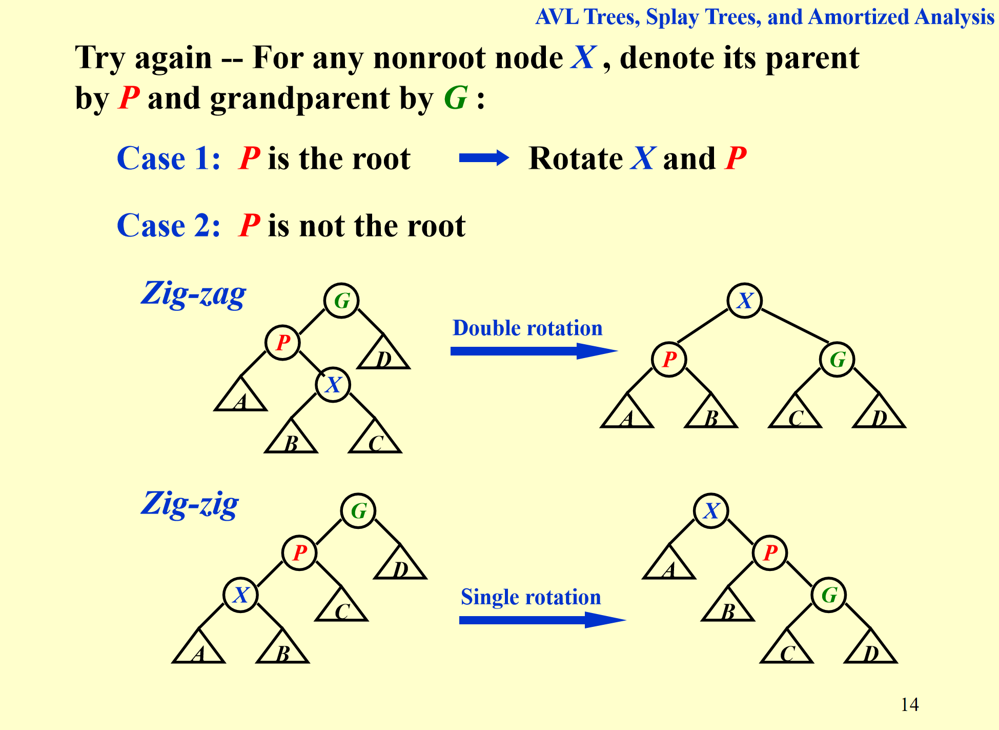

**看一个节点 X、其父亲 P，和其祖父 G：**

zig-zig：一条线

- X 是 P 的左子树，P 是 G 的左子树：两次单旋，先 P & G，再 X & P
- X 是 P 的右子树，P 是 G 的右子树：两次单旋

zig-zag：拐一下

!!! abstract "课下总结"

    按照 AVL 的方法旋转

- X 是 P 的右子树，P 是 G 的左子树：一次双旋，左旋 P，再右旋 G
- X 是 P 的左子树，P 是 G 的右子树：一次双旋，右旋 P，再左旋 G

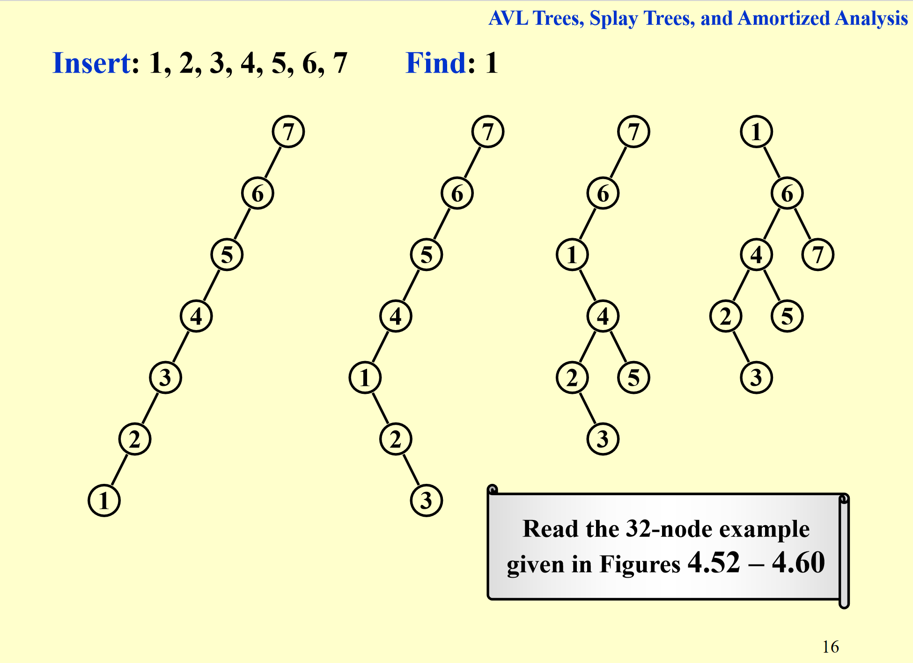

!!! abstract "课下总结"

    通过几次旋转（zig-zig / zig-zag）把被查询的 X 旋转到根节点

### 删除

!!! abstract "课下总结"

    保证删除后树依然是 BST

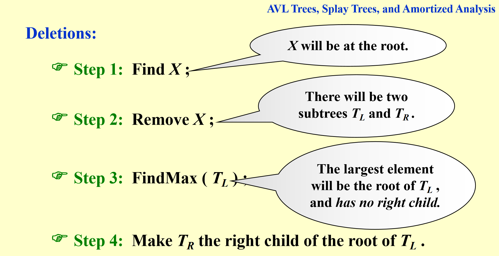

### Spray Tree & AVL Tree 对比

|               | AVL Tree               | Spray Tree                      |
| ------------- | ---------------------- | ------------------------------- |
| 优点        |                  | 树高低                  |
| 缺点        | 每次都旋转           | 多一个push to root                          |

|               | AVL Tree               | Spray Tree                      |
| ------------- | ---------------------- | ------------------------------- |
| 平衡性        | 严格平衡               | 松散平衡                        |
| 旋转次数      | 每次插入/删除可能旋转   | 不是每次都要| 每次访问可能旋转多次            |
| 单次操作时间  | $O(\log n)$           | 不能保证                     |
| 多次操作时间 | $O(M \log n)$          | $O(M \log n)$                   |


## Amortized Analysis

概念：摊销分析是一种通过考虑一系列操作的总成本来平摊单个操作的成本，从而得出更精确的时间复杂度的方法。

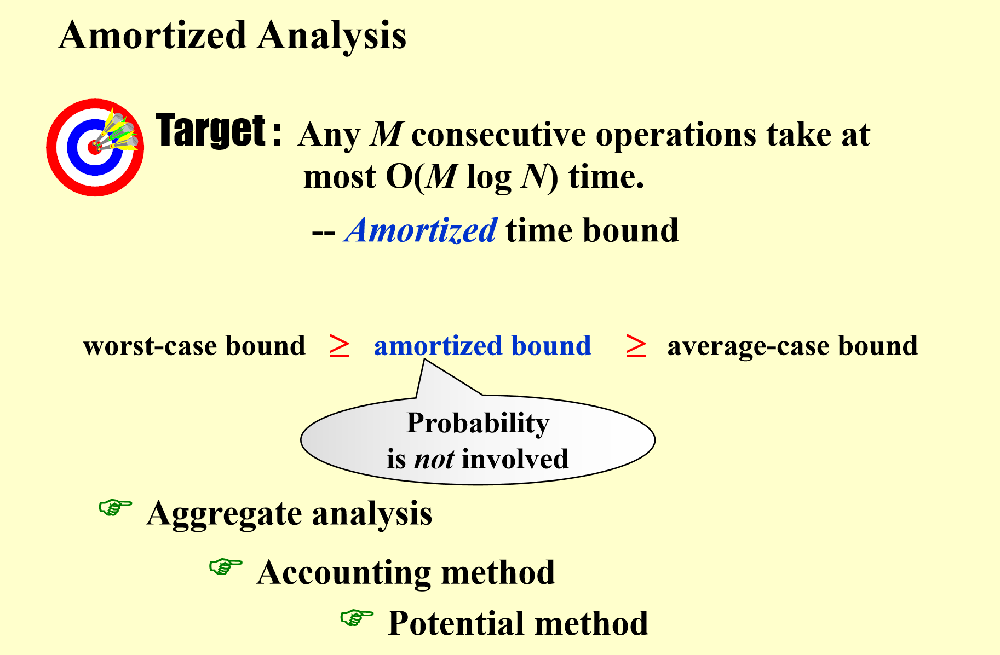


思想：$n$ 个操作花时间为 $T(n)$，In the worse case, amortised cose is $T(n) / n$

Example: on an initially 

!!! success ""

    We can pop each object from the stack at most once for each time we have pushed it onto the stack


### Accouting Method

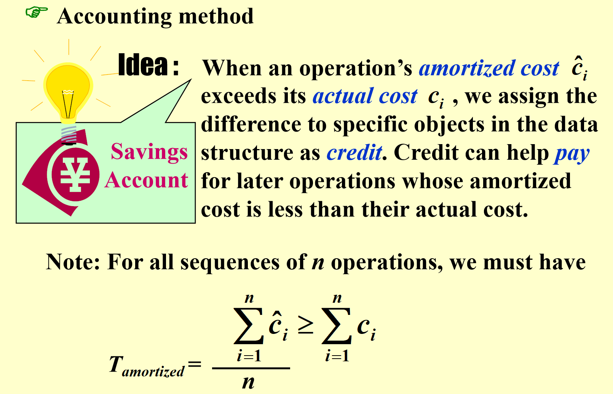

计算方法：将所有时间加起来，除以 n

以 multipop 举例，只有 push 才能 pop，push 时存一个 1 的 credit

### Potential method 势能法

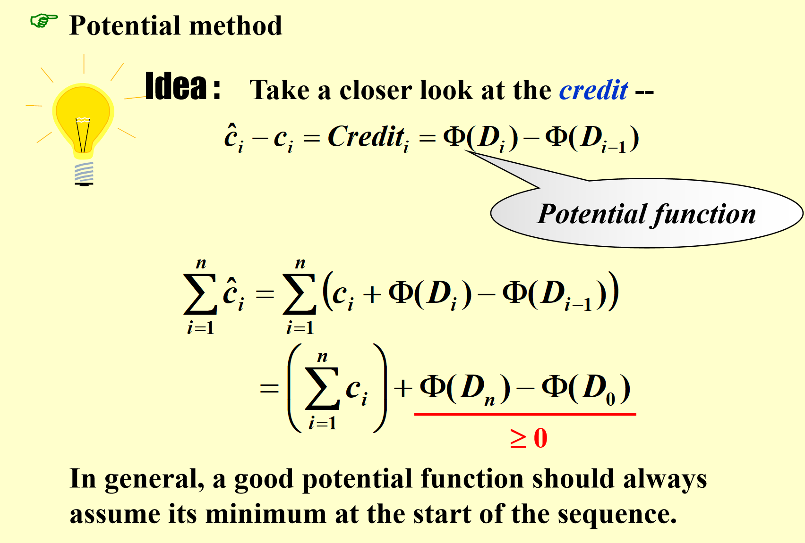

最关键的是 $D_i$ $D_i$ 的定义

用 Potential method 可以计算 accounting method 的 credit，继而算 amortized time

举例：Splay Tree

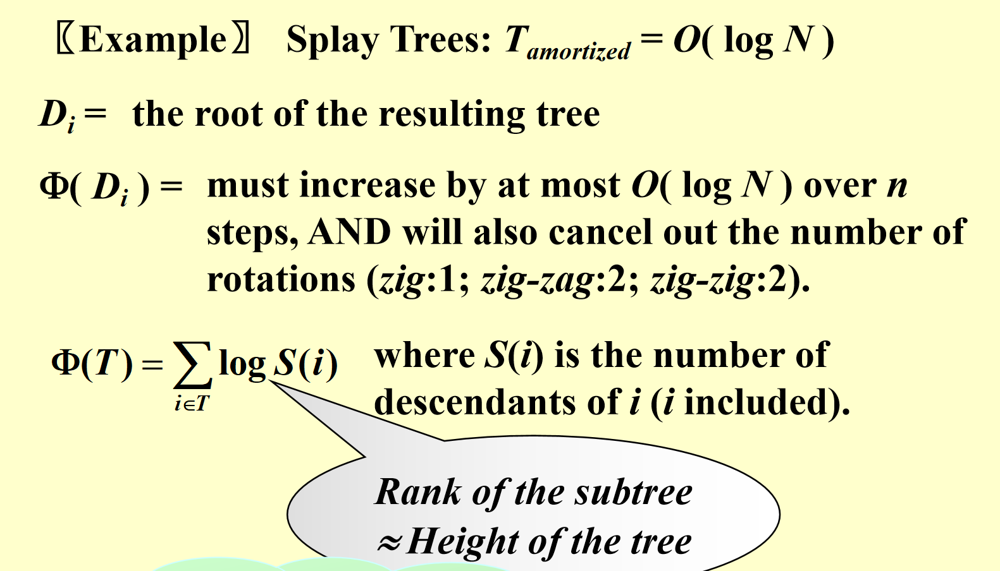

首先要选取势能函数：每次旋转操作后，发生变化的只有 X / P / G 的子树的节点数，其他node的子树的节点数不变；另外，由局部性原理：rank 只与局部有关（X / P / G），使得 rank 的计算简单于 树高 height。

!!! info ""

    rank(node) = log(size of subtree) 约等于 Height of subtree

    rank(X) = log|size(X)| 只依赖于：
    - X 的子树大小
    - 在旋转时，只有 X、P、G 三个节点的 rank 会变化
    - 其他节点的 rank 保持不变

!!! quote ""

    Lemma: if a + b < c, then log(a) + log(b) < 2log(c) - 2


通过上面引理，可以放缩，进而将其都放缩成3倍的，且每次操作上一次减的项和下一次加的项可以裂项相消，进而就剩下 log(n) 级别的项（根节点的 rank，basically height of the tree）

