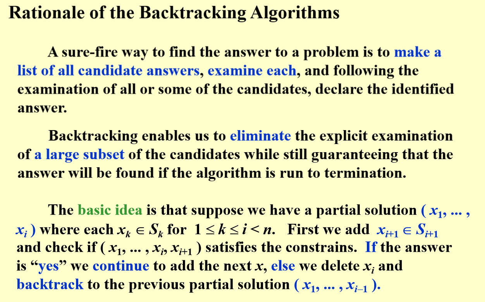
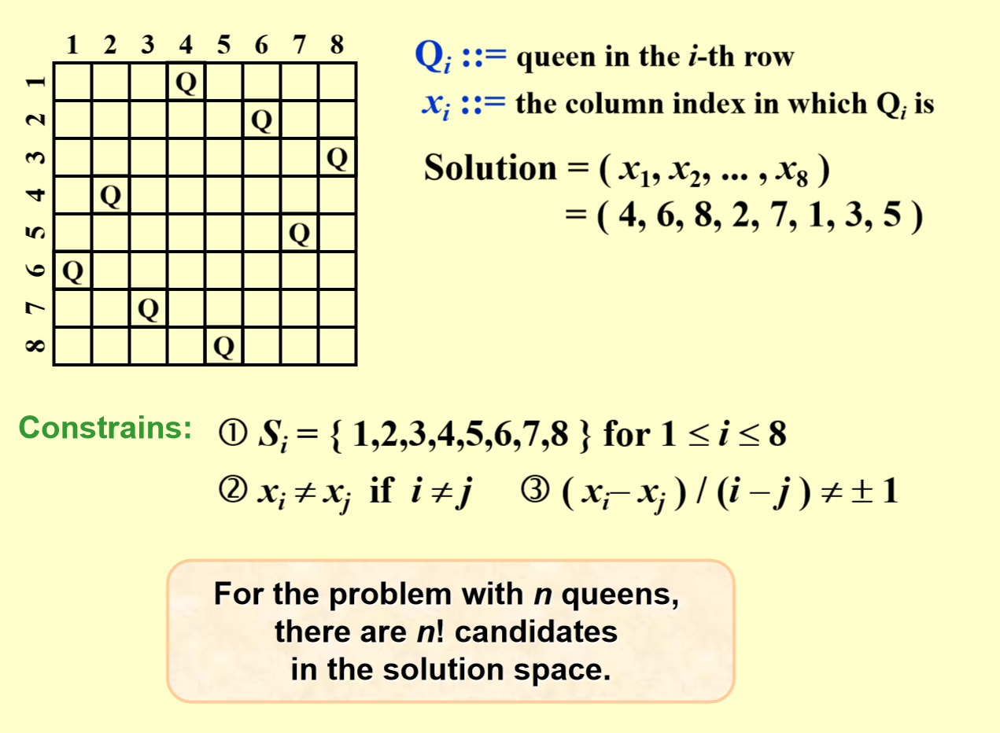
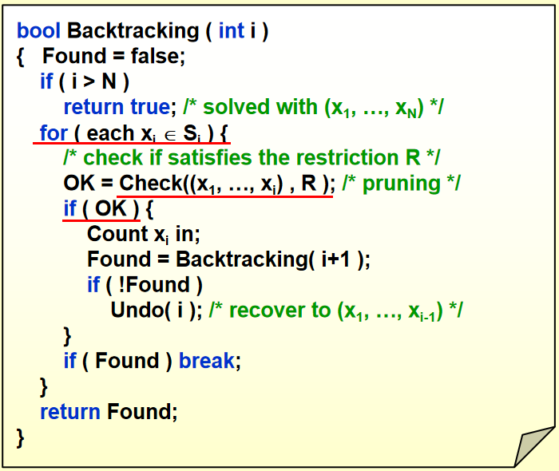
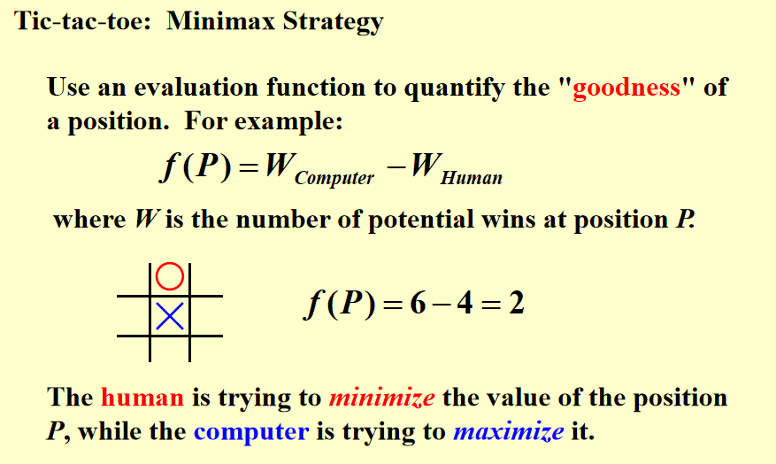
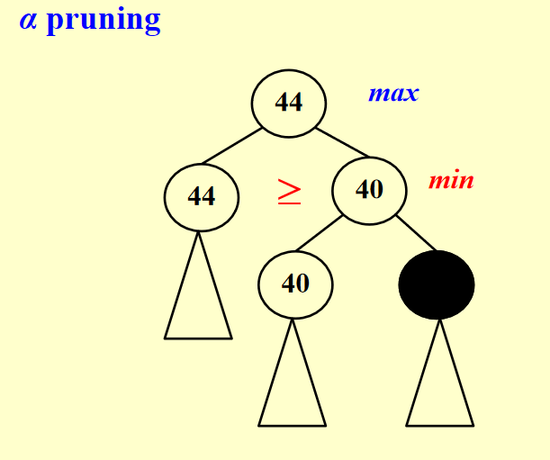
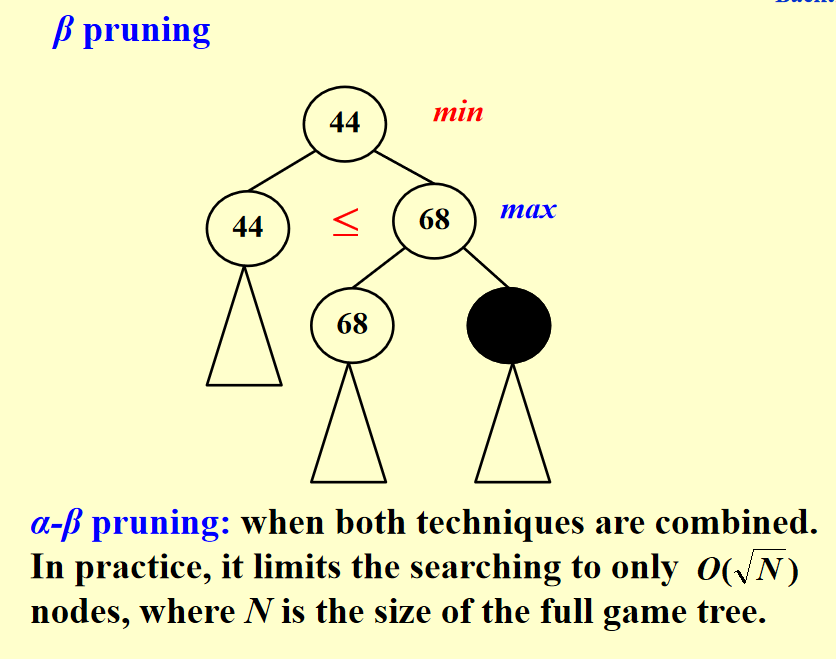

回溯法

这节课开始讲算法，之前都是数据结构

回溯法：在枚举的基础上剪枝，遇见不符合条件的直接干掉不继续看这个方案的后面的情况

**很多问题的解都可以抽象成一个有序系列，很多问题的解法都能用树表示，用树表示之后遍历，DFS / BFS，其中 DFS 出现频率高。**

举例：一个树，有圆圈有方块，1 找一条只有圆圈的路径，2 找一条最短的只有圆圈路径

- 1：深度优先，遇到方块就停

## 八皇后问题

game tree

后序遍历：看到儿子之后有没有可行解，如果没有的话就要跳回父节点，所以是后序遍历。如果发现子嗣不符合，则这个边都减掉，他的儿子们就不用考虑了

事实上做题的时候不会真正生成一棵树，那个树的结构只是逻辑结构，手中无树，心中有树

答案序列：第 i 个元素代表在第 i 行，其值代表在第几列

## 加油站问题

利用当前剩下的最大距离，看他是那两个加油站之间的距离而枚举下一个，检查新的可能的节点和也有其他节点的举例是否在给定的距离里面

回溯法代码模版：

回溯法的难点：剪枝的方法，有些时候得提前预测

## 抓兔子问题

有一个有向图，每个节点有或者没有兔子，要求最多走 k 步回到出发点（给定），路上至少抓到 M 只兔子。

game tree: 路径，要求 root 和 leaf 都是出发点，但是这样只有 DFS 到 leaf 才能知道是否剪枝，所以给出新的剪枝方法

剪枝方法：

1. 先抛弃一些限制条件：抛弃兔子的条件，只看能不能回去。即每次看点前到达的节点，记录当前走了 $k'$ 步，用 dikistra 或者其他算法算出每个节点到出发点的最短路，如果最短路的长度 > k - k'，则肯定失败，可以剪枝

2. 考虑极端情况：如果还没走的几步每次都能抓到兔子，设现在抓到了 $M'$ 只兔子，走了 $k'$ 步，如果 $M - M' > k - k'$，则肯定失败，可以剪枝

上面比较好，剪枝过程中如果在上面的节点剪掉的话可以排除好多。

所以可以先枚举值域范围小的情况

## 木棍问题

拼接之后的大木棍的个数是什么？

方法：遍历一遍，从 N（小木棍数）到1，因为回溯法的时间复杂度本身很高（幂 $2^n$），再乘 N 不影响

剪枝方法：

1. 检查放完之后剩下的木棍里面最长的一个，如果放不进去了就减掉
2. 遍历大木棍数量，不是总长度的因子的减掉
3. ……

加速方法：

先放长的小木条，因为长的是容易被剪枝的，是值域范围小的

## 围棋问题 - Minimax Strategy

估价函数 evaluation function，评估在当前情况下对计算机 / 人的有利情况，即函数返回值（分数）越高，对计算机越有利，分数越低对人越有利。

事实上估价函数可以很复杂，例如alpha go 就是在这训练了一个神经网络。这里我们取在当前情况下，只让一方（A）走另一方（B）不走，A走赢的可能性的数量 - B 走赢的可能性的数量 = 分数，这里 A 是计算机，B是人，那么分数越高对计算机越有利

### 剪枝方法

minimax 的策略选择：给定搜索深度从这个深度在 game tree 里面回溯，每次选择的主体都是人和计算机中的一个，交替进行，每次都由人、计算机选出对自己最有利的一个分支，再从这个分支往上走（在里面选一个的过程就是剪枝）。

但是人其实不一定会选到最佳的（整个过程都是计算机在模拟人怎么走），所以 alpha go 在这里又有一个神经网络。

方法2：

$\alpha \beta$ 剪枝

## 华容道问题

### 方法

game tree 的每个节点都是一个状态，分支按照空格和哪个交换

### 剪枝

记录当前得到的解的步数，由于要找最优解（步数最小），那么如果在另一个解没走完的时候，后面的步数的极限情况都比目前已有的解的步数多，就可以提前剪枝了。

后面步数的极限情况计算方法：

丢弃其他数字的影响，只看一个数字看它走到目标位置要走的最少步数，也就是，边界步数（因为考虑其他影响的话肯定至少大于等于这个步数）如果这个最小步数都比剩下的步数多，则剪枝

