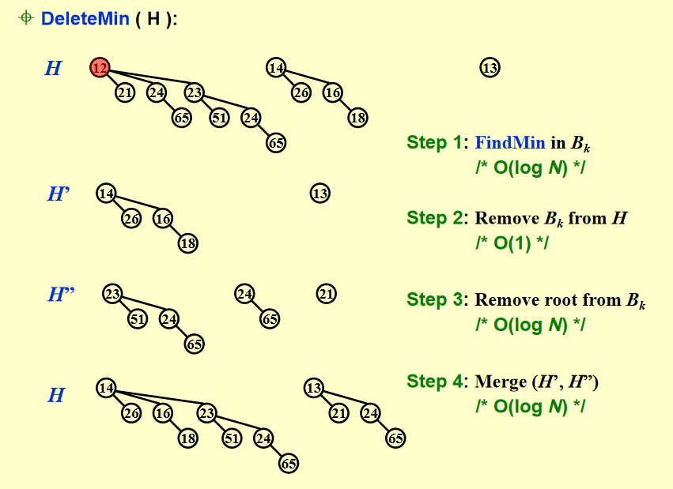
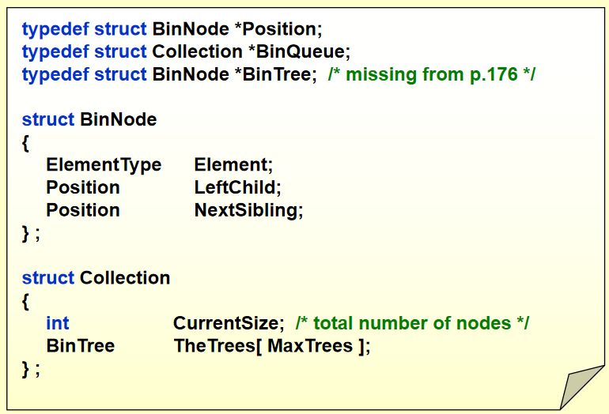
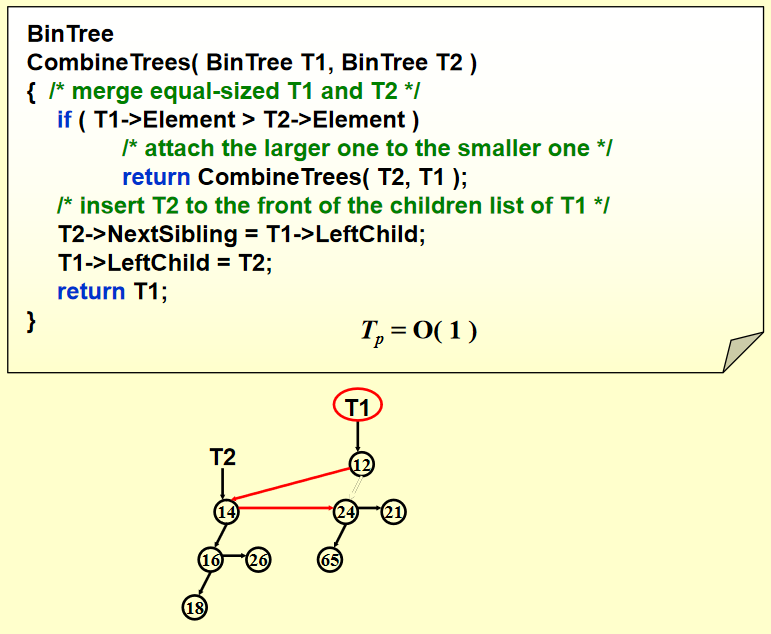

## 引入

本质：优先级队列

队列：先进先出

优先级队列：按照自定义的偏序关系按顺序 pop 元素

优先级队列

- 插入
- 查询 / 删除 最小元素

最常见的优先级队列：堆

## 性质和概念

本质是一群堆，即森林，每一个堆都是一个 binominal tree 二项树

对于高度为 k 的二项树的结构唯一：由两棵高度为 k - 1 的二项树合并而成。合并方法：直接合并，将一个的 root 连到另一个的 root 上面

- $B_k$ 表示高度为 k 的二项树

- $B_0$ 是一个节点，$B_1$ 是将两个节点中小的作为根合并

二项队列：很多二项树，其中二项树不重复，且按照高度排好序了

例子：一个有 k 个元素的二项队列的结构是什么？

将 k 变成二进制，得到的就是每个的数量，因为实际上就是将 k 分解为2的幂次加和，即二进制

## 操作

### FindMin

方案1：遍历所有二项树的根，对 N 个元素的二项队列，里面有 $O(\log N)$ 个二项树，所以 时间复杂度 $O(\log N)$，但是简单的堆最小值就是根 时间复杂度 $O(!)$

方案2：remember 最小值，每次插入的时候更新，这样就是 $O(1)$

### Merge

就是二进制加法

- 不进位就是直接加进来
- 进位就是合并

当两个都有某一个一样结构的二项树，则合并，因为不能出现结构一样的两个

时间复杂度：每次单位操作是 $O(1)$ ，有 $\log N$ 次操作，那么 $O(\log N)$

一般算法要求有确定性，比如说有三个 $B_2$，合并哪两个，只要 make sense 即可，比如说将原始的两个合并，或者将外面的别的俩合并（一般合并是不开 H3，直接覆写 H1，这里的意思是合并 H2 里面的那个和进位产生的那个）

### Insert

插入是一种特殊的合并，即每次合并 N = 1 大小的结构（结点）

插入 N 个结点时间复杂度是 $O(N)$，均摊到每次是 $O(1)$

### DeleteMin

先拿出，再删掉最小值，再合并两组

!!! info "step3 时间复杂度分析"

    做法：将那个根的所有子树拿出来，即遍历所有子树，即新开一个数组，在里面写上所有根

    分析：高度为 k 的二项树的根的儿子数为 k，则是 $O(K)$，k 最大是 $\log N$，即只有一棵树

## Implementation

外面维护一个数组，每个 index 指向那个高度的二项树的根节点

对于二项树：用左儿子右兄弟 left-child-next-sibling 设计结点的结构体

对于二项树，要排序，对于二项树的每个节点，它的儿子们也要排序，按照规模从大到小排

!!! info "儿子们按照规模从大到小排原因"

    合并时候被合并进来的那个肯定在所有儿子里面是最大的，如果儿子们从小到大排，还得遍历所有儿子

    如果从大到小排，只要 next_sibling = left_child, left_child = root_of _being_merged

### 合并

合并二项树：

合并二项队列：

carry：进位

switch-case: 利用二进制将其变成 0 / 1，讨论多个元素的存在关系

### 删除最小元素

## 时间复杂度均摊分析

结论：

- 均摊代价 $O(1)$
- worst case bound $O(\log N)$

!!! success "分析方法"

    先分析实际开销

    先从空的开始画几项

###　聚合法

step：将最后的连在数组里面，每次都要1次

link：合并操作

- 合并每两次出现一次，条件是有 B0
- link = 1，用二进制加法来看，只有末尾是 01 才只合并一次，即每四次出现一次，N 次操作出现 $N / 4$ times
- link = 2，用二进制加法来看，只有末尾是 011 才只合并一次，即每八次出现一次,N 次操作出现 $N / 8$ times

### 势能法

发现树的数量忽高忽低，每次合并操作使得树的数量减少，即为未来铺路

定义：势能函数是二项树的数量

均摊代价 = 实际代价 + 后一次势能 - 前一次势能

实际代价 = 1 + link数量

每次合并都减少一棵树，最后再加一棵；k 次 link，树的增量是 $1 - k$

那么均摊代价是 $1 + k + 1 - k = 2$

N 次操作，2N，$O(N)$

