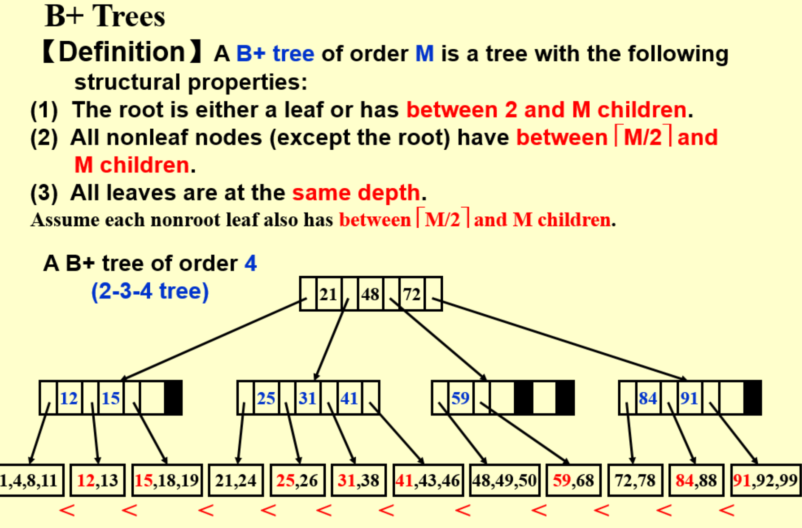
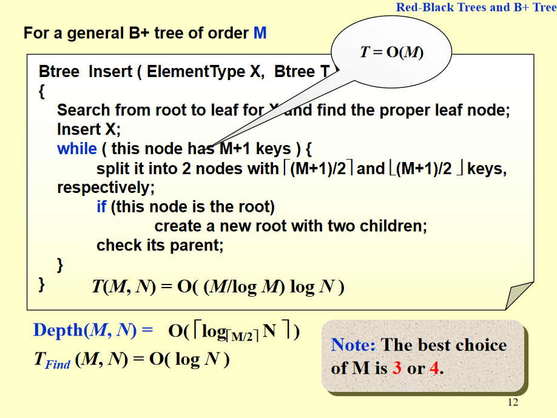

## B+ 树

| 节点类型            | 关键字数范围（keys）                             | 子节点数范围（pointers）                   | 说明                         |
| --------------- | ---------------------------------------- | ---------------------------------- | -------------------------- |
| **根节点（非叶）**     | $[1, m-1]$                             | $[2, m]$                          | 根节点至少要能分出两个子树（除非整棵树只有一个节点） |
| **根节点（叶）**      | $[1, m-1]$                              | 无（只含数据指针）                          | 当整棵树只有一个节点时，根节点也是叶节点       |
| **内部节点（非根、非叶）** | $[\lceil \tfrac{m}{2} \rceil - 1, m-1]$ | $[\lceil \tfrac{m}{2} \rceil, m]$ | 每个内部节点的子节点数比关键字数多1         |
| **叶子节点**        | $[\lceil \tfrac{m}{2} \rceil, m]$ | 数据指针数 = 关键字数                       | 所有叶子位于同一层，并通过链表相连          |

- 数据都存在最底层
- 上一层的第 n 个数是 他的儿子们中第 n + 1 个里面的最小值

插入时候：拆分 + 向上报告

插入伪代码：

- 每个节点里面的元素数量越少越好。最少是 $M / 2$，那所以总共 N 个结点，每个节点里面 $M / 2$ 个数字，即这么多个儿子，于是高度知

时间复杂度：

- 每次操作：$\log M$：每次在一个层里面的一个node查找一个地方，实际上线性查找就行，但是分析时间复杂度要求每步理论最优，那就是二分：logM
- 最多迭代次数：高度，因为每次都是向上报告如果需要合并就合并。，就是 $\log_{[M/2]} N$，也就是 $\log_M N$
- 相乘，M 小，即 $\log N$

删除时候：合并 + 向上走
