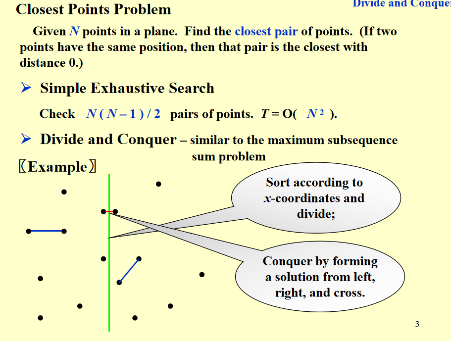
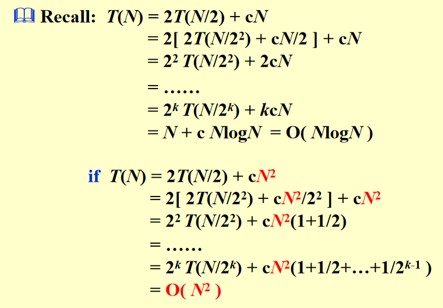
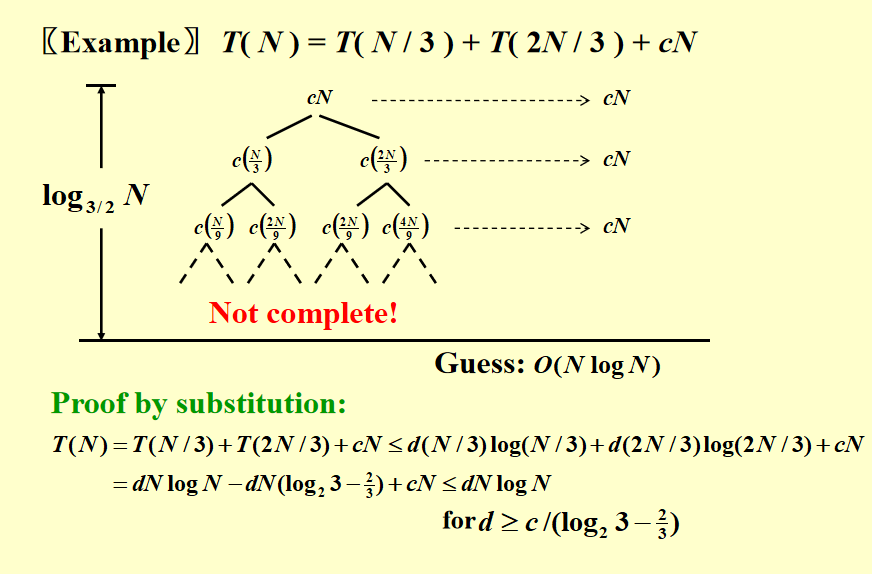
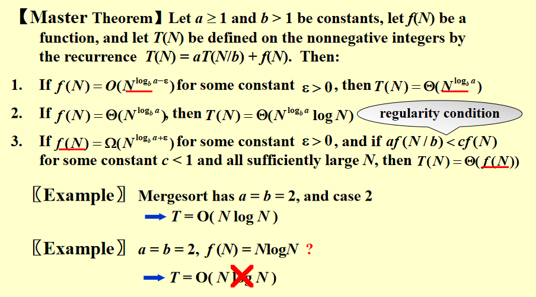
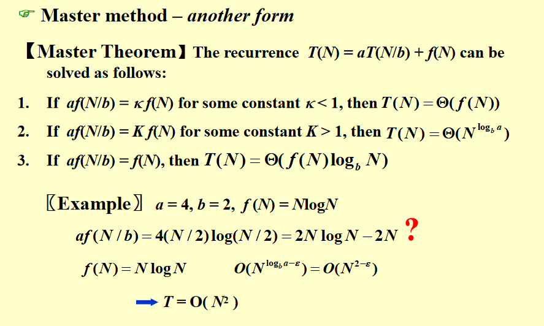
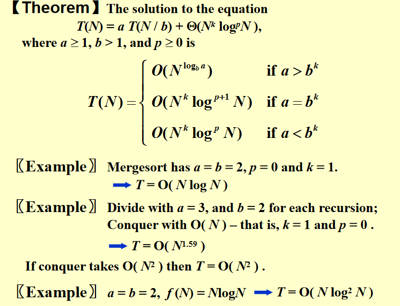

## 概念

递归地进行以下步骤：

- 先分开
- 再分别解
- 最后合并

时间开销为

$$T(N) = aT(N/b) + f(N) $$

$T(N)$ 是总时间开销

a 是分解出几个子问题，b 是规模放缩的倍数

$f(N)$ 是合并时候的时间开销

经典例子：最大子序列

找到和最大的连续子序列

暴力枚举：$O(N^2)$ 选定起点（N种），再在序列里面选一个终点（N的一次式种），乘起来，注意起点不变的时候后延终点只需要将前面的结果加上后面一个数即可

!!! success "分治法方法"

    不管三七二十一先砍一刀变一半（ N/2 规模）

    再想清楚求出子问题的解之后怎样合并就ok了

    递归，先不要想后面的子问题怎样解决，直接交给未来的自己

对于最大子序列：

先砍一半，分别看左右两边的最大子序列

再看横跨两边的：从切开的地方分别往左往右，分别找到左边和右边最大的序列和，加起来

上面得到的三个结果比较

经典问题2：根据树的两种遍历序列写第三种

根据树的根进行分治

经典问题3：归并排序

左右分别扫描，小的排进去，移动指针，再比较

分治法与并行计算：

- 分治法的主要目标是：通过“分解 + 递归 + 合并”来减少重复计算、提高算法效率。它是一种算法优化思想。

- 并行计算的主要目标是：让更多任务同时执行，从而更快完成计算。它是一种执行方式（性能层面），不关心算法是否有冗余计算。

## 最近距离点问题（二维最大子序列）

先分一半，看左右两边

横跨分界线的：用剪枝

当一个点到分界线的距离大于左右两边的最小值（$\delta$），就可以把它剪掉了，也就是只枚举在分界线左右两侧的 $\delta$ 距离内的点。再剪枝，对于一点，只枚举在这个点的横纵距离在 $\delta$ 内的就行

在一个横纵距离都是 $\delta$ 的框内，最多有四个点，因为如果多了的话

## 时间复杂度

假设：

- N/b 是整数
- 当N 很小的时候（1），是常数时间复杂度

### 代入法（瞎猜法）

先猜一个，再证明，一般用数学归纳法

### 递归树法

用递归树法是猜出复杂度，还需要用数学归纳法证明

但是事实上对于第二种，树是不平衡的，左边到 1 的速度比右边快，右路径最长

### 主方法（求偶法）

核心是比较 根和叶子的工作量大小，注意两点

- $f(N)$ 就是根节点的工作量
- $N^{\log _b a}$ 就是叶子节点的数量，每个叶子是 $O(1)$
- 与中间的非根非叶节点们无关

$$a^{\log _b N} = N^{\log _b a}  $$

这个是比较合并和划分的差异

这个是比较子问题的个数和规模

但是事实上主方法不能涵盖所有情况

证明：

