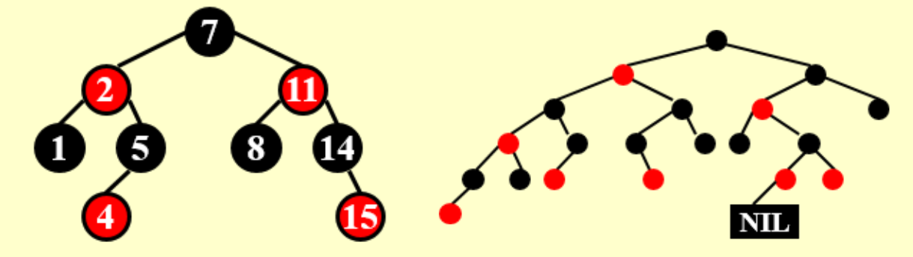
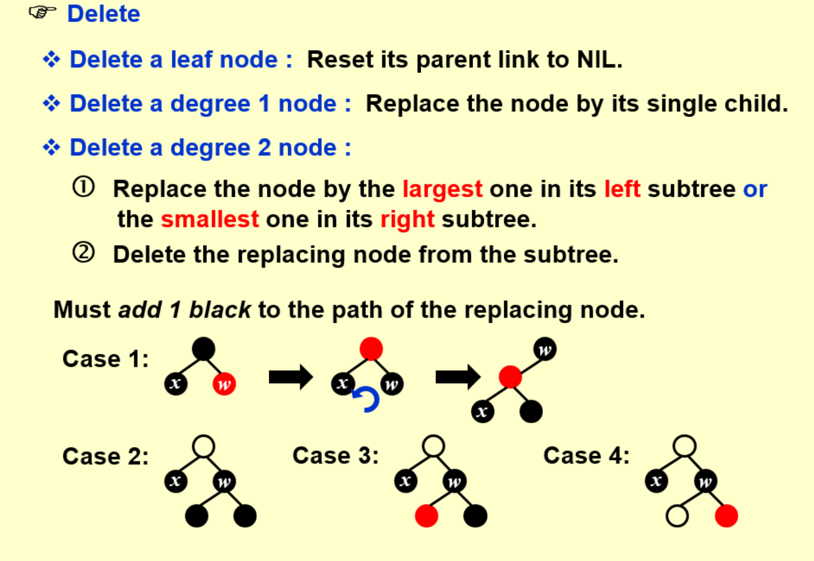
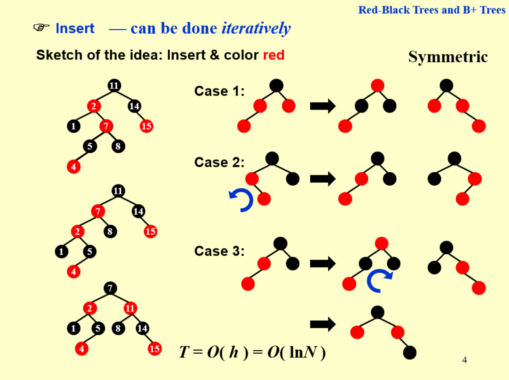
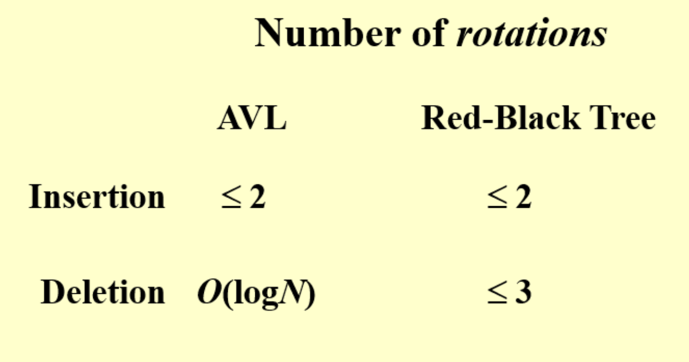

!!! warning ""

    每一年期末考试最后一天肯定是 DP

!!! success "动态规划通用技巧"

    设计状态的方法：

    1. 遇事不决先写 $F[N]$，其中 N 是问题规模
    2. 看看这个 $F[N]$ 能不能唯一表达子问题
    3. 如果不行就调整，加维度，直到可以唯一表达
    4. 如果发现某个维度在右边一直是恒定的，那其实可以删掉这个维度
    
    写状态转移方程：
    
    1. 想想要完成题面要求要做的最后一步 或者 第一步 或者 前一步分别是什么
    2. 其实就很像高中排列组合里面，要达到这种情况，前一步是什么，从前一步怎样能达到这一步

    最后检查：

    - 重叠子问题：看一下就ok，比较显然
    - 最优子结构：假设原问题依赖子问题次优解，那么检查，如果替换其为子问题的最优解，如果此时能替换，且替换之后原问题的解不会变得更差，就ok

    不成立的可能的情况：

    - 两个子问题，一个满足最优解且满足题目条件，另一个没法满足了

    解决方案：

    - 如果发现原问题的最优解有可能依赖子问题的最优解 或者 次优解，那么就扩展一个维度，是一个二维的，用于存储最优解和次优解，要哪个就拿哪个

## 概念

状态转移方程：数学角度就是一个递归方程，不同的子问题之间是怎样转移的

状态：原来唯一表达一个子问题

前提：本质是存储子问题是有意义的

- 最优子结构：父问题最优的前提是子问题最优，因为每次存储的时候都是存子问题的最优解，但是如果父问题基于的不是子问题最优的那种情况，则不行
- 重叠子问题：每次父问题调用同一个子问题的时候其对应的解是一样的

## 举例

### 斐波那契

普通递归：相当于分治法，但是很多数字重复计算了，可以把他们存下来

存储方法：

- 存一个数组，比较直观的
- 只存前两个数：因为只需要这两个数，一个循环就解决了，不用递归

动态规划的核心：存储子问题的解，但是条件是每次调用这个子问题的时候这个子问题依赖的解是一样的

### 多矩阵乘法顺序

#### 计算方案数

计算顺序不同计算开销完全不同

等于矩阵乘法：

- 选择先后计算顺序的本质就是给矩阵画括号
- 最后一步肯定是画在最左和最右
- 看上一步，就是在里面随意划分一下，左右两边独立的，两边的方案数相乘就是这种情况的总方案数

状态转移方程：

$$ F(N) = \sum _i F(i)* F(N - i)$$

结果是 卡特兰数，很大，不能枚举

#### 计算最小开销

首先设计状态：要唯一表示每个子问题。

如果还用刚刚的 $F(N)$ 肯定不行因为前面和后面的矩阵的大小不一样计算开销也不一样。

可以加一个二维的： $F[N][i]$，表示从 i 开始数 N 个矩阵做乘法的开销

同前，对于 $F[N][i]$ 的计算，考虑他的前一次的划分，假设在 被分成 $k$ & $N - k$ 两组，那么总开销等于：前一部分的开销 + 后一部分的开销 + 合并的开销（也就是前后都乘完之后得到的两个矩阵再乘，也就是第一个矩阵的行 * 第 k 个矩阵的列 * 最后一个矩阵的列）

那么总开销 = `for k in range(1, N): min F[N][i]`

其中：

$$F[N][i] = \min\{ F[k][i] + F[N - k][i + k] + R_i * C_{i + k - 1} * C_{i  + N - 1}\}$$

!!! success "规律"

    一般都按照问题规模定义状态

### Optimal Binary Search Tree

树，先找出 root

$$F[N][i] = \min \{ F[k][i] + F[N - k - i][i + k + 1] + 1\}$$

每一步记录 k，即知道每个树的根，就可以构建树

### All-pairs Shortest path

找到有向图中每个点对之间的最短路径

Floyd 算法 —— 本质是 DP

状态转移，可以发现，原本从 i 到 j，中间经过另外一个结点，算一个状态转移，选出经过另外节点中长度最小的那个。

先找状态，显然，从 i 到 j **的最短路径**，可以定义为 $F[i][j]$。

给出，N 指的是以前 N 个节点为跳板，那么，$F[N][i][j]$ 的意思是，以前 N 个节点为跳板从 i 到 j 的路径长。

开始写状态转移方程：

先画个图找一找，首先是起点 i 和终点 j，中间如果1个结点，只有一种走法，中间两个，就可以只经过1，只经过2，或者先经过1再经过2（换个角度就是经过2和不经过2）。中间如果有三个节点，那么可以经过3或者不经过3。

于是，

$$F[N][i][j] = \min \{F[N - 1][i][N] + F[N - 1][N][j], F[N-1][i][j]\}$$

注意这里面 F 指的就是最短路径。

### 生产线问题

抽象出来，就是固定拓扑排序的图，每个节点都只能有两个入度，一个出度，每条边都有一个权重，

比较简单，首先上来 $F[N]$，代表做到第 N 个零件时候的开销。

但是发现这个不能唯一表示一种状态，即在第一条 / 第二条生产线上，所以加一个 binary 的值，表示在第一条 / 第二条生产线上生产的第 N 个零件。

状态转移方程：

发现到第 N 个状态只能有两种选择：从 $F[N - 1][1]$ 或者 $F[N - 1][0]$。

那么，很简单，

$$ F[N][i] = F[N - 1][1] + F[N - 1][0], 其中 i \in \{0, 1\}$$

