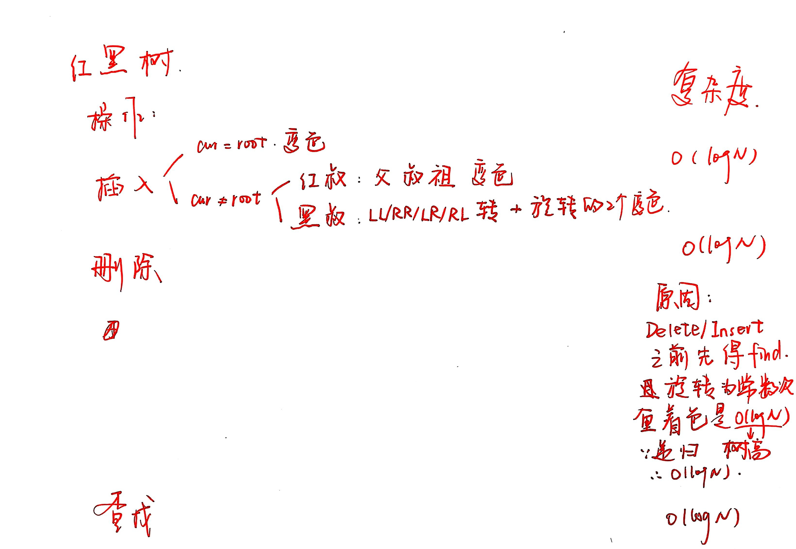

## Data Structure

[时间复杂度详解](https://chatgpt.com/c/69107885-8d20-832e-bc2a-23ba5805abca)

### AVL Tree

时间复杂度：

| 操作         | 平均复杂度         | 最坏复杂度         | 说明                         |
| ---------- | ------------- | ------------- | -------------------------- |
| 查找（Search） | \( O(\log n) \) | \( O(\log n) \) | 和普通 BST 一样，沿树高查找           |
| 插入（Insert） | \( O(\log n) \) | \( O(\log n) \) | 查找插入点 + 回溯更新平衡因子 + 最多旋转常数次 |
| 删除（Delete） | \( O(\log n) \) | \( O(\log n) \) | 查找删除节点 + 回溯调整 + 最多旋转常数次    |

AVL 树是一种 BST，插入删除都遵循 BST 的规则

BF（Balance Factor，平衡因子）是左子树高度减去右子树高度

### Splay Tree

Splay Tree 也是 BST
   

### Red-Black Tree

时间复杂度：

| 操作                           | 平均复杂度         | 最坏复杂度         | 摊销复杂度         | 说明                   |
| ---------------------------- | ------------- | ------------- | ------------- | -------------------- |
| 查找（Search）                   | \( O(\log n) \) | \( O(\log n) \) | \( O(\log n) \) | 按 BST 性质沿树高查找        |
| 插入（Insert）                   | \( O(\log n) \) | \( O(\log n) \) | \( O(\log n) \) | 查找插入点 + 修复平衡（≤2次旋转）  |
| 删除（Delete）                   | \( O(\log n) \) | \( O(\log n) \) | \( O(\log n) \) | 查找删除节点 + 修复平衡（≤3次旋转） |
| 最小值/最大值（Min/Max）             | \( O(\log n) \) | \( O(\log n) \) | \( O(\log n) \) | 走一条路径                |
| 前驱/后继（Predecessor/Successor） | \( O(\log n) \) | \( O(\log n) \) | \( O(\log n) \) | 类似查找                 |

红黑树也是 BST

红黑树的插入：

注意：

1. 别忘 NIL，这也是黑色节点，有可能作为叔叔
2. 只有红黑树性质被破坏才调整

红黑树的删除：

### B Plus Tree

!!! warning ""

    ZJU 版本B+树和正经B+树不一样，做题按照 ZJU 版本，叶子节点关键字范围：$⌈M/2⌉ ≤ keys ≤ M$

时间复杂度：

| 操作   | 最坏时间复杂度           | 摊还时间复杂度           | 主要原因         |
| ---- | ----------------- | ----------------- | ------------ |
| 查找   | \(O(\log_b n)\)     | \(O(\log_b n)\)     | 走树高层数        |
| 插入   | \(O(\log_b n)\)     | \(O(\log_b n)\)     | 分裂摊还常数       |
| 删除   | \(O(\log_b n)\)     | \(O(\log_b n)\)     | 合并摊还常数       |
| 范围查询 | \(O(\log_b n + k)\) | \(O(\log_b n + k)\) | 查找起点 + 顺链表扫描 |

节点结构：

| 节点类型 | 含义 | 关键字数量范围 | 子节点数量范围 |
|-----------|------|----------------|----------------|
| 根节点（仅一个叶子） | 整棵树只有一个节点 | 1 ≤ keys ≤ M−1 | 0 |
| 根节点（内部节点） | 有子节点的根 | 1 ≤ keys ≤ M−1 | 2 ≤ pointers ≤ M |
| 内部节点 | 中间层节点 | ⌈M/2⌉−1 ≤ keys ≤ M−1 | ⌈M/2⌉ ≤ pointers ≤ M |
| 叶子节点 | 存储实际数据 | **⌈M/2⌉ ≤ keys ≤ M** | 0（或一个指向下一个叶子的指针） |

查找的时间复杂度就是 $O(\log N)$，不管 M

### Leftist Heap

时间复杂度：

| 操作          | 通过 merge 实现        | 最坏复杂度 | 摊还复杂度    |
| ----------- | ------------------ | ----- | -------- |
| `merge`     | 基础操作               | \( O(n) \)  | \( O(log n) \) |
| `insert`    | merge(H, newNode)  | \( O(n) \)  | \( O(log n) \) |
| `deleteMin` | merge(left, right) | \( O(n) \)  | \( O(log n) \) |
| `findMin`   | 取根                 | \( O(1) \)  | \( O(1) \)     |

### Stew Heap

时间复杂度：

| 操作          | 最坏复杂度 | 摊还复杂度    | 说明                    |
| ----------- | ----- | -------- | --------------------- |
| `merge`     | \( O(n) \)  | \( O(log n) \) | 自调整保持平衡               |
| `insert`    | \( O(n) \)  | \( O(log n) \) | 相当于 merge(H, newNode) |
| `deleteMin` | \( O(n) \)  | \( O(log n) \) | 合并左右子堆                |
| `findMin`   | \( O(1) \)  | \( O(1) \)     | 取根节点                  |

斜堆的插入：

- 比较右路径上节点大小
- 合并时候，写出按顺序该出现的那个节点，二话不说先把其 **左子树移到右边**

### Inverted File

| | Relevant | Irrelevant |
| :--- | :---: | :---: |
| **Retrieved** | RR | IR |
| **Not Retrieved**| RN | IN |

Precision P = RR / (RR + IR)

Recall R = RR / (RR + RN)

记忆：

- recall：召回率 / 查全率，在所有应该被找回的结果中，我成功找回来了多少？

- precision：精确率 / 准确率，在所有我找回来的结果中，有多少是真正对的？

### Binomial Heap

| 操作              | 描述     | 最坏复杂度        | 摊还复杂度        |
| --------------- | ------ | ------------ | ------------ |
| `findMin()`     | 找最小根   | \( O(\log n) \) | \( O(\log n) \) |
| `insert(x)`     | 插入元素   | \( O(\log n) \) | \( O(1) \)     |
| `merge(H1, H2)` | 合并两个堆  | \( O(\log n) \) | \( O(\log n) \) |
| `deleteMin()`   | 删除最小元素 | \( O(\log n) \) | \( O(\log n) \) |
| `decreaseKey()` | 降低键值   | \( O(\log n) \) | \( O(\log n) \) |
## Methods

### Master Theorem

| 情况         | 比较结果                      | 主导来源     | 结果                                  |
| ---------- | ------------------------- | -------- | ----------------------------------- |
| **Case 1** | \( f(N) \ll N^{\log_b a} \) | 递归层（叶子）  | \( T(N)=\Theta(N^{\log_b a}) \)       |
| **Case 2** | \( f(N) = N^{\log_b a} \)   | 平衡（每层相等） | \( T(N)=\Theta(N^{\log_b a}\log N) \) |
| **Case 3** | \( f(N) \gg N^{\log_b a} \) | 合并层（根）   | \( T(N)=\Theta(f(N)) \)               |

里面的 $N^{\log_ b a}$ 是叶子结点的数量，也是当 $af(N/b) = f(N)$ 时候的函数表达式（差一个常数）

### Amortized Analysis

## Algorithm

### Divide Conquer

先测试解空间小的，这样排除一个就可以有效剪枝
