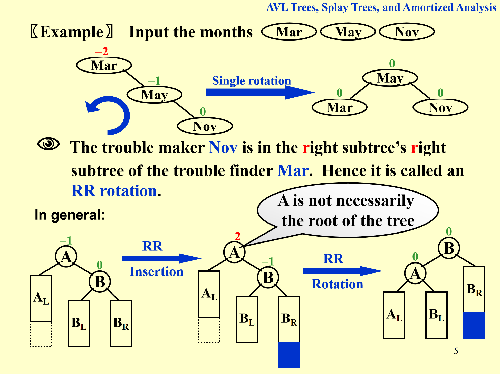

## Data Structure

### AVL Tree

AVL 树是一种 BST，插入删除都遵循 BST 的规则

### Splay Tree

Splay Tree 也是 BST
   

### Red-Black Tree

红黑树也是 BST

红黑树的插入：

注意：

1. 别忘 NIL，这也是黑色节点，有可能作为叔叔
2. 只有红黑树性质被破坏才调整

红黑树的删除：

### B Plus Tree

| 节点类型 | 含义 | 关键字数量范围 | 子节点数量范围 |
|-----------|------|----------------|----------------|
| 根节点（仅一个叶子） | 整棵树只有一个节点 | 1 ≤ keys ≤ M−1 | 0 |
| 根节点（内部节点） | 有子节点的根 | 1 ≤ keys ≤ M−1 | 2 ≤ pointers ≤ M |
| 内部节点 | 中间层节点 | ⌈M/2⌉−1 ≤ keys ≤ M−1 | ⌈M/2⌉ ≤ pointers ≤ M |
| 叶子节点 | 存储实际数据 | ⌈M/2⌉−1 ≤ keys ≤ M−1 | 0（或一个指向下一个叶子的指针） |

查找的时间复杂度就是 $O(\log N)$，不管 M

### Stew Heap

斜堆的插入：

- 比较右路径上节点大小
- 合并时候，写出按顺序该出现的那个节点，二话不说先把其 **左子树移到右边**

### Inverted File

| | Relevant | Irrelevant |
| :--- | :---: | :---: |
| **Retrieved** | RR | IR |
| **Not Retrieved**| RN | IN |

 

Precision P = RR / (RR + IR)

Recall R = RR / (RR + RN)

记忆：

- recall：召回率 / 查全率，在所有应该被找回的结果中，我成功找回来了多少？

- precision：精确率 / 准确率，在所有我找回来的结果中，有多少是真正对的？

## Methods

### Master Theorem

| 情况         | 比较结果                      | 主导来源     | 结果                                  |
| ---------- | ------------------------- | -------- | ----------------------------------- |
| **Case 1** | \( f(N) \ll N^{\log_b a} \) | 递归层（叶子）  | \( T(N)=\Theta(N^{\log_b a}) \)       |
| **Case 2** | \( f(N) = N^{\log_b a} \)   | 平衡（每层相等） | \( T(N)=\Theta(N^{\log_b a}\log N) \) |
| **Case 3** | \( f(N) \gg N^{\log_b a} \) | 合并层（根）   | \( T(N)=\Theta(f(N)) \)               |

里面的 $N^{\log_ b a}$ 是叶子结点的数量，也是当 $af(N/b) = f(N)$ 时候的函数表达式（差一个常数）

### Amortized Analysis

## Algorithm

### Divide Conquer

先测试解空间小的，这样排除一个就可以有效剪枝
