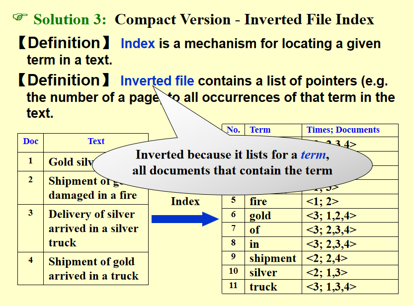
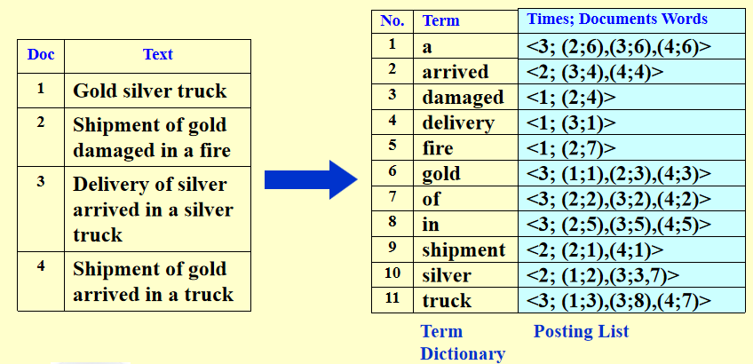
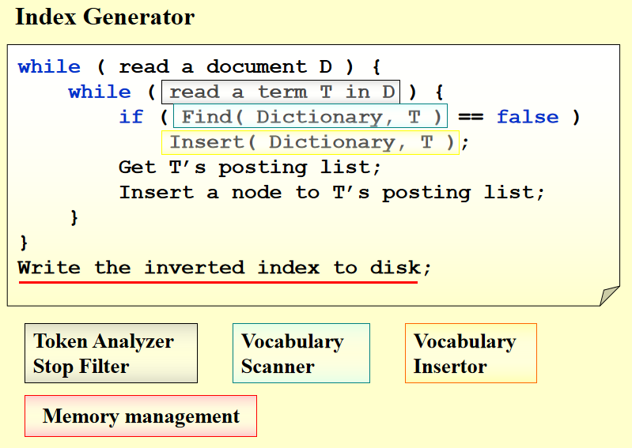
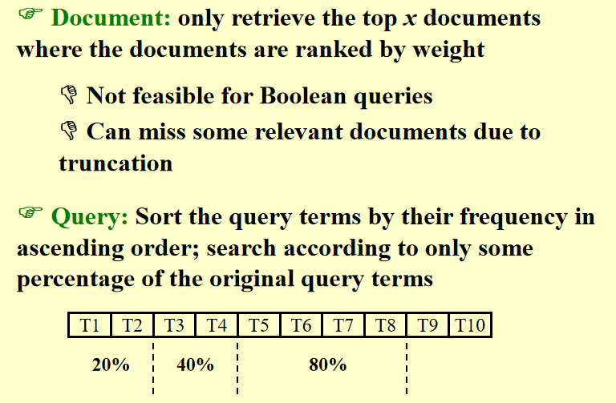
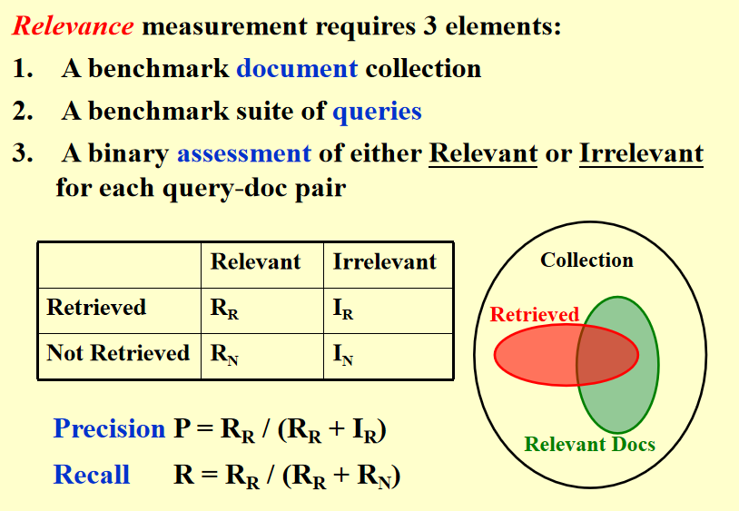

## 倒排索引

搜索引擎：

- 首先把所有数据爬取
- 建立文档和词汇对应的表格，再将所有词汇并集和文档的矩阵，词汇在文档中用1表示，矩阵很稀疏，可以用邻接表，也可以用倒排表

> 词带假设：词的顺序不被考虑，只看出现了哪些词

倒排表结构：

- 键：词
- 值：(出现次数，出现的文件和其位置)

记录位置可以做到高亮搜索词

查询同时出现多个词的文档要取交集，取交集：从出现数量少的词开始到出现数量多的

词频过高：扔掉

维护词表的伪代码：

词语预处理：

- 词干化
-停用词处理

处理词语的数据结构：

- Search tree: B- tree, B+ tree, Tries ...
- Hashing

### Distributed indexing

数据的存储：

- 小：放内存
- 中：放内存，当内存满了的时候移到硬盘
- 大：多台机器分布式存储
    - 方案1：按照词语顺序分开存：效率高但实际不用，但是如果有一台机器挂掉了就好多词汇查不到
    - 方案2：按照文档分开存：实际用，鲁棒性高，能查到即可

    

### Dynamic indexing

动态维护网站 index：

- 开两个 index，新加的在另一个里面，一段时间合并一次

### Compression 

存储文档的index的优化：把网站的index原来是存 index 的数字，后面会很大，我存前一个和后一个的差值

### Threshoding

Google 的 PageRank 算法

[知乎文](https://zhuanlan.zhihu.com/p/137561088)

根据每个指向他的超链接，记录一个PR，意思是引用一个网站的网站越厉害，那么被引用的网站厉害，优先推荐

优化 query：将出现频率高的词筛掉，因为出现频率高代表信息量少

返回 Top-k

搜索引擎认为关联与否，实际上关联与否

precision：返回的里面有多少是真正关联的，想让他变高可以少返回一些
recall：关联的里面有多少被搜索引擎返回了，想让他变高可以多返回一些

两个一般成反比例

