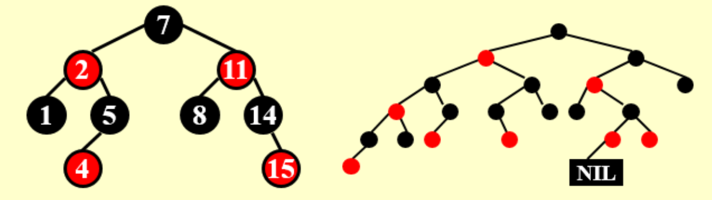

## 红黑树定义概念

定义：BST满足以下条件：

1. 每个节点有颜色（红 / 黑）
2. root is black
3. leaf(NIL) is black（这个叶子节点特指底下加的虚拟节点）：所有看到的叶节点都带两个黑色的 NULL（即 NIL）
4. If node is red, both its children is black.

    - meaning: 不能连着两个红节点，且，黑节点的儿子的情况没说

5. 从一个节点到叶子节点的所有路径中黑色节点的数量一样

!!! info ""

    性质3最重要：外部节点叫哨兵节点

    红黑树通过颜色保证树的平衡

黑高black-height（$bh$）：从任意节点开始（它不包括）到叶子结点（叶子都包含一个看不见的黑色NIL）的路径上黑色节点的数量

定理：

包含 N 个内部节点的红黑树的高度最多 $ 2 \ln{(N +1)}$

## 红黑树操作

插入和删除的核心都是 **叔叔和侄子的关系**

### Insert

因为是 BST，所以按照 BST 方法插入（插入的节点该在哪就在哪）；

因为性质5比较难满足，所以规定插入红节点。

与规则冲突，则：换色＋旋转

**局部旋转**

case3：做完旋转就ok
case2：变成case3
case1：要迭代

只看局部，局部改变之后上面还出问题，则不归这管了，到上面再改

### Delete

删掉黑色会比较复杂

**换颜色** + 旋转，使得要删的那个变成一个“多余的黑色”

练习：

