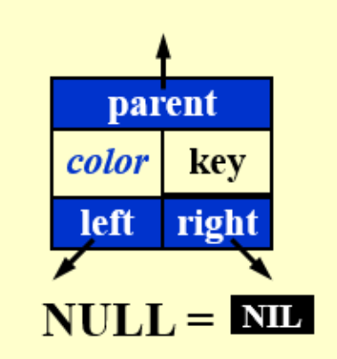
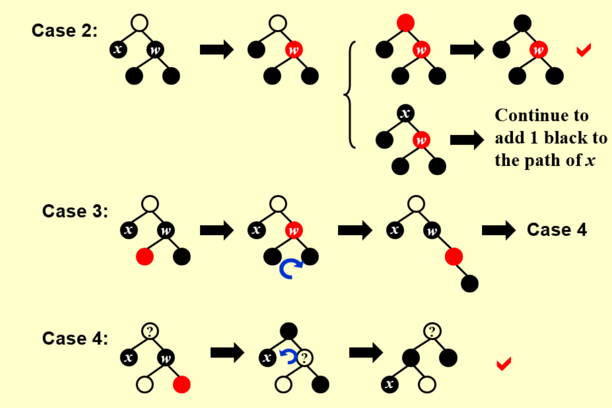
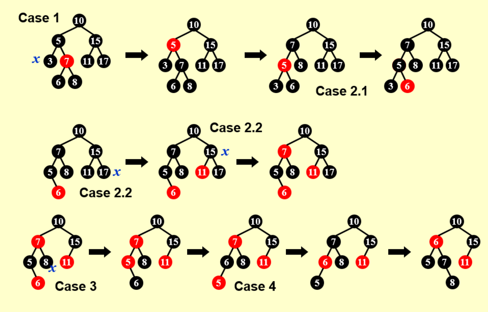

## 红黑树定义概念

定义：BST满足以下条件：

1. 每个节点有颜色（红 / 黑）
2. root is black
3. leaf(NIL) is black：所有看到的叶节点都带两个黑色的 NULL（即 NIL）
4. If node is red, both its children is black.

    - meaning: 不能连着两个红节点，且，黑节点的儿子的情况没说

5. 从一个节点到叶子节点的所有路径中黑色节点的数量一样

黑高black-height（$bh$）：从任意节点开始（它不包括）到叶子结点（叶子都包含一个看不见的黑色NIL）的路径上黑色节点的数量

## 红黑树操作

### Insert

因为是 BST，所以基本规则不变（插入的节点该在哪就在哪）；规定插入的是红节点。

与规则冲突，则：换色＋旋转

只看局部，局部改变之后上面还出问题，则不归这管了，到上面再改

### Delete

删掉黑色会比较复杂

**换颜色** + 旋转，使得要删的那个变成一个“多余的黑色”

## B+ 树

- 数据都存在最底层
- 上一层的第 n 个数是 他的儿子们中第 n + 1 个里面的最小值

插入时候：拆分 + 向上报告

