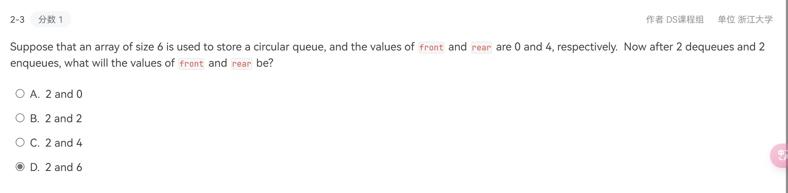
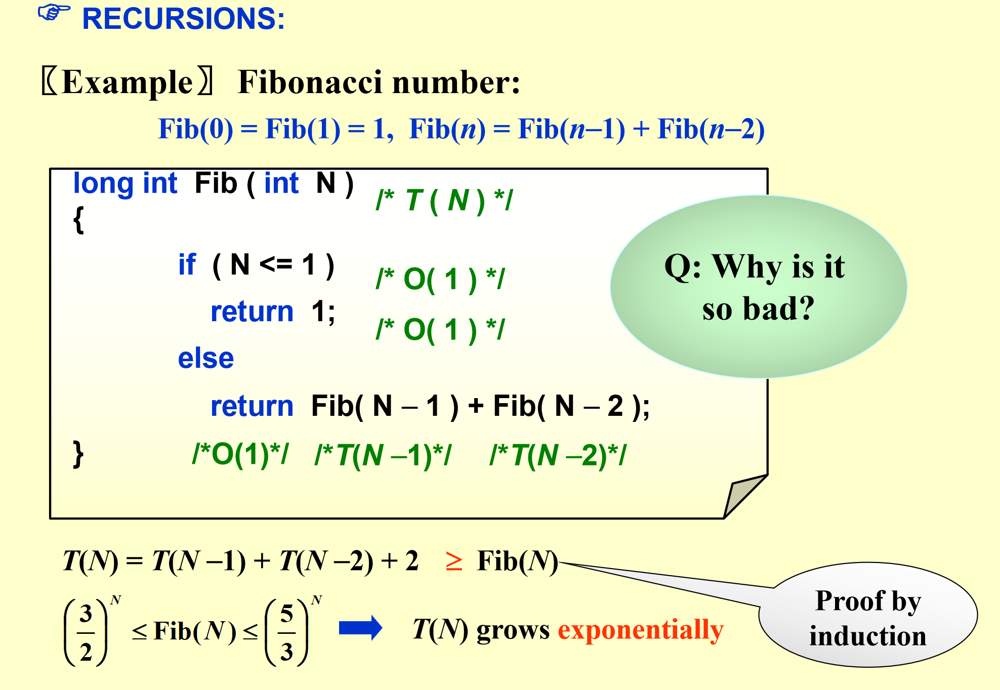

!!! warning "Grading Policies"
    
    - 期中：春夏第一周、期末：机考（编译器其他语言都有，建议C/Cpp）
    - 平时分69分（PROJECT的hard mode多出5，小project两个每个2分），溢出按60分算
    - 覆盖：期末好期中可覆盖
    - 期末卷面100分方可总评100
    - 三次Quiz，总评10分，每次10min每份10分，手写
    - 没有点名，不可抗拒因素需要提前正式请假条
    - LAB：PTA上，交两次作业，第一次互评50%的分、第二次给助教50%的分，可以申诉互评，注意DDL~
    - 诚信考试满分方可参加期末，有查重/AI查重。
	- 独立完成project
	- bonus problem ddl：6.3 10:00 题LRU-K，一个2分，直接在pta提交程序，每次的submission都会查重！

## 算法分析

**算法**

- 定義：有限集合指令+完成特定任務
- criteria：
    - 至少零條輸入（隨機數生成器不需要輸入）
    - 至少一條輸出
    - 清晰性
    - 有限性，首先預估算法複雜度（節約開銷~），程序不需要有限例如操作系統os
    - 有效性

举例：

??? info "运行次数分析"

	

	1. 外层循环 (`for(i = 0; i < rows; i++)`)

	- **执行次数**：外层循环从 `i = 0` 到 `i = rows - 1`，总共运行 `rows` 次。
	- **额外检查**：当 `i = rows` 时，循环条件 `i < rows` 会再检查一次，发现不满足条件，循环结束。因此，循环条件检查总共执行了 `rows + 1` 次。
	- **总结**：外层循环的执行次数是 `rows + 1`。

	---

	2. 内层循环 (`for(j = 0; j < cols; j++)`)

	- **执行次数**：内层循环从 `j = 0` 到 `j = cols - 1`，总共运行 `cols` 次。
	- **额外检查**：每次内层循环结束时，条件 `j < cols` 会再检查一次，发现不满足条件，内层循环结束。因此，内层循环的条件检查总共执行了 `cols + 1` 次。
	- **嵌套关系**：内层循环嵌套在外层循环中，因此内层循环的总执行次数是：
	\[
	\text{外层循环次数} \times \text{内层循环次数} = rows \times (cols + 1)
	\]
	- **总结**：内层循环的总执行次数是 \( rows \cdot (cols + 1) \)。

	---

	3. 矩阵加法操作 (`c[i][j] = a[i][j] + b[i][j]`)

	- **执行次数**：矩阵加法操作在内层循环的每次迭代中执行一次。
	- **嵌套关系**：由于内层循环运行 \( rows \cdot cols \) 次，因此矩阵加法操作也执行 \( rows \cdot cols \) 次。
	- **总结**：矩阵加法操作的总执行次数是 \( rows \cdot cols \)。

	---

	4. 总执行次数（时间复杂度）

	将上述所有部分的执行次数相加，得到总执行次数：
	\[
	T(rows, cols) = \text{外层循环条件检查} + \text{内层循环条件检查} + \text{矩阵加法操作}
	\]
	代入具体值：
	\[
	T(rows, cols) = (rows + 1) + rows \cdot (cols + 1) + rows \cdot cols
	\]

	展开并简化：
	\[
	T(rows, cols) = rows + 1 + rows \cdot cols + rows + rows \cdot cols
	\]
	\[
	T(rows, cols) = 2 \cdot rows \cdot cols + 2 \cdot rows + 1
	\]

	---

	5. 为什么时间复杂度是 \( O(rows \cdot cols) \)

	- **时间复杂度**表示算法执行时间随输入规模增长的趋势。
	- 在矩阵加法中，输入规模由矩阵的行数 \( rows \) 和列数 \( cols \) 决定。
	- 从总执行次数公式 \( T(rows, cols) = 2 \cdot rows \cdot cols + 2 \cdot rows + 1 \) 可以看出：
	- 最高阶项是 \( 2 \cdot rows \cdot cols \)，它主导了整个时间复杂度。
	- 低阶项 \( 2 \cdot rows \) 和常数项 \( 1 \) 在 \( rows \) 和 \( cols \) 很大时可以忽略。
	- 因此，时间复杂度为：
	\[
	O(rows \cdot cols)
	\]

	

	递归的执行次数：分析出其实际上是执行加法，总共n个数，加了n次

**分析**
<!-- HBM 萬卡集群 -->
時間空間複雜度，假設：

- 單綫程，簡化時間綫
- 每個操作都認爲是一個時間單元（速度：寄存器——catch——RAM，瓶頸是I/O
- 有限大小整數/無限内存

在運作前，考慮平均&最壞情況下應該用什麽硬件實現

### **1. 渐进表达式（Asymptotic Expressions）**
**渐进表达式**用于描述算法的性能随输入规模 n 增大的变化趋势，通常采用**大O符号（Big-O Notation）**来表示上界。  

常见的渐进符号包括：
- **O（大O）**：表示最坏情况的时间复杂度（上界）。
- **Ω（大欧米伽）**：表示算法的下界（最优情况）。
- **Θ（大Theta）**：表示算法的平均情况（精确界限）。上界（最差情况）=下界（最好情况）代表过程是精确的，无条件判断之类
- **o（小o）**：表示严格小于某个渐进增长率的界。
- **ω（小欧米伽）**：表示严格大于某个渐进增长率的界。

$T(n)$ 代表执行次数，取其 $n$ 最高次项并省略系数，得出时间复杂度 $O(n)$

### **2. 时间复杂度（Time Complexity）**
**时间复杂度**衡量算法的执行时间随输入规模 n 增大的增长情况，通常用**大O符号**表示最坏情况下的执行时间。例如：

| 时间复杂度 | 名称 | 示例 |
|------------|------|------|
| **O(1)** | 常数时间 | 直接访问数组元素 `arr[i]` |
| **O(log n)** | 对数时间 | 二分查找 |
| **O(n)** | 线性时间 | 线性搜索 |
| **O(n log n)** | 线性对数时间 | 快速排序、归并排序 |
| **O(n²)** | 二次时间 | 冒泡排序、选择排序 |
| **O(2ⁿ)** | 指数时间 | 递归解决斐波那契数列 |
| **O(n!)** | 阶乘时间 | 旅行商问题（TSP）暴力求解 |

[b站-时间复杂度](https://www.bilibili.com/video/BV1nE411x7qP/?spm_id_from=333.337.search-card.all.click&vd_source=b14909f255fe42946743657320d2f59a)

OOM：内存超出限制

memory：内存，有关空间复杂度

**空间换时间**，把之前算的结果存下来

思想1：**分支法**

先分（分到不能分为止） —— 再 conquer

递推公式求法：

- 逐项递推，到 $2^k = 1$
- 

例题：

思想2：**在线算法**

- 高效/不用存

*二分查找*

- 先排序！（慢
- 与中位数比，循环调整上下界

