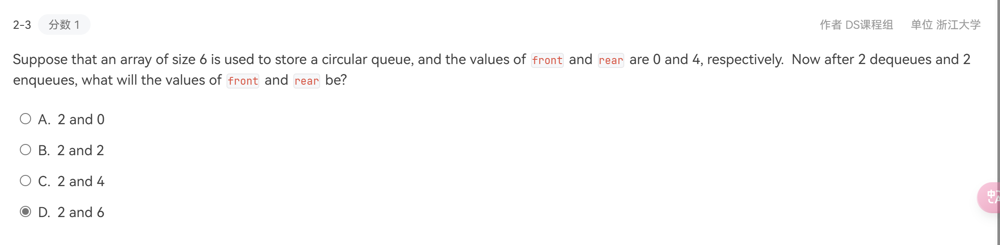

## 抽象数据类型 ADT

数据类型 + 操作，不关心具体实现

### 线性结构

一个列表，可以完成许多操作

- 查找
- 插入
- 删除

实现方式：数组/链表

数组：开buffer（连续内存空间），用偏移量表示数；

- 缺点：需要估计 MaxSize；插入删除复杂（平均时间复杂度是 $O(N)$ 首为N，尾为1，平均还是N）

链表：结构体，每个node只知道下一个是谁next指针

- 优点节约 memory
- 查找：从头遍历，$O(N)$ （中间 half n, still about n）
- 插入：三步：allocate + 连尾 + 连头
    ```c
    temp->next = node->next
    node-> next = temp
    //两步不能反：否则自己指向自己 断链disaster！
    ```
- 删除：先从头遍历找到前一个指针（他的next = node），再改next，再free
    ```c

    ```

双向链表：空间换时间

每个节点两个指针，`llink` 和 `rlink` 分别指前面和后面

判断单链是否由loop：快指针 慢指针

ACM~

#### 多项式

算术运算

数组：下标即次数，缺点是中间空的

链表：

- 存储：系数、次数、next

#### multilist

数组：`array[n][m]`

链表：

水平竖直

没有pointer实现链表

### cuesor implement

针对没有pointer的语言

一次开一个buffer

## stack 栈

一种线性表

delete —— pop，insert —— push都是在顶上

reverse order 有用

操作：

- isempty
- creat
- makeempty
- push
- top
- pop
- disposestack

### 实现

链表：关键点是 **指针指向前一个**

定义一个栈顶指针

设计一个recycle bin 的stack，存储删除的东西，但不删除

不free！

数组

### 应用

#### balancing symble

#### 计算器

**概念**

- postfix（后缀表达式）：机器可读。操作数顺序不变，区别是操作符在两个数后面。eg：$62/ \Leftrightarrow 6/2$, 结果替换原来的式子
- infix（中缀表达式）：人可读
- prefix（前缀表达式）

**算法**

Step 1：infix -> postfix

- 使用栈
- 思想：高优先级先算
- 方法：
    
    1. 操作数顺序排列，操作符入栈
    2. 操作符进之前将栈中优先级大于等于它的全部 pop
    3. 最后一个操作数进来之后 pop everything
- 规定：括号在入栈之前优先级最高，在入栈之后优先级最低。右括号进来之后 pop至左括号。

Step 2：postfix calculation

- 使用栈
- 方法：
    1. 遇到操作符，pop两个操作数（出栈）并运算，将结果push进去（压栈）


#### 函数调用

是 system stack

首先要有 return address（需要回来） —— stack frame —— local variable —— pop

recursion：编译器自动转换成带标号的

工程应用：不用递归

## queue 队列

特点：进出口不一样 first in first out

### 操作

- isempty
- create
- dispose
- makeempty
- enqueue
- dequeue
- front：数据类型

### 实现

能用数组则数组

#### 数组

取余操作！：逻辑上实现环形queue，但物理上还是线性的，最后一个不能占用：否则full和empty是同样状态（用front和rear的相对位置判断size

长度：头减尾/定义长度变量


