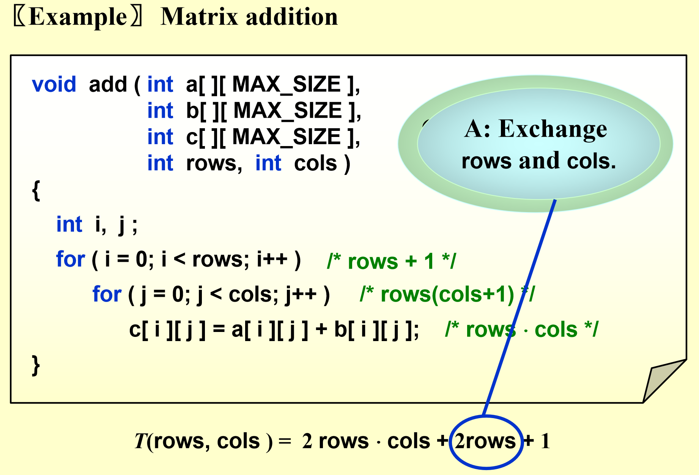
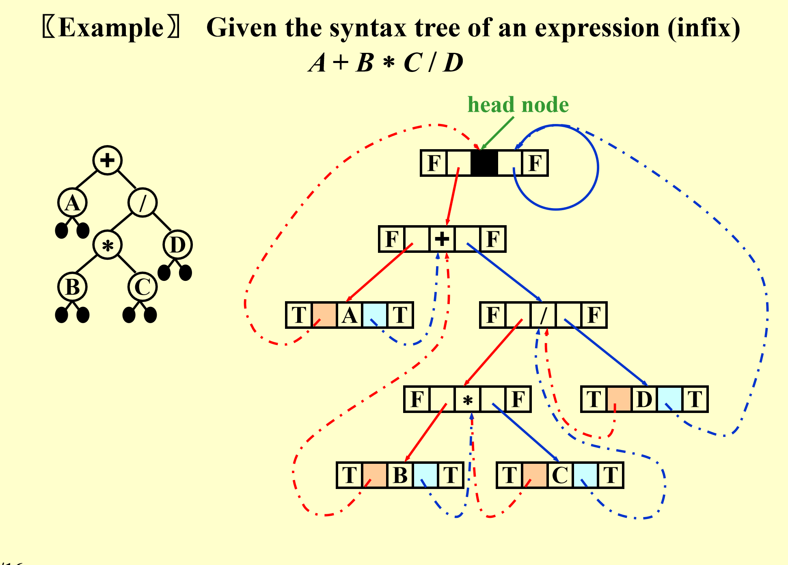

作用主要的searching

递归定义的：基本都是recursive

与学校管理一样的（

organization tree / decision tree

组成：是一系列节点node

- root 根节点
- 其他 subtree（单独拿一个节点和子节点都是tree）

特点

- 是graph的一种：subtree是 must not connect each other
- N node 的 tree 有 N - 1 条边：edge 

定义

- degree of node 节点的度 degree(node)：有几个孩子（孩子的集合的模）
- parent / children：一条边产生的关系，是不对称关系
- siblings：互为姊妹，是对称的关系
- leaf / terminal node 叶节点：degree = 0
- path from $n_1$ to $n_k$ : 
- length of path : number of **edges** on the path
- depth of $n_i$ : length of the unique path from the root to $n_i$
- height of $n_i$ : longest path from $n_i$ to a leaf
- height/depth of tree = height(root) = depth()

特点：向上走唯一，向下走很多

## 实现

数组（复杂）：用括号

链表：

方法一：直接实现

方法二：FirstChild NextSibling —— 旋转45度——> binary tree

0/1/2 个孩子，左为FirstChild，右为NextSibling

## 遍历

!!! warning

    四种traversal必考

!!! info "几个参考"

    [b站-画圈法](https://www.bilibili.com/video/BV1Ub4y147Zv/?spm_id_from=333.337.search-card.all.click&vd_source=b14909f255fe42946743657320d2f59a)

    [b站-动画讲解](https://www.bilibili.com/video/BV12T411J72x/?spm_id_from=333.337.search-card.all.click&vd_source=b14909f255fe42946743657320d2f59a)

    [b站-含代码](https://www.bilibili.com/video/BV1Ky41187qT/?spm_id_from=333.337.search-card.all.click&vd_source=b14909f255fe42946743657320d2f59a)

    [CSDN很好文章](https://blog.csdn.net/qq_44096670/article/details/109638015)

!!! info "考法"

    1. 实现出来
    2. 和stack一起考
    3. levelorder：queue + tree

所有遍历的时间复杂度都是 $O(n)$

### PreOrder（先序遍历）

任意树：

```cpp
void  preorder ( tree_ptr  tree ){
    if (tree){
        visit (tree);
        for(each child C of tree )
            preorder(C);
    }
}
```

二叉树：

```cpp
preorder(node)
    if(node == NULL)
        return
    visit(node)
    preorder(node->left)  // 递归遍历左子树
    preorder(node->right) // 递归遍历右子树
// 或者：
preorder(node)
    if(node)
        visit(node)
        preorder(node->left)  
        preorder(node->right) 
```

错误示例：
```cpp
node = root
preorder(node)
    visit(node)
    if(node->left)
        preorder(node->left)
        return
    if(node->right)
        preorder(node->right)
        return
```
???+ info "错误原因"

    对于该二叉树：

    ```
         1
        / \
        2  3
       / \
      4   5
    ```

    Step 1: `preorder(1)`

    - 访问 `1`，输出：`1`
    - `node->left` 存在，调用 `preorder(2)`
    - **关键错误：`return` 语句导致右子树 3 永远不会被访问！**

    Step 2: `preorder(2)`

    - 访问 `2`，输出：`1 2`
    - `node->left` 存在，调用 `preorder(4)`
    - **错误：`return` 语句导致 `5` 和 `3` 永远不会被访问！**

    Step 3: `preorder(4)`

    - 访问 `4`，输出：`1 2 4`
    - `node->left` 和 `node->right` 都为空，结束当前递归


    **关键问题**

    回到 `preorder(2)` 之后：
    - 由于 `preorder(2)` 调用 `preorder(4)` 后 `return` 了，**所以 `preorder(5)` 永远不会被执行！**
    - `preorder(1)` 调用 `preorder(2)` 后 `return` 了，**所以 `preorder(3)` 永远不会被执行！**

    最终输出错误：  
    ```
    1 2 4 （缺少 5 和 3）
    ```

### PostOrder（后序遍历）

关键：在遍历完左子树和右子树之后才访问当前节点，即顺序为 “**左子树 -> 右子树 -> 根节点**”

二叉树

```cpp
postorder(node)
    if(node)
        postorder(node->left)  
        postorder(node->right)
        visit(node)
```

所有树

```cpp
void  postorder ( tree_ptr  tree ){  
    if (tree) {
        for(each child C of tree )
            postorder (C);
        visit (tree);
    }
}
```

### LevelOrder（层序遍历）

思路：

1. 将根节点入队
2. 循环执行以下操作，直到队列为空

    1. 将队头节点A出队，进行访问。
    2. 将A的左子节点入队。
    3. 将A的右子节点入队。

```cpp
void levelorder(tree)
    enqueue(tree)
    while(!empty(queue))
        visit(T = dequeue())
        for(each child C of T)
            enqueue(C)
```

???+ success "一些解析"

    假设给定二叉树如下：

    ```
           A
          / \
         B   C
        / \   \
       D   E   F
    ```

    **循环遍历**
    
    | 队列状态 | 访问节点 | 操作 |
    |---|---|---|
    | `[A]` | `A` | 访问 `A`，入队 `B, C` |
    | `[B, C]` | `B` | 访问 `B`，入队 `D, E` |
    | `[C, D, E]` | `C` | 访问 `C`，入队 `F` |
    | `[D, E, F]` | `D` | 访问 `D`，无子节点 |
    | `[E, F]` | `E` | 访问 `E`，无子节点 |
    | `[F]` | `F` | 访问 `F`，无子节点 |
    | `[]` | - | 队列为空，结束遍历 |

    **最终访问顺序**： `A → B → C → D → E → F`


    **`visit(T = dequeue());` 解释**
    这一行代码的作用是：
    1. **从队列中取出一个节点**（即 `dequeue()` 操作）。
    2. **将该节点赋值给 `T`**（即 `T = dequeue()`）。
    3. **访问该节点**（即 `visit(T)`）。


    **等效代码**

    ```c
    T = dequeue();  // 从队列中取出一个元素，赋值给 T
    visit(T);       // 访问该元素
    ```

### InOrder（中序遍历）

!!! info "考法"

    问 push pop 多少次，具体实现考的少

只适用于二叉树，

```cpp
void inorder (tree_ptr tree){
    if (tree) {
        inorder (tree->Left);
        visit (tree->Element);
        inorder (tree->Right);
   }
}
```

## 应用

### 后缀表达式

步骤：用栈构建 **表达式树**

1. 遍历后缀表达式的每个符号：
   - 遇到数字（操作数），创建新节点并压入栈
   - 遇到运算符，弹出两个栈顶元素作为左右子树，创建新节点，并将其压入栈
2. 最终栈中唯一的节点即为根节点

???+ info "举例"

    输入后缀表达式： `3 4 + 5 * 6 -`

    | 读取字符 | 操作 | 栈状态（从底到顶） |
    |---------|------|------------------|
    | `3` | 数字，创建叶子节点并入栈 | `3` |
    | `4` | 数字，创建叶子节点并入栈 | `3, 4` |
    | `+` | 操作符，弹出 `4` 和 `3`，创建 `+` 作为父节点，并入栈 | `(+ 3 4)` |
    | `5` | 数字，创建叶子节点并入栈 | `(+ 3 4), 5` |
    | `*` | 操作符，弹出 `5` 和 `(+ 3 4)`，创建 `*` 作为父节点，并入栈 | `(* (+ 3 4) 5)` |
    | `6` | 数字，创建叶子节点并入栈 | `(* (+ 3 4) 5), 6` |
    | `-` | 操作符，弹出 `6` 和 `(* (+ 3 4) 5)`，创建 `-` 作为根节点 | `(- (* (+ 3 4) 5) 6)` |

    最终树的结构：

    ```
          (-)
         /   \
       (*)    6
      /   \
     (+)   5
     /  \
    3    4
    ```


只有 inorder 的只针对二叉树

根据两个traversal的顺序写另一个：

- 识别一般规律：postorder根节点最后，
- inorder
- 用recursion！

levelorder需要一个queue

非递归实现：用 自定义 stack 代替system stack

时间复杂度：所有的traversal都是线性的：因为每个node当且仅当访问一次！

## 线索二叉树 threaded binary tree

!!! info "考试"

    会考，作用是加速遍历

N node 的二叉树有几个 NULL：N + 1





- 每个节点贡献两个分支，共 2N 个，实实在在的边为 N - 1，故 N + 1


## 重要等式

binary tree 左孩子和右孩子不一样

complete binary tree：都有 0 / 2 孩子

- 可以用数组表示

退化的tree = 链表

10：14

几个等式

- $n_0 = n_2 + 1$ 其中$n_0$是叶节点个数，$n_2$是与两个孩子的节点数

    - 证明：设n为总节点个数，$n = n_1 + n_2 + n_0$，$n = Branches + 1$, $Branches = 2n_2 + n_1.
    - 会考三叉树……

- 节点数和树层数的关系


## binary search tree 二叉搜索树BST 

!!! info ""

    必考

作用：处理动态数据 **查找** （searching 最重要的东西）（hashing / BST是查找动态数据的方法）

### 定义

- 每个node含有一个key，是一个int，每个不同
- 左孩子的key < root的key < 右孩子的key
- 左右子树都是 BST

### ADT

**操作**：核心是 Find

### Find 

**逻辑和二分查找一样**

时间复杂度：$O(d)$，$d$ 是深度

- 最坏情况：退化成链表，$O(d) = O(N)$
- 最好情况：

注意

- 必须先检查节点非空

### FindMax

### FindMin

### Insert

是一个确定的情况，给定顺序则树确定

步骤

1. check if 数字在tree中
2. 找到插入他的父节点
2. bigger 则 go to right，smaller 则 go  to left
4. 插入：`malloc` 一个节点，`T-> = x`, `T->left = T->right = NULL`

10:45

处理重复情况

### Delete

#### Delete a leaf node

reset its parent link to NULL

#### Delete a degree 1 node

replace it with its child

#### Delete a degree 2 node

- replace 
- delete 这是一个 degree为 0 / 1的node

原理：

不确定的

考虑BST的中序遍历：

这里，选左边更好因为选左边数变浅，时间复杂度（$O(d)$）都变少

实现：

```cpp

```

!!! info "Note"

    删除是free掉内存，实际上不删除，可以加一个flag来表示active/inactive，真正的deletion发生在需要调整tree时

### 平均情况分析

!!! info ""

    自己想想几种题：给出inorder postorder自己写另一个

（期中考试考完下节课内容）

给一串数，构建树的形状取决于给出的顺序，例如从小到大则右撇链表，从大到小则左撇链表，

平均时间复杂度还是 $O(\log N)$