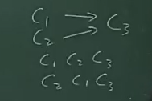
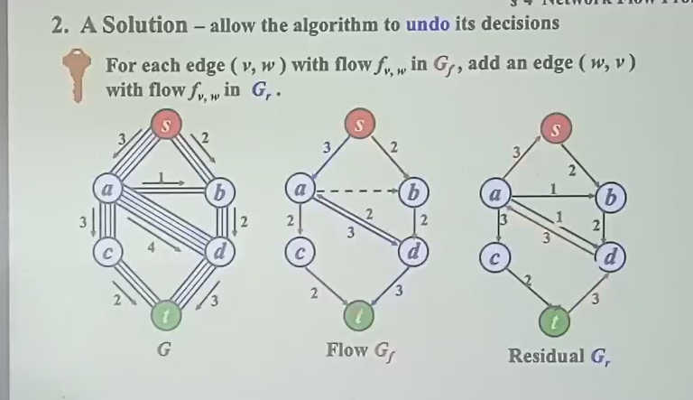
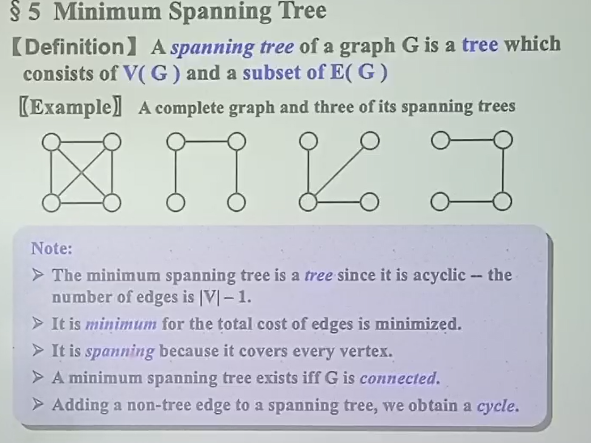
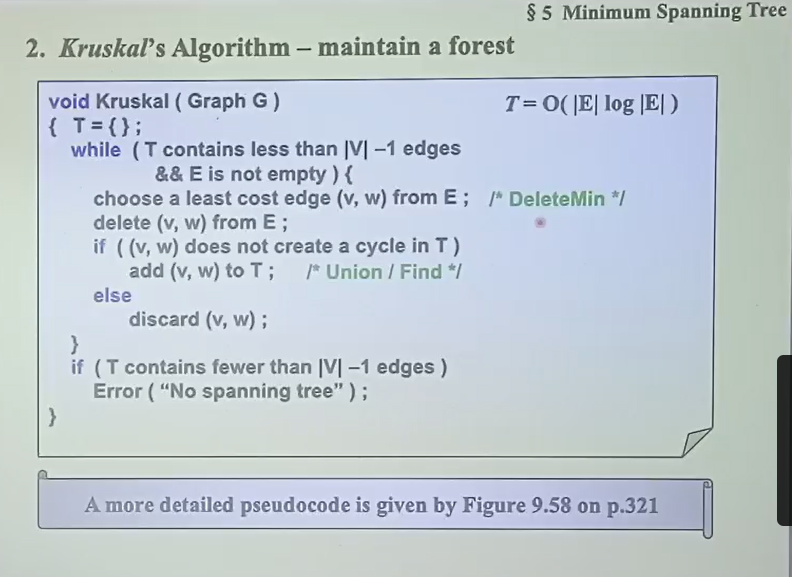
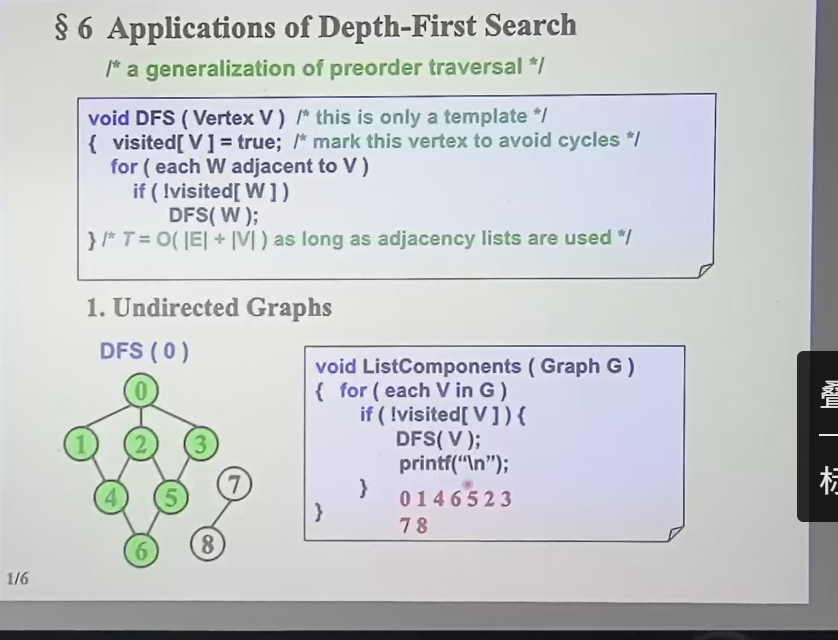
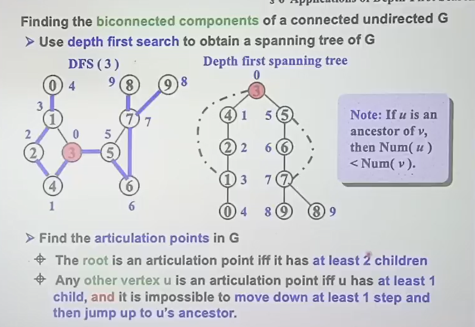

## 基本概念

$$G = (E, V)$$

边的集合 $E$，节点的集合 $V$

无向图：每个节点间谁指谁都一样，最多 $\frac12 n(n - 1)$ 个边

有向图：每个节点间谁指谁不一样，最多 $n(n - 1)$ 个边

!!! success ""

    有向图想成中间的边带箭头，无向图的边不代箭头

完全图complete graph：边满


子图subgraph：顶点集子集 + 边集子集，要匹配

相邻adjacent / incident


路径path：从一个顶点到另一个

路径长：中间边数

$simple \; \; path$：这个路径上没有重复的节点，收尾相接中间不重复也算

环路 $cycle$：首尾相同 + simple path

顶点的连通connect：中间有path

图的连通：任意两个顶点都连通

连通组件：一个图的**最大**的**连通**的**子图**

树和图：树是**连通**且**无环**的**无向图**，反之也成立

!!! warning "DAG"

    DAG：有向无环图

    

    这个图的节点从左到右设为1、2、3，1可以直接到3，但是3不能直接到1，所以无环

强连通：每个顶点都有路径的**有向图**

弱连通：将有向图的所有（有向）边换成无向边之和是连通的即可

!!! warning ""

    强连通和弱连通都是针对有向图的概念

    

    

    这不是强连通，没有顶点可以走到0节点

    

    这就强连通了

强连通组件：强连通的最大子图

!!! info ""

    
    

度数degree：跟一个顶点相邻的节点数

入度数in-degree：有向图中，指向它的

出度数out-degree：有向图中，他指出去的

$$\sum _{v \in V} dv = 2|E|$$

predecessor / successor：前驱 / 后继

## 数据结构

### 邻接矩阵

用矩阵表示，$matrix[i][j]$ 为1则俩之间有连通，为0则不连通

无向图是关于对角线对称，则只存下三角


节点度数计算


### 邻接链表 Agjacency list 

!!! warning ""

    每个节点代表一条边

!!! success ""

    每个节点维护一个链表，链表的每个指针代表一个边，即每个节点代表一条边。

    相当于将邻接矩阵的每一行非零节点串起来，在节点的值处记录在矩阵中节点的位置，顺序互换无所谓


对于有向图，上面的链表只记录了指出去的边有两种方法：

- 加上一个入的边的链表，如下method1
- 十字链表：一个节点中放俩指针，一个是指出去的，一个是指进来的。如下method2


!!! success ""

    本质上就是四个链表，将其合并了：

    - 每个数组元素都代表一个节点，其出去的指针代表图中该节点指向的节点
    - 节点的表示：包含了一条边的两个端点，里面的指针就是代表边 

边的权重


!!! info "在图的链表表示"

    **1. 邻接表（Adjacency List）**
    - **适用场景**：有向图或无向图。
    - **结构特点**：
    - **顶点结点**：每个顶点维护一个链表，链表中每个结点表示一条从该顶点出发的边（对于无向图，则包含所有邻接顶点）。
    - **边结点**：存储边的终点（对于有向图）或邻接顶点（对于无向图），以及可能的权重或其他信息。
    - **示例**：
        ```c
        // 邻接表的边结点（有向图）
        typedef struct AdjListNode {
            int dest;               // 边的终点（邻接顶点）
            int weight;            // 边权重
            struct AdjListNode *next; // 指向下一个邻接边结点
        } AdjListNode;

        // 顶点结点
        typedef struct VertexNode {
            char data;                // 顶点数据
            AdjListNode *head;       // 邻接链表头指针
        } VertexNode;
        ```
    - **特点**：
    - 每个边结点仅关联一个顶点（起点由顶点结点隐式确定，终点由边结点显式存储）。
    - 对于无向图，每条边会被存储两次（分别在两个顶点的链表中）。

    ---

    **2. 邻接多重表（Adjacency Multilist）**
    - **适用场景**：无向图。
    - **结构特点**：
    - **边结点**：每条边用一个结点表示，同时属于两个顶点的邻接链表（避免重复存储）。
    - **边结点包含两个顶点信息**（如 `vertex1` 和 `vertex2`），并通过指针链接到两个顶点的链表中。
    - **示例**：
        ```c
        // 邻接多重表的边结点（无向图）
        typedef struct EdgeNode {
            int v1, v2;              // 边的两个顶点
            int weight;              // 边权重
            struct EdgeNode *path1;  // 链接到顶点v1的邻接链表
            struct EdgeNode *path2;  // 链接到顶点v2的邻接链表
        } EdgeNode;

        // 顶点结点
        typedef struct VertexNode {
            char data;                // 顶点数据
            EdgeNode *head;           // 邻接链表头指针
        } VertexNode;
        ```
    - **特点**：
    - 每条边只存储一次，但通过 `path1` 和 `path2` 指针同时存在于两个顶点的链表中。
    - 适合无向图，节省空间且避免数据冗余。

    ---

    **3. 十字链表（Orthogonal List）**
    - **适用场景**：有向图（如你之前提到的十字链表）。
    - **结构特点**：
    - 边结点同时存在于起点顶点的**出边链表**和终点顶点的**入边链表**。
    - 边结点明确存储起点（`tailVex`）和终点（`headVex`），并通过 `tLink` 和 `hLink` 指针链接。
    - 示例见你之前的代码定义。


## 应用示例

### AOV network

- 活动在节点上
- 边表示活动间的依赖关系
- 必须是有向无环图DAG

??? info "AOV network"

    AOV（Activity On Vertex）网络是图论中的一种数据结构，用于表示活动之间的依赖关系。以下是其核心要点：

    1. 基本定义

    - **顶点表示活动**：每个顶点代表一个独立的任务或活动
    - **有向边表示依赖**：边A→B表示活动A必须在活动B之前完成（B依赖A）

    2. 关键特性

    - 必须是有向无环图（DAG）
    - 不允许出现循环依赖（如A→B→C→A）
    - 边本身不携带权重（仅表示依赖关系）

    3. 拓扑排序应用

    通过拓扑排序可以确定合法的执行顺序：
    ```python
    def topological_sort(graph):
        in_degree = {u:0 for u in graph}
        for u in graph:
            for v in graph[u]:
                in_degree[v] += 1
        
        queue = deque([u for u in in_degree if in_degree[u] == 0])
        result = []
        
        while queue:
            u = queue.popleft()
            result.append(u)
            for v in graph[u]:
                in_degree[v] -= 1
                if in_degree[v] == 0:
                    queue.append(v)
        
        return result if len(result) == len(graph) else "存在环"
    ```

    4. 典型应用场景

    - 课程选修顺序（先修课要求）
    - 软件构建的编译顺序
    - 产品生产流程规划
    - 项目管理中的任务调度

    5. 与AOE网络的对比

    | 特性        | AOV网络                | AOE网络                |
    |-------------|-----------------------|-----------------------|
    | 活动位置    | 顶点                   | 边                    |
    | 关键路径    | 不涉及                | 核心概念              |
    | 时间信息    | 不包含                | 边权重表示持续时间    |
    | 应用重点    | 任务顺序              | 工期计算和优化        |

    6. 实践注意事项

    - 必须进行环检测（时间复杂度O(V+E)）
    - 可能存在多个有效拓扑排序结果
    - 实际应用中常结合关键路径分析进行优化


**拓扑序列**：将所有节点进行一个线性排序，要求是该顺序中**前驱必须在后继前面**。

- 由于partial order（不是所有节点间都有依赖关系，如下图）的关系，可能有多个合法的拓扑序列。



第一个节点必须得是没有前驱的

??? info "拓扑序列 Topological Ordering"

    拓扑序列（Topological Ordering）是**有向无环图（DAG）**中顶点的一种线性排列，满足图中所有有向边从前驱顶点指向后继顶点的顺序关系。以下是其核心要点：

    ---

    **1. 核心定义**

    - **依赖顺序的体现**：若存在边 `u→v`，则在拓扑序列中顶点 `u` 必须出现在顶点 `v` 之前。
    - **DAG的必然属性**：只有无环的有向图才能存在拓扑序列（若存在环，则无法找到合法排序）。

    ---

    **2. 关键特性**

    | 特性                | 说明                                                                 |
    |---------------------|----------------------------------------------------------------------|
    | **不唯一性**        | 一个DAG可能有多个合法拓扑序列（例如并行任务的不同排列）              |
    | **局部有序性**      | 仅保证依赖关系的严格性，非依赖顶点的顺序可能任意（如A和B无依赖可互换） |
    | **存在性条件**      | 当且仅当图为DAG时存在拓扑序列                                        |

    ---

    **3. 生成算法**

    **Kahn算法（基于入度）**

    ```python
    from collections import deque

    def topological_sort(graph):
        in_degree = {u: 0 for u in graph}
        # 计算初始入度
        for u in graph:
            for v in graph[u]:
                in_degree[v] += 1
        # 初始化队列（入度为0的顶点）
        queue = deque([u for u in in_degree if in_degree[u] == 0])
        result = []
        
        # BFS处理
        while queue:
            u = queue.popleft()
            result.append(u)
            for v in graph[u]:
                in_degree[v] -= 1
                if in_degree[v] == 0:
                    queue.append(v)
        
        # 环检测
        return result if len(result) == len(graph) else "图中有环，无法生成拓扑序列"
    ```

    **DFS算法（基于后序遍历反转）**

    ```python
    def topological_sort_dfs(graph):
        visited = set()
        stack = []
        
        def dfs(u):
            if u in visited:
                return
            visited.add(u)
            for v in graph[u]:
                dfs(v)
            stack.append(u)  # 后序入栈
        
        for u in graph:
            if u not in visited:
                dfs(u)
        
        return stack[::-1]  # 反转后序得到拓扑序列
    ```

    ---

    **4. 应用场景**

    | 场景                | 示例                                                                 |
    |---------------------|----------------------------------------------------------------------|
    | **任务调度**        | 编译顺序（如C++头文件依赖、Makefile规则）                           |
    | **课程选修**        | 先修课程必须排在后续课程之前（如数据结构→算法）                     |
    | **工作流管理**      | 生产流程中工序的先后依赖（如组装→测试→包装）                        |
    | **依赖解析**        | 软件包安装的依赖关系（如npm/yarn包管理）                            |

    ---

    **5. 经典示例**

    课程依赖关系：
    
    - 顶点：`C1`（高数）, `C2`（线代）, `C3`（数据结构）, `C4`（算法）
    - 边：`C1→C3`, `C2→C3`, `C3→C4`

    **可能的拓扑序列**：

    - `[C1, C2, C3, C4]`
    - `[C2, C1, C3, C4]`
    - `[C1, C2, C3, C4]`（多个合法解，因C1和C2无依赖）

    ---

    **6. 特殊说明**

    - **环的检测**：若算法返回的序列长度≠顶点总数，说明图中存在环。
    - **动态图处理**：某些场景需支持动态添加顶点/边并维护拓扑序列（如实时任务调度系统）。
    - **加权扩展**：若需要处理带权依赖（如最短时间路径），需结合**AOE网络**和关键路径算法。

例题：给出AOV，若有环报错，无环则给出一个拓扑序

思想：

- 每次在填入没有前驱的节点
- 更新其后继节点的前驱计数：删除之前填入那个指出的边


改进：开一个队列/栈存储入度为0的节点（因为上一个算法一开始遍历寻找入度为0使得复杂度高）


!!! warning ""

    使用邻接链表存储

!!! success "讲解"

    [数据结构基础（本） 2025-04-09第7-8节 1小时25分钟处](https://classroom.zju.edu.cn/livingroom?course_id=69838&sub_id=1508064&tenant_code=112)


## 最短路

一条路上边的权重求和，需要找一个确定的算法去找它

存在负环：则无最短路，即这个环一直绕


??? info "Pick & Relax"

    - Pick : **选择顶点** 
    - Relax :  **更新路径/权重** 

    ---

    **1. Pick 操作**

    **定义**

    - **Pick**（选择操作）：从候选集合中选择一个顶点，用于后续处理。具体选择策略取决于算法目标：
    - **最短路径算法**（如 Dijkstra）：选择当前距离起点最近的未处理顶点。
    - **最小生成树算法**（如 Prim）：选择当前距离生成树最近的顶点。

    **作用**

    - 确定算法的处理顺序，确保每一步都朝着最优解推进。
    - 避免重复处理已确定最短路径或已加入生成树的顶点。

    **示例**

    - **Dijkstra 算法**：
    ```python
    def dijkstra(graph, start):
        dist = {v: ∞ for v in graph.vertices}  # 初始化距离为无穷大
        dist[start] = 0
        visited = set()
        priority_queue = PriorityQueue()       # 优先队列按距离排序
        priority_queue.add(start, 0)
        
        while not priority_queue.empty():
            u = priority_queue.extract_min()  # Pick 操作：选择距离最小的顶点
            visited.add(u)
            for v in u.neighbors:
                relax(u, v, graph.edge(u, v))  # Relax 操作
    ```

    ---

    **2. Relax 操作**

    **定义**

    - **Relax**（松弛操作）：检查是否可以通过某个顶点 `u` 到达顶点 `v` 的路径更短（或更优），如果是，则更新 `v` 的最短距离或权重。
    - 数学描述（最短路径算法）：
    ```plaintext
    if dist[v] > dist[u] + weight(u, v):
        dist[v] = dist[u] + weight(u, v)
        prev[v] = u
    ```

    **作用**

    - 动态更新顶点的最短路径估计值。
    - 逐步逼近全局最优解。

    **示例**

    - **Dijkstra 算法中的 Relax**：
    ```python
    def relax(u, v, weight):
        if dist[v] > dist[u] + weight:
            dist[v] = dist[u] + weight
            prev[v] = u
            priority_queue.decrease_key(v, dist[v])  # 更新优先级队列
    ```

    ---

    **3. Pick 和 Relax 的协同工作**

    以 **Dijkstra 算法** 为例，两者的协作流程如下：
    1. **初始化**：起点距离为 0，其他顶点距离为 ∞。
    2. **Pick**：从优先队列中选择距离最小的顶点 `u`。
    3. **Relax**：遍历 `u` 的所有邻接顶点 `v`，尝试通过 `u` 更新 `v` 的距离。
    4. **重复**：直到所有顶点被处理。

    **可视化流程**

    ```
    初始状态：
    顶点 A(0), B(∞), C(∞), D(∞)

    Pick A → Relax A→B 和 A→C：
    顶点 A(0), B(2), C(5), D(∞)

    Pick B → Relax B→C 和 B→D：
    顶点 A(0), B(2), C(3), D(7)

    Pick C → Relax C→D：
    顶点 A(0), B(2), C(3), D(5)

    Pick D → 结束。
    ```

    ---

    **4. 不同算法中的 Pick 和 Relax**

    **Dijkstra 算法**

    - **Pick**：使用优先队列选择距离起点最近的未处理顶点。
    - **Relax**：更新邻接顶点的最短距离。
    - **适用场景**：无负权边的图。

    **Bellman-Ford 算法**

    - **Pick**：无显式选择操作，直接遍历所有边。
    - **Relax**：对所有边进行松弛，重复 `V-1` 次。
    - **适用场景**：含负权边的图（可检测负权环）。

    **Prim 算法**
    x   
    - **Pick**：选择距离生成树最近的顶点。
    - **Relax**：更新未加入生成树顶点的最小权重。
    - **目标**：构建最小生成树。

    ---

    **5. 关键区别**
    | **算法**       | **Pick 操作**                | **Relax 操作**                      | **时间复杂度**     |
    |----------------|-----------------------------|-------------------------------------|-------------------|
    | **Dijkstra**   | 优先队列选择最小距离顶点       | 更新邻接顶点的最短路径               | O((V+E) log V)   |
    | **Bellman-Ford**| 无显式选择，遍历所有边         | 对所有边进行松弛操作，重复 V-1 次    | O(V·E)           |
    | **Prim**       | 优先队列选择最小权重边的顶点    | 更新未加入生成树顶点的最小权重       | O((V+E) log V)   |

    ---

    **6. 代码示例（Dijkstra 算法）**
    ```python
    import heapq

    def dijkstra(graph, start):
        dist = {v: float('inf') for v in graph}
        dist[start] = 0
        heap = [(0, start)]
        visited = set()
        
        while heap:
            current_dist, u = heapq.heappop(heap)  # Pick 操作
            if u in visited:
                continue
            visited.add(u)
            
            for v, weight in graph[u].items():
                if dist[v] > dist[u] + weight:    # Relax 条件
                    dist[v] = dist[u] + weight    # Relax 操作
                    heapq.heappush(heap, (dist[v], v))
        
        return dist
    ```


### 无权最短路


标数字，确认

```c
void Unweighted(Table T) {
    int CurrDist;
    Vertex V, W;
    for (CurrDist = 0; CurrDist < NumVertex; CurrDist++) {
        for (each vertex V) {
            if (!T[V].Known && T[V].Dist == CurrDist) {
                T[V].Known = true;
                for (each W adjacent from V) {
                    if (T[W].Dist == Infinity) {
                        T[W].Dist = CurrDist + 1;
                        T[W].Path = V;
                    }
                }
            }
        }
    }
}
```

优化：用队列储存刚改过的节点


### 有权最短路


[B站图文讲解](https://www.bilibili.com/video/BV1zz4y1m7Nq/?spm_id_from=333.337.search-card.all.click&vd_source=b14909f255fe42946743657320d2f59a)


### 无环图

用拓扑排序遍历节点，依此松弛即可

例如：AOE网络

### 所有节点最短路

!!! info ""

    没细讲~


### 网络流问题



- 流量图
- 残量图

每次松弛时：残量图加上反向边


### 最小生成树



生成树：图的所有节点，边的子集

要求这个图本身是连通的

最小生成树：图的所有节点，边的子集，且边的权重和最小

最小生成树的性质：

- 生成树的边数为 $n - 1$，其中 $n$ 为节点数
- 生成树是连通的
- 生成树是无环的

生成算法：

- Prim算法：核心是贪心算法，类似dijkstra算法
    - 把节点连成树
    1. 从一个节点开始
    2. 每次选择一个节点，使得其和已经有的集合距离最小
    3. 直到所有节点都在树中

- Kruskal算法：核心是并查集
    - 把小树拼成大数
    1. 每次找出权重最小边
        - 将所有边按权重从小到大排序，从小到大遍历 
        - 把边建成最小堆，每次delete min
    2. 判断是否会形成环
        - 用并查集find判断
    3. 如果不会形成环，则加入树中
        - 用并查集union
    4. 直到所有节点都在树中



## 深度优先搜索 DFS



- 如果连通图，一个 DFS
- 如果非连通图，外面加一个遍历all节点

关节点：去掉这个就不连通了

双连通：去掉1个节点还是连通图

k连通：去掉 k - 1 个还联通

双连通组件：双连通的最大的子图    

一个图的所有双连通组件的边是对原图边集合的划分

### 寻找双连通组件



1. 将一个图做 DFS，虚线画出原图中存在而树中不存在的边
2. 得到的树中：
    - 根节点是关节点
    - 这个节点的祖先和后辈没有用虚线相连则是关节点，即，向下走几步然后可以跳回高点
