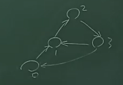

## 基本概念

$$G = (E, V)$$

边的集合 $E$，节点的集合 $V$

无向图：每个节点间谁指谁都一样，最多 $\frac12 n(n - 1)$ 个边

有向图：每个节点间谁指谁不一样，最多 $n(n - 1)$ 个边

!!! success ""

    有向图想成中间的边带箭头，无向图的边不代箭头

完全图complete graph：边满


子图subgraph：顶点集子集 + 边集子集，要匹配

相邻adjacent / incident


路径path：从一个顶点到另一个

路径长：中间边数

$simple \; \; path$：这个路径上没有重复的节点，收尾相接中间不重复也算

环路 $cycle$：首尾相同 + simple path

顶点的连通connect：中间有path

图的连通：任意两个顶点都连通

连通组件：一个图的**最大**的**连通**的**子图**

树和图：树是**连通**且**无环**的**无向图**，反之也成立

!!! warning "DAG"

    DAG：有向无环图

    

    这个图的节点从左到右设为1、2、3，1可以直接到3，但是3不能直接到1，所以无环

强连通：每个顶点都有路径的**有向图**

弱连通：将有向图的所有（有向）边换成无向边之和是连通的即可

!!! warning ""

    强连通和弱连通都是针对有向图的概念

    

    

    这不是强连通，没有顶点可以走到0节点

    

    这就强连通了

强连通组件：强连通的最大子图

!!! info ""

    
    

度数degree：跟一个顶点相邻的节点数

入度数in-degree：有向图中，指向它的

出度数out-degree：有向图中，他指出去的

$$\sum _{v \in V} dv = 2|E|$$

predecessor / successor：前驱 / 后继

## 数据结构

### 矩阵

用矩阵表示，$matrix[i][j]$ 为1则俩之间有连通，为0则不连通

无向图是关于对角线对称，则只存下三角


节点度数计算


### 邻接链表 Agjacency list 


!!! success ""

    本质上就是四个链表，将其合并了：

    - 每个数组元素都代表一个节点，其出去的指针代表图中该节点指向的节点
    - 节点的表示：包含了一条边的两个端点，里面的指针就是代表边 

边的权重


## 应用示例

### AOV network

??? info "AOV network"

    AOV（Activity On Vertex）网络是图论中的一种数据结构，用于表示活动之间的依赖关系。以下是其核心要点：

    1. 基本定义

    - **顶点表示活动**：每个顶点代表一个独立的任务或活动
    - **有向边表示依赖**：边A→B表示活动A必须在活动B之前完成（B依赖A）

    2. 关键特性

    - 必须是有向无环图（DAG）
    - 不允许出现循环依赖（如A→B→C→A）
    - 边本身不携带权重（仅表示依赖关系）

    3. 拓扑排序应用

    通过拓扑排序可以确定合法的执行顺序：
    ```python
    def topological_sort(graph):
        in_degree = {u:0 for u in graph}
        for u in graph:
            for v in graph[u]:
                in_degree[v] += 1
        
        queue = deque([u for u in in_degree if in_degree[u] == 0])
        result = []
        
        while queue:
            u = queue.popleft()
            result.append(u)
            for v in graph[u]:
                in_degree[v] -= 1
                if in_degree[v] == 0:
                    queue.append(v)
        
        return result if len(result) == len(graph) else "存在环"
    ```

    4. 典型应用场景

    - 课程选修顺序（先修课要求）
    - 软件构建的编译顺序
    - 产品生产流程规划
    - 项目管理中的任务调度

    5. 与AOE网络的对比

    | 特性        | AOV网络                | AOE网络                |
    |-------------|-----------------------|-----------------------|
    | 活动位置    | 顶点                   | 边                    |
    | 关键路径    | 不涉及                | 核心概念              |
    | 时间信息    | 不包含                | 边权重表示持续时间    |
    | 应用重点    | 任务顺序              | 工期计算和优化        |

    6. 实践注意事项

    - 必须进行环检测（时间复杂度O(V+E)）
    - 可能存在多个有效拓扑排序结果
    - 实际应用中常结合关键路径分析进行优化


拓扑序列：前驱到后继地线性序列

第一个节点必须得是没有前驱的

??? info "拓扑序列 Topological Ordering"

    拓扑序列（Topological Ordering）是**有向无环图（DAG）**中顶点的一种线性排列，满足图中所有有向边从前驱顶点指向后继顶点的顺序关系。以下是其核心要点：

    ---

    **1. 核心定义**

    - **依赖顺序的体现**：若存在边 `u→v`，则在拓扑序列中顶点 `u` 必须出现在顶点 `v` 之前。
    - **DAG的必然属性**：只有无环的有向图才能存在拓扑序列（若存在环，则无法找到合法排序）。

    ---

    **2. 关键特性**

    | 特性                | 说明                                                                 |
    |---------------------|----------------------------------------------------------------------|
    | **不唯一性**        | 一个DAG可能有多个合法拓扑序列（例如并行任务的不同排列）              |
    | **局部有序性**      | 仅保证依赖关系的严格性，非依赖顶点的顺序可能任意（如A和B无依赖可互换） |
    | **存在性条件**      | 当且仅当图为DAG时存在拓扑序列                                        |

    ---

    **3. 生成算法**

    **Kahn算法（基于入度）**

    ```python
    from collections import deque

    def topological_sort(graph):
        in_degree = {u: 0 for u in graph}
        # 计算初始入度
        for u in graph:
            for v in graph[u]:
                in_degree[v] += 1
        # 初始化队列（入度为0的顶点）
        queue = deque([u for u in in_degree if in_degree[u] == 0])
        result = []
        
        # BFS处理
        while queue:
            u = queue.popleft()
            result.append(u)
            for v in graph[u]:
                in_degree[v] -= 1
                if in_degree[v] == 0:
                    queue.append(v)
        
        # 环检测
        return result if len(result) == len(graph) else "图中有环，无法生成拓扑序列"
    ```

    **DFS算法（基于后序遍历反转）**

    ```python
    def topological_sort_dfs(graph):
        visited = set()
        stack = []
        
        def dfs(u):
            if u in visited:
                return
            visited.add(u)
            for v in graph[u]:
                dfs(v)
            stack.append(u)  # 后序入栈
        
        for u in graph:
            if u not in visited:
                dfs(u)
        
        return stack[::-1]  # 反转后序得到拓扑序列
    ```

    ---

    **4. 应用场景**

    | 场景                | 示例                                                                 |
    |---------------------|----------------------------------------------------------------------|
    | **任务调度**        | 编译顺序（如C++头文件依赖、Makefile规则）                           |
    | **课程选修**        | 先修课程必须排在后续课程之前（如数据结构→算法）                     |
    | **工作流管理**      | 生产流程中工序的先后依赖（如组装→测试→包装）                        |
    | **依赖解析**        | 软件包安装的依赖关系（如npm/yarn包管理）                            |

    ---

    **5. 经典示例**

    课程依赖关系：
    
    - 顶点：`C1`（高数）, `C2`（线代）, `C3`（数据结构）, `C4`（算法）
    - 边：`C1→C3`, `C2→C3`, `C3→C4`

    **可能的拓扑序列**：

    - `[C1, C2, C3, C4]`
    - `[C2, C1, C3, C4]`
    - `[C1, C2, C3, C4]`（多个合法解，因C1和C2无依赖）

    ---

    **6. 特殊说明**

    - **环的检测**：若算法返回的序列长度≠顶点总数，说明图中存在环。
    - **动态图处理**：某些场景需支持动态添加顶点/边并维护拓扑序列（如实时任务调度系统）。
    - **加权扩展**：若需要处理带权依赖（如最短时间路径），需结合**AOE网络**和关键路径算法。


!!! warning ""

    使用邻接链表存储

!!! success "讲解"

    [数据结构基础（本） 2025-04-09第7-8节 1小时25分钟处](https://classroom.zju.edu.cn/livingroom?course_id=69838&sub_id=1508064&tenant_code=112)


## 最短路

一条路上边的权重求和，需要找一个确定的算法去找它

存在负环：则无最短路，即这个环一直绕

### 无权最短路


标数字，确认

```c
void Unweighted(Table T) {
    int CurrDist;
    Vertex V, W;
    for (CurrDist = 0; CurrDist < NumVertex; CurrDist++) {
        for (each vertex V) {
            if (!T[V].Known && T[V].Dist == CurrDist) {
                T[V].Known = true;
                for (each W adjacent from V) {
                    if (T[W].Dist == Infinity) {
                        T[W].Dist = CurrDist + 1;
                        T[W].Path = V;
                    }
                }
            }
        }
    }
}
```

优化：用队列储存刚改过的节点


### 有权最短路


[B站图文讲解](https://www.bilibili.com/video/BV1zz4y1m7Nq/?spm_id_from=333.337.search-card.all.click&vd_source=b14909f255fe42946743657320d2f59a)


### 所有节点最短路

