## 概念

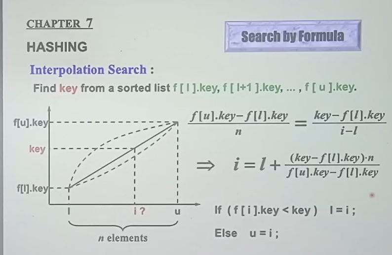

将 key 映射到 i

symbol table是哈希表最常用的场景

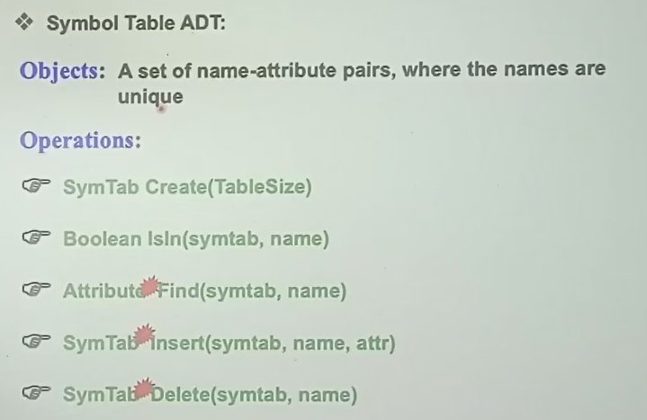

## 哈希函数

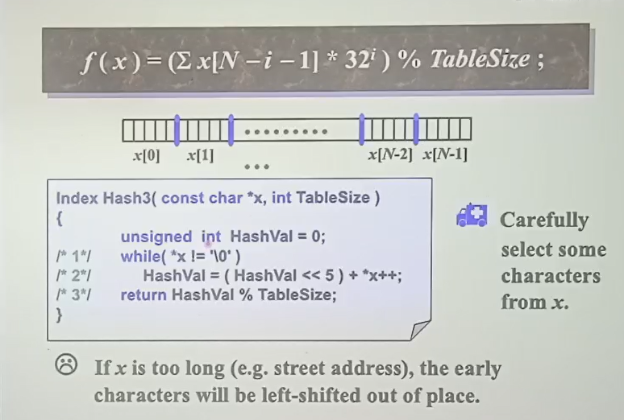

类似32进制：27就够，但是32可以用位运算（左翼5位），快

## 解决冲突

### 分离链表法

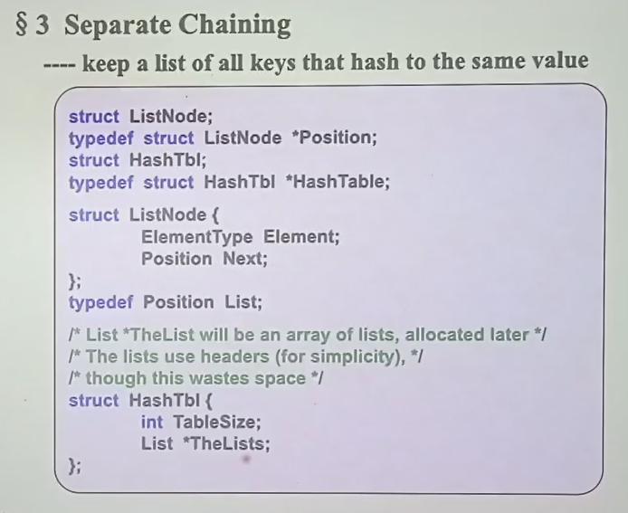
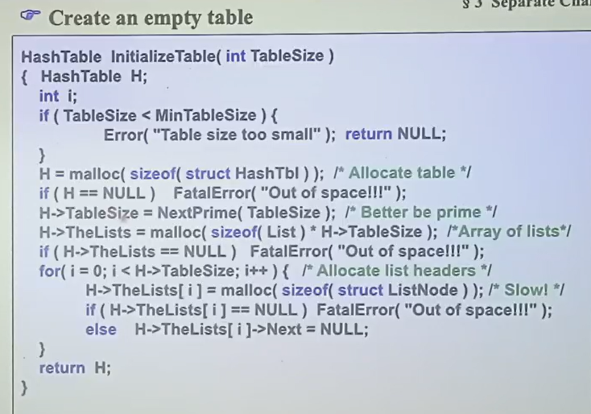
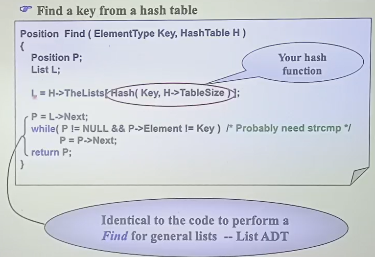
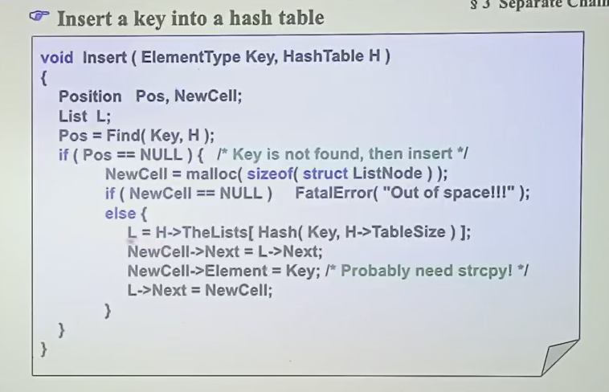
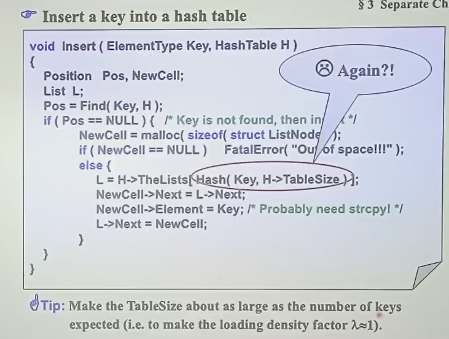
tablesize 和要插的数据量尽量相近，即 $\lambda$ 接近1

### 开放寻址法

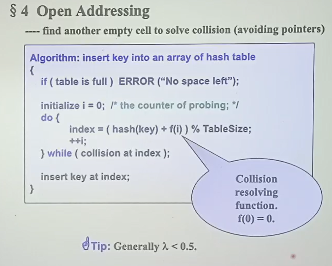

一般要求 $\lambda < 0.5$

1. 线性查找

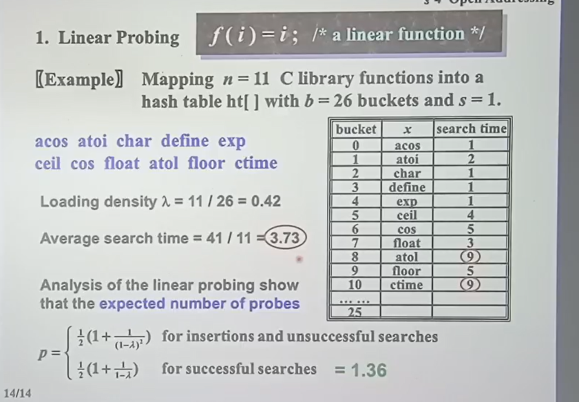

理论上平均探测次数见上图最下面

2. 二次探测

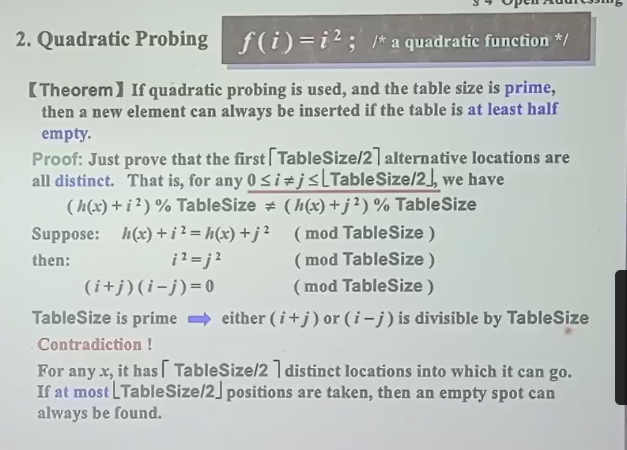

二次探测work的条件：一半空且tablesize为质数

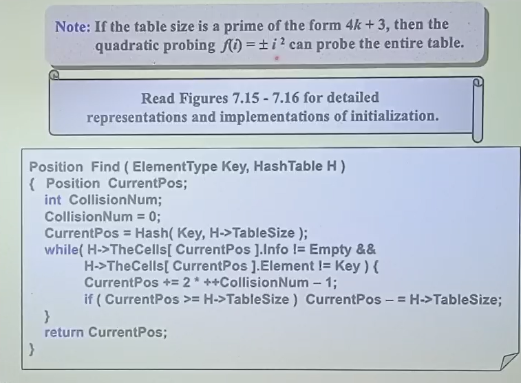

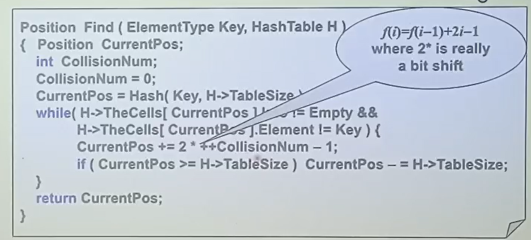
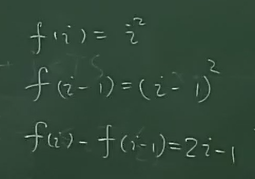

这比直接算平方算的快

不直接删除而是更改元素状态的原因：如果直接删除查找的话到这里就退出了，后面的元素找不到了

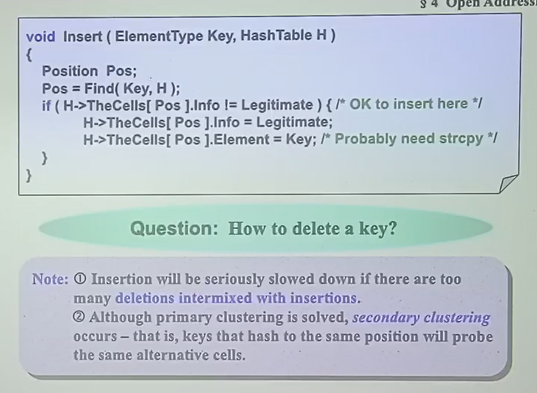

3. 二次哈希

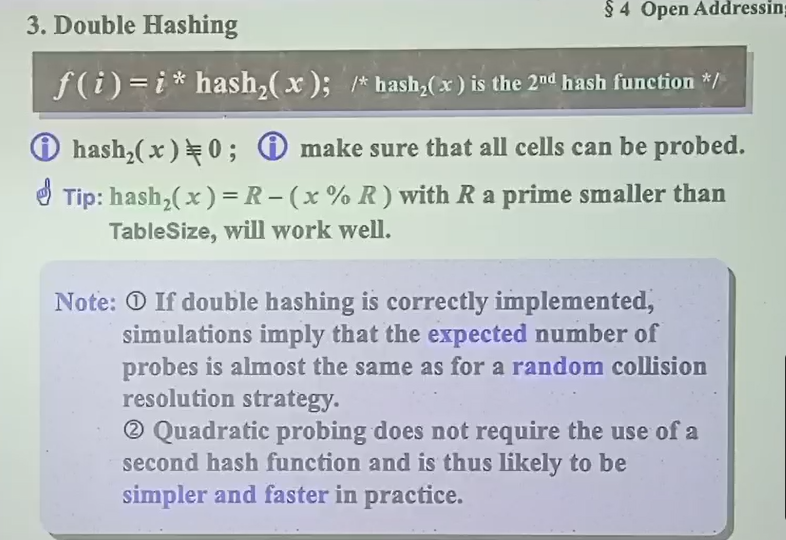

## 重哈希

$$O(N)$$

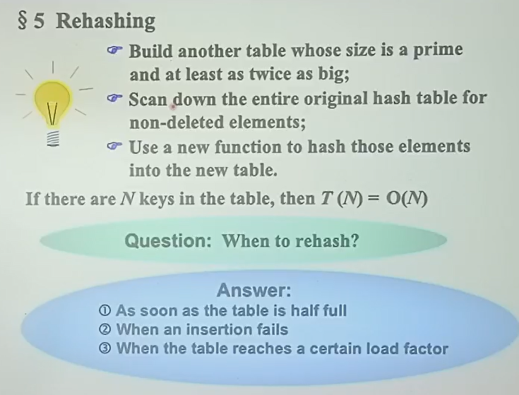

出现问题，重新建哈希表，填入原来元素，用新哈希函数填入其他

