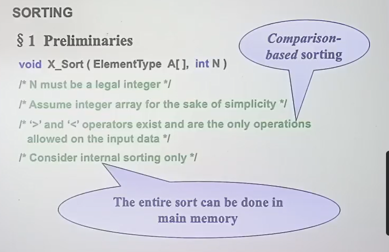

## 插入排序 insertion sort

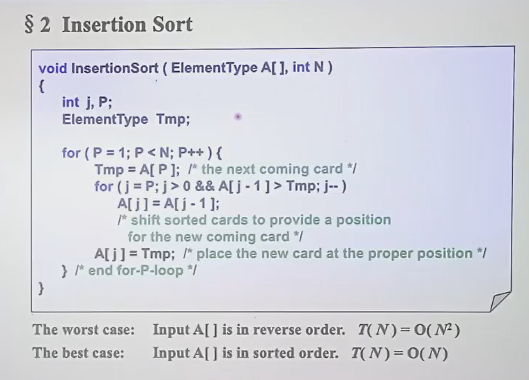

实例：摸牌

## 逆序对原理解释

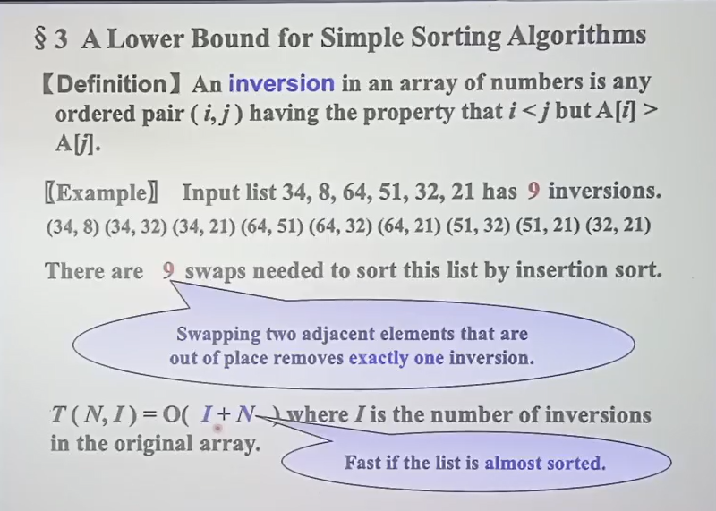

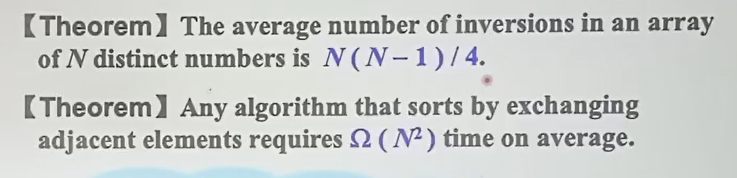

## 希尔排序 shell sort

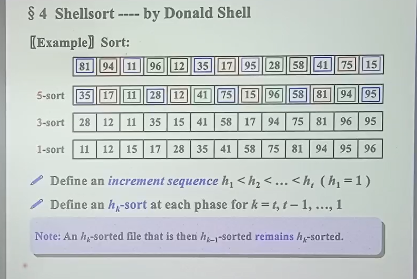

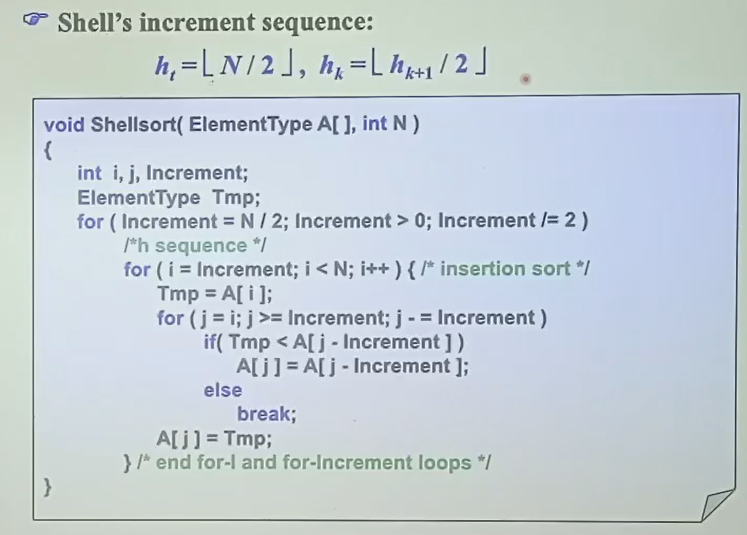

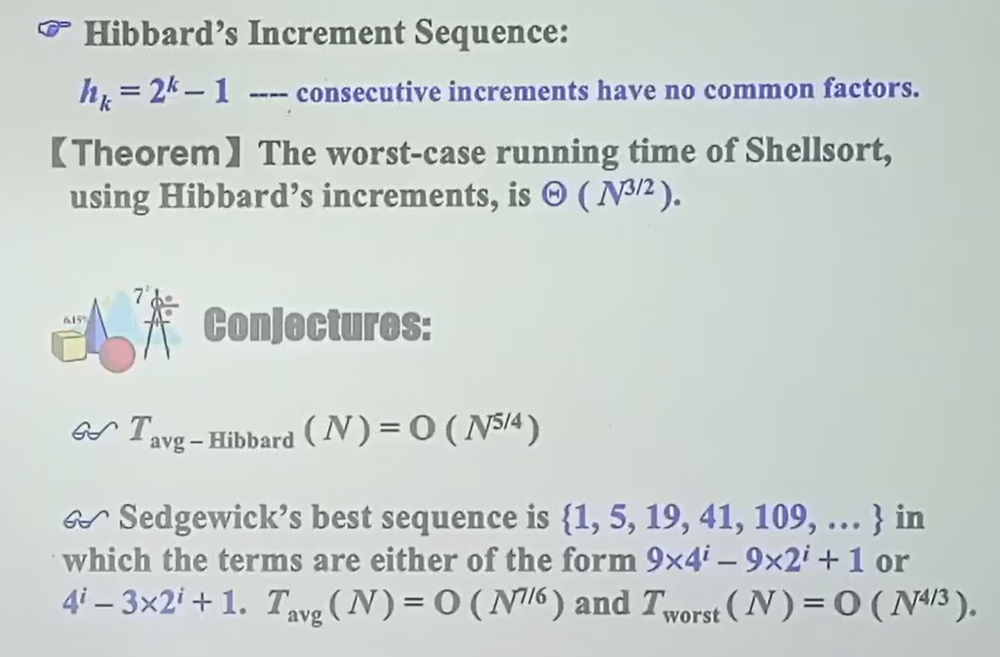

## 堆排序 heap sort

$$O(N \log N)$$

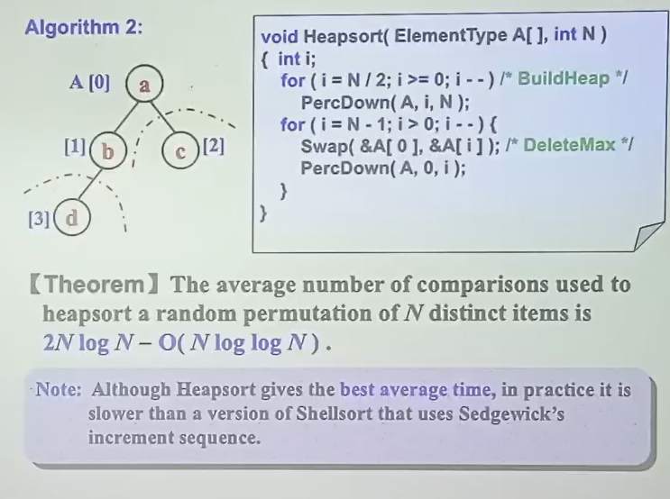

最大堆

1. 建堆

    1. 将所有元素填入堆
    2. 从第一个非叶节点开始perculate down
2. 依此delete max，将其放到最后

    1. 放到最后即将最上面和最后面交换
    2. 再percdown

给的数据是链表不能用，因为它基于数组

## 归并排序 merge sort

$$O(N \log N)$$

空间复杂度 $O(N)$

merge two sorted list

和链表合并思想一样

递归一下二分然后合并排序

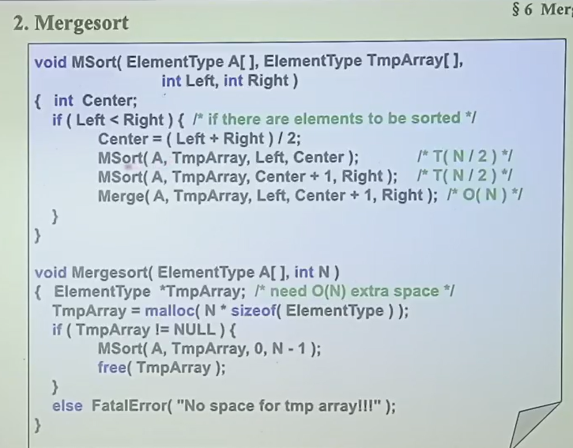
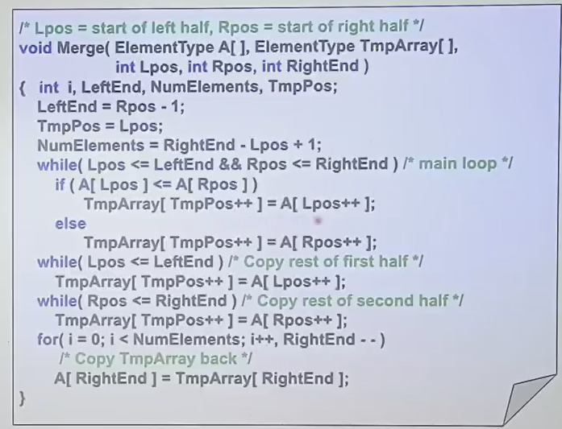

对cash友好

## 快速排序 quick sort

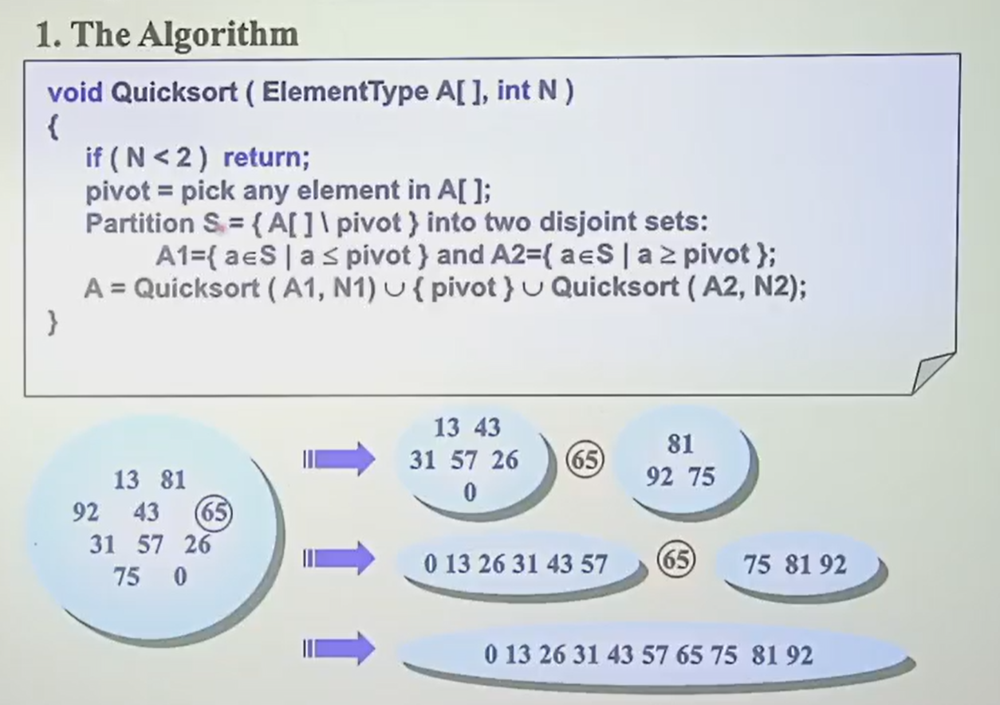

1. 找一个数字，两边划分
2. 两边递归

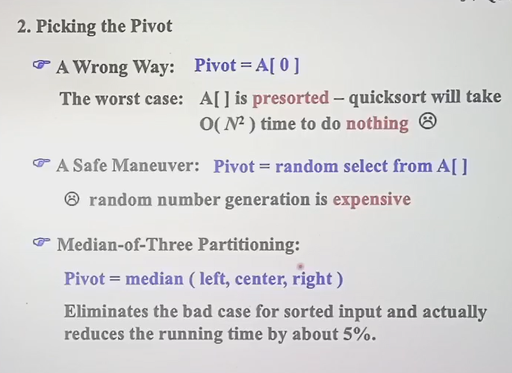

选择基准元素的方法：Mo3

## 小数据量

做选择：N小用插入排序

注意：递归过程中递归到数据量小时即切换

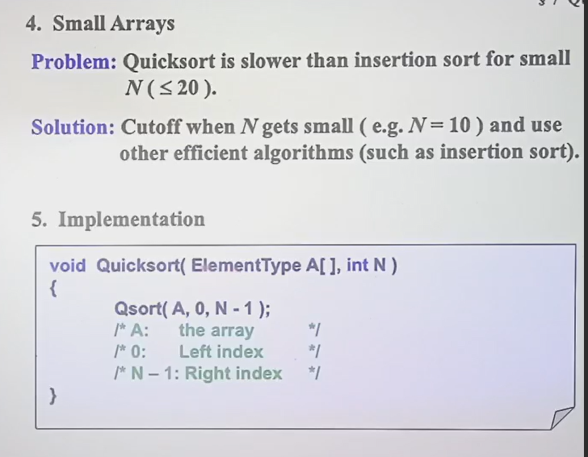
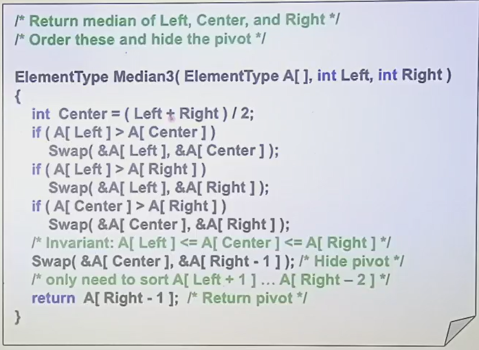
///caption
选取 pivot
///

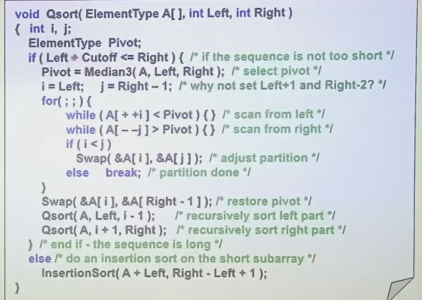
///caption
main func， mainly partition
///

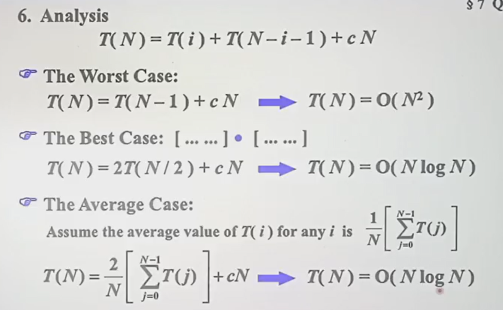

quick sort 选择第k大的数：$O(N)$

- 思路：判断在哪一边，递归

## 大数据的间接排序

**先排序再移动**

## 下界分析

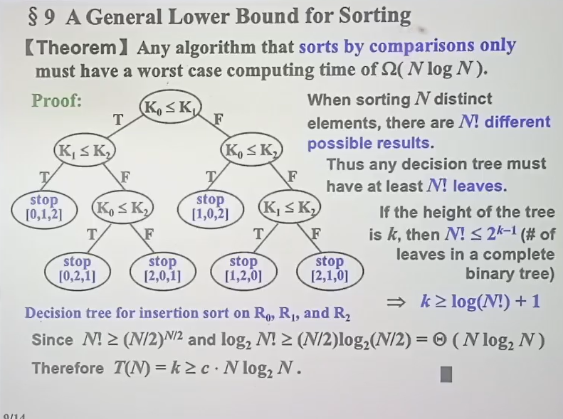

基于比较的排序worst case：$O(N \log N)$

## 桶排序

$m << n$

$$O(N)$$

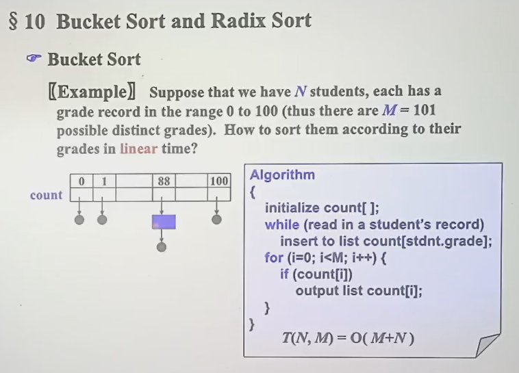

## radix sort

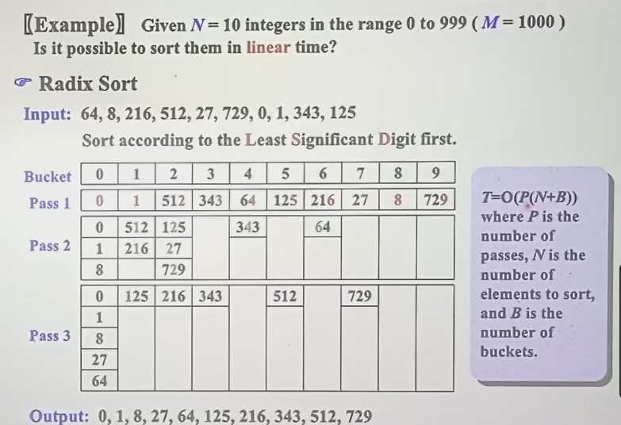

按每一位排

