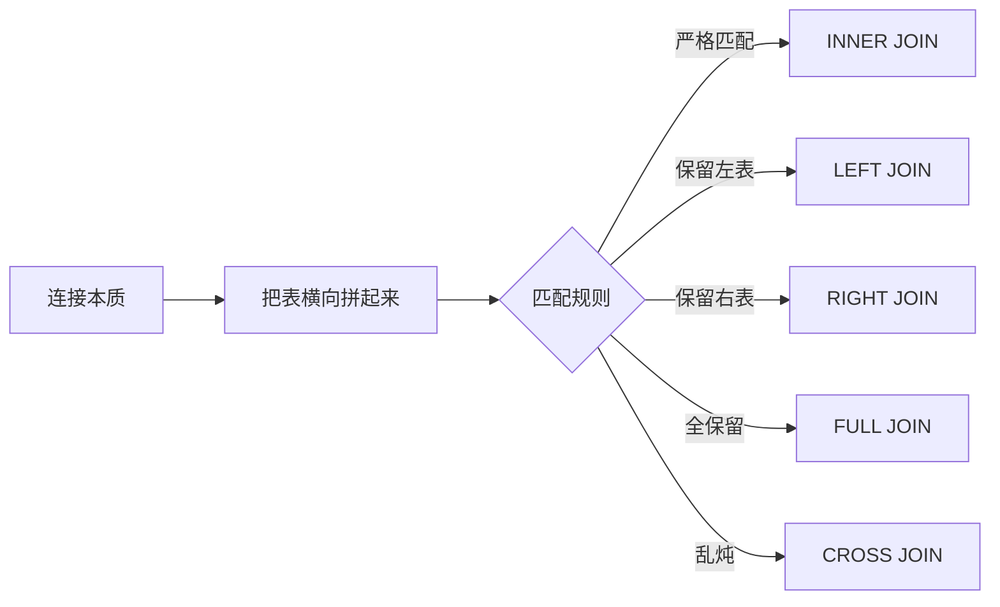

## 命令行操作数据库的核心指南

以PostgreSQL 的 `psql` 为例（其他数据库如 MySQL 原理类似）：

---

### 一、基础连接操作
| 命令 | 说明 | 示例 |
|------|------|------|
| 连接数据库 | `psql -U 用户名 -d 数据库名 -h 主机` | `psql -U cosmos -d mygo -h localhost` |
| 断开连接 | `\q` 或 `Ctrl + D` | 输入 `\q` 退出 |
| 切换数据库 | `\c 数据库名` | `\c postgres` 切换到 postgres 库 |
| 查看所有库 | `\l` | 显示所有数据库列表 |

---

### 二、表操作（核心）
| 命令 | 说明 | 示例 |
|------|------|------|
| **查看所有表** | `\dt` | 显示当前库所有表 |
| **查看表结构** | `\d 表名` | `\d demo` 查看 demo 表结构 |
| 创建表 | `CREATE TABLE 表名 (...)` | ```CREATE TABLE users (id SERIAL PRIMARY KEY, name VARCHAR(50));``` |
| 删除表 | `DROP TABLE 表名` | `DROP TABLE demo;` |
| 清空表数据 | `TRUNCATE TABLE 表名` | `TRUNCATE TABLE logs;` |

---

### 三、数据操作（CRUD）
| 操作 | 命令示例 | 说明 |
|------|----------|------|
| **插入数据** | `INSERT INTO 表名 VALUES (...);` | `INSERT INTO demo VALUES (1, 'John');` |
| **查询数据** | `SELECT * FROM 表名 [WHERE 条件];` | `SELECT * FROM users WHERE age > 18;` |
| **更新数据** | `UPDATE 表名 SET 列=值 [WHERE 条件];` | `UPDATE users SET name='Mike' WHERE id=1;` |
| **删除数据** | `DELETE FROM 表名 [WHERE 条件];` | `DELETE FROM logs WHERE date < '2023-01-01';` |

---

### 四、实用技巧
| 命令 | 作用 | 示例 |
|------|------|------|
| **查看执行时间** | `\timing on` | 显示 SQL 执行耗时 |
| 查看历史命令 | `\s` | 显示执行过的命令历史 |
| 执行外部 SQL 文件 | `\i 文件路径` | `\i /home/user/init.sql` |
| 输出到文件 | `\o 文件路径` | `\o result.txt` 之后查询结果存到文件 |
| 显示查询结果 | `\x` | 开启扩展显示模式（更适合宽表） |
| 事务控制 | `BEGIN;` `COMMIT;` `ROLLBACK;` | ```BEGIN; UPDATE...; COMMIT;``` |

---

### 五、权限管理
| 命令 | 说明 |
|------|------|
| 查看所有用户 | `\du` |
| 创建用户 | `CREATE USER 用户名 WITH PASSWORD '密码';` |
| 授权 | `GRANT ALL PRIVILEGES ON TABLE 表名 TO 用户名;` |
| 修改密码 | `ALTER USER 用户名 WITH PASSWORD '新密码';` |

---

### 六、高级操作
```sql
-- 1. 连接多个表查询（JOIN）
SELECT users.name, orders.amount 
FROM users 
JOIN orders ON users.id = orders.user_id;

-- 2. 创建索引（加速查询）
CREATE INDEX idx_name ON users (name);

-- 3. 备份数据库 (在系统命令行执行)
pg_dump -U cosmos mygo > backup.sql

-- 4. 恢复数据库
psql -U cosmos -d mygo < backup.sql
```

---

### 七、常用快捷键
| 快捷键 | 功能 |
|--------|------|
| **↑/↓** | 切换历史命令 |
| **Tab** | 自动补全表名/列名 |
| Ctrl + C | 终止当前操作 |
| Ctrl + R | 反向搜索历史命令 |
| \? | 查看所有 psql 命令帮助 |

---

### 八、学习路径建议
1. 先掌握：连接数据库、查看表(`\dt`)、查询数据(`SELECT`)
2. 再练习：创建表、插入/更新数据
3. 进阶：多表查询、事务控制
4. 管理：用户权限、数据备份

> 💡 **黄金法则**：所有破坏性操作（DELETE/DROP）前先用 SELECT 确认目标数据！

**示例工作流**：
```bash
# 连接数据库
psql -U myuser -d mydb

# 查看所有表
\dt

# 查询数据
SELECT * FROM products WHERE price > 100;

# 创建新表
CREATE TABLE orders (id SERIAL, product_id INT, quantity INT);

# 插入数据
INSERT INTO orders (product_id, quantity) VALUES (101, 5);

# 保存退出
\q
```




