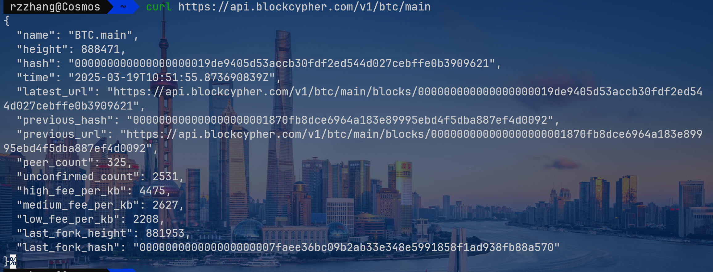

!!! info "陈建海"

    - 浙江大学超算队，2025暑假集训课陈建海老师带队
    - lab负责人：
        - 浙江大学智能计算创新创业实验室Ice-lab，大创
        - 浙江大学超算队-超算竞赛基地zjuspc-lab，2025暑假集训课
        - 智能计算与系统实验室Incas-lab
    - 协会
        - 浙江大学学生智能计算协会
        - 浙江大学学生区块链技术协会
    - Off. 玉泉曹202B，紫金港西2-407
    - Tel：13958011808
    - Email：chenjh919@163.com

    - 大三学生50w年薪~ 10w行代码~

课堂

- 语言：Go/Solidity
- 区块链是什么？
- 现实中哪些问题需要区块链？
- 智能合约开发
- 主流三大区块链：比特币、以太坊（公共链）、超级账本
- 教材推荐：

    

## 时代背景

- 互联网 —— App —— 大数据 —— 人工智能 all added
- 实体经济 / 数字经济
    - 数据价值化
        - 数据采集、确权、定价、交易
    - 数字产业化：软件/电信
    - 产业数字化：数据记录
    - 数字化治理

    

    - 云计算：虚拟化，用虚拟机提供计算服务
    - web1.0：互联网无交互功能（只读互联网）
    - web2.0：移动互联网
    - web3.0：VR/AR/MR、体验、密钥、数字孪生
    - 技术支撑：人工智能 + 区块链 + 物联网