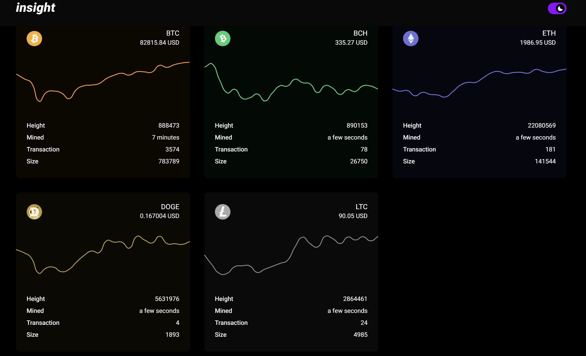
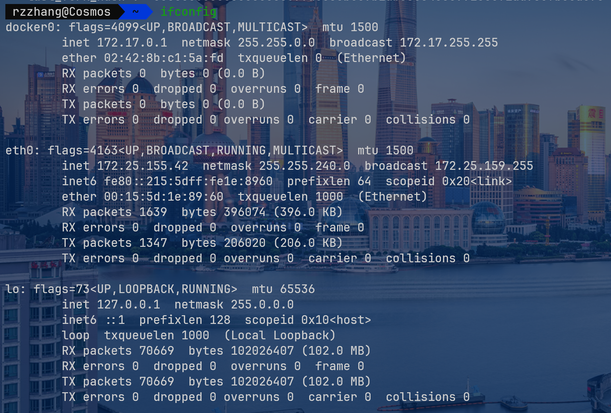

## 主流平台

[bitpay](https://insight.bitpay.com)



[blockstream explorer](https://blockstream.info)

数字币交易所：火币网、币安、

中国股票T + 1 交易

[上证指数](https://www.msn.cn/zh-cn/money/watchlist?tab=Related&id=adfh77&ocid=ansMSNMoney11&duration=1D&src=b_secdans&relatedQuoteId=adfh77&relatedSource=MlAl)


## 数字币开发

### API

实现量化交易：通过API（量化交易主要技术），用户与交易系统进行交互

- API是一种程序，相当于函数，实现多个软件的连接
- API是一个信使，接受请求并告诉系统用户需要做什么，并将系统信息返回给用户
- 交易所提供API支持

[API交易-知乎](https://zhuanlan.zhihu.com/p/40037681)

[blockcypher官方API文档](https://www.blockcypher.com/dev/bitcoin/#introduction)，首先申请token

### 技术基础

```shell
curl https://api.blockcypher.com/v1/btc/main?token=$TOKEN
# 如果需要token，这样访问api
```

目标：做一个网站，在web端返回调用API得到的信息

`curl`返回值是json格式

与外部对接：部署php + mysql + apache，结合API，将获取的数据返回数据库显示在网页

json轻量级文本数据交易格式

client处发送请求到server，把网页地址返回

我这里Ubuntu虚拟机就是充当server，IP就是server的地址，在终端用`ping`访问，浏览器直接访问IP地址 在客户端用`ssh`远程登录到服务端

命令行`ssh`访问

**菜鸟教程** LAMP（linux apache mysql php）+ html css js OS 这几个都菜鸟一把~ ——> 全栈，搞个小兼职 学学vue

读一读linux的cpu管理/进程管理/内存管理的代码，修改修改，把它瘦身搞一个嵌入式系统



```php
<?php
// 调用 BlockCypher API 获取比特币最新区块高度
function getBitcoinBlockHeight() {
    try {
        // BlockCypher 比特币主链信息 API 端点
        $apiUrl = 'https://api.blockcypher.com/v1/btc/main';
        
        // 使用 cURL 发送 GET 请求
        $ch = curl_init();
        curl_setopt($ch, CURLOPT_URL, $apiUrl);
        curl_setopt($ch, CURLOPT_RETURNTRANSFER, true);
        curl_setopt($ch, CURLOPT_SSL_VERIFYPEER, true); // 生产环境建议保持 SSL 验证
        curl_setopt($ch, CURLOPT_TIMEOUT, 10); // 设置超时时间为10秒
        
        $response = curl_exec($ch);
        
        // 检查 cURL 错误
        if (curl_errno($ch)) {
            throw new Exception('cURL 错误: ' . curl_error($ch));
        }
        
        // 检查 HTTP 状态码
        $httpCode = curl_getinfo($ch, CURLINFO_HTTP_CODE);
        if ($httpCode !== 200) {
            throw new Exception("API 请求失败，HTTP 状态码: $httpCode");
        }
        
        curl_close($ch);
        
        // 解析 JSON 数据
        $data = json_decode($response, true);
        if (json_last_error() !== JSON_ERROR_NONE) {
            throw new Exception('JSON 解析失败: ' . json_last_error_msg());
        }
        
        // 提取区块高度
        if (isset($data['height'])) {
            return $data['height'];
        } else {
            throw new Exception('API 返回数据中未找到区块高度');
        }
        
    } catch (Exception $e) {
        // 处理异常，可根据需要记录日志或返回错误信息
        return '错误: ' . $e->getMessage();
    }
}

// 执行并输出结果
$blockHeight = getBitcoinBlockHeight();
echo "最新比特币区块高度: " . $blockHeight;
?>
```

