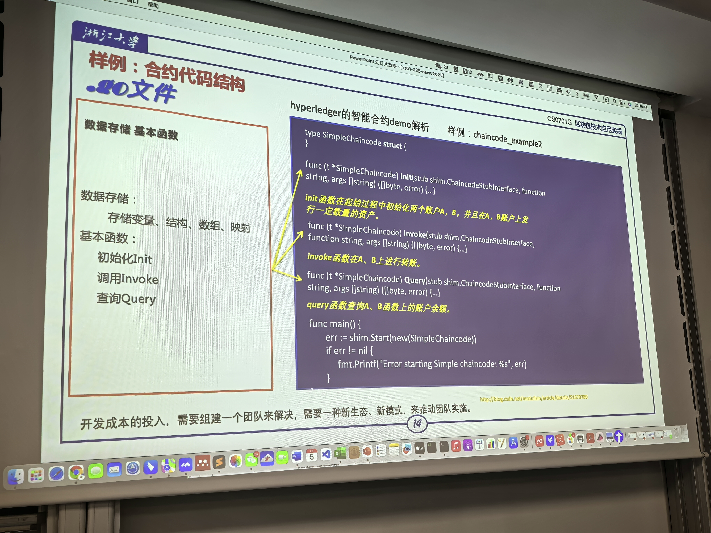

应用的关键技术：智能合约 + 区块链

## 智能合约

### 定义

是基于多方协作的业务描述规则写出来的运行在区块链系统中的能够自动校验逻辑正确性的程序代码。（相当于规则，例如让机器打麻将，得写一个代表规则的程序

$$规则 == 合约，电脑上跑的规则程序 == 智能合约$$

相应业务有相应规则，例如比特币只能干支付不能打麻将，需要其他应用场景（业务）则需要引入其他智能合约

写区块链：几个虚拟机，联网，写处智能合约程序，跑起来

- BitCoin比特币：公链，交易系统，不支持智能合约
- Ethereum以太坊：公链，支持部署智能合约，基本是全功能
- Hyperledger Fabric超级账本：联盟链，企业级应用

区块链用智能合约干活，区块链保证智能合约执行任务过程不可篡改


发一个请求，放到合约里面，通过智能合约，通过区块链网络，传递信息

合约是什么？

这是一个简单的合约模板

```go
type SimpleChainCode struct {

}

func (t *SimpleChainCode) Init(stub shim.ChaincodeSuubinterface, function string, args[]string)([]byte, error){

}

func ()
```



### 合约的部署

通过一个请求，将合约上传到区块链

合约本身也是数据，不可篡改

### 调用

合约上链之后调用合约即为调用

区块链生态：取之于民，用之于民 形成纳什均衡；其中的资金链要搞明白

## 实际应用

可编程货币 —— 可编程金融 —— 可编程社会

<!-- 杭州云象网络技术有限公司 ：陈建海的学生创办-->
<!-- 打比赛~ -->


### 供应链金融

多级资金流转问题多，区块链保证数据共享

区块链开发的成本 —— 抵消之前效率低的问题，也可通过提高售价的方式解决

系统部署：每个公司都是一个节点，通过区块链上传（挂上去）相关数据

银行搞区块链：为了不用swift进行跨境交易
