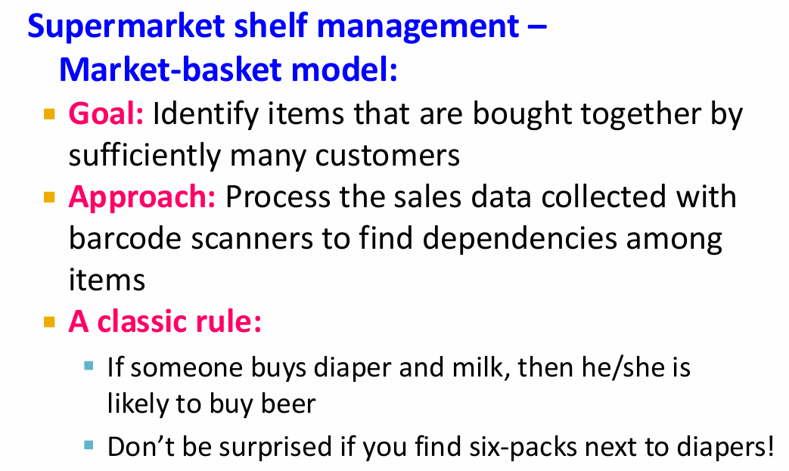
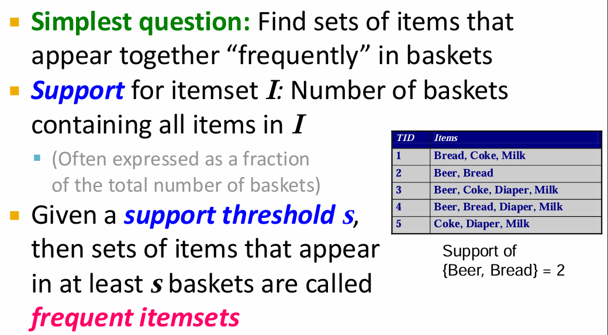
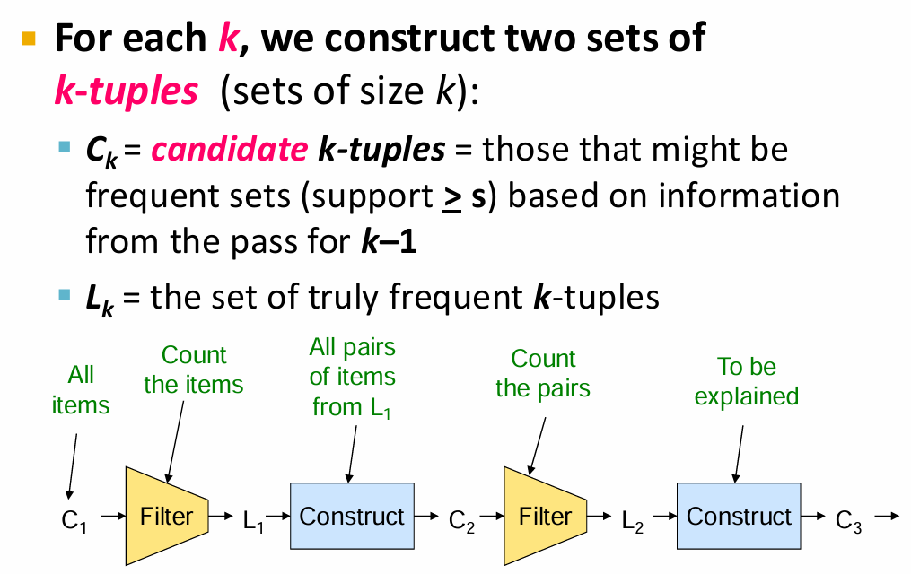
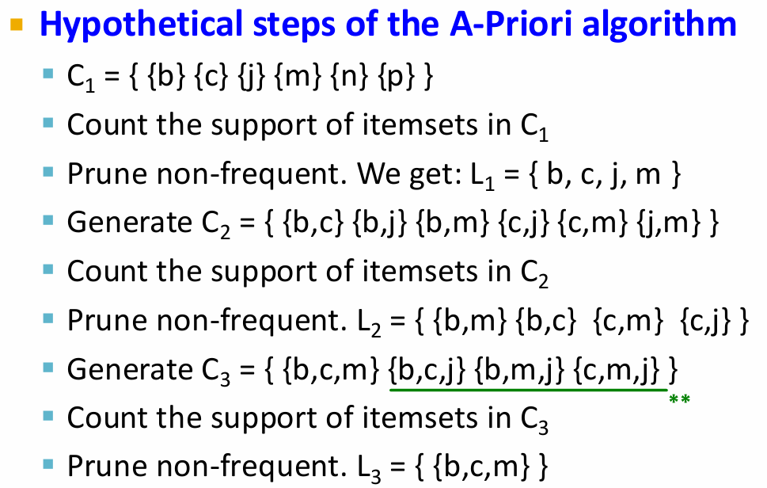

## Association Rule Discovery

Association rule discovery is a popular and well-researched method for discovering interesting relations between variables in large databases. It is intended to identify strong rules discovered in databases using different measures of interestingness. The classic example is market basket analysis, where one seeks to discover associations between different items purchased by customers.



### the Market-Basket Model

元素：

- A large set of items (e.g, things sold in a supermarket)
- A large set of baskets (e.g., things a customer buys on one day), **each basket is a subset of items, 每个basket都是由一些item组成**
- Association rules: e.g., people who bought {x, y, z} tend to buy {v, w}

Input / Output:


本质是：多对多映射


Applications:


plagiarism: 抄袭

## Definitions

### Frequent Itemsets

An itemset is a set of items. An itemset that contains k items is called a k-itemset. The support count (or simply support) of an itemset is the number of transactions in the database which contain the itemset. An itemset is said to be frequent if its support is greater than or equal to a user-specified minimum support threshold.



Itemset: 一个包含若干 item 的集合 set

Suport: 在所有 set 中某个 itemset 出现的次数（是多少个 set 包含这个 itemset）

Support threshold: 用户指定的一个阈值，只有 support 大于等于这个阈值的 itemset 才被认为是 frequent itemset

### Association Rules

**If the basket contains A, then it is likely to contain B as well.**

An association rule is an implication expression of the form A -> B, where A and B are disjoint itemsets (i.e., A ∩ B = ∅). The rule A -> B holds in the transaction set D with support s and confidence c if s% of transactions in D contain A ∪ B, and c% of transactions in D that contain A also contain B.

$$ conf(A \rightarrow B) = \frac{support(A \cup B)}{support(A)} $$


#### Interest of an association rule A->B:

如果每个 set 中包含 B 的概率和包含 A 的概率无关，那么 A->B 就不有趣。比如说每个集合都包含 B，那么无论 A 是什么，A->B 都是成立的，但是这个规则并没有什么意义。

$$ interest(A \rightarrow B) = |conf(A \rightarrow B) - Pr[B]| $$

abs. difference between its confidence and the fraction of baskets that contain j.

Interesting rules: those with high interest values (usually above 0.5)

很大的负数代表很强的不 interesting，即有 A 就没有 B。


两个步骤：


1. Find all frequent itemsets in the database.
2. Generate strong association rules from the frequent itemsets.

    1. For each frequent itemset I, for each non-empty subset A of I, output the rule $A \rightarrow I | A$ ( $I | A$ 就是 $C_I A$ ) if it meets the minimum confidence threshold. 这里其实就是反过来的逻辑，前面是一个集合并另外一个，现在是找到并起来的集合，然后拆分成两个部分。
    
    2. {;A, B} 出现的概率一定比 {A, B, C} 大，所以 $conf(A, B \rightarrow C, D) \ge conf(A, B, C \rightarrow D)$

#### Find All Frequent Itemsets

strategy: item 大小（集合的秩）从小到大增长，即先找频繁出现的 1-itemset，再根据刚刚的结果找 2-itemset，以此类推。

cost：需要 scan throw the dataset 的次数


main-memory 大小是主要限制因素，所以目的是：只扫描 things at the end will be as judged as frequent itemsets. 即只扫描 likely to be frequent 的 itemsets, and if it is not likely to be frequent, we do not want to scan it.


intuitions to the approach: 首先产生所有可能的 pairs，然后记录频繁出现的


储存所有 pair 的方法：

1. Triangular Matrix 适合数据量大且符合条件的 pair 很多的情况

    实现方案：
    - preallocate a 2D array of size n*n, where n is the number of items: 首先预分配空间
    - for each transaction, increment the count for each pair in the transaction：在每个格子里写数量

    空间占用：$O(n^2)$

2. Dictionary 适合符合条件的 pair 很少的情况

    实现方案：
    - 每个 pair 元素的组成：(item1, item2) -> count 或者 (item1,item2,count)

    空间占用：$O(k)$, k 是符合条件的 pair 数量，每个 pair 占用 12 bytes（因为每个 item 用 4 bytes 表示）


Approach 2 beats Approach 1 if less than 1/3 of possible pairs actually occur

注意这里是：实际会出现的 pair 数量 / 所有可能的 pair 数量 < 1/3。实际会出现，用超市购物的例子：买了 A 的人都没有买 B ，那么 (A, B) 这个 pair 就不会出现，但是 (A, B) 的确是一个可能的 pair。

### A-Priori Algorithm

A intuitive: 如果 A 是 frequent itemset，B 是 frequent itemset，那么 A ∪ B 也是 frequent itemset。如果 A ∪ B 不是 frequent itemset，那么 A 和 B 至少有一个不是 frequent itemset。

Key idea: If a set of items apperars at least S times, then all of its subsets must also appear at least S times.



第 1 步：找到频繁 1-项集（单个元素）

* 扫描一次数据库，统计每个元素的出现次数（即支持度）。
* 过滤掉不满足最小支持度的项。

👉 得到 **L₁**：所有频繁 1-项集。

第 2 步：生成候选 2-项集

* 用 L₁ 中的元素两两组合，得到候选集合 **C₂**。
* 再次扫描数据库，计算每个 2-项集的支持度。
* 筛选出频繁的 2-项集，得到 **L₂**。

第 3 步：迭代生成更大的项集

* 从 L₂ 生成候选 3-项集（C₃），再筛选出频繁的 L₃；
* 从 L₃ 生成 C₄，得到 L₄；
* 直到没有更多频繁项集。

算法流程如下：

```
L1 = 所有频繁1项集
k = 2
while L(k-1) 非空:
    Ck = 由 L(k-1) 生成候选项集（连接+剪枝）
    计算 Ck 的支持度
    Lk = 满足最小支持度的项集
    k = k + 1
return 所有 Lk 的并集
```



生成三元组的方法

1. 找两个二元组，如果其中有一个元素相同，就合并成三元组

    e.g., {A, B} and {A, C} -> {A, B, C}

2. 剪枝：检查新生成的三元组的所有二元子集是否都在 L₂ 中出现过。如果有任何一个子集不在 L₂ 中，那么这个三元组就不可能是频繁项集，可以直接丢弃。

frequent itemsets: 频繁项集

### PCY(Park-Chen-Yu) Algorithm

PCY 算法是对 A-Priori 算法的改进，旨在减少候选项集的数量，从而提高挖掘频繁项集的效率。它通过使用哈希表来压缩数据，从而减少内存使用和计算开销。

将多个 pair 放入一个 hash bucket：

- 如果 bucket 的 count 超过了 threshold，那么这个 bucket 就是“frequent”的，bucket 里的所有 pair 都**有可能**是 frequent itemsets
- 如果 bucket 的 count 没有超过 threshold，那么 bucket 里的所有 pair 都不可能是 frequent itemsets，可以直接丢弃

实现方式：

1. First Pass: 创建 hash table, 包含 buckets, 用一个标签 bit vector 来标记哪些 bucket 是 frequent 的，即 1 表示 frequent, 0 表示 infrequent。
2. Second Pass: 只考虑那些 hash 到 frequent buckets 的 pairs 作为 candidate itemset。


是有足够的 memory 来存储所有 pairs 的。

显然需要很多 buckets 来减少 collisions: 

这里面的 collisions 指的是不同的 pair 被 hash 到同一个 bucket 里，当 bucket 太少的话，会导致很多不同的 pair 被 hash 到同一个 bucket 里，从而增加误判的概率，即好多 pair 在一起放在一个 bucket 里，导致这个 bucket 的 count 超过了 threshold，但是实际上这些 pair 中有很多并不是 frequent itemsets。

### Multistage Algorithm

Multistage Algorithm 是对 PCY 算法的进一步改进，旨在通过多次哈希来进一步减少候选项集的数量，从而提高挖掘频繁项集的效率。


Multistage 的运行流程

🩵 Step 1：第一次扫描（Stage 1）

和 PCY 一模一样：

1. 扫描所有交易；
2. 统计每个单个项的出现次数；
3. 对每个项对 `(i, j)` 用 **哈希函数 h₁** 映射到哈希桶；
4. 统计每个桶的计数；
5. 用最小支持度阈值 `min_sup` 决定哪些桶是“频繁桶”（bit=1）。

得到结果：

* `L₁`: 频繁 1-项集；
* `bitmap₁`: 第一个哈希函数 h₁ 的频繁桶位图。

🩷 Step 2：第二次扫描（Stage 2）

这一步是 PCY 没有的额外阶段 💡

在生成候选 2-项集时：

1. 仅考虑那些满足以下条件的项对：

   * 两个单项都在 `L₁`；
   * 且该项对 `(i, j)` 哈希到 **频繁桶 in bitmap₁**。
2. 对这些项对，再使用一个**新的哈希函数 h₂**，映射到新的哈希表。
3. 统计第二个哈希表的桶计数。
4. 生成新的位图 `bitmap₂`，表示第二阶段的频繁桶。

🧡 Step 3：第三次扫描（Candidate Counting）

现在我们要决定第二次扫描要数哪些项对。

在 Multistage 算法中，**只有那些项对满足以下条件才会被保留为候选项对 C₂：**

> (i, j) 满足：
>
> * i, j 都在 L₁（频繁 1-项）
> * 哈希到频繁桶 in bitmap₁（第一阶段）
> * 哈希到频繁桶 in bitmap₂（第二阶段）

这样，就相当于：

> 候选项对 ∈ (频繁桶₁ ∩ 频繁桶₂)

### Multihash Algorithm

🔩 三、Multihash 算法的执行流程

🩵 Step 1：第一次扫描数据库

对每个交易中的所有项对 `(i, j)`：

1. 使用多个哈希函数（例如 h₁, h₂, h₃）：

   ```
   bucket1 = h₁(i, j) % B₁
   bucket2 = h₂(i, j) % B₂
   ...
   ```
2. 分别在多个哈希表中记录这些桶的计数：

   ```
   table₁[bucket1] += 1
   table₂[bucket2] += 1
   ...
   ```

这样我们会得到：

* 若干个哈希表（table₁, table₂, ...）
* 每个表都有自己的计数桶数组。

🩷 Step 2：标记频繁桶（Frequent Buckets）

对每个哈希表：

* 如果某个桶的计数 ≥ 最小支持度 `min_sup`，
  就在对应的位图 bitmap 中标记为 `1`（频繁）。

得到多个位图：

```
bitmap₁, bitmap₂, bitmap₃, ...
```

🧡 Step 3：生成候选项对（Candidate Generation）

在第二次扫描时，只保留那些项对 `(i, j)` 满足：

> 对所有哈希表 t：
>
> ```
> h_t(i, j) 哈希到的桶 ∈ frequent buckets
> ```
>
> 也就是说，这个项对必须在**所有哈希表中都落在频繁桶**里，
> 才能进入候选集 C₂。

💛 Step 4：第二次扫描

对剩下的候选项对（更少了）重新统计支持度，
筛选出真正的频繁 2-项集 L₂，
然后像 Apriori 一样生成更高阶项集。

