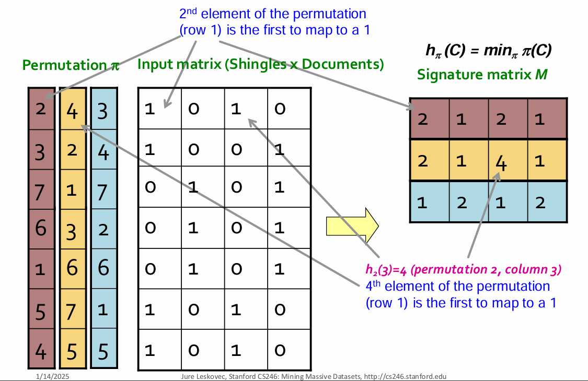
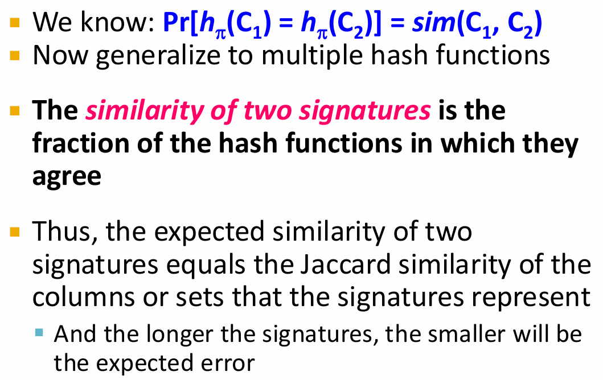

## Min-Hasing

Min-Hashing 是 LSH 的一种哈希方法



Permutation: 对所有可能的元素进行随机排列

从顺序为 1 的开始，当扫描到第一个 shingle 为 1 的元素时，记录下该元素的顺序号作为该 document 的 Min-Hash 值

注意，在格子里记录的顺序号可以是 permutation 之后的顺序号，也可以是原始的顺序号，只要保证统一即可


!!! question "为什么这个方法能成立能使用"

    目的是让两个 Jaccard 相似度高（Jaccard 距离小）的document，即列分到一个 bucket 中，严谨地说，Jaccard 概率与分到一个 bucket 的概率（哈希值相等）相等，遇事要找一个算哈希值的方法，使得哈希值相等的概率等于 Jaccad 概率。

    在这里面，bucket 的顺序只要固定就好
    
    那么这个方法：因为两个集合的 Jaccard 相似度等于它们的 Min-Hash 值相等的概率，即：

    $$ P(h_{min}(A) = h_{min}(B)) = J(A, B) $$

    ???- info "proof"

        **模型与假设（前提很重要）**

        * 有一个**全集** (U)（包含所有可能的元素），集合 (A,B\subseteq U)。
        * 我们选一个**随机的全排列（random permutation）** (\pi) 对全集 (U) 做随机排序；每个排列等概率。
        * 对集合 (S) 定义 MinHash：
        [
        h_\pi(S) = \arg\min_{x\in S} \pi(x)
        ]
        即在排列 (\pi) 下，集合 (S) 中排位最靠前（最小）的元素。
        * 假设没有“平局”：每个元素的顺序都严格（全排列保证）。

        目标证明：对随机排列 (\pi)，事件 (h_\pi(A)=h_\pi(B)) 的概率等于 (J(A,B))。

        ---

        **直观概率证明（最核心的一步**

        考虑集合 (A) 与 (B) 的并集 (U_{AB}=A\cup B)。在随机排列 (\pi) 中，(U_{AB}) 中的元素在排列中的**最先出现的那个元素**是谁，是由随机排列决定的。

        **关键观察**：在随机全排列下，(U_{AB}) 中“第一个出现的元素”对所有 ( |U_{AB}| ) 个元素是**等概率**的 —— 因为排列是完全随机的，任何位置的分布是对称的。

        因此，第一个出现的元素落在 (A\cap B) 的概率就是：
        [
        \frac{|A\cap B|}{|A\cup B|}.
        ]

        而当且仅当这个“第一个出现的元素”属于 (A\cap B)，我们才有 (h_\pi(A)=h_\pi(B))：

        * 若第一个出现的元素 (x\in A\cap B)，那么它在 (A) 中是最小的，也在 (B) 中是最小的，因此 (h_\pi(A)=h_\pi(B)=x)；
        * 反之若第一个出现的元素属于 (A\setminus B)（或 (B\setminus A)），则它只会成为 (A)（或 (B)）的最小元素，而不会同时是另一个集合的最小元素，因而 (h_\pi(A)\neq h_\pi(B))。

        于是直接得到：
        [
        \Pr[h_\pi(A)=h_\pi(B)] = \Pr[\text{first element of }A\cup B\text{ lies in }A\cap B] = \frac{|A\cap B|}{|A\cup B|}.
        ]

Jaccard 的全称是：Jaccard Similarity，相似度，就是概率

###　Signature

Min-Hashing 生成的哈希值叫做 Signature



用的 permutation 越多，signature 越长（两者是相等的），效果越好，即分桶策略的本质就是概率，那么样本量多，频率越接近真实概率

### Implementation


## LSH

LSH 的目标是用一个 hash function 判断 x,y 是否是 candidate pair


这一步是操作 signature，每个 document 的 signature 是 一列！


将 signature 分成 b 个 band，每个 band 有 r 行


What b and r do?

convert a linear similarity to a function that is very steep (because we it is the image of $1 - (1 - t^r)^b$), and we can adjust the steepness by changing b and r. Also, the more hash functions we use (i.e., the longer the signature), the more accurate our approximation of the similarity will be.


蓝色区域：false negative，即他们是相似的，但是没有被分到同一个 bucket 里，很坏
橘色区域：false positive，即他们不相似，但是被分到同一个 bucket 里，还好，哈希函数不变的情况下通过提高 s 可以减少 false positive

用完 b / r 之后：

🪣 三、核心操作：将每个 band 的 r 个哈希值“打包”并哈希到桶中

对每个文档（或集合）的第 (i) 个 band：

1. 取出该 band 的 (r) 个哈希值；
2. 把它们组合成一个 tuple 或字符串：

   $$
   \text{band-signature}_i = (h_{i1}, h_{i2}, \ldots, h_{ir})
   $$

3. 用一个哈希函数（例如 Python 中的 `hash()` 或 MurmurHash、MD5、SHA1 等）
   把这 (r)-tuple 映射到一个整数 bucket ID：
   $$
   \text{bucket-id} = \text{hash}(\text{band-signature}_i)
   $$

所有哈希到同一个 `bucket_id` 的文档，就认为它们在这个 band 上是“相似”的（candidate pair）。

🧠 四、伪代码示例

```python
for band in range(b):
    buckets = {}
    for doc_id, signature in enumerate(signatures):
        # 取出该文档第band个band的r个哈希值
        start = band * r
        end = start + r
        band_signature = tuple(signature[start:end])
        
        # 用哈希函数将该band_signature映射到桶
        bucket_id = hash(band_signature)
        
        # 将文档ID放入对应桶中
        buckets.setdefault(bucket_id, []).append(doc_id)
    
    # 该band中同一个桶内的所有文档是候选pair
    for docs in buckets.values():
        if len(docs) > 1:
            generate_candidate_pairs(docs)
```

这里：

* `signatures` 是所有文档的 MinHash 签名矩阵；
* `hash()` 是哈希函数（可以换成 MurmurHash、SHA-1 等更稳定的函数）；
* 同一个桶中的文档是候选对（candidate pairs）。

🔍 五、之后的步骤：候选对验证（Candidate Verification）

经过所有 (b) 个 band 之后：

* 任何两个文档，只要在任意一个 band 的同一个桶中，就成为**候选相似对（candidate pair）**；
* 接下来要在候选对集合上进行**精确计算**（例如直接计算 Jaccard 相似度），来过滤掉假阳性（false positives）。
    * 对候选对进行 多 band 筛选，即要求两个文档有更多 band 在同一个 bucket 中；
    * 更多 band 中匹配意味着更高的概率它们的整体相似度较高；

伪代码示例：

```python
for (doc_i, doc_j) in candidate_pairs:
    sim = jaccard_similarity(docs[doc_i], docs[doc_j])
    if sim >= threshold:
        print(f"{doc_i} and {doc_j} are similar, sim={sim}")
```

🔢 六、总结整个流程（完整管道）

| 阶段                          | 操作                        | 说明                 |
| --------------------------- | ------------------------- | ------------------ |
| **1. MinHash**              | 计算每个文档的 MinHash 签名        | 把集合/文档转为长度 n 的哈希签名 |
| **2. Banding**              | 分成 b 个 band，每个 band 含 r 行 | 局部对比的基础            |
| **3. Hash to buckets**      | 对每个 band 的签名 tuple 进行哈希   | 将 band 映射到桶，生成候选对  |
| **4. Candidate generation** | 同桶文档成为候选对                 | 高速筛选潜在相似文档         |
| **5. Verification**         | 精确计算 Jaccard 相似度          | 过滤误报，输出真正相似文档      |

🧮 七、常用的哈希函数

在真实系统中，`hash()` 可以换成：

* **MurmurHash**（速度快，碰撞率低）；
* **SHA-1** 或 **MD5**（更稳定，但稍慢）；
* **cityhash / farmhash**（Google 内部常用）；
* 在 Spark、Hadoop 等系统里，通常会有内置的哈希映射函数。
