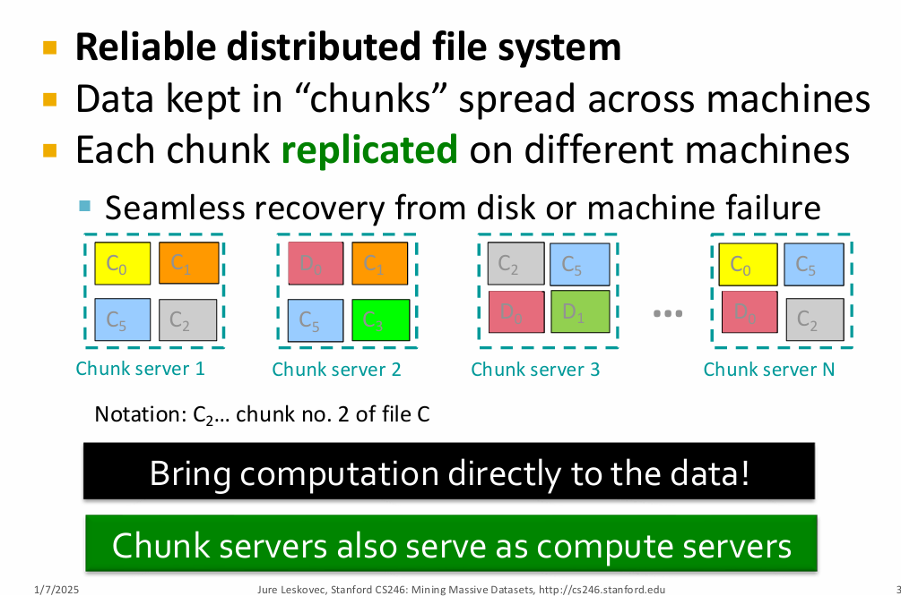
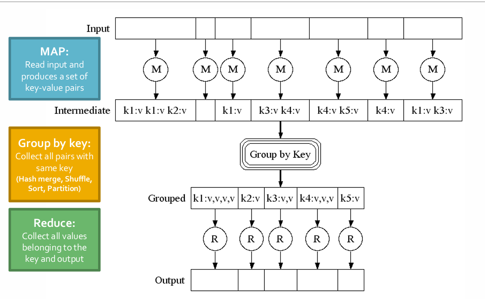
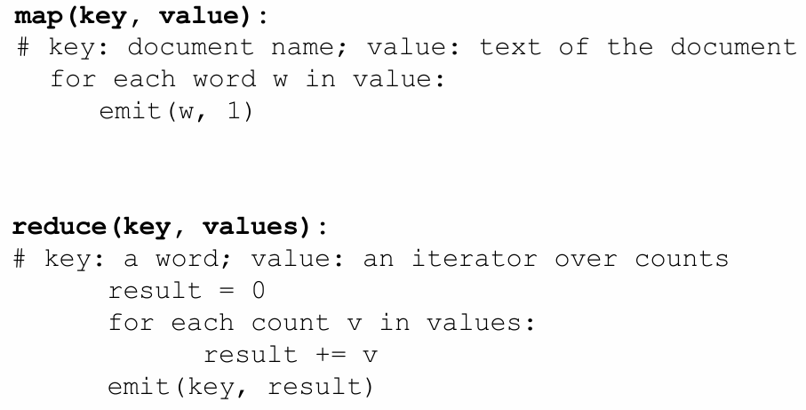
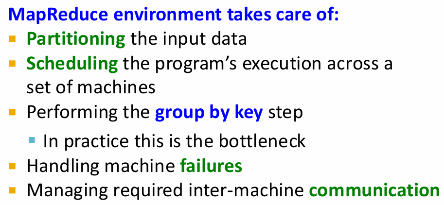
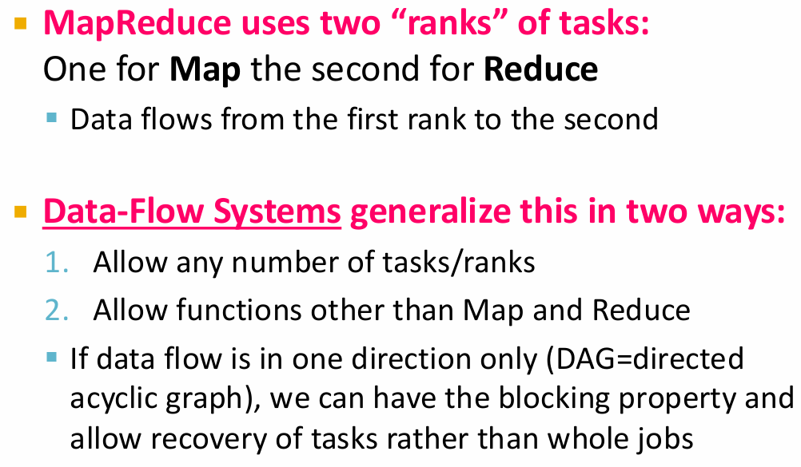
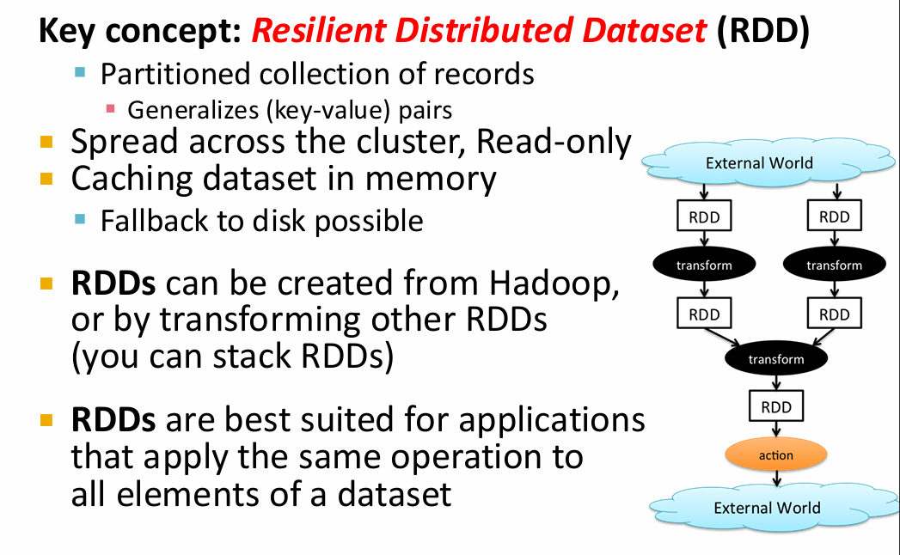
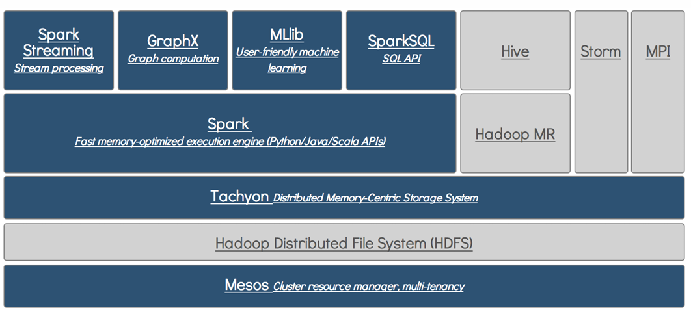

## 分布式文件系统 distributed file system

The core slide:



核心：

📦 数据块（Chunk / Block）

- 每个大文件会被拆分成固定大小的块（例如：

- GFS（Google File System）默认一个 chunk 为 64MB；

- HDFS（Hadoop Distributed File System）默认一个 block 为 128MB 或 256MB）。

- 每个块会被冗余存储在多个节点上（比如 HDFS 默认存三份副本）。

⚙️ 数据访问流程（举例：HDFS）

- 客户端请求文件元信息 → NameNode。

- NameNode 返回文件的块列表及每块所在的 DataNode。

- 客户端直接与 DataNode 通信，读取或写入对应块的数据。

- 系统自动处理副本、负载均衡、恢复。

分布式文件系统（Distributed File System, DFS）是一种允许用户在网络中的多台计算机上存储和访问文件的系统。它通过将数据分散存储在多个节点上，提高了数据的可用性、可靠性和访问速度。常见的分布式文件系统包括HDFS（Hadoop Distributed File System）、Google File System（GFS）等。

当machine goes down，网络传输慢，可以通过，replication（数据复制）和data locality（数据本地化）来解决。

写程序时候不用关心数据存储、数据分区

### Chunk Server

每个块被复制到多个chunk server上。

### Name Node

存一个map of the files

Name Node负责管理文件系统的元数据，包括文件和目录的结构、文件块的位置等。它维护一个映射表，记录每个文件对应的块以及这些块存储在哪些chunk server上。

The chunk sever also serve as compute server, which avoid the data transfer over network or leave the server.

## Programming Model

### Map Reduce

三个阶段：

1. Map Phase: 将输入通过程序映射成一系列的键值对（key-value pairs）。需要 programmer 编写Map函数来定义映射逻辑。

2. Groupe by key Phase: 根据上一步骤得出的键值对将数据按键进行分组，结果是每个键对应好多值，然后有好多键。这一步是系统自动执行的。

3. Reduce Phase: 对每个键及其对应的值进行归约操作（提取有效信息），生成最终的输出结果。需要 programmer 编写Reduce函数来定义归约逻辑。

三个阶段：前一个阶段都结束之后，下一个阶段才开始。

在不同分区上并行执行 map 和 reduce 任务，提高处理大规模数据的效率。




如果有一个 server 上面的 chunk 特别慢，由于其他 server 上面有相同的 chunk，可以从其他 server 上面读取数据，直接 kill 掉慢的那个进程，避免等待。

Example: Word Count

Input: A set of documents

Output: A list of (word, count) pairs

Map Function:
```
function map(document_id, document_content):
    for each word in document_content:
        emit(word, 1)
```
Reduce Function:
```
function reduce(word, counts):
    total = 0
    for each count in counts:
        total += count
    emit(word, total)
```

分块：直接将文本文件分成多个 block，每个块可以独立处理。




对于环境：



处理 machine failure：


但是这是2004年的设计，现在有更先进的系统，比如 Spark。

当需要随机访问时候，MapReduce 不适合，效率低。

### Spark

Map Reduce 的缺点：


- 每个阶段都需要将中间结果写入磁盘，导致 I/O 开销大，性能较低。
- 编程模型较为简单，难以处理复杂的数据处理任务。

Spark, or Data-Flow System



!!! info "关于 Data Flow System"

    **数据流系统（Data Flow System）**是一种执行模型，它把数据处理过程看作：

    > **一组相互连接的操作节点（operators），数据像“流”一样在这些节点之间流动并被处理。**

    可以理解为：

    * 程序 = 一张“数据流图”（Dataflow Graph）
    * 节点（node/operator） = 一个计算步骤（例如过滤、聚合、映射等）
    * 边（edge） = 数据在节点之间的流动通道

    ---

    ⚙️ 二、工作方式（核心思想）

    1. **表示为有向无环图（DAG）**

    * 每个节点执行特定的数据操作。
    * 节点之间通过边传输数据（流或批次）。
    * 整个计算任务就是一张“图”，描述了数据的流动路径。

    2. **数据流执行模型**

    * 数据从输入源（如文件、消息队列）进入系统。
    * 按照图中定义的顺序和逻辑依次流经各个算子。
    * 在每个算子上进行转换、过滤、聚合等操作。
    * 最后输出到结果（数据库、文件、仪表盘等）。

    3. **流式处理与批处理统一**

    * Data Flow 模型天然支持：

        * **Batch（批处理）**：处理有限数据集。
        * **Streaming（流处理）**：实时处理无限数据流。
    * 这也是现代系统（如 Apache Beam / Google Dataflow）的关键优势。

    ---

    📘 三、Data Flow System 示例（例如 Apache Beam）

    以 Beam 为例，计算每分钟的平均温度：

    ```python
    p = beam.Pipeline()

    (
        p
        | 'Read data' >> beam.io.ReadFromPubSub('sensor-topic')
        | 'Parse' >> beam.Map(parse_json)
        | 'Window' >> beam.WindowInto(beam.window.FixedWindows(60))
        | 'Average' >> beam.CombinePerKey(beam.combiners.MeanCombineFn())
        | 'Write results' >> beam.io.WriteToBigQuery('average_temperature')
    )

    p.run()
    ```

    这里每个 `>>` 表示一个数据流节点，数据从源头一路流动下去。

    ---

    ⚖️ 四、与 MapReduce 的对比

    | 特性       | **MapReduce**              | **Data Flow System**                                                   |
    | -------- | -------------------------- | ---------------------------------------------------------------------- |
    | **计算模型** | 两阶段：Map → Shuffle → Reduce | 通用 DAG，可有多个算子、多个阶段                                                     |
    | **执行方式** | 批处理（Batch Only）            | 支持批处理和流处理（Batch + Streaming）                                           |
    | **数据传输** | 每个阶段间落盘（磁盘 I/O 大）          | 可在内存中直接传输，实时性更强                                                        |
    | **灵活性**  | 只能表达 Map + Reduce          | 支持任意复杂的数据流逻辑（Filter、Join、Window、Combine 等）                             |
    | **容错机制** | 通过任务重试和中间结果写盘保证            | 通过 checkpoint 和 replay 实现                                              |
    | **代表系统** | Hadoop MapReduce           | Apache Beam, Google Dataflow, Apache Flink, Spark Structured Streaming |

### Resilient Distributed Dataset (RDD)

RDD 是 Spark 中的核心抽象，其本质是一种弹性分布式数据集，允许用户以容错的方式进行并行计算。



RDD 支持两种类型的操作：
1. 转换操作（Transformations）：对 RDD 进行转换，生成新的 RDD。例如 `map`、`filter`、`reduceByKey` 等。这些操作是惰性求值的，只有在需要结果时才会执行。
2. 行动操作（Actions）：触发计算并返回结果。例如 `collect`、`count`、`saveAsTextFile` 等。

RDD 的容错性来自于其血统信息（lineage），即记录了如何从原始数据集通过一系列转换操作生成当前 RDD 的信息。当某个分区的数据丢失时，Spark 可以根据血统信息重新计算该分区的数据，而不需要重新计算整个数据集。

RDD 的存在使得 Spark 不用将每次操作都写入磁盘，原因：

- RDD 存在内存中，可被缓存复用；

- 通过血统（Lineage）实现容错，不需写中间文件；

- 惰性求值使 Spark 可以优化执行计划，在内存中高效 pipeline 执行。


### Some Libraries on Spark

- Spark SQL: 用于结构化数据处理，支持 SQL 查询和 DataFrame 操作。

### Data Analytics Softwares Stack



spark 的缺点：内存占用大

Example: Host size

For each page, find the bytes it contains.

### Cost Measures

真正关心的是产生了多少中间数据，shuffle data。