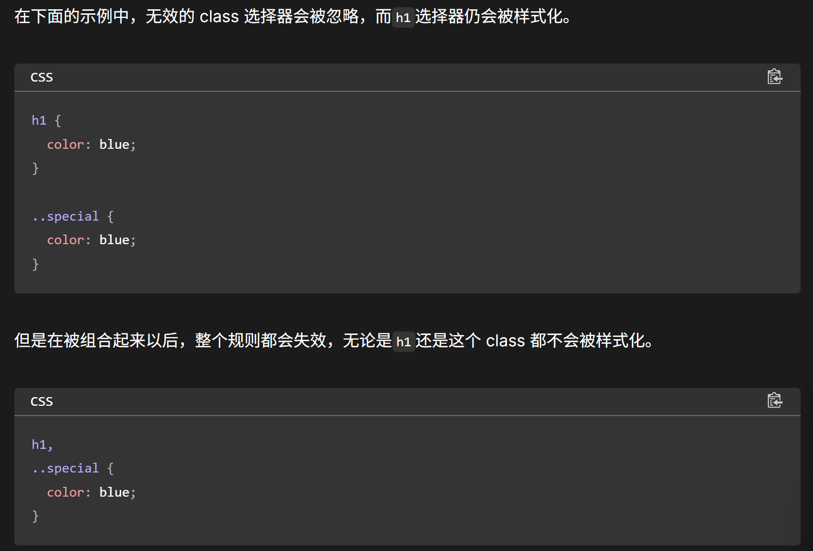
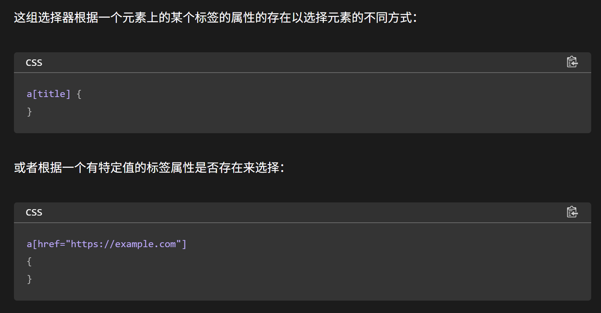

[MDN - 层叠、优先级、继承](https://developer.mozilla.org/zh-CN/docs/Learn_web_development/Core/Styling_basics/Handling_conflicts)

## 选择器

选择器列表：中间加一个逗号，将选择器分到不同行好看

```css
h1,
.special {
  color: blue;
}
```

当使用选择器列表时，如果任何一个选择器无效 (存在语法错误)，那么整条规则都会被忽略。



### 关系选择器 —— 符号


### **1. 后代选择符（空格）**
- **作用**：选择某元素的所有后代元素（不限层级）。
- **示例**：  
  ```css
  div p { color: red; } 
  /* 所有在 div 内部的 <p> */
  ```

---

### **2. 子元素选择符（`>`）**
- **作用**：仅选择直接子元素（一级嵌套）。
- **示例**：  
  ```css
  ul > li { list-style: none; } 
  /* 仅 <ul> 的直接子级 <li> */
  ```

---

### **3. 相邻兄弟选择符（`+`）**
- **作用**：选择紧跟在某元素后的第一个兄弟元素。
- **示例**：  
  ```css
  h2 + p { margin-top: 0; } 
  /* 紧接在 <h2> 后的第一个 <p> */
  ```

---

### **4. 通用兄弟选择符（`~`）**
- **作用**：选择某元素后的所有同级兄弟元素。
- **示例**：  
  ```css
  .title ~ p { font-size: 14px; } 
  /* 所有在 .title 之后的同级 <p> */
  ```

---

### **5. 群组选择符（`,`）**
- **作用**：同时选择多个元素，应用相同样式。
- **示例**：  
  ```css
  h1, h2, h3 { color: blue; } 
  /* 所有 <h1>, <h2>, <h3> */
  ```

---

### **6. 交集选择符（无符号）**
- **作用**：同时满足多个条件的元素。
- **示例**：  
  ```css
  p.warning { background: yellow; } 
  /* 类名为 warning 的 <p> */
  ```

---

### **优先级规则**
- **组合选择器权重**：各部分的权重相加。  
  ```css
  div#main > .item a:hover {} 
  /* 权重：1 ID + 2 类 + 2 元素 = 1-2-2 */
  ```

---

### **总结**
| 运算符 | 符号  | 作用场景                  |
|--------|-------|-------------------------|
| 后代   | 空格  | 嵌套元素（不限层级）       |
| 子元素 | `>`   | 直接子级                 |
| 相邻   | `+`   | 紧邻的下一个兄弟元素       |
| 通用   | `~`   | 后续所有兄弟元素           |
| 群组   | `,`   | 多元素共用样式            |
| 交集   | 无    | 同时满足多个条件          |


### 标签属性选择器

```css
标签名[属性条件] {
  /* 样式规则 */
}
```



### **一、伪类（Pseudo-classes）**
**作用**：选择元素的 **特定状态** 或 **在文档结构中的位置**。  
**语法**：`选择器:伪类名称`  
**符号**：使用单冒号 `:`（CSS3 规范中部分伪类兼容双冒号，但建议统一用单冒号）。

---

#### **常见伪类类型及示例**
| 伪类名称              | 作用描述                                                                 | 示例                                                                 |
|-----------------------|------------------------------------------------------------------------|--------------------------------------------------------------------|
| **`:hover`**          | 鼠标悬停在元素上时触发                                                 | `a:hover { color: red; }`                                         |
| **`:active`**         | 元素被激活时（如点击按钮）                                              | `button:active { transform: scale(0.95); }`                       |
| **`:focus`**          | 元素获得焦点时（如输入框被选中）                                         | `input:focus { border-color: blue; }`                             |
| **`:nth-child(n)`**   | 选择父元素的第 `n` 个子元素                                             | `ul li:nth-child(2) { color: green; }`（选中第二个列表项）          |
| **`:first-child`**    | 选择父元素的第一个子元素                                                | `div p:first-child { font-weight: bold; }`                        |
| **`:last-child`**     | 选择父元素的最后一个子元素                                              | `div p:last-child { margin-bottom: 0; }`                          |
| **`:not(selector)`**  | 排除满足条件的元素                                                     | `div:not(.hidden) { display: block; }`（排除类为 `.hidden` 的 div） |

---

### **二、伪元素（Pseudo-elements）**
**作用**：创建 **不在文档树中的虚拟元素**，用于装饰性内容或特殊样式。  
**语法**：`选择器::伪元素名称`  
**符号**：使用双冒号 `::`（CSS3 规范推荐，但旧版浏览器可能支持单冒号 `:`）。

---

#### **常见伪元素类型及示例**
| 伪元素名称              | 作用描述                                                                 | 示例                                                                 |
|-------------------------|------------------------------------------------------------------------|--------------------------------------------------------------------|
| **`::before`**          | 在元素内容前插入虚拟内容                                                 | `p::before { content: "★"; }`                                      |
| **`::after`**           | 在元素内容后插入虚拟内容                                                 | `button::after { content: "→"; }`                                  |
| **`::first-letter`**    | 选中元素内容的首字母                                                     | `h1::first-letter { font-size: 2em; }`                             |
| **`::first-line`**      | 选中元素内容的第一行                                                     | `article::first-line { text-transform: uppercase; }`               |
| **`::selection`**       | 用户选中的文本部分                                                       | `::selection { background: yellow; }`                              |

---

### **三、核心区别与注意事项**
| 特性               | 伪类（Pseudo-classes）                 | 伪元素（Pseudo-elements）              |
|--------------------|---------------------------------------|---------------------------------------|
| **作用对象**       | 元素的 **状态** 或 **位置**             | 元素的 **虚拟子元素** 或 **特定部分**    |
| **语法符号**       | `:`（单冒号）                          | `::`（双冒号，CSS3 规范）               |
| **DOM 结构**       | 不修改 DOM 结构                        | 创建不在 DOM 中的虚拟元素                |
| **常见用途**       | 交互反馈（如悬停）、结构选择             | 装饰性内容（如图标）、文本修饰            |

---

### **四、综合应用示例**
#### **1. 按钮悬停效果**
```css
.button {
  padding: 10px 20px;
  background: #007bff;
}
.button:hover {
  background: #0056b3; /* 悬停时变深蓝色 */
}
.button::after {
  content: "→";
  margin-left: 5px;
}
```

#### **2. 段落首字下沉**
```css
p::first-letter {
  font-size: 3em;
  float: left;
  line-height: 1;
}
```

#### **3. 列表隔行换色**
```css
ul li:nth-child(odd) {
  background: #f8f9fa; /* 奇数行浅灰色 */
}
ul li:nth-child(even) {
  background: #fff; /* 偶数行白色 */
}
```


## 继承性

以下是 CSS 中 `inherit`、`initial`、`revert`、`revert-layer` 和 `unset` 的简明对比：

---

### **1. `inherit`**
- **作用**：强制元素**继承父元素**的对应属性值。
- **示例**：
  ```css
  .child {
    color: inherit; /* 继承父元素的文字颜色 */
  }
  ```

---

### **2. `initial`**
- **作用**：将属性重置为 **CSS 规范定义的初始值**（与浏览器默认样式无关）。
- **示例**：
  ```css
  div {
    display: initial; /* 重置为默认值 inline */
  }
  ```

---

### **3. `unset`**
- **作用**：
  - 若属性**可继承** → 等同于 `inherit`（继承父元素）。
  - 若属性**不可继承** → 等同于 `initial`（重置为初始值）。
- **示例**：
  ```css
  .box {
    color: unset;    /* 继承父元素（color 可继承） */
    border: unset;   /* 重置为初始值 none（border 不可继承） */
  }
  ```

---

### **4. `revert`**
- **作用**：将属性还原为 **浏览器默认样式**（用户代理样式）。
- **示例**：
  ```css
  h1 {
    font-size: revert; /* 回退到浏览器默认的 <h1> 字号 */
  }
  ```

---

### **5. `revert-layer`**
- **作用**：将属性回退到 **上一个层（@layer）** 中定义的值（需结合 CSS 层叠层使用）。
- **示例**：
  ```css
  @layer base {
    .text { color: red; }
  }
  @layer theme {
    .text { color: blue; }
    .special { color: revert-layer; } /* 回退到 @layer base 的 red */
  }
  ```

---

### **对比总结**
| 值              | 行为                                                                 | 典型场景                     |
|------------------|--------------------------------------------------------------------|----------------------------|
| `inherit`        | 强制继承父元素的值                                                     | 覆盖默认样式，保持一致性           |
| `initial`        | 重置为 CSS 规范的初始值                                               | 清除自定义样式，回归原始状态         |
| `unset`          | 自动判断继承性 → `inherit` 或 `initial`                             | 简化代码，兼容继承与非继承属性       |
| `revert`         | 回退到浏览器默认样式（用户代理样式）                                     | 恢复浏览器原生样式（如 `<button>`） |
| `revert-layer`   | 回退到上一层 `@layer` 中的值（需结合层叠层使用）                        | 管理多层级样式覆盖                |


```html
<blockquote>
  <p>当前块引用设置了样式</p>
</blockquote>

<blockquote class="fix-this">
  <p>当前块引用未设置样式</p>
</blockquote>
```
```css
blockquote {
  background-color: orange;
  border: 2px solid blue;
}

.fix-this {
  all: unset;
}
```

## 层叠

**CSS 层叠（Cascading）** 是 CSS 的核心机制，决定了当多个样式规则作用于同一个元素时，最终哪些样式会被应用。它的名字来源于“层叠”（Cascade），就像瀑布一层层叠加，最终结果由多个因素共同决定。

---


**CSS 层叠（Cascading）** 是决定多个样式规则如何作用于同一元素的核心机制。它通过一套明确的规则解决样式冲突，确保最终效果可预测。以下是层叠机制的完整解析：

---

### **一、层叠的三大核心规则**
层叠的决策过程遵循以下顺序（优先级从低到高）：

1. **样式来源的重要性**  
2. **选择器的优先级（Specificity）**  
3. **代码的书写顺序**  

若前两个规则无法区分胜负，第三个规则生效。

---

### **二、样式来源的优先级**
不同来源的样式权重不同，按以下顺序排列（从低到高）：

| 来源类型                | 示例                          | 典型场景                     |
|-------------------------|-----------------------------|----------------------------|
| **用户代理样式**         | 浏览器默认样式（如 `<a>` 蓝色） | 无开发者样式时的基础渲染       |
| **用户自定义样式**       | 用户通过浏览器设置的样式        | 辅助功能（如放大字体）         |
| **开发者普通样式**       | 开发者编写的 CSS 文件          | 项目主要样式                 |
| **开发者 `!important`**  | `color: red !important;`     | 强制覆盖其他样式（慎用）       |
| **用户 `!important`**    | 用户设置的 `!important`       | 辅助功能强制修改（如高对比度） |


#### 2. **选择器的优先级（Specificity）**

[选择器优先级计算网页](https://specificity.keegan.st/)

当来源相同时，选择器的“特殊性”决定优先级：  
**权重计算规则**（从高到低）：
1. **行内样式**（`style="..."`） → `1,0,0,0`
2. **ID 选择器**（如 `#header`） → `0,1,0,0`
3. **类/伪类/属性选择器**（如 `.btn`, `:hover`） → `0,0,1,0`
4. **元素/伪元素选择器**（如 `div`, `::before`） → `0,0,0,1`

**示例**：
```css
#nav .item:hover {}  /* 权重：0,1,2,0 */
div#sidebar a {}     /* 权重：0,1,0,2 */
```

---

#### 3. **代码书写顺序**
当来源和优先级相同时，**最后出现的样式**生效：
```css
.text { color: red; }
.text { color: blue; } /* 最终生效 */
```

---

#### 4. **`!important` 强制覆盖**
用 `!important` 可以打破优先级规则，但需谨慎使用：
```css
.button {
  background: red !important; /* 强制生效 */
}
```


### **七、层叠过程流程图**

```
[浏览器默认样式] → [用户样式] → [开发者样式] → [开发者!important] → [用户!important]
       ↓               ↓             ↓               ↓                ↓
     低优先级 ←−−−−−−−−−−−−−−−−−−−−−−−−−−−−−−−−−−−−−−−−−−−−−−→ 高优先级
```

---

### **实际应用示例**
```html
<div class="box" id="main" style="color: yellow;">Hello</div>
```
```css
/* 来源：作者样式，权重 0,0,1,0 */
.box { color: red; }

/* 来源：作者样式，权重 0,1,0,1 */
#main div { color: green; }

/* 来源：作者样式，权重 0,0,1,0，但 !important 强制生效 */
.box { color: blue !important; }
```
最终文字颜色为 **蓝色**（`!important` 优先级最高）。


不同CSS样式覆盖问题：不会覆盖所有规则，只覆盖相同的属性。

!!! info "优先级计算"

    

## 内联样式

定义：直接在 HTML 元素中使用 `style` 属性定义的样式，优先级最高。

## 级联层

!!! warning ""

    1. 先前的层中的 important 样式比后面的层以及为在层中声明的 important 样式优先级要高。
    
    2. 内联样式比所有作者定义的样式的优先级都要高，不受级联层规则的影响。

**CSS 级联层（Cascade Layers）** 是 CSS 的一个高级特性，允许开发者通过分层管理样式规则的优先级，避免传统优先级（Specificity）和代码顺序带来的复杂性问题。以下是详细解析：

---

### **1. 级联层的核心概念**
- **分层控制**：将样式规则分组到不同的“层”（Layer）中，通过层的声明顺序决定优先级。
- **独立于选择器优先级**：层的优先级高于选择器的权重（Specificity）。
- **解决冲突**：适用于大型项目或需要覆盖第三方库样式的场景。

---

### **2. 基本语法**
通过 `@layer` 规则定义层，并指定优先级顺序：

```css
/* 定义层及其顺序 */
@layer base, theme, utilities;

/* 向层中添加样式 */
@layer base {
  h1 { color: gray; }
}

@layer theme {
  h1 { color: red; }
}
```

- **层顺序**：`@layer base, theme, utilities;` 表示 `utilities` 的优先级最高，`base` 最低。
- **最终效果**：`h1` 颜色为 `red`（`theme` 层在 `base` 之后定义）。

---

### **3. 层的优先级规则**
- **声明顺序决定优先级**：后声明的层覆盖先声明的层。
- **匿名层**：未命名的层按代码顺序叠加，优先级高于已命名的层。
- **嵌套层**：层内可再分层，形成层级结构。

**示例**：
```css
@layer A {
  @layer B {
    /* 层级为 A.B */
  }
}
```

---

### **4. 级联层 vs 传统优先级**
| 场景               | 传统优先级（Specificity）       | 级联层（Layers）           |
|--------------------|--------------------------------|---------------------------|
| 样式冲突解决        | 依赖选择器权重和代码顺序         | 依赖层的声明顺序            |
| 可维护性            | 复杂项目易混乱                 | 结构化分层，清晰管理        |
| 覆盖第三方库        | 需使用 `!important` 或更高权重 | 将库样式放在低优先级层      |

---

### **5. 实际应用示例**
#### **(1) 管理第三方库样式**
```css
/* 第三方库样式放在低优先级层 */
@layer third-party {
  .button { background: black; }
}

/* 项目主题样式放在更高层 */
@layer theme {
  .button { background: blue; }
}
```
- 最终 `.button` 背景为 `blue`，无需调整选择器权重。

#### **(2) 分层覆盖基础样式**
```css
@layer base {
  a { color: gray; }
}

@layer components {
  a { color: blue; }
}

@layer utilities {
  a { color: red !important; }
}
```
- 最终链接颜色为 `red`（`utilities` 层优先级最高，且使用 `!important`）。

---

### **6. 与 `!important` 的交互**
- **层内 `!important`**：在层内部，`!important` 依然有效，但优先级仍受层顺序控制。
- **跨层覆盖**：高层级的 `!important` 可以覆盖低层级的 `!important`。