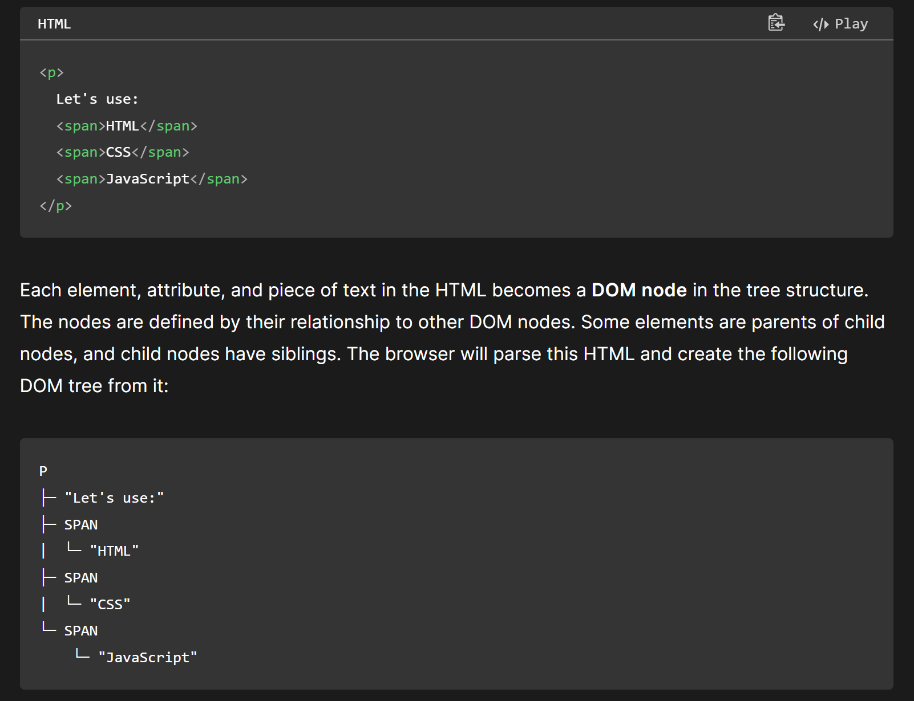

## 网页的构建

当用户导航到新网页时（通过单击链接或在浏览器地址栏中输入 Web 地址），将发送多个 HTTP 请求，并在 HTTP 响应中发回多个文件。在这些响应中收到的文件由浏览器处理，并放在一个用户可以与之交互的网页中。这种将各个部分组装到网页中的过程称为 渲染。

首先，浏览器接收包含网页内容并定义其结构的 HTML 文件，并对其进行解析。浏览器将其转换为称为 DOM 树（文档对象模型）的树状结构。DOM 表示计算机内存中的 HTML 文档结构。以这个基本的 HTML 代码片段为例：

/// caption
这就是一个树 `tree`，只不过变了一下形状（所以跟fds里画的不太一样）
///

> Each element, attribute, and piece of text in the HTML becomes a DOM node in the tree structure. The nodes are defined by their relationship to other DOM nodes. Some elements are parents of child nodes, and child nodes have siblings. The browser will parse this HTML and create the following DOM tree from it:

